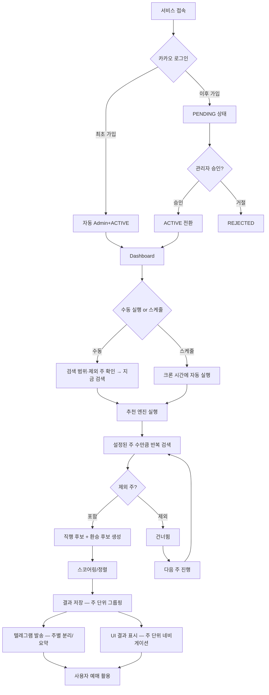
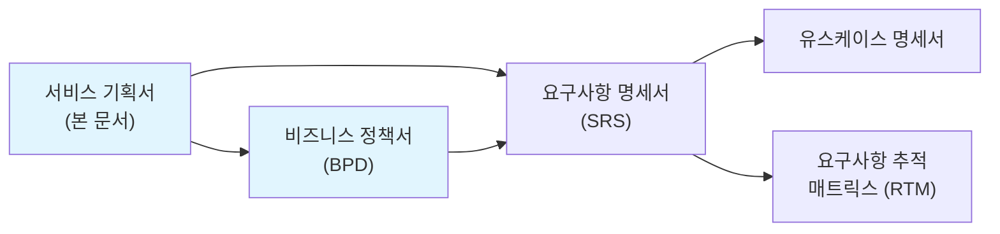

# 서비스 기획서 (Service Planning Document)

> 이 문서는 SRS(요구사항 명세서) 작성 이전에 "왜 이 서비스를 만드는가", "핵심 가치는 무엇인가", "MVP에 무엇을 포함/제외하는가"를 정의하는 선행 기획 문서이다.

| 항목 | 내용 |
| --- | --- |
| **프로젝트명** | TrainBot — 김천구미↔동탄 주간 예매 어시스턴트 |
| **문서 버전** | v1.0 |
| **작성일** | 2026-03-02 |
| **작성자** | 프로젝트 오너 |
| **승인자** | \- |
| **문서 상태** | 초안 |

---

## 변경 이력

| 버전 | 날짜 | 작성자 | 변경 내용 |
| --- | --- | --- | --- |
| v1.0 | 2026-03-02 | 프로젝트 오너 | 초안 작성 (PRD 최종본 기반) |
| v1.1 | 2026-03-02 | 프로젝트 오너 | 검색 범위 설정(주 단위) 기능 반영 |
| v1.2 | 2026-03-02 | 프로젝트 오너 | 주간 캘린더 관리 UI 기능 반영 (8페이지 체계) |
| v1.3 | 2026-03-02 | 프로젝트 오너 | 결제 수단/계정 관리 기능 반영 |

---

## 목차

1. [서비스 개요](#1-%EC%84%9C%EB%B9%84%EC%8A%A4-%EA%B0%9C%EC%9A%94)
2. [핵심 메커니즘](#2-%ED%95%B5%EC%8B%AC-%EB%A9%94%EC%BB%A4%EB%8B%88%EC%A6%98)
3. [콘텐츠/기능 전략](#3-%EC%BD%98%ED%85%90%EC%B8%A0%EA%B8%B0%EB%8A%A5-%EC%A0%84%EB%9E%B5)
4. [수익화 전략](#4-%EC%88%98%EC%9D%B5%ED%99%94-%EC%A0%84%EB%9E%B5)
5. [MVP 스코프 정의](#5-mvp-%EC%8A%A4%EC%BD%94%ED%94%84-%EC%A0%95%EC%9D%98)
6. [KPI 가설 검증 프레임워크](#6-kpi-%EA%B0%80%EC%84%A4-%EA%B2%80%EC%A6%9D-%ED%94%84%EB%A0%88%EC%9E%84%EC%9B%8C%ED%81%AC)
7. [다음 단계](#7-%EB%8B%A4%EC%9D%8C-%EB%8B%A8%EA%B3%84)
8. [관련 문서](#8-%EA%B4%80%EB%A0%A8-%EB%AC%B8%EC%84%9C)

---

## 1. 서비스 개요

### 1.1 서비스명 및 컨셉

| 항목 | 내용 |
| --- | --- |
| 서비스명 | TrainBot |
| 한 줄 설명 | 김천구미↔동탄 주간 왕복 열차를 자동 검색·추천·알림해주는 NAS 기반 개인용 예매 어시스턴트 |
| 서비스 유형 | 셀프호스팅 웹 서비스 (NAS Docker) |
| 대상 플랫폼 | Web (React SPA) + Telegram Bot |

**서비스 컨셉 설명:**

김천대학교(김천) 통학으로 인해 매주 반복되는 김천구미↔동탄 왕복 열차 예매가 필요하다. 수동으로 SRT/KTX를 검색하고, 매진·취소표 등 변수를 고려하여 최적 열차를 판단하는 것은 시간이 많이 소요되고 번거롭다. TrainBot은 이 과정을 "검색→판단→알림"으로 자동화하여, 사용자는 텔레그램으로 받은 추천 결과를 보고 바로 예매만 하면 되도록 한다.

**배경 및 동기:**

- 매주 금\~일 왕복 통학에 필요한 열차 예매가 반복적으로 발생한다
- SRT 직행이 가장 선호되지만, 매진 시 KTX 환승 등 대안 검토가 필요하다
- 수동 검색은 여러 시간대와 열차를 비교해야 하므로 판단 비용이 높다
- NAS 환경에 Docker로 올려두면 개인 서버에서 지속적으로 운영할 수 있다

### 1.2 핵심 가치 제안 (Value Proposition)

| 항목 | 내용 |
| --- | --- |
| 핵심 가치 | 매주 반복되는 열차 검색·비교·판단 작업을 자동화하여 예매 준비 시간을 최소화 |
| 차별점 | SRT 직행 우선 추천 + KTX 환승 대안 자동 생성 + 텔레그램 즉시 알림 |
| 대안 대비 우위 | 수동 검색(SRT/코레일 앱 각각 확인) 대비 한번에 최적 후보를 정렬·비교·알림 |

**가치 제안 캔버스:**

| 구분 | 내용 |
| --- | --- |
| 사용자의 할 일 (Jobs) | 매주 금\~일 왕복 열차를 검색·비교하여 최적 시간대 열차를 예매한다 |
| 사용자의 고통 (Pains) | SRT/KTX 앱을 번갈아 확인, 매진·시간대 비교 판단 부담, 취소표 모니터링 필요 |
| 사용자의 이득 (Gains) | 텔레그램으로 최적 후보를 받아보고 바로 예매, 환승 대안도 자동 제공 |
| 고통 해결제 (Pain Relievers) | 자동 검색/정렬/추천 엔진, 요일별 선호시간 필터, 중복 알림 방지 |
| 이득 생성제 (Gain Creators) | 스케줄 자동 실행, 직행/환승 분리 출력, 검색값 복사 기능, (옵션) 자동예매 |

### 1.3 타겟 사용자 정의

#### 1.3.1 주요 사용자 페르소나

**페르소나 1: 관리자 (Admin)**

| 항목 | 내용 |
| --- | --- |
| 이름 | 운영자 본인 |
| 연령/직업 | 대학생 / 김천대학교 통학생 |
| 기술 수준 | 중급 (NAS Docker 운영 가능) |
| 핵심 목표 | 매주 통학 열차 예매를 최소 노력으로 완료 |
| 핵심 불편 | SRT 앱/코레일 앱 각각 확인, 매진 시 대안 검색 반복 |
| 사용 시나리오 | 화요일에 스케줄이 자동 실행 → 텔레그램으로 금\~일 추천 수신 → 앱에서 즉시 예매 |
| 성공 기준 | 텔레그램 알림만 보고 5분 이내에 예매 완료 |

**페르소나 2: 공동 사용자 (Member)**

| 항목 | 내용 |
| --- | --- |
| 이름 | 동일 노선 이용 가족/지인 |
| 연령/직업 | 다양 |
| 기술 수준 | 초급 |
| 핵심 목표 | 추천 결과를 확인하고 예매에 활용 |
| 핵심 불편 | 직접 검색하기 번거로움 |
| 사용 시나리오 | 관리자가 승인 → 텔레그램으로 추천 결과 수신 → 참고하여 예매 |
| 성공 기준 | 별도 검색 없이 추천만으로 예매 판단 가능 |

#### 1.3.2 사용자 세그먼트

| 세그먼트 | 설명 | 규모 추정 | 우선순위 | MVP 포함 |
| --- | --- | --- | --- | --- |
| 관리자 (본인) | NAS 운영자 겸 주 사용자 | 1명 | P0 | Y |
| 공동 사용자 | 동일 노선 가족/지인 | 최대 3명 | P1 | Y |

#### 1.3.3 비사용자 (Anti-Persona)

| 비사용자 | 이유 | 대안 |
| --- | --- | --- |
| 불특정 다수 외부 사용자 | 개인/소규모 전용 시스템, 최대 4인 제한 | 공개 열차 예약 서비스 직접 사용 |
| 다른 노선 이용자 | 현재 김천구미↔동탄 노선 전용 설계 | 확장 시 대체역 설정으로 일부 대응 가능 |

---

## 2. 핵심 메커니즘

### 2.1 서비스 작동 원리

**핵심 루프 (Core Loop):**

1. **설정**: 사용자가 요일별 선호시간/환승 옵션/스코어링 가중치를 설정
2. **캘린더 관리**: 주간 캘린더에서 각 주의 티켓 필요 여부를 관리 (필요/예매완료/불필요)
3. **실행**: 수동 또는 스케줄에 의해 추천 엔진이 실행 (캘린더에서 "필요" 상태 주만 대상)
4. **검색·정렬**: SRT/KTX 열차를 조회 → 직행 우선 후보 생성 → 환승 후보 생성 → 스코어링/정렬 (주 단위 그룹핑)
5. **알림**: 결과를 텔레그램으로 발송 (주 단위 분리 또는 요약, 중복 방지 적용)
6. **예매 활용**: 사용자가 추천 결과를 보고 SRT/코레일 앱에서 예매 → 캘린더에서 "예매완료"로 상태 변경

### 2.2 전체 서비스 플로우

### 2.3 핵심 사용자 여정 (Key User Journey)

#### 여정 1: 주간 추천 수신 (핵심 루프)

| 단계 | 사용자 행동 | 시스템 반응 | 감정 목표 | 핵심 지표 |
| --- | --- | --- | --- | --- |
| 1\. 설정 | 요일별 선호시간/환승 옵션 설정 | 설정 저장, diff 표시 | 신뢰감 | 설정 완료율 |
| 2\. 캘린더 관리 | Calendar 페이지에서 주별 상태 관리 (필요/예매완료/불필요 + 메모) | 캘린더 뷰 표시, 상태별 색상 구분 | 유연함·파악 | 캘린더 갱신율 |
| 3\. 스케줄 등록 | 매주 화 09:00 스케줄 등록 | 스케줄 활성화 확인 | 안심 | 스케줄 등록률 |
| 4\. 대기 | (별도 행동 없음) | 화요일 09:00 자동 실행 ("필요" 상태 주만 순차 검색) | \- | 실행 성공률 |
| 5\. 알림 수신 | 텔레그램 알림 확인 | 주 단위로 분리된 직행/환승 추천 결과 발송 | 편리함 | 알림 확인율 |
| 6\. 예매 | 추천 정보로 SRT/코레일 앱 예매 → 캘린더에서 "예매완료" 표시 | 상태 자동/수동 전환 | 만족·완결감 | \- |

#### 여정 2: 수동 검색 (즉시 필요 시)

| 단계 | 사용자 행동 | 시스템 반응 | 감정 목표 | 핵심 지표 |
| --- | --- | --- | --- | --- |
| 1\. 접속 | Calendar 페이지 접속 | 주별 상태 한눈에 확인 | 파악 | \- |
| 2\. 실행 | "필요" 상태 주 확인 → \[선택한 주 검색\] 또는 \[전체 검색\] | 주별 진행률 표시 | 기대 | 수동 실행 횟수 |
| 3\. 결과 확인 | Results 페이지에서 상행/하행 확인 | 직행/환승 분리 출력 | 만족 | \- |
| 4\. 활용 | 검색값 복사 또는 텔레그램 재전송 | 클립보드 복사/발송 완료 | 편리함 | 복사/재전송 횟수 |

---

## 3. 콘텐츠/기능 전략

### 3.1 핵심 기능 방향

| 기능 영역 | 전략 방향 | 우선순위 | MVP 포함 | 비고 |
| --- | --- | --- | --- | --- |
| 추천 엔진 (직행) | SRT 직행 최우선 검색·정렬 | P0 | Y | 핵심 기능 |
| 추천 엔진 (환승) | SRT+KTX 환승 후보 자동 생성 | P0 | Y | allow_transfer 옵션 |
| 검색 범위 설정 | 주 단위(1\~8주) 범위 설정 + 주 제외 | P0 | Y | 핵심 유연성 |
| 주간 캘린더 관리 | 월간 캘린더 뷰 + 티켓 상태 관리 + 검색 연동 | P0 | Y | 핵심 UX |
| 텔레그램 알림 | 결과 자동 발송 + 중복 방지 | P0 | Y | dedupe 180분 |
| 스케줄 실행 | 크론 기반 자동 실행 | P0 | Y | 핵심 자동화 |
| React Web UI | 설정/실행/결과/로그/관리 | P0 | Y | 8개 페이지 |
| 카카오 OAuth + 사용자 관리 | 인증/승인/정원 제한 | P1 | Y | 최대 4인 |
| 자동예매 (auto 모드) | 결제까지 자동 수행 플러그인 | P1 | Y | 기본 비활성, 가드레일 |
| 결제 수단/계정 관리 | UI에서 예매 계정·결제수단·승객정보 관리, 환경변수 저장 | P1 | Y | auto 모드 전제조건 |
| 캘린더 자동 등록 | 예매 결과를 캘린더에 등록 | P2 | N | v2 |
| 지능형 추천 고도화 | 개인별 패턴 학습 | P2 | N | v2 |

**기능 방향 의사결정 기록:**

| 항목 | A안 | B안 | 선택 | 근거 |
| --- | --- | --- | --- | --- |
| 인증 방식 | 이메일/비밀번호 | 카카오 OAuth only | B | 소규모 개인 서비스, 계정 관리 부담 최소화 |
| 자동예매 | 구현 제외 | 구현하되 기본 비활성 | B | PRD 명시 요구사항, 플러그인 분리로 안전성 확보 |
| 모바일 앱 | 네이티브 앱 | 반응형 웹 UI | B | 개발/유지보수 비용 절감, 텔레그램이 주 인터페이스 |
| 민감정보 저장 | DB 암호화 필드 | 환경변수 파일(.env) + UI 관리 | B | DB 저장 시 암호화 키 관리 복잡, .env는 Docker 친화적이고 단순 |

---

## 4. 수익화 전략

> 본 서비스는 개인용 비상업 프로젝트로, 수익화 계획 없음.

| 항목 | 내용 |
| --- | --- |
| 주요 수익 모델 | 없음 (개인 운영) |
| 보조 수익 모델 | 없음 |
| 운영 비용 | NAS 전기료 + 도메인(선택) 수준 |

---

## 5. MVP 스코프 정의

### 5.1 MVP 정의 기준

| 항목 | 내용 |
| --- | --- |
| MVP 목표 | 매주 통학 열차 추천을 자동화하여 수동 검색 없이 예매 준비 완료 |
| MVP 기간 | 2\~3주 |
| MVP 성공 기준 | 스케줄 실행 → 텔레그램 추천 수신 → 예매 완료까지 5분 이내 |
| MVP 실패 시 대응 | 열차 조회 API 불안정 시 재시도/에러 알림으로 대응, UI 단순화 |

### 5.2 포함 항목 (In-Scope)

| ID | 기능/항목 | 설명 | 우선순위 | 비고 |
| --- | --- | --- | --- | --- |
| MVP-001 | 추천 엔진 (직행) | SRT 직행 검색·정렬·Top N 출력 | P0 | 핵심 |
| MVP-002 | 추천 엔진 (환승) | SRT+KTX 환승 후보 생성·정렬 | P0 | allow_transfer 옵션 |
| MVP-003 | 텔레그램 알림 | 결과 자동 발송 + dedupe | P0 | 핵심 |
| MVP-004 | 스케줄 실행 | 크론 기반 자동 실행 + 중복 방지(락) | P0 | 핵심 |
| MVP-005 | 수동 실행 | UI에서 즉시 검색 | P0 | 핵심 |
| MVP-006 | React Web UI | Dashboard/Results/Settings/Schedule/Logs/Safety/Admin | P0 | 7페이지 |
| MVP-007 | 카카오 OAuth 인증 | 카카오 로그인 + 세션 관리 | P1 |  |
| MVP-008 | 사용자 관리 | 승인/거절/비활성화 + 정원 제한(4명) | P1 |  |
| MVP-009 | 자동예매 플러그인 인터페이스 | auto 모드 구현 (기본 비활성) + 가드레일 | P1 |  |
| MVP-010 | 감사 로그 | 실행/설정/사용자 관리 이벤트 기록 | P1 |  |
| MVP-011 | 검색 범위 설정 (주 단위) | 1\~8주 범위 선택 + 특정 주 제외(Skip Weeks) | P0 | 핵심 |
| MVP-012 | 주간 캘린더 관리 UI | 월간 캘린더 뷰 + 주별 상태 관리 + 검색 실행 연동 | P0 | 핵심 |

### 5.3 제외 항목 (Out-of-Scope) + 제외 근거

| ID | 제외 항목 | 제외 근거 | 대안 (MVP에서는) | v2 진입 조건 |
| --- | --- | --- | --- | --- |
| EX-001 | 자동예매 기본 활성화 | 결제 리스크, 명시적 동의 필요 | 관리자가 UI에서 수동 활성화 | 안정적 운영 확인 후에도 기본 비활성 유지 |
| EX-002 | 캘린더 자동 등록 | 핵심 가치 검증에 불필요 | 수동으로 캘린더 등록 | 사용자 요청 시 v2 도입 |
| EX-003 | 지능형 추천 고도화 | 데이터 축적 필요, 복잡도 높음 | 가중치 수동 설정으로 대체 | 3개월 이상 실행 데이터 축적 후 |
| EX-004 | 모바일 앱 | 개발/유지보수 비용 대비 가치 불확실 | 반응형 웹 UI + 텔레그램 | 웹 UI로 불편 사례 다수 발생 시 |

### 5.4 MVP 기능 범위 다이어그램

```mermaid
flowchart LR
    subgraph MVP["MVP (v1.0)"]
        direction TB
        F1["추천 엔진 (직행+환승)"]
        F2["텔레그램 알림 + dedupe"]
        F3["스케줄/수동 실행"]
        F8_1["검색 범위 설정 (1~8주 + 주 제외)"]
        F8_2["주간 캘린더 관리 UI"]
        F4["React Web UI (8 페이지)"]
        F5["카카오 OAuth + 사용자 관리"]
        F6["자동예매 플러그인 (기본 비활성)"]
        F7["감사 로그"]
    end

    subgraph V2["v2.0 (조건 충족 시)"]
        direction TB
        F8["캘린더 자동 등록"]
        F9["지능형 추천 고도화"]
        F10["대체역 확장"]
    end

    subgraph FUTURE["장기 로드맵"]
        direction TB
        F11["모바일 앱"]
        F12["다중 노선 지원"]
    end

    MVP --> V2
    V2 --> FUTURE
```

### 5.5 기술적 MVP 결정사항

| 결정 항목 | MVP 선택 | 근거 | v2에서 전환 가능 |
| --- | --- | --- | --- |
| 인프라 | NAS Docker (단일 컨테이너) | 개인 NAS 활용, 추가 비용 없음 | Y |
| 프론트엔드 | React SPA | 모던 UI, 컴포넌트 재사용 | Y |
| 백엔드 | Node.js (또는 Python) | 빠른 개발, Docker 친화적 | Y |
| 데이터베이스 | SQLite (파일 기반) | 소규모, /data 볼륨 마운트 | Y (PostgreSQL 전환 가능) |
| 시간대 | TZ=Asia/Seoul (고정) | 국내 전용 서비스 | \- |

---

## 6. KPI 가설 검증 프레임워크

### 6.1 검증할 가설 목록

| ID | 가설 | 검증 방법 | 성공 기준 | 실패 시 대응 | 우선순위 |
| --- | --- | --- | --- | --- | --- |
| H-001 | 스케줄 자동 실행으로 매주 수동 검색이 불필요해진다 | 4주간 스케줄 실행 성공률 측정 | 실행 성공률 95% 이상 | 에러 핸들링/재시도 개선 | P0 |
| H-002 | SRT 직행 우선 추천이 실제 예매 선택과 일치한다 | 추천 Top 1과 실제 예매 비교 | Top 3 내 예매 80% 이상 | 스코어링 가중치 조정 | P0 |
| H-003 | 환승 후보 제공이 매진 시 대안 선택에 도움된다 | 직행 매진 시 환승 후보 활용률 | 환승 후보 확인율 50% 이상 | 환승 기본 비활성화 검토 | P1 |
| H-004 | 텔레그램 알림만으로 예매 판단이 가능하다 | 알림 수신 후 앱 접속 없이 예매 완료율 | 80% 이상 | 알림 포맷/정보량 개선 | P1 |

### 6.2 핵심 지표 (Key Metrics)

| 구분 | 지표명 | 정의 | 목표값 | 측정 방법 | 측정 주기 |
| --- | --- | --- | --- | --- | --- |
| **North Star** | 주간 예매 준비 시간 | 추천 수신\~예매 완료까지 소요 시간 | 5분 이내 | 수동 기록 | 주간 |
| 실행 | 스케줄 실행 성공률 | 성공 실행 / 전체 실행 | 95% | runs 테이블 | 주간 |
| 품질 | 추천 적중률 | Top 3 내 실제 예매 비율 | 80% | 수동 기록 | 월간 |
| 알림 | 텔레그램 발송 성공률 | 발송 성공 / 발송 시도 | 99% | audit_logs | 주간 |

---

## 7. 다음 단계

### 7.1 기획 완료 체크리스트

- [x] 서비스 컨셉이 한 문장으로 명확히 정의되었는가

- [x] 타겟 사용자가 구체적으로 정의되었는가 (비사용자 포함)

- [x] 핵심 가치 제안이 명확한가

- [x] 핵심 메커니즘(Core Loop)이 명확한가

- [x] 수익 모델이 결정되었는가 (비상업 프로젝트)

- [x] MVP 포함/제외 항목이 모두 정의되었는가

- [x] **제외 항목에 "왜 제외하는가"와 "대안"이 모두 기록되었는가**

- [x] 검증할 가설이 정량적 성공 기준과 함께 정의되었는가

- [x] 가설 실패 시 대응 방안이 사전에 정의되었는가

- [ ] 비즈니스 동작 규칙이 비즈니스정책서에 독립적으로 정의되었는가 → BPD 작성 필요

### 7.2 v2+ 로드맵

| 버전 | 진입 조건 | 주요 기능 | 목표 |
| --- | --- | --- | --- |
| v1.0 (MVP) | \- | 5.2절 참조 | 핵심 가설 검증 |
| v1.1 | MVP 출시 후 2주 내 | 버그 수정, UX 개선, 스코어링 가중치 튜닝 | 안정화 |
| v2.0 | 4주 이상 안정 운영 확인 | 캘린더 등록, 대체역 확장, 지능형 추천 | 기능 확장 |

---

## 8. 관련 문서

### 8.1 문서 간 관계

### 8.2 참조 문서 목록

| 문서명 | 위치 | 관계 |
| --- | --- | --- |
| PRD 최종본 (요구사항.md) | `docs/요구사항.md` | 본 문서의 원본 요구사항 |
| 비즈니스 정책서 (BPD) | `docs/00-기획/BPD-TRAINBOT-v1.0.md` | 비즈니스 규칙 상세 정의 |
| 요구사항 명세서 (SRS) | `docs/01-요구사항분석/SRS-TRAINBOT-v1.0.md` | MVP 스코프를 시스템 요구사항으로 구체화 |

---

## 부록

### A. 용어 정의

| 용어 | 정의 |
| --- | --- |
| 상행(up) | 김천구미 → 동탄 |
| 하행(down) | 동탄 → 김천구미 |
| 컷오프(earliest_after) | 해당 요일 전체에서 "N시 이후만 허용"하는 시작 시각 |
| assist 모드 | 추천/알림/복사/링크 중심 (기본) |
| auto 모드 | 결제까지 자동 수행 (옵션, 기본 비활성, 플러그인) |
| dedupe | 동일 결과 해시 기반 중복 발송 방지 |
| SRT | 수서고속철도 |
| KTX | 한국고속철도 |
| NAS | Network Attached Storage |

### B. 승인

| 역할 | 이름 | 서명 | 날짜 |
| --- | --- | --- | --- |
| 프로젝트 오너 | \- |  | 2026-03-02 |
