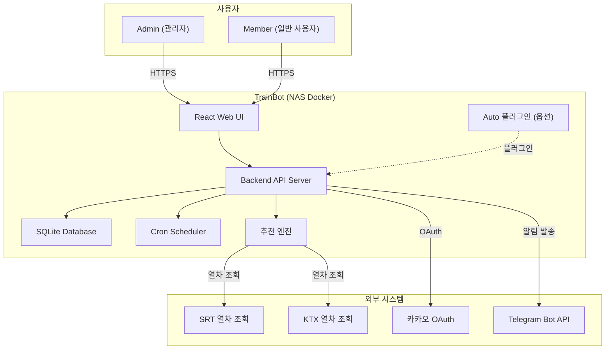
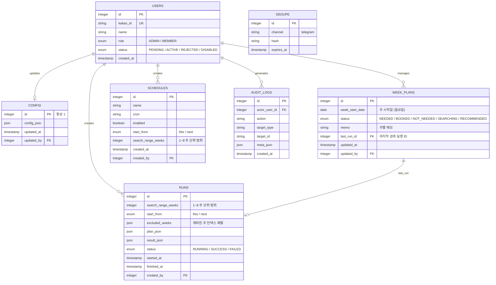

# 소프트웨어 요구사항 명세서 (SRS)

> Software Requirements Specification

---

## 문서 정보

| 항목 | 내용 |
|------|------|
| 프로젝트명 | TrainBot — 김천구미↔동탄 주간 예매 어시스턴트 |
| 문서 번호 | SRS-TRAINBOT-v1.0 |
| 버전 | 1.0.0 |
| 작성일 | 2026-03-02 |
| 작성자 | 프로젝트 오너 |
| 보안 등급 | 대외비 |

---

## 변경 이력

| 버전 | 날짜 | 변경 내용 | 작성자 | 승인자 |
|------|------|-----------|--------|--------|
| 1.0 | 2026-03-02 | 초안 작성 (PRD 최종본 기반) | 프로젝트 오너 | - |
| 1.1 | 2026-03-02 | 검색 범위 설정(주 단위) 기능 요구사항 추가 (FR-016, FR-017) | 프로젝트 오너 | - |
| 1.2 | 2026-03-02 | 주간 캘린더 관리 기능 추가 (FR-018), 화면 8페이지 체계 | 프로젝트 오너 | - |
| 1.3 | 2026-03-02 | 결제 수단/계정 관리 기능 추가 (FR-019) | 프로젝트 오너 | - |

---

## 목차

1. [문서 개요](#1-문서-개요)
2. [전체 시스템 설명](#2-전체-시스템-설명)
3. [기능 요구사항](#3-기능-요구사항)
4. [비기능 요구사항](#4-비기능-요구사항)
5. [외부 인터페이스 요구사항](#5-외부-인터페이스-요구사항)
6. [데이터 요구사항](#6-데이터-요구사항)
7. [제약 조건](#7-제약-조건)
8. [승인 내역](#8-승인-내역)

---

## 1. 문서 개요

### 1.1 목적

본 문서는 **TrainBot** 시스템의 소프트웨어 요구사항을 정의한다. 김천구미↔동탄 주간 왕복 열차 추천/알림 자동화 시스템의 개발 범위, 기능/비기능 요구사항, 데이터 모델, API 설계의 기준 문서로 활용된다.

본 문서는 다음 용도로 활용된다:

- 개발 범위 및 기능의 명확한 정의
- 설계, 구현, 테스트의 기준 문서
- 요구사항 추적(RTM)의 기반 문서

### 1.2 범위

- **포함 범위**:
  - React Web UI (설정/실행/스케줄/로그/사용자관리 8개 페이지)
  - 추천 엔진 (직행 우선 + 환승 후보 생성 + 스코어링/정렬)
  - 선호시간대 규칙 (요일별 earliest_after 필터)
  - 검색 범위 설정 (주 단위 1~8주, 주 제외/Skip Weeks)
  - 텔레그램 알림 및 중복 방지(dedupe)
  - 수동 실행 및 스케줄 실행
  - 카카오 OAuth 인증 + 사용자 관리 (최대 4인)
  - 자동예매(결제 포함) 옵션 기능 (기본 비활성, 플러그인 분리)
  - 감사 로그

- **제외 범위**:
  - 자동예매 기본 활성화
  - 캘린더 자동 등록 (v2)
  - 개인별 모델 학습/지능형 추천 고도화 (v2)
  - 모바일 앱 (웹 UI로 대체)

시스템의 주요 목표:

1. 매주 반복되는 왕복 예매 업무를 추천/알림 중심으로 자동화
2. SRT 직행 최우선 추천 + SRT+KTX 환승 대안 제공
3. NAS Docker 환경에서 안정적으로 운영

### 1.3 용어 정의

| 용어 | 정의 |
|------|------|
| SRS | Software Requirements Specification. 소프트웨어 요구사항 명세서 |
| FR | Functional Requirement. 기능 요구사항 |
| NFR | Non-Functional Requirement. 비기능 요구사항 |
| 상행(up) | 김천구미 → 동탄 |
| 하행(down) | 동탄 → 김천구미 |
| 컷오프(earliest_after) | 해당 요일 전체에서 "N시 이후만 허용"하는 시작 시각 |
| assist 모드 | 추천/알림/복사/링크 중심 (기본) |
| auto 모드 | 결제까지 자동 수행 (옵션, 기본 비활성, 플러그인) |
| dedupe | 동일 결과 해시 기반 중복 발송 방지 |
| Skip Weeks | 검색 범위 내 특정 주를 제외하는 기능 |
| week_plans | 주간 캘린더 관리 테이블. 주별 상태·메모·마지막 실행 ID를 저장 |
| RBAC | Role-Based Access Control. 역할 기반 접근 제어 |
| OAuth | Open Authorization |
| SRT | 수서고속철도 |
| KTX | 한국고속철도 |
| NAS | Network Attached Storage |

### 1.4 참고 문서

| 문서명 | 버전 | 비고 |
|--------|------|------|
| PRD 최종본 (요구사항.md) | v1.0 | 원본 요구사항 |
| 서비스 기획서 (SPD) | v1.0 | 서비스 컨셉, MVP 스코프 |
| 비즈니스 정책서 (BPD) | v1.0 | 비즈니스 동작 규칙 |

### 1.5 우선순위 정의

| 등급 | 라벨 | 정의 |
|------|------|------|
| P1 | 필수 (Must) | 반드시 구현해야 하는 핵심 기능. 미구현 시 서비스 불가 |
| P2 | 권장 (Should) | 구현이 강력히 권장되는 기능 |
| P3 | 선택 (Could) | 구현하면 좋으나 필수는 아닌 기능 |
| P4 | 제외 (Won't) | 현재 범위에서 명시적으로 제외 |

---

## 2. 전체 시스템 설명

### 2.1 시스템 관점도



### 2.2 사용자 유형 및 특성

| Actor ID | 사용자 유형 | 설명 | 권한 수준 | 사용 빈도 | 기술 숙련도 |
|----------|-------------|------|-----------|-----------|-------------|
| ACT-01 | Admin (관리자) | 시스템 운영자, 최초 가입자 | 최고 | 주 2~3회 | 중급 |
| ACT-02 | Member (일반 사용자) | 관리자 승인 후 활성화, 결과 열람 | 기본 | 주 1~2회 | 초급 |

### 2.3 운영 환경

#### 2.3.1 소프트웨어 환경

| 구분 | 기술 스택 | 버전 | 비고 |
|------|-----------|------|------|
| Container | Docker | latest | NAS 환경 |
| Frontend | React | 18+ | SPA |
| Backend | Node.js (또는 Python) | LTS | |
| Database | SQLite | 3.x | 파일 기반, /data 볼륨 |
| Timezone | Asia/Seoul | - | TZ 환경변수 고정 |

#### 2.3.2 클라이언트 환경

| 구분 | 지원 범위 | 비고 |
|------|-----------|------|
| 데스크톱 브라우저 | Chrome, Firefox, Safari, Edge 최신 2버전 | |
| 모바일 브라우저 | iOS Safari, Android Chrome | 반응형 웹 |

### 2.4 제약사항

1. NAS Docker 환경에서 단일 컨테이너로 운영 (리소스 제한)
2. 외부 열차 조회 API의 가용성/레이트리밋에 의존
3. 최대 4인 동시 사용 (소규모 개인용)
4. 카카오 OAuth API 의존

### 2.5 가정 및 전제 조건

1. NAS가 항시 가동 중이며 인터넷 연결이 안정적이다
2. SRT/KTX 열차 조회 API가 사용 가능하다
3. 카카오 OAuth 서비스가 안정적으로 제공된다
4. Telegram Bot API가 정상 동작한다
5. 동시 접속 사용자는 최대 4명이다

---

## 3. 기능 요구사항

### 3.1 기능 요구사항 요약 목록

| FR-ID | 기능명 | 설명 | 우선순위 | 상태 |
|-------|--------|------|----------|------|
| FR-001 | 카카오 로그인 | 카카오 OAuth 기반 인증 | P1 필수 | 초안 |
| FR-002 | 로그아웃 | 세션/토큰 무효화 | P1 필수 | 초안 |
| FR-003 | 사용자 관리 (Admin) | 승인/거절/비활성화, 정원 제한 | P1 필수 | 초안 |
| FR-004 | 노선/역 설정 | Primary 노선 + 대체역 설정 | P1 필수 | 초안 |
| FR-005 | 선호시간대 설정 | 요일별 earliest_after 설정 | P1 필수 | 초안 |
| FR-006 | 추천 엔진 (직행) | SRT 직행 검색/정렬/Top N | P1 필수 | 초안 |
| FR-007 | 추천 엔진 (환승) | SRT+KTX 환승 후보 생성 | P1 필수 | 초안 |
| FR-008 | 스코어링/정렬 | 가중치 기반 후보 정렬 | P1 필수 | 초안 |
| FR-009 | 결과 출력 (UI) | 상행/하행 탭, 직행/환승 섹션 | P1 필수 | 초안 |
| FR-010 | 텔레그램 알림 | 결과 발송 + dedupe | P1 필수 | 초안 |
| FR-011 | 수동 실행 | 이번 주/다음 주 즉시 검색 | P1 필수 | 초안 |
| FR-012 | 스케줄 실행 | 크론 기반 자동 실행 | P1 필수 | 초안 |
| FR-013 | 자동예매 (auto 모드) | 결제까지 자동 수행 (플러그인) | P2 권장 | 초안 |
| FR-014 | 감사 로그 | 실행/설정/승인 이벤트 기록 | P2 권장 | 초안 |
| FR-015 | 설정 관리 | 시스템 설정 조회/변경 | P1 필수 | 초안 |
| FR-016 | 검색 범위 설정 | 주 단위(1~8주) 검색 범위 + 시작점 설정 | P1 필수 | 초안 |
| FR-017 | 주 단위 제외 (Skip Weeks) | 특정 주 제외 설정 + 복수 주 결과 그룹핑 | P1 필수 | 초안 |
| FR-018 | 주간 캘린더 관리 | 캘린더 뷰 + 주별 상태/메모 관리 + 검색 연동 | P1 필수 | 초안 |
| FR-019 | 결제 수단/계정 관리 | 예매 계정·결제수단·승객정보 UI 관리 + 환경변수 저장 | P2 권장 | 초안 |

---

### 3.2 FR-001: 카카오 로그인

| 항목 | 내용 |
|------|------|
| **FR-ID** | FR-001 |
| **기능명** | 카카오 로그인 |
| **설명** | 사용자가 카카오 OAuth를 통해 시스템에 인증한다. 최초 가입자는 자동으로 Admin+ACTIVE, 이후 가입자는 PENDING 상태로 생성된다. |
| **우선순위** | P1 필수 |
| **연관 기능** | FR-002 (로그아웃), FR-003 (사용자 관리) |
| **비즈니스 규칙** | BP-AUTH-001, BP-USER-001, BP-USER-002 |

#### 처리 로직

1. 사용자가 카카오 로그인 버튼 클릭
2. 카카오 OAuth 인증 페이지로 리다이렉트
3. 인증 성공 시 callback으로 kakao_id 수신
4. kakao_id로 기존 사용자 조회
   - 기존 사용자: 상태 확인 (ACTIVE → 로그인, PENDING → 대기 안내, REJECTED/DISABLED → 거부)
   - 신규 사용자:
     - ACTIVE 사용자 0명 → ADMIN + ACTIVE 자동 생성
     - ACTIVE 사용자 < 4명 → PENDING 생성
     - ACTIVE 사용자 = 4명 → 정원 초과 안내
5. 세션/토큰 발급

#### API

| Method | Endpoint | 설명 |
|--------|----------|------|
| GET | /auth/kakao/login | 카카오 OAuth 로그인 시작 |
| GET | /auth/kakao/callback | 카카오 OAuth 콜백 처리 |

---

### 3.3 FR-002: 로그아웃

| 항목 | 내용 |
|------|------|
| **FR-ID** | FR-002 |
| **기능명** | 로그아웃 |
| **설명** | 사용자가 시스템에서 로그아웃한다. |
| **우선순위** | P1 필수 |
| **연관 기능** | FR-001 |

#### 처리 로직

1. 세션/토큰 무효화
2. 클라이언트 측 인증 정보 삭제
3. 로그인 페이지로 리다이렉트

#### API

| Method | Endpoint | 설명 |
|--------|----------|------|
| POST | /auth/logout | 로그아웃 |

---

### 3.4 FR-003: 사용자 관리 (Admin)

| 항목 | 내용 |
|------|------|
| **FR-ID** | FR-003 |
| **기능명** | 사용자 관리 |
| **설명** | 관리자가 가입 신청 목록을 확인하고, 승인/거절/비활성화를 수행한다. ACTIVE 사용자 정원(4명)을 관리한다. |
| **우선순위** | P1 필수 |
| **연관 기능** | FR-001 |
| **비즈니스 규칙** | BP-USER-001, BP-USER-002, BP-USER-003 |

#### 처리 로직

**가입 신청 목록 조회:**
1. 인증 확인 + Admin 권한 확인
2. PENDING 상태 사용자 목록 반환 + ACTIVE 사용자 수 표시

**승인:**
1. 정원 확인 (ACTIVE < 4)
2. 대상 사용자 상태를 ACTIVE로 변경
3. 감사 로그 기록

**거절:**
1. 대상 사용자 상태를 REJECTED로 변경
2. 감사 로그 기록

**비활성화:**
1. 대상 사용자 상태를 DISABLED로 변경
2. 감사 로그 기록

#### API

| Method | Endpoint | 설명 | 인증 |
|--------|----------|------|------|
| GET | /api/admin/users?status=PENDING | 가입 신청 목록 | Admin |
| POST | /api/admin/users/{id}/approve | 승인 | Admin |
| POST | /api/admin/users/{id}/reject | 거절 | Admin |
| POST | /api/admin/users/{id}/disable | 비활성화 | Admin |

---

### 3.5 FR-004: 노선/역 설정

| 항목 | 내용 |
|------|------|
| **FR-ID** | FR-004 |
| **기능명** | 노선/역 설정 |
| **설명** | 기본 노선(김천구미↔동탄)을 표시하고, 대체역 옵션을 설정한다. |
| **우선순위** | P1 필수 |
| **비즈니스 규칙** | BP-REC-001 |

#### 설정 항목

| 설정 키 | 타입 | 기본값 | 설명 |
|---------|------|--------|------|
| route.primary.from | String | "김천구미" | 출발역 (고정) |
| route.primary.to | String | "동탄" | 도착역 (고정) |
| route.alternatives.enabled | Boolean | false | 대체역 후보 사용 여부 |
| route.alternatives.from_candidates | String[] | [] | 대체 출발역 목록 |
| route.alternatives.to_candidates | String[] | [] | 대체 도착역 목록 |

---

### 3.6 FR-005: 선호시간대 설정

| 항목 | 내용 |
|------|------|
| **FR-ID** | FR-005 |
| **기능명** | 선호시간대 설정 |
| **설명** | 방향(상행/하행) + 요일별로 "N시 이후" 컷오프를 설정한다. |
| **우선순위** | P1 필수 |
| **비즈니스 규칙** | BP-REC-002 |

#### 설정 항목

| 설정 키 | 타입 | 기본값 | 설명 |
|---------|------|--------|------|
| preferences.time_rules.up | Object | {금: 18, 토: 8} | 상행 요일별 earliest_after (시) |
| preferences.time_rules.down | Object | {일: 12} | 하행 요일별 earliest_after (시) |

#### 비고

- 해당 요일 00:00~23:59 전체에서 earliest_after 이후의 열차만 후보로 허용
- 설정되지 않은 요일은 해당 방향의 후보를 생성하지 않음

---

### 3.7 FR-006: 추천 엔진 (직행)

| 항목 | 내용 |
|------|------|
| **FR-ID** | FR-006 |
| **기능명** | 추천 엔진 — 직행 후보 |
| **설명** | SRT 직행을 최우선으로 검색하여 후보를 생성한다. |
| **우선순위** | P1 필수 |
| **연관 기능** | FR-004, FR-005, FR-008 |
| **비즈니스 규칙** | BP-REC-003, BP-REC-005 |

#### 처리 로직

1. 설정에서 노선/선호시간대 로드
2. 해당 요일의 earliest_after 이후 SRT 직행 열차 조회
3. 방향별 후보 최대 30개 제한
4. 스코어링 후 **Top N (기본 5)** 출력

#### 출력

| 필드 | 설명 |
|------|------|
| 출발역/도착역 | 역명 |
| 출발/도착 시각 | 시간 |
| 총 소요시간 | 분 단위 |
| 태그 | 직행/최단/조건부합 등 |

---

### 3.8 FR-007: 추천 엔진 (환승)

| 항목 | 내용 |
|------|------|
| **FR-ID** | FR-007 |
| **기능명** | 추천 엔진 — 환승 후보 |
| **설명** | allow_transfer=true일 때 SRT+KTX 환승 후보를 생성한다. |
| **우선순위** | P1 필수 |
| **연관 기능** | FR-006, FR-008 |
| **비즈니스 규칙** | BP-REC-004, BP-REC-005 |

#### 설정 항목

| 설정 키 | 타입 | 기본값 | 설명 |
|---------|------|--------|------|
| preferences.modes.allow_transfer | Boolean | true | 환승 허용 여부 |
| preferences.modes.max_transfers | Integer | 1 | 최대 환승 횟수 |
| preferences.modes.min_transfer_buffer_min | Integer | 20 | 최소 환승 여유시간 (분) |

#### 처리 로직

1. allow_transfer=false이면 환승 후보를 생성하지 않음
2. SRT/KTX 열차 조합에서 환승 경로 탐색
3. 최대 환승 1회, 최소 여유 20분 조건 필터
4. 방향별 후보 최대 30개 제한 (직행+환승 합산)
5. 스코어링 후 **Top N (기본 3)** 출력

#### 출력

| 필드 | 설명 |
|------|------|
| 출발역/도착역 | 역명 |
| 출발/도착 시각 | 시간 |
| 총 소요시간 | 분 단위 |
| 환승역 | 환승 역명 |
| 환승횟수 | 횟수 |
| 환승 대기시간 | 분 단위 |
| 태그 | 환승1/대체역/조건부합 등 |

---

### 3.9 FR-008: 스코어링/정렬

| 항목 | 내용 |
|------|------|
| **FR-ID** | FR-008 |
| **기능명** | 스코어링/정렬 |
| **설명** | 후보 열차를 가중치 기반으로 점수화하고 정렬한다. |
| **우선순위** | P1 필수 |
| **비즈니스 규칙** | BP-REC-006 |

#### 가중치 설정

| 설정 키 | 타입 | 기본값 | 설명 |
|---------|------|--------|------|
| ranking.direct_bonus | Number | (설정 필요) | SRT 직행 가산점 |
| ranking.total_time_penalty_per_min | Number | (설정 필요) | 총 소요시간 분당 감점 |
| ranking.transfer_penalty | Number | (설정 필요) | 환승 발생 시 감점 |
| ranking.transfer_wait_penalty_per_min | Number | (설정 필요) | 환승 대기시간 분당 감점 |

#### 정렬 우선순위

1. SRT 직행 (가산점)
2. 시간 조건(earliest_after) 충족
3. 총 소요시간 짧음
4. 환승 횟수 적음
5. 환승 대기시간 짧음

---

### 3.10 FR-009: 결과 출력 (UI)

| 항목 | 내용 |
|------|------|
| **FR-ID** | FR-009 |
| **기능명** | 결과 출력 |
| **설명** | 추천 결과를 상행/하행 탭으로 구분하고, 직행/환승 섹션으로 표시한다. |
| **우선순위** | P1 필수 |

#### UI 구성

- **방향 탭**: 상행(김천구미→동탄) / 하행(동탄→김천구미)
- **섹션**: SRT 직행 Top N (항상) + 환승 Top N (옵션)
- **항목 카드**: 출발역/도착역, 출발/도착 시각, 총 소요시간, (환승 시) 환승역/횟수/대기시간, 태그
- **적용 조건 표시**: 컷오프 시간, 환승 허용 여부, 대체역 사용 여부
- **액션**: 검색값 복사, 텔레그램 재전송, (가능 시) 링크 제공

---

### 3.11 FR-010: 텔레그램 알림

| 항목 | 내용 |
|------|------|
| **FR-ID** | FR-010 |
| **기능명** | 텔레그램 알림 |
| **설명** | 추천 결과를 텔레그램으로 발송하고, 동일 결과 중복 발송을 방지한다. |
| **우선순위** | P1 필수 |
| **비즈니스 규칙** | BP-NOTI-001, BP-NOTI-002, BP-NOTI-003 |

#### 처리 로직

1. 실행 완료 후 결과 해시 생성
2. dedupe 테이블에서 동일 해시 확인 (180분 윈도우)
3. 중복 아니면 텔레그램 발송
4. 발송 성공 시 dedupe 레코드 생성 (expires_at = now + 180분)

#### API

| Method | Endpoint | 설명 | 인증 |
|--------|----------|------|------|
| POST | /api/notify/telegram | 텔레그램 발송 (run_id 지정) | 인증 필요 |

#### 설정 항목

| 설정 키 | 타입 | 기본값 | 설명 |
|---------|------|--------|------|
| telegram.bot_token | String | (환경변수) | Telegram Bot Token |
| telegram.chat_id | String | (설정) | Telegram Chat ID |
| telegram.dedupe_window_minutes | Integer | 180 | 중복 방지 윈도우 (분) |

---

### 3.12 FR-011: 수동 실행

| 항목 | 내용 |
|------|------|
| **FR-ID** | FR-011 |
| **기능명** | 수동 실행 |
| **설명** | UI에서 검색 범위(주 수)/시작점/제외 주를 확인 후 즉시 검색을 실행한다. |
| **우선순위** | P1 필수 |
| **연관 기능** | FR-016, FR-017 |
| **비즈니스 규칙** | BP-EXEC-001, BP-EXEC-003, BP-RANGE-001 |

#### 입력

| 필드 | 타입 | 필수 | 설명 |
|------|------|------|------|
| start_from | Enum (this / next) | 필수 | 이번 주부터 또는 다음 주부터 |
| search_range_weeks | Integer (1~8) | 필수 | 검색 범위 (주 단위, 기본 1) |
| excluded_weeks | Integer[] | 선택 | 제외할 주 인덱스 목록 (0-based) |
| notify | Boolean | 선택 | 텔레그램 발송 여부 (기본 true) |

#### API

| Method | Endpoint | 설명 | 인증 |
|--------|----------|------|------|
| POST | /api/run | 수동 실행 | 인증 필요 |
| GET | /api/runs | 실행 목록 조회 | 인증 필요 |
| GET | /api/runs/{id} | 실행 상세 조회 | 인증 필요 |

---

### 3.13 FR-012: 스케줄 실행

| 항목 | 내용 |
|------|------|
| **FR-ID** | FR-012 |
| **기능명** | 스케줄 실행 |
| **설명** | 크론 기반 자동 실행을 등록/관리한다. 검색 범위(주 수)와 시작점을 스케줄에 포함한다. |
| **우선순위** | P1 필수 |
| **연관 기능** | FR-016, FR-017 |
| **비즈니스 규칙** | BP-EXEC-002, BP-EXEC-003, BP-RANGE-001 |

#### 입력 (스케줄 생성)

| 필드 | 타입 | 필수 | 설명 |
|------|------|------|------|
| name | String | 필수 | 스케줄 이름 |
| cron | String | 필수 | 크론 표현식 (프리셋 또는 직접 입력) |
| start_from | Enum | 필수 | this / next (시작점) |
| search_range_weeks | Integer (1~8) | 필수 | 검색 범위 (주 단위, 기본 1) |
| enabled | Boolean | 필수 | 활성 여부 |

#### API

| Method | Endpoint | 설명 | 인증 |
|--------|----------|------|------|
| GET | /api/schedules | 스케줄 목록 | Admin |
| POST | /api/schedules | 스케줄 생성 | Admin |
| PATCH | /api/schedules/{id} | 스케줄 수정 (활성 토글) | Admin |
| DELETE | /api/schedules/{id} | 스케줄 삭제 | Admin |

---

### 3.14 FR-013: 자동예매 (auto 모드)

| 항목 | 내용 |
|------|------|
| **FR-ID** | FR-013 |
| **기능명** | 자동예매 (auto 모드) |
| **설명** | 검색→좌석확보→결제까지 자동 수행하는 옵션 기능. 기본 비활성, 플러그인 분리, 강력한 가드레일 포함. |
| **우선순위** | P2 권장 |
| **연관 기능** | FR-019 (결제 수단/계정 관리) |
| **비즈니스 규칙** | BP-AUTO-001 ~ BP-AUTO-009 |

#### 모드

| 모드 | 설명 | 기본값 |
|------|------|--------|
| assist | 추천/알림/복사/링크 | 기본 활성 |
| auto | 결제까지 자동 수행 | **기본 비활성** |

#### 활성화 절차

1. 리스크 안내문 표시
2. 체크박스 2개 이상 확인 (이해/책임)
3. 지정 문구 직접 입력 (2단계 확인)
4. Admin 권한 필수

#### 제한/안전장치

| 설정 키 | 설명 |
|---------|------|
| safety.auto_booking.enabled | auto 모드 활성 여부 (기본 false) |
| safety.auto_booking.max_amount_per_booking | 1회 최대 결제 금액 |
| safety.auto_booking.max_bookings_per_week | 주간 최대 결제 횟수 |
| safety.auto_booking.max_attempts_per_run | 실행당 최대 시도 횟수 |

#### 구현 분리

- 기본 배포본: assist 완성
- auto: 플러그인 인터페이스로 연결
- 플러그인 미설치 시: UI에서 비활성 또는 "미설치" 표시

---

### 3.15 FR-014: 감사 로그

| 항목 | 내용 |
|------|------|
| **FR-ID** | FR-014 |
| **기능명** | 감사 로그 |
| **설명** | 실행, 설정 변경, 사용자 관리 등 주요 이벤트를 기록한다. |
| **우선순위** | P2 권장 |
| **비즈니스 규칙** | BP-AUDIT-001, BP-AUDIT-002 |

#### 기록 대상

| 이벤트 | 기록 항목 |
|--------|-----------|
| 실행 (run) | 실행자, 모드, week_mode, 상태, 소요시간 |
| 설정 변경 | 변경자, 변경 전/후 |
| 사용자 승인/거절/비활성화 | 수행자, 대상, 액션 |
| auto 모드 변경 | 수행자, 변경 전/후 |
| 스케줄 변경 | 수행자, 상세 |
| 텔레그램 발송 | 실행 ID, 결과, dedupe 여부 |

---

### 3.16 FR-015: 설정 관리

| 항목 | 내용 |
|------|------|
| **FR-ID** | FR-015 |
| **기능명** | 설정 관리 |
| **설명** | 시스템 전체 설정을 조회/변경한다. |
| **우선순위** | P1 필수 |

#### API

| Method | Endpoint | 설명 | 인증 |
|--------|----------|------|------|
| GET | /api/config | 설정 조회 | 인증 필요 |
| PUT | /api/config | 설정 변경 | Admin |

#### UX 규칙

- 설정 저장 전 변경 요약(diff) 제공
- 변경 시 감사 로그 기록

---

### 3.17 FR-016: 검색 범위 설정

| 항목 | 내용 |
|------|------|
| **FR-ID** | FR-016 |
| **기능명** | 검색 범위 설정 |
| **설명** | 사용자가 주 단위(1~8주)로 검색 범위를 설정하고, 시작 기준점(이번 주/다음 주)을 선택한다. |
| **우선순위** | P1 필수 |
| **연관 기능** | FR-011, FR-012, FR-017 |
| **비즈니스 규칙** | BP-RANGE-001 |

#### 설정 항목

| 설정 키 | 타입 | 기본값 | 설명 |
|---------|------|--------|------|
| search_range.default_weeks | Integer | 1 | 기본 검색 범위 (주) |
| search_range.max_weeks | Integer | 8 | 최대 검색 범위 (주) |
| search_range.default_start_from | Enum | "this" | 기본 시작점 (this/next) |

#### 처리 로직

1. 사용자가 UI에서 검색 범위(1~8주)를 선택한다
2. 시작 기준점(이번 주부터 / 다음 주부터)을 선택한다
3. 설정된 주 수만큼 연속으로 검색을 수행한다
4. 각 주에 대해 요일별 선호시간대 규칙(FR-005)이 동일하게 적용된다

#### 검증 규칙

- search_range_weeks: 1 ≤ 값 ≤ 8 (범위 벗어나면 에러)
- start_from: "this" 또는 "next"만 허용

---

### 3.18 FR-017: 주 단위 제외 (Skip Weeks)

| 항목 | 내용 |
|------|------|
| **FR-ID** | FR-017 |
| **기능명** | 주 단위 제외 (Skip Weeks) |
| **설명** | 검색 범위 내 특정 주를 제외하고, 복수 주 검색 결과를 주 단위로 그룹핑하여 출력한다. |
| **우선순위** | P1 필수 |
| **연관 기능** | FR-016, FR-009, FR-010, FR-011 |
| **비즈니스 규칙** | BP-RANGE-002, BP-RANGE-003 |

#### 처리 로직

**주 제외:**
1. 사용자가 검색 범위 내 주 목록에서 개별 주를 체크/해제한다
2. 제외된 주는 검색/추천/알림 대상에서 완전히 제외된다
3. 제외된 주는 "건너뜀" 태그로 Dashboard/Results에 표시된다
4. 모든 주가 제외된 경우 실행을 거부하고 안내 메시지를 표시한다

**복수 주 결과 출력:**
1. 결과는 주 단위로 그룹핑하여 저장/출력한다
2. 각 주별로 기존 상행/하행 탭 → 직행/환승 섹션 구조를 유지한다
3. UI에 주 단위 네비게이션(이전 주 / 다음 주 전환)을 제공한다

**텔레그램 알림 (복수 주):**
1. 주 단위로 메시지를 분리 발송 (1주 = 1메시지) — 기본
2. 또는 전체 요약 + 주별 상세를 하나의 메시지로 구성 — 설정 가능

#### UI 구성

- **주 선택 리스트**: 검색 범위 내 주별 날짜 표시 + 체크박스 (포함/제외)
- **제외 주 태그**: "건너뜀" 배지
- **주 네비게이션**: Results 페이지 상단에 주 단위 탭/네비게이터

#### 설정 항목

| 설정 키 | 타입 | 기본값 | 설명 |
|---------|------|--------|------|
| telegram.multi_week_mode | Enum | "separate" | 복수 주 알림 모드 (separate: 주별 분리 / summary: 전체 요약) |

---

### 3.19 FR-018: 주간 캘린더 관리

| 항목 | 내용 |
|------|------|
| **FR-ID** | FR-018 |
| **기능명** | 주간 캘린더 관리 |
| **설명** | 월간/주간 캘린더 뷰를 제공하여 각 주의 티켓 상태(필요/예매완료/불필요)를 관리하고, 검색 실행과 연동한다. |
| **우선순위** | P1 필수 |
| **연관 기능** | FR-016, FR-017, FR-011, FR-009 |
| **비즈니스 규칙** | BP-RANGE-005, BP-RANGE-006, BP-RANGE-007 |

#### 주별 상태 모델

| 상태 | 코드 | 설정 주체 | 설명 |
|------|------|-----------|------|
| 필요 | NEEDED | 사용자 (기본값) | 해당 주 티켓 검색이 필요한 상태 |
| 예매완료 | BOOKED | 사용자 | 이미 예매를 완료한 주 |
| 불필요 | NOT_NEEDED | 사용자 | 이동이 필요 없는 주 (휴강/공휴일 등) |
| 검색중 | SEARCHING | 시스템 자동 | 해당 주에 대한 검색이 실행 중 |
| 추천완료 | RECOMMENDED | 시스템 자동 | 검색/추천이 완료되어 결과 존재 |

#### 상태 전이

```
NEEDED → SEARCHING (검색 실행 시 자동)
SEARCHING → RECOMMENDED (검색 완료 시 자동)
SEARCHING → NEEDED (검색 실패 시 롤백)
RECOMMENDED → NEEDED (사용자가 재검색 요청 시)
RECOMMENDED → BOOKED (사용자가 예매완료 표시)
NEEDED ↔ BOOKED ↔ NOT_NEEDED (사용자 수동 전환)
```

#### UI 구성

| UI 요소 | 설명 |
|---------|------|
| 월간 캘린더 뷰 | 향후 최대 8주를 주 단위 행으로 표시. 이전/다음 달 탐색 가능 |
| 주별 행 | 날짜 범위 + 상태 배지(색상 구분) + 메모 미리보기 + 결과 링크(추천완료 시) |
| 상태 전환 | 드롭다운 또는 버튼으로 필요/예매완료/불필요 전환 |
| 메모 입력 | 인라인 편집 또는 모달로 짧은 메모 입력 |
| [선택한 주 검색] | 체크박스로 선택한 "필요" 상태 주만 즉시 검색 실행 |
| [전체 검색] | "필요" 상태 전체를 한 번에 검색 실행 |
| 실행 상태 표시 | 검색중 주에 로딩 인디케이터, 실패 시 오류 아이콘 |

#### 처리 로직

**캘린더 조회:**
1. 현재 날짜 기준 향후 8주의 week_plans 레코드를 조회
2. 레코드가 없는 주는 NEEDED 상태로 자동 생성
3. 각 주별 상태, 메모, 마지막 실행 결과 링크를 표시

**상태 변경:**
1. 사용자가 주의 상태를 변경 (NEEDED/BOOKED/NOT_NEEDED)
2. week_plans 테이블 업데이트
3. 감사 로그 기록

**검색 실행 연동:**
1. [선택한 주 검색] 또는 [전체 검색] 클릭
2. NEEDED 상태 주를 대상으로 runs 생성
3. 각 주 상태를 SEARCHING으로 자동 전환
4. 검색 완료 시 RECOMMENDED로 전환 + last_run_id 업데이트
5. 실패 시 NEEDED로 롤백 + 오류 표시

**스케줄 실행 연동:**
1. 스케줄 실행 시 week_plans에서 NEEDED 상태 주를 자동 필터
2. 해당 주만 대상으로 검색 수행
3. 상태 전이는 수동 실행과 동일

#### API

| Method | Endpoint | 설명 | 인증 |
|--------|----------|------|------|
| GET | /api/week-plans | 주간 캘린더 목록 조회 (from, weeks 파라미터) | 인증 필요 |
| PUT | /api/week-plans/{id} | 주 상태/메모 변경 | 인증 필요 |
| POST | /api/week-plans/search | 선택한 주 검색 실행 (week_plan_ids 지정) | 인증 필요 |

---

### 3.20 FR-019: 결제 수단/계정 관리

| 항목 | 내용 |
|------|------|
| **FR-ID** | FR-019 |
| **기능명** | 결제 수단/계정 관리 |
| **설명** | 예매 사이트 로그인 계정, 결제 수단, 승객 정보를 UI(Safety 페이지)에서 관리하고, 환경변수 파일(/data/.env.credentials)에 저장한다. DB 및 로그에는 절대 저장하지 않는다. |
| **우선순위** | P2 권장 |
| **연관 기능** | FR-013 (자동예매) |
| **비즈니스 규칙** | BP-AUTO-007, BP-AUTO-008, BP-AUTO-009 |

#### 관리 대상

| 카테고리 | 항목 | 설정 키 (환경변수) | 설명 |
|----------|------|-------------------|------|
| 예매 계정 | SRT 회원번호 | BOOKING_SRT_MEMBER_ID | SRT 멤버십 로그인용 |
| 예매 계정 | SRT 비밀번호 | BOOKING_SRT_PASSWORD | SRT 멤버십 로그인용 |
| 예매 계정 | 코레일 회원번호 | BOOKING_KORAIL_MEMBER_ID | 코레일 멤버십 로그인용 |
| 예매 계정 | 코레일 비밀번호 | BOOKING_KORAIL_PASSWORD | 코레일 멤버십 로그인용 |
| 결제 수단 | 결제 수단 별칭 | PAYMENT_METHOD_ALIAS | 카드 닉네임 등 |
| 결제 수단 | 결제 수단 식별 정보 | PAYMENT_METHOD_ID | 카드 번호 끝 4자리 등 최소 식별 정보 |
| 승객 정보 | 승객 이름 | PASSENGER_NAME | 예매 시 필요한 실명 |
| 승객 정보 | 승객 연락처 | PASSENGER_PHONE | 예매 시 필요한 연락처 |

#### 처리 로직

**조회:**
1. Admin 권한 확인
2. `/data/.env.credentials` 파일 로드
3. 각 항목을 **마스킹하여** 반환 (예: `SRT_MEMBER_ID=12345678` → `1234****`)
4. 비밀번호 류는 설정 여부만 표시 (`설정됨` / `미설정`)

**저장:**
1. Admin 권한 확인
2. 입력값 검증 (빈 값, 형식 등)
3. `/data/.env.credentials` 파일에 환경변수 형식으로 덮어쓰기
4. 애플리케이션에 환경변수 리로드 신호 발송
5. 감사 로그 기록 (변경된 키 이름만 기록, **값은 절대 기록하지 않음**)

**삭제:**
1. Admin 권한 확인
2. 해당 키를 `.env.credentials` 파일에서 제거
3. 환경변수 리로드
4. 감사 로그 기록

#### 저장 방식

| 항목 | 내용 |
|------|------|
| **저장 위치** | `/data/.env.credentials` (Docker 볼륨 마운트 영역) |
| **파일 형식** | `KEY=VALUE` 형태의 환경변수 파일 |
| **파일 권한** | `600` (소유자만 읽기/쓰기) |
| **DB 저장** | **금지** — 민감정보는 DB에 절대 저장하지 않음 |
| **로그 기록** | **금지** — 값은 로그에 절대 기록하지 않음 (키 이름만 허용) |
| **UI 표시** | 마스킹 처리 (비밀번호는 설정 여부만 표시) |
| **로드 방식** | 애플리케이션 시작 시 + API를 통한 런타임 리로드 |

#### UI 구성

Safety 페이지(SCR-07)에 "결제 수단/계정 관리" 섹션을 추가:

| UI 요소 | 설명 |
|---------|------|
| 예매 계정 카드 | SRT / 코레일 계정 입력 폼 (회원번호 + 비밀번호) |
| 결제 수단 카드 | 결제 수단 별칭 + 식별 정보 입력 |
| 승객 정보 카드 | 이름 + 연락처 입력 |
| 저장 버튼 | 전체 저장 (변경 요약 확인 후 저장) |
| 마스킹 표시 | 저장된 값은 마스킹하여 표시, 수정 모드에서만 원본 입력 가능 |
| 삭제 버튼 | 개별 항목 초기화/삭제 |

#### API

| Method | Endpoint | 설명 | 인증 |
|--------|----------|------|------|
| GET | /api/credentials | 결제 수단/계정 목록 조회 (마스킹된 값 반환) | Admin |
| PUT | /api/credentials | 결제 수단/계정 저장 (전체 덮어쓰기) | Admin |
| DELETE | /api/credentials/{key} | 특정 자격증명 삭제 | Admin |

#### 보안 규칙

1. **전송 보안**: HTTPS 사용 권장 (NAS 내부망에서도)
2. **접근 제어**: Admin 전용 — Member는 조회/수정 불가
3. **감사 추적**: 저장/삭제 시 감사 로그 기록 (키 이름만)
4. **입력 검증**: XSS/Injection 방지를 위한 입력값 검증
5. **메모리 관리**: 사용 후 민감 변수 메모리 즉시 해제 권장

---

## 4. 비기능 요구사항

### 4.1 비기능 요구사항 요약 목록

| NFR-ID | 분류 | 요구사항명 | 목표 수치 | 우선순위 |
|--------|------|-----------|-----------|----------|
| NFR-001 | 운영/배포 | Docker 컨테이너 운영 | NAS 단일 컨테이너 | P1 필수 |
| NFR-002 | 운영/배포 | 데이터 영속성 | /data 볼륨 마운트 | P1 필수 |
| NFR-003 | 운영/배포 | 시크릿 관리 | 환경변수 기반 | P1 필수 |
| NFR-004 | 운영/배포 | 시간대 | TZ=Asia/Seoul | P1 필수 |
| NFR-005 | 보안 | 인증 | 카카오 OAuth + 세션/토큰 | P1 필수 |
| NFR-006 | 보안 | 접근 제어 | RBAC (Admin/Member) | P1 필수 |
| NFR-007 | 보안 | 민감정보 저장 금지 | 결제정보 로그/설정 저장 금지 | P1 필수 |
| NFR-008 | 안정성 | graceful error | 외부 조회 실패 시 안전 처리 | P1 필수 |
| NFR-009 | 안정성 | 레이트리밋/재시도 | 외부 API 재시도 정책 | P1 필수 |
| NFR-010 | 안정성 | 실행 중복 방지 | 락 기반 동시 실행 방지 | P1 필수 |
| NFR-011 | 관측성 | 감사 로그 | 실행/설정/승인 이벤트 기록 | P2 권장 |

---

### 4.2 운영/배포 요구사항

#### NFR-001: Docker 컨테이너 운영

| 항목 | 내용 |
|------|------|
| **NFR-ID** | NFR-001 |
| **요구사항** | NAS Docker 환경에서 단일 컨테이너로 운영 |
| **상세** | Dockerfile 제공, docker-compose 지원, NAS 호환 이미지 |

#### NFR-002: 데이터 영속성

| 항목 | 내용 |
|------|------|
| **NFR-ID** | NFR-002 |
| **요구사항** | /data 볼륨에 DB/로그/설정 저장 |
| **상세** | 컨테이너 재생성 시에도 데이터 유지 |

#### NFR-003: 시크릿 관리

| 항목 | 내용 |
|------|------|
| **NFR-ID** | NFR-003 |
| **요구사항** | 환경변수로 시크릿 관리 |
| **대상** | 카카오 OAuth Client ID/Secret, Telegram Bot Token, 결제 관련 민감정보 |
| **저장 위치** | 시스템 환경변수 (`.env`) + 결제 민감정보 전용 파일 (`/data/.env.credentials`) |
| **관련 FR** | FR-019 |

#### NFR-004: 시간대

| 항목 | 내용 |
|------|------|
| **NFR-ID** | NFR-004 |
| **요구사항** | TZ=Asia/Seoul 고정 |
| **상세** | 모든 시간 처리/표시/스케줄이 한국 시간 기준 |

---

### 4.3 보안 요구사항

#### NFR-005: 인증

| 항목 | 내용 |
|------|------|
| **NFR-ID** | NFR-005 |
| **요구사항** | 카카오 OAuth + 세션/토큰 안전 관리 |
| **상세** | 세션 하이재킹 방지, HTTPS 사용 권장, 토큰 만료 관리 |

#### NFR-006: 접근 제어

| 항목 | 내용 |
|------|------|
| **NFR-ID** | NFR-006 |
| **요구사항** | RBAC (Admin/Member) |
| **상세** | 모든 API 엔드포인트에 역할 기반 접근 제어 적용 |

#### NFR-007: 민감정보 저장 금지

| 항목 | 내용 |
|------|------|
| **NFR-ID** | NFR-007 |
| **요구사항** | 결제 관련 민감정보를 DB/설정/로그에 저장하지 않음 |
| **상세** | `/data/.env.credentials` 환경변수 파일에만 저장. DB/config_json/audit_logs/콘솔 로그에 민감 값 기록 금지. UI 표시 시 마스킹 필수. |
| **관련 FR** | FR-019 |

---

### 4.4 안정성 요구사항

#### NFR-008: Graceful Error

| 항목 | 내용 |
|------|------|
| **NFR-ID** | NFR-008 |
| **요구사항** | 외부 조회 실패 시 안전하게 처리 |
| **상세** | 에러 로그 기록 + UI에 오류 표시 + 필요 시 텔레그램 알림 |

#### NFR-009: 레이트리밋/재시도

| 항목 | 내용 |
|------|------|
| **NFR-ID** | NFR-009 |
| **요구사항** | 외부 API 호출에 재시도 정책 적용 |
| **상세** | 지수 백오프 권장, 최대 재시도 횟수 제한 |

#### NFR-010: 실행 중복 방지

| 항목 | 내용 |
|------|------|
| **NFR-ID** | NFR-010 |
| **요구사항** | 동일 시간대 중복 실행 방지 |
| **상세** | 락 기반, 수동/스케줄 동시 트리거 시 하나만 수행 |

---

## 5. 외부 인터페이스 요구사항

### 5.1 사용자 인터페이스 (UI)

#### 5.1.1 UI 일반 원칙

| 항목 | 요구사항 |
|------|----------|
| 프레임워크 | React SPA |
| 반응형 디자인 | 데스크톱 + 모바일 브라우저 지원 |
| 로딩 상태 | 모든 비동기 작업에 로딩 인디케이터 표시 |
| 실행 중 | 버튼 비활성화 + 진행 상태 표시 |
| 결과 화면 | "적용된 조건" 항상 표시 |
| 설정 변경 | 저장 전 변경 요약(diff) 제공 |

#### 5.1.2 주요 화면 목록

| 화면 ID | 화면명 | 설명 | 관련 FR |
|---------|--------|------|---------|
| SCR-01 | Dashboard | 캘린더 요약, 최근 실행, 다음 스케줄, 텔레그램 상태 | FR-011, FR-018 |
| SCR-02 | Calendar | 월간/주간 캘린더 뷰, 주별 상태 관리, 메모, 검색 실행 연동 | FR-018, FR-016, FR-017 |
| SCR-03 | Results | 상행/하행 탭, 직행/환승 섹션, 주 단위 그룹핑/네비게이션, 복사/재전송 | FR-009, FR-017 |
| SCR-04 | Settings | 노선, 선호시간대, 환승 옵션, 가중치, 텔레그램 설정, 검색 범위 기본값 | FR-004, FR-005, FR-015, FR-016 |
| SCR-05 | Schedule | 스케줄 목록/추가/활성 토글/삭제, 프리셋+크론 입력 | FR-012 |
| SCR-06 | Logs | 실행 기록 (성공/실패/소요시간/후보수), 오류 상세 | FR-014 |
| SCR-07 | Safety | assist/auto 모드, auto 활성화 절차, 제한값 설정, 예매 계정/결제 수단/승객 정보 관리 | FR-013, FR-019 |
| SCR-08 | Admin: Users | PENDING 목록, 승인/거절, ACTIVE 수/최대 4 표시, 비활성화 | FR-003 |

### 5.2 API 인터페이스

#### 5.2.1 API 일반 규격

| 항목 | 내용 |
|------|------|
| 프로토콜 | HTTPS (권장) / HTTP (NAS 내부망) |
| 아키텍처 스타일 | REST |
| 데이터 형식 | JSON |
| 인증 방식 | 세션 또는 Bearer Token |

#### 5.2.2 API 엔드포인트 전체 목록

| Method | Endpoint | 설명 | 인증 | 관련 FR |
|--------|----------|------|------|---------|
| GET | /auth/kakao/login | 카카오 OAuth 시작 | 불필요 | FR-001 |
| GET | /auth/kakao/callback | 카카오 OAuth 콜백 | 불필요 | FR-001 |
| POST | /auth/logout | 로그아웃 | 필수 | FR-002 |
| GET | /api/admin/users | 사용자 목록 (status 필터) | Admin | FR-003 |
| POST | /api/admin/users/{id}/approve | 사용자 승인 | Admin | FR-003 |
| POST | /api/admin/users/{id}/reject | 사용자 거절 | Admin | FR-003 |
| POST | /api/admin/users/{id}/disable | 사용자 비활성화 | Admin | FR-003 |
| GET | /api/config | 설정 조회 | 필수 | FR-015 |
| PUT | /api/config | 설정 변경 | Admin | FR-015 |
| POST | /api/run | 수동 실행 | 필수 | FR-011 |
| GET | /api/runs | 실행 목록 | 필수 | FR-011 |
| GET | /api/runs/{id} | 실행 상세 | 필수 | FR-011 |
| POST | /api/notify/telegram | 텔레그램 발송 | 필수 | FR-010 |
| GET | /api/schedules | 스케줄 목록 | Admin | FR-012 |
| POST | /api/schedules | 스케줄 생성 | Admin | FR-012 |
| PATCH | /api/schedules/{id} | 스케줄 수정 | Admin | FR-012 |
| DELETE | /api/schedules/{id} | 스케줄 삭제 | Admin | FR-012 |
| GET | /api/week-plans | 주간 캘린더 목록 조회 | 필수 | FR-018 |
| PUT | /api/week-plans/{id} | 주 상태/메모 변경 | 필수 | FR-018 |
| POST | /api/week-plans/search | 선택한 주 검색 실행 | 필수 | FR-018 |
| GET | /api/credentials | 결제 수단/계정 목록 조회 (마스킹) | Admin | FR-019 |
| PUT | /api/credentials | 결제 수단/계정 저장 (전체 덮어쓰기) | Admin | FR-019 |
| DELETE | /api/credentials/{key} | 특정 자격증명 삭제 | Admin | FR-019 |

### 5.3 외부 시스템 연동

| 연동 ID | 외부 시스템 | 연동 목적 | 프로토콜 | 인증 방식 | 비고 |
|---------|-------------|-----------|----------|-----------|------|
| EXT-01 | SRT 열차 조회 | SRT 직행 열차 시간표 조회 | HTTPS | (조회 방식에 따라 결정) | 핵심 의존 |
| EXT-02 | KTX 열차 조회 | KTX 열차 시간표 조회 (환승용) | HTTPS | (조회 방식에 따라 결정) | 환승 후보용 |
| EXT-03 | 카카오 OAuth | 사용자 인증 | OAuth 2.0 | Client ID/Secret | |
| EXT-04 | Telegram Bot API | 추천 결과 알림 발송 | HTTPS | Bot Token | |

---

## 6. 데이터 요구사항

### 6.1 데이터 모델 개요



### 6.2 주요 엔티티 설명

| 엔티티 | 설명 | 예상 레코드 수 | 증가율 |
|--------|------|---------------|--------|
| users | 시스템 사용자 (최대 4명 ACTIVE) | 4~10 | 극소량 |
| config | 시스템 설정 (단일 레코드) | 1 | 고정 |
| runs | 실행 기록 | 수백 | 주 2~5건 |
| week_plans | 주간 캘린더 관리 (주별 상태/메모) | 수십 | 주 단위 자동 생성 |
| schedules | 스케줄 정의 | 수건 | 극소량 |
| audit_logs | 감사 로그 | 수천 | 주 10~50건 |
| dedupe | 중복 방지 해시 | 수십 (만료 후 정리) | 주 2~5건 |

### 6.3 설정 스키마 (config_json)

```json
{
  "route": {
    "primary": { "from": "김천구미", "to": "동탄" },
    "alternatives": {
      "enabled": false,
      "from_candidates": [],
      "to_candidates": []
    }
  },
  "preferences": {
    "time_rules": {
      "up": { "금": 18, "토": 8 },
      "down": { "일": 12 }
    },
    "modes": {
      "allow_transfer": true,
      "max_transfers": 1,
      "min_transfer_buffer_min": 20
    }
  },
  "ranking": {
    "direct_bonus": 100,
    "total_time_penalty_per_min": 1,
    "transfer_penalty": 50,
    "transfer_wait_penalty_per_min": 2
  },
  "search_range": {
    "default_weeks": 1,
    "max_weeks": 8,
    "default_start_from": "this"
  },
  "display": {
    "direct_top_n": 5,
    "transfer_top_n": 3,
    "max_candidates_per_direction": 30
  },
  "telegram": {
    "dedupe_window_minutes": 180,
    "multi_week_mode": "separate"
  },
  "safety": {
    "mode": "assist",
    "auto_booking": {
      "enabled": false,
      "max_amount_per_booking": null,
      "max_bookings_per_week": null,
      "max_attempts_per_run": null
    }
  }
}
```

### 6.4 데이터 보존 정책

| 데이터 유형 | 보존 기간 | 보존 후 처리 | 비고 |
|------------|-----------|-------------|------|
| users | 무기한 | - | DISABLED도 보관 |
| config | 무기한 | - | 단일 레코드, 이력은 audit_logs |
| runs | 90일 | 오래된 레코드 삭제 | 정기 정리 |
| week_plans | 90일 | 과거 주 레코드 삭제 | runs와 동일 주기 |
| schedules | 무기한 | - | |
| audit_logs | 1년 | 오래된 레코드 삭제 | 정기 정리 |
| dedupe | expires_at 이후 | 자동 삭제 | 만료 기반 |

---

## 7. 제약 조건

### 7.1 기술적 제약

| 제약 ID | 내용 | 영향 범위 | 대응 방안 |
|---------|------|-----------|-----------|
| TC-01 | NAS Docker 환경 (제한된 CPU/메모리) | 전체 | 경량 설계 (SQLite, 단일 프로세스) |
| TC-02 | 외부 열차 조회 API 가용성/레이트리밋 | 추천 엔진 | 재시도 정책, graceful error |
| TC-03 | 카카오 OAuth API 의존 | 인증 | 세션 유지로 빈번한 재인증 방지 |

### 7.2 운영 제약

| 제약 ID | 내용 | 영향 범위 | 대응 방안 |
|---------|------|-----------|-----------|
| OC-01 | 최대 4인 동시 사용 | 사용자 관리 | 정원 제한 가드레일 |
| OC-02 | 1인 운영 (관리자 = 개발자) | 전체 | 자동화/알림 중심 설계 |

### 7.3 법규 제약

| 제약 ID | 내용 | 영향 범위 | 대응 방안 |
|---------|------|-----------|-----------|
| RC-01 | 자동예매 시 외부 서비스 이용약관 준수 | auto 모드 | 기본 비활성, 사용자 책임 고지 |
| RC-02 | 결제정보 보안 | auto 모드 | 민감정보 저장 금지, 환경변수 사용 |

---

## 8. 승인 내역

### 8.1 최종 승인

| 역할 | 이름 | 승인일 | 서명 |
|------|------|--------|------|
| 프로젝트 오너 | - | 2026-03-02 | ________________ |

---

## 부록

### 부록 A: 수용 기준 (Acceptance Criteria)

| AC ID | 수용 기준 | 관련 FR |
|-------|-----------|---------|
| AC-01 | 카카오 로그인만 가능하며 최초 가입자는 자동으로 관리자/활성 상태가 된다 | FR-001 |
| AC-02 | 이후 가입자는 관리자 승인 전까지 PENDING이며 시스템 기능 접근이 제한된다 | FR-001, FR-003 |
| AC-03 | ACTIVE 사용자 수가 최대 4명으로 제한되고 UI에 표시된다 | FR-003 |
| AC-04 | 요일별 "N시 이후" 설정이 가능하며 추천 결과에 정확히 반영된다 | FR-005, FR-006 |
| AC-05 | 추천 결과는 SRT 직행이 우선이며, 환승 허용 시 환승 후보가 별도 섹션으로 제공된다 | FR-006, FR-007, FR-009 |
| AC-06 | UI에서 수동 실행/스케줄 실행이 가능하고 실행 결과가 저장/조회된다 | FR-011, FR-012 |
| AC-07 | 텔레그램으로 추천이 발송되며 동일 결과 중복 발송이 지정 시간 동안 제한된다 | FR-010 |
| AC-08 | 자동예매 기능은 구현 대상이며, 기본 비활성이고 관리자의 명시적 활성화 절차를 거쳐야만 동작한다 | FR-013 |
| AC-09 | 로그/감사 기능을 통해 실행·설정·승인 관련 이벤트가 추적 가능하다 | FR-014 |
| AC-10 | 사용자가 1~8주 범위로 검색 기간을 설정할 수 있으며, 시작점(이번 주/다음 주)을 선택할 수 있다 | FR-016 |
| AC-11 | 검색 범위 내 특정 주를 제외(Skip)할 수 있으며, 제외된 주는 검색/추천/알림에서 완전히 빠진다 | FR-017 |
| AC-12 | 복수 주 검색 결과가 주 단위로 그룹핑되어 UI에 표시되며, 주 단위 네비게이션이 제공된다 | FR-017 |
| AC-13 | 텔레그램 알림이 주 단위로 분리 발송되거나 전체 요약으로 발송된다 (설정 가능) | FR-017, FR-010 |
| AC-14 | 월간 캘린더 뷰에서 향후 8주의 주별 상태(필요/예매완료/불필요/검색중/추천완료)를 한눈에 확인할 수 있다 | FR-018 |
| AC-15 | 캘린더에서 "예매완료"/"불필요"로 표시한 주는 검색에서 자동 제외되고, "필요" 상태 주만 검색 대상이 된다 | FR-018, FR-017 |
| AC-16 | 캘린더에서 주를 선택하여 즉시 검색하거나, "필요" 상태 전체를 한 번에 검색할 수 있다 | FR-018 |
| AC-17 | 검색 실행 시 캘린더의 해당 주가 "검색중"으로 자동 전환되고, 완료 시 "추천완료"로 전환된다 | FR-018 |
| AC-18 | 각 주에 메모를 남길 수 있으며 캘린더 뷰에 미리보기가 표시된다 | FR-018 |
| AC-19 | Admin이 Safety 페이지에서 예매 계정(SRT/코레일), 결제 수단, 승객 정보를 등록/수정/삭제할 수 있다 | FR-019 |
| AC-20 | 저장된 민감정보는 UI에서 마스킹 처리되어 표시되며, 비밀번호는 설정 여부만 표시된다 | FR-019 |
| AC-21 | 민감정보는 `/data/.env.credentials` 파일에만 저장되며 DB, 로그, config_json에는 절대 기록되지 않는다 | FR-019 |
| AC-22 | Member 역할 사용자는 결제 수단/계정 관리 기능에 접근할 수 없다 (Admin 전용) | FR-019 |

### 부록 B: 미결정 사항

| 이슈 ID | 내용 | 담당자 | 상태 |
|---------|------|--------|------|
| ISSUE-01 | SRT/KTX 열차 조회 API 구체적 접근 방식 확정 | 프로젝트 오너 | 미결 |
| ISSUE-02 | 스코어링 가중치 기본값 튜닝 | 프로젝트 오너 | 미결 |
| ISSUE-03 | auto 모드 플러그인 인터페이스 상세 설계 | 프로젝트 오너 | 미결 |

---

> **본 문서는 프로젝트 이해관계자의 승인을 통해 확정되며, 변경 시 변경 관리 절차에 따라 관리된다.**
