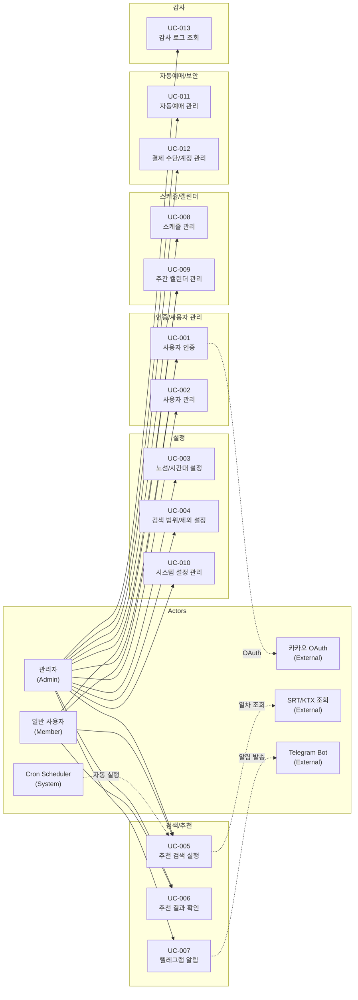
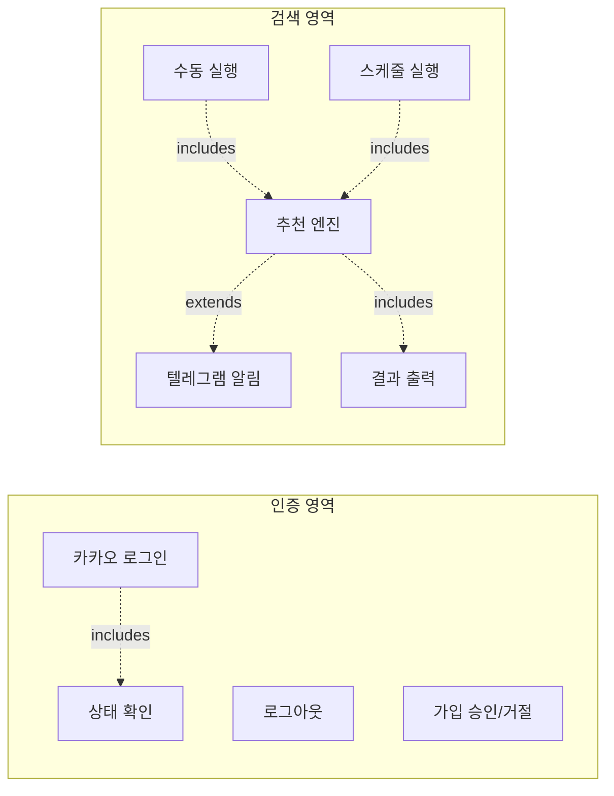
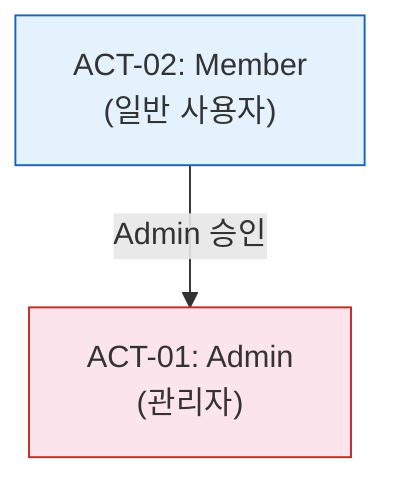

# 유스케이스 명세서

> Use Case Specification

---

## 문서 정보

| 항목 | 내용 |
|------|------|
| 프로젝트명 | TrainBot — 김천구미↔동탄 주간 예매 어시스턴트 |
| 문서 번호 | UCS-TRAINBOT-v1.0 |
| 버전 | 1.0.0 |
| 작성일 | 2026-03-02 |
| 작성자 | 프로젝트 오너 |

---

## 변경 이력

| 버전 | 날짜 | 변경 내용 | 작성자 | 승인자 |
|------|------|-----------|--------|--------|
| 1.0 | 2026-03-02 | 초안 작성 (SRS v1.3 / RTM v1.0 기반, UC-001 ~ UC-013) | 프로젝트 오너 | - |

---

## 목차

1. [유스케이스 다이어그램](#1-유스케이스-다이어그램)
2. [액터 정의](#2-액터-정의)
3. [유스케이스 목록](#3-유스케이스-목록)
4. [유스케이스 상세 명세](#4-유스케이스-상세-명세)

---

## 1. 유스케이스 다이어그램

### 1.1 전체 시스템 유스케이스 다이어그램

### 1.2 기능 영역별 유스케이스 다이어그램

---

## 2. 액터 정의

### 2.1 주요 액터 (Primary Actors)

| Actor ID | 이름 | 설명 | 권한 수준 | 인증 여부 |
|----------|------|------|-----------|-----------|
| ACT-01 | Admin (관리자) | 시스템 운영자. 최초 가입자가 자동 부여. 모든 기능 접근 가능. | Level 2 (최고) | 인증됨 |
| ACT-02 | Member (일반 사용자) | 관리자 승인 후 활성화. 결과 열람, 검색 실행, 캘린더 조회 가능. | Level 1 (기본) | 인증됨 |

### 2.2 보조 액터 (Secondary Actors)

| Actor ID | 이름 | 설명 | 연동 방식 |
|----------|------|------|-----------|
| ACT-S01 | 카카오 OAuth Provider | 사용자 인증을 위한 OAuth 2.0 서비스 | OAuth 2.0 |
| ACT-S02 | SRT/KTX 열차 조회 API | 열차 시간표 조회 외부 서비스 | HTTPS |
| ACT-S03 | Telegram Bot API | 추천 결과 알림 발송 서비스 | HTTPS (Bot Token) |
| ACT-S04 | Cron Scheduler | 시스템 내부 스케줄러 (자동 실행 트리거) | 내부 |

### 2.3 액터 계층 구조

> Admin은 Member의 모든 권한을 포함한다. 시스템 첫 가입자가 자동으로 Admin이 된다.

---

## 3. 유스케이스 목록

| UC-ID | 유스케이스명 | 주요 액터 | 우선순위 | 상태 | 관련 FR |
|-------|-------------|-----------|----------|------|---------|
| UC-001 | 사용자 인증 | Admin, Member | P1 필수 | 초안 | FR-001, FR-002 |
| UC-002 | 사용자 관리 | Admin | P1 필수 | 초안 | FR-003 |
| UC-003 | 노선/시간대 설정 | Admin | P1 필수 | 초안 | FR-004, FR-005 |
| UC-004 | 검색 범위/제외 설정 | Admin | P1 필수 | 초안 | FR-016, FR-017 |
| UC-005 | 추천 검색 실행 | Admin, Member | P1 필수 | 초안 | FR-006, FR-007, FR-008, FR-011 |
| UC-006 | 추천 결과 확인 | Admin, Member | P1 필수 | 초안 | FR-009 |
| UC-007 | 텔레그램 알림 관리 | Admin | P1 필수 | 초안 | FR-010 |
| UC-008 | 스케줄 관리 | Admin | P1 필수 | 초안 | FR-012 |
| UC-009 | 주간 캘린더 관리 | Admin, Member | P1 필수 | 초안 | FR-018 |
| UC-010 | 시스템 설정 관리 | Admin | P1 필수 | 초안 | FR-015 |
| UC-011 | 자동예매 관리 | Admin | P2 권장 | 초안 | FR-013 |
| UC-012 | 결제 수단/계정 관리 | Admin | P2 권장 | 초안 | FR-019 |
| UC-013 | 감사 로그 조회 | Admin | P2 권장 | 초안 | FR-014 |

**상태 정의:**

| 상태 | 설명 |
|------|------|
| 초안 | 최초 작성, 검토 필요 |
| 검토중 | 이해관계자 검토 진행 중 |
| 완료 | 검토 완료 및 승인됨 |
| 변경중 | 승인 후 변경 사항 발생 |

---

## 4. 유스케이스 상세 명세

---

### 4.1 UC-001: 사용자 인증

| 항목 | 내용 |
|------|------|
| **UC-ID** | UC-001 |
| **유스케이스명** | 사용자 인증 |
| **액터** | Admin, Member, 카카오 OAuth Provider (Secondary) |
| **설명** | 사용자가 카카오 OAuth를 통해 시스템에 로그인하고, 로그아웃할 수 있다. 최초 가입자는 자동으로 Admin+ACTIVE, 이후 가입자는 PENDING 상태로 생성된다. |
| **우선순위** | P1 필수 |
| **트리거** | 사용자가 로그인 페이지에 접근한다 |
| **관련 요구사항** | FR-001, FR-002 |

#### 사전 조건 (Pre-conditions)

1. 카카오 OAuth 서비스가 정상 동작 중이다.
2. 사용자는 유효한 카카오 계정을 보유하고 있다.

#### 기본 흐름 (Main Flow) — 로그인

| 단계 | 액터 | 시스템 |
|------|------|--------|
| 1 | 사용자가 로그인 페이지에 접근한다. | 카카오 로그인 버튼을 표시한다. |
| 2 | 사용자가 [카카오 로그인] 버튼을 클릭한다. | - |
| 3 | - | 카카오 OAuth 인증 페이지로 리다이렉트한다. |
| 4 | 사용자가 카카오 계정으로 인증한다. | - |
| 5 | - | 카카오로부터 callback으로 kakao_id를 수신한다. |
| 6 | - | kakao_id로 기존 사용자를 조회한다. |
| 7 | - | 사용자 상태를 확인한다 (ACTIVE → 로그인 진행). |
| 8 | - | 세션/토큰을 발급한다. |
| 9 | - | Dashboard 페이지로 리다이렉트한다. |

#### 대안 흐름 (Alternative Flow)

**AF-001-01: 신규 사용자 (최초 가입자)**

- 분기 시점: 단계 6 (사용자 미존재)
- 조건: ACTIVE 사용자가 0명이다.
- 시스템은 해당 kakao_id로 사용자를 ADMIN + ACTIVE 상태로 자동 생성한다.
- 감사 로그를 기록한다 (최초 관리자 생성).
- 기본 흐름 단계 8로 복귀한다.

**AF-001-02: 신규 사용자 (일반 가입)**

- 분기 시점: 단계 6 (사용자 미존재)
- 조건: ACTIVE 사용자가 1명 이상 4명 미만이다.
- 시스템은 해당 kakao_id로 사용자를 MEMBER + PENDING 상태로 생성한다.
- "관리자 승인 후 이용 가능합니다" 안내 화면을 표시한다.
- 유스케이스 종료.

**AF-001-03: 로그아웃**

- 트리거: 인증된 사용자가 [로그아웃] 버튼을 클릭한다.
- 단계:

| 단계 | 액터 | 시스템 |
|------|------|--------|
| A1 | 사용자가 [로그아웃] 버튼을 클릭한다. | - |
| A2 | - | 세션/토큰을 무효화한다. |
| A3 | - | 클라이언트 측 인증 정보를 삭제한다. |
| A4 | - | 로그인 페이지로 리다이렉트한다. |

#### 예외 흐름 (Exception Flow)

**EF-001-01: PENDING 상태 사용자**

- 분기 시점: 단계 7
- 조건: 사용자 상태가 PENDING이다.
- "관리자 승인 대기 중입니다" 안내를 표시한다.
- 유스케이스 종료.

**EF-001-02: REJECTED/DISABLED 사용자**

- 분기 시점: 단계 7
- 조건: 사용자 상태가 REJECTED 또는 DISABLED이다.
- "접근이 거부되었습니다. 관리자에게 문의하세요" 안내를 표시한다.
- 유스케이스 종료.

**EF-001-03: 정원 초과**

- 분기 시점: 단계 6 (사용자 미존재)
- 조건: ACTIVE 사용자가 이미 4명이다.
- "정원이 가득 찼습니다. 관리자에게 문의하세요" 안내를 표시한다.
- 유스케이스 종료.

**EF-001-04: 카카오 OAuth 오류**

- 분기 시점: 단계 3~5
- 조건: 카카오 OAuth 서비스 장애 또는 사용자 권한 거부.
- "카카오 로그인 처리 중 오류가 발생했습니다" 오류를 표시한다.
- 로그인 페이지로 복귀한다.

#### 사후 조건 (Post-conditions)

**로그인 성공 시:**

1. 유효한 세션/토큰이 발급되어 있다.
2. (신규 사용자) 사용자 레코드가 생성되어 있다.

**로그아웃 성공 시:**

1. 세션/토큰이 무효화되어 있다.
2. 클라이언트 인증 정보가 삭제되어 있다.

#### 비즈니스 규칙

| 규칙 ID | 내용 |
|---------|------|
| BR-001-01 | 카카오 OAuth만 지원한다 (자체 회원가입 불가) |
| BR-001-02 | 최초 가입자는 자동으로 Admin + ACTIVE 상태가 된다 |
| BR-001-03 | 이후 가입자는 PENDING 상태로 생성되며 Admin 승인이 필요하다 |
| BR-001-04 | ACTIVE 사용자는 최대 4명으로 제한된다 |
| BR-001-05 | kakao_id는 시스템 내에서 고유해야 한다 |

#### UI 참조

| 화면 ID | 화면명 | 설명 |
|---------|--------|------|
| SCR-LOGIN | 로그인 | 카카오 로그인 버튼 |
| SCR-01 | Dashboard | 로그인 후 메인 화면 |

#### 관련 요구사항 ID (RTM)

| 요구사항 ID | 설계 문서 | 테스트케이스 |
|------------|----------|-------------|
| FR-001 | - | - |
| FR-002 | - | - |
| NFR-005 | - | - |

---

### 4.2 UC-002: 사용자 관리

| 항목 | 내용 |
|------|------|
| **UC-ID** | UC-002 |
| **유스케이스명** | 사용자 관리 |
| **액터** | Admin |
| **설명** | 관리자가 가입 신청 목록을 확인하고, 승인/거절/비활성화를 수행한다. ACTIVE 사용자 정원(4명)을 관리한다. |
| **우선순위** | P1 필수 |
| **트리거** | 관리자가 Admin:Users 페이지에 접근한다 |
| **관련 요구사항** | FR-003 |

#### 사전 조건 (Pre-conditions)

1. 사용자는 Admin 역할로 로그인한 상태이다.
2. PENDING 상태 사용자가 1명 이상 존재한다 (승인/거절 시).

#### 기본 흐름 (Main Flow) — 가입 승인

| 단계 | 액터 | 시스템 |
|------|------|--------|
| 1 | Admin이 Admin:Users 페이지에 접근한다. | Admin 권한을 확인한다. |
| 2 | - | PENDING 사용자 목록과 ACTIVE 사용자 수(현재/최대)를 표시한다. |
| 3 | Admin이 대상 사용자의 [승인] 버튼을 클릭한다. | - |
| 4 | - | ACTIVE 사용자 수가 4명 미만인지 확인한다. |
| 5 | - | 대상 사용자의 상태를 ACTIVE로 변경한다. |
| 6 | - | 감사 로그를 기록한다 (승인자, 대상, 액션). |
| 7 | - | 목록을 갱신하여 표시한다. |

#### 대안 흐름 (Alternative Flow)

**AF-002-01: 가입 거절**

- 분기 시점: 단계 3 대신
- 단계:

| 단계 | 액터 | 시스템 |
|------|------|--------|
| A1 | Admin이 대상 사용자의 [거절] 버튼을 클릭한다. | - |
| A2 | - | 대상 사용자의 상태를 REJECTED로 변경한다. |
| A3 | - | 감사 로그를 기록한다. |
| A4 | - | 목록을 갱신하여 표시한다. |

**AF-002-02: 사용자 비활성화**

- 분기 시점: ACTIVE 사용자 목록에서
- 단계:

| 단계 | 액터 | 시스템 |
|------|------|--------|
| A1 | Admin이 ACTIVE 사용자의 [비활성화] 버튼을 클릭한다. | - |
| A2 | - | 확인 대화 상자를 표시한다. |
| A3 | Admin이 [확인]을 클릭한다. | - |
| A4 | - | 대상 사용자의 상태를 DISABLED로 변경한다. |
| A5 | - | 해당 사용자의 활성 세션을 무효화한다. |
| A6 | - | 감사 로그를 기록한다. |

#### 예외 흐름 (Exception Flow)

**EF-002-01: 정원 초과 시 승인 시도**

- 분기 시점: 단계 4
- 조건: ACTIVE 사용자가 이미 4명이다.
- "정원이 가득 찼습니다. 기존 사용자를 비활성화한 후 승인하세요" 안내를 표시한다.
- 유스케이스 종료.

**EF-002-02: 자기 자신 비활성화 시도**

- 분기 시점: AF-002-02 A1
- 조건: Admin이 자기 자신을 비활성화하려 한다.
- "자기 자신을 비활성화할 수 없습니다" 오류를 표시한다.
- 유스케이스 종료.

#### 사후 조건 (Post-conditions)

**승인 성공 시:** 대상 사용자가 ACTIVE 상태이며 시스템에 로그인할 수 있다.
**거절 성공 시:** 대상 사용자가 REJECTED 상태이며 로그인이 거부된다.
**비활성화 성공 시:** 대상 사용자가 DISABLED 상태이며 기존 세션이 무효화되었다.

#### 비즈니스 규칙

| 규칙 ID | 내용 |
|---------|------|
| BR-002-01 | ACTIVE 사용자 최대 4명 |
| BR-002-02 | Admin만 사용자 상태를 변경할 수 있다 |
| BR-002-03 | 모든 상태 변경은 감사 로그에 기록한다 |
| BR-002-04 | Admin은 자기 자신을 비활성화할 수 없다 |

#### UI 참조

| 화면 ID | 화면명 | 설명 |
|---------|--------|------|
| SCR-08 | Admin: Users | PENDING 목록, 승인/거절 버튼, ACTIVE 수/최대 표시 |

#### 관련 요구사항 ID (RTM)

| 요구사항 ID | 설계 문서 | 테스트케이스 |
|------------|----------|-------------|
| FR-003 | - | - |
| NFR-006 | - | - |

---

### 4.3 UC-003: 노선/시간대 설정

| 항목 | 내용 |
|------|------|
| **UC-ID** | UC-003 |
| **유스케이스명** | 노선/시간대 설정 |
| **액터** | Admin |
| **설명** | 관리자가 기본 노선(김천구미↔동탄) 확인, 대체역 옵션 설정, 요일별 선호시간대(earliest_after)를 설정한다. |
| **우선순위** | P1 필수 |
| **트리거** | 관리자가 Settings 페이지에 접근한다 |
| **관련 요구사항** | FR-004, FR-005 |

#### 사전 조건 (Pre-conditions)

1. 사용자는 Admin 역할로 로그인한 상태이다.

#### 기본 흐름 (Main Flow)

| 단계 | 액터 | 시스템 |
|------|------|--------|
| 1 | Admin이 Settings 페이지에 접근한다. | 현재 설정값을 로드하여 표시한다. |
| 2 | Admin이 노선 섹션에서 대체역 사용 여부를 토글한다. | - |
| 3 | (대체역 활성 시) Admin이 대체 출발역/도착역 목록을 입력한다. | - |
| 4 | Admin이 선호시간대 섹션에서 방향(상행/하행)을 선택한다. | - |
| 5 | Admin이 요일별 earliest_after 시간을 설정한다. | 시간 선택 UI를 제공한다 (0~23시). |
| 6 | Admin이 [저장] 버튼을 클릭한다. | - |
| 7 | - | 변경 요약(diff)을 표시하여 확인을 요청한다. |
| 8 | Admin이 변경 내용을 확인하고 [확인]을 클릭한다. | - |
| 9 | - | 설정을 저장한다. |
| 10 | - | 감사 로그를 기록한다 (변경 전/후 값). |
| 11 | - | "설정이 저장되었습니다" 안내를 표시한다. |

#### 대안 흐름 (Alternative Flow)

**AF-003-01: 변경 취소**

- 분기 시점: 단계 7
- Admin이 변경 요약에서 [취소]를 클릭한다.
- 변경사항이 저장되지 않고 이전 값이 유지된다.
- 유스케이스 종료.

#### 예외 흐름 (Exception Flow)

**EF-003-01: 선호시간대 미설정 요일**

- 설정되지 않은 요일은 해당 방향의 후보를 생성하지 않는다 (정상 동작).

#### 사후 조건 (Post-conditions)

**성공 시:**

1. 노선/시간대 설정이 config_json에 저장되어 있다.
2. 변경 감사 로그가 기록되어 있다.
3. 다음 검색 실행 시 변경된 설정이 적용된다.

#### 비즈니스 규칙

| 규칙 ID | 내용 |
|---------|------|
| BR-003-01 | Primary 노선(김천구미↔동탄)은 고정이며 변경할 수 없다 |
| BR-003-02 | 선호시간대의 earliest_after는 0~23 정수만 허용한다 |
| BR-003-03 | 설정되지 않은 요일은 검색 대상에서 제외된다 |
| BR-003-04 | 설정 변경 시 변경 요약(diff) 제공 필수 |

#### UI 참조

| 화면 ID | 화면명 | 설명 |
|---------|--------|------|
| SCR-04 | Settings | 노선/시간대/환승/가중치 설정 |

#### 관련 요구사항 ID (RTM)

| 요구사항 ID | 설계 문서 | 테스트케이스 |
|------------|----------|-------------|
| FR-004 | - | - |
| FR-005 | - | - |

---

### 4.4 UC-004: 검색 범위/제외 설정

| 항목 | 내용 |
|------|------|
| **UC-ID** | UC-004 |
| **유스케이스명** | 검색 범위/제외 설정 |
| **액터** | Admin |
| **설명** | 관리자가 검색 범위(1~8주), 시작점(이번 주/다음 주)의 기본값을 설정하고, 실행 시 특정 주를 제외(Skip)할 수 있다. |
| **우선순위** | P1 필수 |
| **트리거** | 관리자가 Settings 페이지 또는 실행 화면에서 범위를 설정한다 |
| **관련 요구사항** | FR-016, FR-017 |

#### 사전 조건 (Pre-conditions)

1. 사용자는 Admin 역할로 로그인한 상태이다.

#### 기본 흐름 (Main Flow) — 기본값 설정

| 단계 | 액터 | 시스템 |
|------|------|--------|
| 1 | Admin이 Settings 페이지의 검색 범위 섹션에 접근한다. | 현재 기본값을 표시한다 (default_weeks, default_start_from). |
| 2 | Admin이 기본 검색 범위(1~8주)를 선택한다. | - |
| 3 | Admin이 기본 시작점(이번 주/다음 주)을 선택한다. | - |
| 4 | Admin이 [저장] 버튼을 클릭한다. | - |
| 5 | - | 변경 요약을 표시하고 확인을 요청한다. |
| 6 | - | 설정을 저장하고 감사 로그를 기록한다. |

#### 대안 흐름 (Alternative Flow)

**AF-004-01: 실행 시 주 제외 (Skip Weeks)**

- 분기 시점: 수동 실행 또는 캘린더 검색 실행 시
- 단계:

| 단계 | 액터 | 시스템 |
|------|------|--------|
| A1 | 사용자가 검색 범위 내 주 목록을 확인한다. | 각 주의 날짜 범위와 체크박스를 표시한다. |
| A2 | 사용자가 제외할 주의 체크박스를 해제한다. | - |
| A3 | - | 제외된 주에 "건너뜀" 태그를 표시한다. |
| A4 | 사용자가 [검색 실행]을 클릭한다. | 제외된 주를 빼고 검색을 실행한다. |

#### 예외 흐름 (Exception Flow)

**EF-004-01: 범위 검증 실패**

- 조건: search_range_weeks가 1~8 범위를 벗어난다.
- "검색 범위는 1주~8주 사이여야 합니다" 오류를 표시한다.

**EF-004-02: 모든 주 제외**

- 조건: 검색 범위 내 모든 주가 제외되었다.
- "최소 1주 이상을 포함해야 합니다" 안내를 표시한다.
- 실행을 거부한다.

#### 사후 조건 (Post-conditions)

**성공 시:** 검색 범위 기본값이 저장되어 있고, 제외된 주는 검색/추천/알림에서 제외된다.

#### 비즈니스 규칙

| 규칙 ID | 내용 |
|---------|------|
| BR-004-01 | 검색 범위는 1~8주로 제한한다 |
| BR-004-02 | 시작점은 "this" 또는 "next"만 허용한다 |
| BR-004-03 | 제외된 주는 모든 처리에서 완전히 제외한다 |
| BR-004-04 | 최소 1주 이상은 검색 대상에 포함해야 한다 |

#### UI 참조

| 화면 ID | 화면명 | 설명 |
|---------|--------|------|
| SCR-04 | Settings | 검색 범위 기본값 설정 |
| SCR-01 | Dashboard | 실행 시 주 선택/제외 UI |

#### 관련 요구사항 ID (RTM)

| 요구사항 ID | 설계 문서 | 테스트케이스 |
|------------|----------|-------------|
| FR-016 | - | - |
| FR-017 | - | - |

---

### 4.5 UC-005: 추천 검색 실행

| 항목 | 내용 |
|------|------|
| **UC-ID** | UC-005 |
| **유스케이스명** | 추천 검색 실행 |
| **액터** | Admin, Member, SRT/KTX API (Secondary), Cron Scheduler (Secondary) |
| **설명** | 사용자가 수동으로 또는 스케줄에 의해 자동으로 추천 검색을 실행한다. 직행(SRT)+환승(SRT+KTX) 후보를 생성하고 스코어링하여 Top N을 선정한다. |
| **우선순위** | P1 필수 |
| **트리거** | 사용자가 [검색 실행] 버튼을 클릭하거나 스케줄이 트리거된다 |
| **관련 요구사항** | FR-006, FR-007, FR-008, FR-011 |

#### 사전 조건 (Pre-conditions)

1. 사용자는 로그인한 상태이다 (수동 실행 시).
2. 노선/시간대 설정이 완료되어 있다.
3. SRT/KTX 열차 조회 API가 정상 동작 중이다.
4. 현재 다른 실행이 진행 중이지 않다 (중복 방지).

#### 기본 흐름 (Main Flow) — 수동 실행

| 단계 | 액터 | 시스템 |
|------|------|--------|
| 1 | 사용자가 Dashboard에서 검색 범위/시작점/제외 주를 확인한다. | 현재 설정값과 주 목록을 표시한다. |
| 2 | 사용자가 [검색 실행] 버튼을 클릭한다. | - |
| 3 | - | 실행 락을 획득한다 (중복 방지). |
| 4 | - | 실행 레코드(runs)를 생성한다 (상태: RUNNING). |
| 5 | - | 검색 범위 내 각 주에 대해 반복: |
| 6 | - | — 해당 주의 요일별 earliest_after 이후 SRT 직행 열차를 조회한다. |
| 7 | - | — allow_transfer=true이면 SRT+KTX 환승 후보를 생성한다. |
| 8 | - | — 방향별 후보 최대 30개로 제한한다. |
| 9 | - | — 가중치 기반 스코어링을 수행한다. |
| 10 | - | — 직행 Top 5 + 환승 Top 3을 선정한다. |
| 11 | - | 결과를 result_json에 저장한다 (주 단위 그룹핑). |
| 12 | - | 실행 상태를 SUCCESS로 변경한다. |
| 13 | - | 실행 락을 해제한다. |
| 14 | - | 텔레그램 알림을 발송한다 (notify=true일 때). |
| 15 | - | Results 페이지로 리다이렉트한다. |

#### 대안 흐름 (Alternative Flow)

**AF-005-01: 스케줄 자동 실행**

- 트리거: Cron Scheduler가 등록된 스케줄을 실행한다.
- 스케줄에 설정된 search_range_weeks, start_from으로 실행한다.
- week_plans에서 NEEDED 상태 주만 대상으로 한다.
- 기본 흐름 단계 3~14와 동일하게 처리한다.
- 결과는 자동으로 텔레그램 알림 발송한다.

**AF-005-02: 캘린더 연동 실행**

- 트리거: 캘린더 페이지에서 [선택한 주 검색] 또는 [전체 검색]을 클릭한다.
- 선택된 NEEDED 상태 주만 대상으로 검색한다.
- 각 주의 상태를 SEARCHING으로 변경한다.
- 완료 시 RECOMMENDED로 변경하고 last_run_id를 업데이트한다.

#### 예외 흐름 (Exception Flow)

**EF-005-01: 중복 실행**

- 조건: 이미 다른 실행이 진행 중이다.
- "현재 검색이 진행 중입니다. 완료 후 다시 시도하세요" 안내를 표시한다.
- 유스케이스 종료.

**EF-005-02: 외부 API 조회 실패**

- 분기 시점: 단계 6~7
- 지수 백오프로 재시도한다 (최대 3회).
- 모든 재시도 실패 시 해당 주를 실패로 기록하고 다음 주를 계속 처리한다.
- 실행 상태를 FAILED로 변경한다.
- 오류 상세를 로그에 기록한다.

**EF-005-03: 후보 없음**

- 조건: 조건에 맞는 열차가 없다.
- "조건에 맞는 열차를 찾을 수 없습니다" 메시지를 결과에 포함한다.
- 실행 상태는 SUCCESS로 처리한다 (빈 결과).

#### 사후 조건 (Post-conditions)

**성공 시:**

1. runs 레코드에 결과가 저장되어 있다 (상태: SUCCESS).
2. 주 단위로 그룹핑된 결과가 result_json에 포함되어 있다.
3. (알림 활성 시) 텔레그램 알림이 발송되었다.
4. (캘린더 연동 시) week_plans 상태가 RECOMMENDED로 변경되어 있다.

**실패 시:**

1. runs 레코드가 FAILED 상태이다.
2. 오류 상세가 로그에 기록되어 있다.
3. (캘린더 연동 시) week_plans 상태가 NEEDED로 롤백되어 있다.

#### 비즈니스 규칙

| 규칙 ID | 내용 |
|---------|------|
| BR-005-01 | SRT 직행을 최우선으로 추천한다 |
| BR-005-02 | 방향별 후보 최대 30개, 직행 Top 5, 환승 Top 3 |
| BR-005-03 | 동시 실행은 락으로 방지한다 |
| BR-005-04 | 외부 API 실패 시 지수 백오프 재시도 (최대 3회) |
| BR-005-05 | 환승은 최대 1회, 최소 대기 20분 조건을 충족해야 한다 |

#### UI 참조

| 화면 ID | 화면명 | 설명 |
|---------|--------|------|
| SCR-01 | Dashboard | 수동 실행 버튼, 범위/시작점 선택 |
| SCR-02 | Calendar | 캘린더 연동 실행 |
| SCR-03 | Results | 결과 표시 |

#### 관련 요구사항 ID (RTM)

| 요구사항 ID | 설계 문서 | 테스트케이스 |
|------------|----------|-------------|
| FR-006 | - | - |
| FR-007 | - | - |
| FR-008 | - | - |
| FR-011 | - | - |
| NFR-008 | - | - |
| NFR-009 | - | - |
| NFR-010 | - | - |

---

### 4.6 UC-006: 추천 결과 확인

| 항목 | 내용 |
|------|------|
| **UC-ID** | UC-006 |
| **유스케이스명** | 추천 결과 확인 |
| **액터** | Admin, Member |
| **설명** | 사용자가 추천 검색 결과를 상행/하행 탭으로 구분하여 확인하고, 주 단위 네비게이션으로 복수 주 결과를 탐색한다. |
| **우선순위** | P1 필수 |
| **트리거** | 사용자가 Results 페이지에 접근하거나 실행 완료 후 리다이렉트된다 |
| **관련 요구사항** | FR-009 |

#### 사전 조건 (Pre-conditions)

1. 사용자는 로그인한 상태이다.
2. 최소 1건 이상의 실행 결과가 존재한다.

#### 기본 흐름 (Main Flow)

| 단계 | 액터 | 시스템 |
|------|------|--------|
| 1 | 사용자가 Results 페이지에 접근한다. | 가장 최근 실행 결과를 로드한다. |
| 2 | - | 주 단위 네비게이션을 표시한다 (복수 주 결과인 경우). |
| 3 | - | 상행/하행 탭을 표시한다 (기본: 상행 탭). |
| 4 | - | SRT 직행 Top N 섹션을 표시한다. |
| 5 | - | (환승 결과 존재 시) 환승 Top N 섹션을 표시한다. |
| 6 | - | 적용된 조건(컷오프 시간, 환승 허용 여부 등)을 표시한다. |
| 7 | 사용자가 개별 결과의 [복사] 버튼을 클릭한다. | 검색값을 클립보드에 복사한다. |

#### 대안 흐름 (Alternative Flow)

**AF-006-01: 주 단위 전환**

- 사용자가 주 네비게이터에서 다른 주를 선택한다.
- 해당 주의 결과를 로드하여 표시한다.
- 제외된 주는 "건너뜀" 태그로 표시한다.

**AF-006-02: 텔레그램 재전송**

- 사용자가 [텔레그램 재전송] 버튼을 클릭한다.
- dedupe 확인 후 알림을 재발송한다.

#### 사후 조건 (Post-conditions)

사용자가 결과를 확인하고 필요한 액션(복사, 재전송 등)을 수행했다.

#### UI 참조

| 화면 ID | 화면명 | 설명 |
|---------|--------|------|
| SCR-03 | Results | 상행/하행 탭, 직행/환승 섹션, 주 네비게이션 |

---

### 4.7 UC-007: 텔레그램 알림 관리

| 항목 | 내용 |
|------|------|
| **UC-ID** | UC-007 |
| **유스케이스명** | 텔레그램 알림 관리 |
| **액터** | Admin, Telegram Bot API (Secondary) |
| **설명** | 추천 결과를 텔레그램으로 발송하고, 동일 결과 중복 발송을 방지한다. 복수 주 결과는 주별 분리 또는 전체 요약으로 발송한다. |
| **우선순위** | P1 필수 |
| **트리거** | 추천 검색 완료 후 자동 발송 또는 사용자가 수동 재전송 |
| **관련 요구사항** | FR-010 |

#### 사전 조건 (Pre-conditions)

1. 텔레그램 Bot Token과 Chat ID가 설정되어 있다.
2. 발송할 추천 결과가 존재한다.

#### 기본 흐름 (Main Flow)

| 단계 | 액터 | 시스템 |
|------|------|--------|
| 1 | - | 실행 완료 후 결과 해시를 생성한다. |
| 2 | - | dedupe 테이블에서 동일 해시를 확인한다 (180분 윈도우). |
| 3 | - | (중복 아님) 텔레그램 메시지를 구성한다. |
| 4 | - | (복수 주) multi_week_mode에 따라 주별 분리 또는 전체 요약으로 구성한다. |
| 5 | - | Telegram Bot API로 메시지를 발송한다. |
| 6 | - | dedupe 레코드를 생성한다 (expires_at = now + 180분). |

#### 예외 흐름 (Exception Flow)

**EF-007-01: 중복 결과**

- 조건: 동일 해시가 dedupe 윈도우 내 존재한다.
- 알림을 발송하지 않는다.
- "동일 결과로 인해 알림이 생략되었습니다" 로그를 기록한다.

**EF-007-02: 텔레그램 발송 실패**

- 조건: Telegram Bot API 오류.
- 오류를 로그에 기록한다.
- 재시도하지 않는다 (다음 실행 시 재발송 가능).

#### 비즈니스 규칙

| 규칙 ID | 내용 |
|---------|------|
| BR-007-01 | dedupe 윈도우는 180분이다 |
| BR-007-02 | 복수 주 알림은 "separate" (주별 분리) 또는 "summary" (전체 요약) 모드를 지원한다 |

#### UI 참조

| 화면 ID | 화면명 | 설명 |
|---------|--------|------|
| SCR-04 | Settings | 텔레그램 설정 (Bot Token, Chat ID, dedupe 윈도우, multi_week_mode) |

---

### 4.8 UC-008: 스케줄 관리

| 항목 | 내용 |
|------|------|
| **UC-ID** | UC-008 |
| **유스케이스명** | 스케줄 관리 |
| **액터** | Admin |
| **설명** | 관리자가 크론 기반 자동 실행 스케줄을 등록/관리한다. 검색 범위와 시작점을 스케줄에 포함한다. |
| **우선순위** | P1 필수 |
| **트리거** | 관리자가 Schedule 페이지에 접근한다 |
| **관련 요구사항** | FR-012 |

#### 사전 조건 (Pre-conditions)

1. 사용자는 Admin 역할로 로그인한 상태이다.

#### 기본 흐름 (Main Flow) — 스케줄 생성

| 단계 | 액터 | 시스템 |
|------|------|--------|
| 1 | Admin이 Schedule 페이지에 접근한다. | 기존 스케줄 목록을 표시한다 (이름, 크론 표현식, 활성 여부, 다음 실행 예정). |
| 2 | Admin이 [스케줄 추가] 버튼을 클릭한다. | 스케줄 생성 폼을 표시한다. |
| 3 | Admin이 스케줄 이름을 입력한다. | - |
| 4 | Admin이 크론 표현식을 설정한다 (프리셋 또는 직접 입력). | 프리셋 옵션과 직접 입력 필드를 제공한다. |
| 5 | Admin이 시작점(this/next)과 검색 범위(주 수)를 설정한다. | - |
| 6 | Admin이 활성 여부를 설정한다. | - |
| 7 | Admin이 [생성] 버튼을 클릭한다. | - |
| 8 | - | 입력값을 검증하고 스케줄을 생성한다. |
| 9 | - | 감사 로그를 기록한다. |
| 10 | - | 목록을 갱신하여 표시한다. |

#### 대안 흐름 (Alternative Flow)

**AF-008-01: 스케줄 활성 토글**

- Admin이 기존 스케줄의 활성/비활성 토글을 클릭한다.
- 시스템이 스케줄 상태를 변경하고 감사 로그를 기록한다.

**AF-008-02: 스케줄 삭제**

- Admin이 스케줄의 [삭제] 버튼을 클릭한다.
- 확인 대화 상자를 표시한다.
- 확인 시 스케줄을 삭제하고 감사 로그를 기록한다.

#### 사후 조건 (Post-conditions)

**생성 성공 시:** 새 스케줄이 등록되어 설정된 크론에 따라 자동 실행된다.

#### 비즈니스 규칙

| 규칙 ID | 내용 |
|---------|------|
| BR-008-01 | 스케줄 관리는 Admin 전용이다 |
| BR-008-02 | 크론 표현식은 유효성 검증을 통과해야 한다 |

#### UI 참조

| 화면 ID | 화면명 | 설명 |
|---------|--------|------|
| SCR-05 | Schedule | 스케줄 목록/추가/토글/삭제 |

---

### 4.9 UC-009: 주간 캘린더 관리

| 항목 | 내용 |
|------|------|
| **UC-ID** | UC-009 |
| **유스케이스명** | 주간 캘린더 관리 |
| **액터** | Admin, Member |
| **설명** | 월간/주간 캘린더 뷰를 통해 각 주의 티켓 상태(NEEDED/BOOKED/NOT_NEEDED)를 관리하고, 검색 실행과 연동한다. |
| **우선순위** | P1 필수 |
| **트리거** | 사용자가 Calendar 페이지에 접근한다 |
| **관련 요구사항** | FR-018 |

#### 사전 조건 (Pre-conditions)

1. 사용자는 로그인한 상태이다.

#### 기본 흐름 (Main Flow) — 캘린더 조회

| 단계 | 액터 | 시스템 |
|------|------|--------|
| 1 | 사용자가 Calendar 페이지에 접근한다. | - |
| 2 | - | 현재 날짜 기준 향후 8주의 week_plans 레코드를 조회한다. |
| 3 | - | 레코드가 없는 주는 NEEDED 상태로 자동 생성한다. |
| 4 | - | 월간 캘린더 뷰를 표시한다 (주 단위 행, 상태 배지, 메모 미리보기, 결과 링크). |

#### 대안 흐름 (Alternative Flow)

**AF-009-01: 상태 변경**

| 단계 | 액터 | 시스템 |
|------|------|--------|
| A1 | 사용자가 주의 상태 드롭다운을 클릭한다. | 상태 옵션을 표시한다 (NEEDED/BOOKED/NOT_NEEDED). |
| A2 | 사용자가 새 상태를 선택한다. | - |
| A3 | - | week_plans 테이블을 업데이트한다. |
| A4 | - | 감사 로그를 기록한다. |
| A5 | - | 캘린더 뷰를 갱신한다. |

**AF-009-02: 메모 입력**

| 단계 | 액터 | 시스템 |
|------|------|--------|
| A1 | 사용자가 주의 메모 영역을 클릭한다. | 인라인 편집 모드를 활성화한다. |
| A2 | 사용자가 메모를 입력하고 저장한다. | - |
| A3 | - | week_plans.memo를 업데이트한다. |
| A4 | - | 캘린더 뷰에 메모 미리보기를 갱신한다. |

**AF-009-03: 선택한 주 검색 실행**

| 단계 | 액터 | 시스템 |
|------|------|--------|
| A1 | 사용자가 NEEDED 상태 주의 체크박스를 선택한다. | - |
| A2 | 사용자가 [선택한 주 검색] 버튼을 클릭한다. | - |
| A3 | - | 선택된 주의 상태를 SEARCHING으로 변경한다. |
| A4 | - | 로딩 인디케이터를 표시한다. |
| A5 | - | UC-005 (추천 검색 실행)을 실행한다. |
| A6 | - | 완료 시 상태를 RECOMMENDED로 변경하고 last_run_id를 업데이트한다. |
| A7 | - | 캘린더 뷰를 갱신한다 (결과 링크 포함). |

**AF-009-04: 전체 검색 실행**

- 사용자가 [전체 검색] 버튼을 클릭한다.
- NEEDED 상태 전체를 대상으로 AF-009-03과 동일하게 처리한다.

#### 예외 흐름 (Exception Flow)

**EF-009-01: 검색 실패 시 롤백**

- 조건: 검색 실행 중 오류가 발생한다.
- 해당 주의 상태를 NEEDED로 롤백한다.
- 오류 아이콘을 표시한다.

#### 사후 조건 (Post-conditions)

**상태 변경 시:** week_plans 레코드가 업데이트되어 있다.
**검색 실행 시:** 대상 주의 상태가 RECOMMENDED이고 결과 링크가 연결되어 있다.

#### 비즈니스 규칙

| 규칙 ID | 내용 |
|---------|------|
| BR-009-01 | 레코드가 없는 주는 NEEDED로 자동 생성한다 |
| BR-009-02 | BOOKED/NOT_NEEDED 상태 주는 검색에서 자동 제외한다 |
| BR-009-03 | 검색 실패 시 NEEDED로 롤백한다 |
| BR-009-04 | 상태 전이: NEEDED↔BOOKED↔NOT_NEEDED (사용자), NEEDED→SEARCHING→RECOMMENDED (시스템) |

#### UI 참조

| 화면 ID | 화면명 | 설명 |
|---------|--------|------|
| SCR-02 | Calendar | 월간 캘린더 뷰, 상태 관리, 메모, 검색 연동 |

---

### 4.10 UC-010: 시스템 설정 관리

| 항목 | 내용 |
|------|------|
| **UC-ID** | UC-010 |
| **유스케이스명** | 시스템 설정 관리 |
| **액터** | Admin |
| **설명** | 관리자가 시스템 전체 설정을 조회/변경한다. 환승 옵션, 스코어링 가중치, 텔레그램 설정, 표시 설정 등을 포함한다. |
| **우선순위** | P1 필수 |
| **트리거** | 관리자가 Settings 페이지에 접근한다 |
| **관련 요구사항** | FR-015 |

#### 사전 조건 (Pre-conditions)

1. 사용자는 Admin 역할로 로그인한 상태이다.

#### 기본 흐름 (Main Flow)

| 단계 | 액터 | 시스템 |
|------|------|--------|
| 1 | Admin이 Settings 페이지에 접근한다. | 전체 설정(config_json)을 로드하여 표시한다. |
| 2 | Admin이 원하는 설정 항목을 변경한다. | - |
| 3 | Admin이 [저장] 버튼을 클릭한다. | - |
| 4 | - | 변경 요약(diff)을 표시한다. |
| 5 | Admin이 [확인]을 클릭한다. | - |
| 6 | - | config_json을 업데이트한다. |
| 7 | - | 감사 로그를 기록한다 (변경 전/후). |
| 8 | - | "설정이 저장되었습니다" 안내를 표시한다. |

#### 설정 카테고리

| 카테고리 | 설정 항목 |
|----------|----------|
| 환승 옵션 | allow_transfer, max_transfers, min_transfer_buffer_min |
| 스코어링 가중치 | direct_bonus, total_time_penalty_per_min, transfer_penalty, transfer_wait_penalty_per_min |
| 표시 설정 | direct_top_n, transfer_top_n, max_candidates_per_direction |
| 텔레그램 | dedupe_window_minutes, multi_week_mode |
| 검색 범위 | default_weeks, max_weeks, default_start_from |

#### 비즈니스 규칙

| 규칙 ID | 내용 |
|---------|------|
| BR-010-01 | 설정 변경은 Admin 전용이다 |
| BR-010-02 | 변경 전 반드시 diff를 표시한다 |
| BR-010-03 | 모든 변경은 감사 로그에 기록한다 |

#### UI 참조

| 화면 ID | 화면명 | 설명 |
|---------|--------|------|
| SCR-04 | Settings | 전체 설정 조회/변경 |

---

### 4.11 UC-011: 자동예매 관리

| 항목 | 내용 |
|------|------|
| **UC-ID** | UC-011 |
| **유스케이스명** | 자동예매 관리 |
| **액터** | Admin |
| **설명** | 관리자가 자동예매(auto) 모드를 활성화/비활성화하고, 제한값(최대 금액/횟수/시도)을 설정한다. 활성화에는 강력한 가드레일이 적용된다. |
| **우선순위** | P2 권장 |
| **트리거** | 관리자가 Safety 페이지에 접근한다 |
| **관련 요구사항** | FR-013 |

#### 사전 조건 (Pre-conditions)

1. 사용자는 Admin 역할로 로그인한 상태이다.
2. (활성화 시) auto 플러그인이 설치되어 있어야 한다.

#### 기본 흐름 (Main Flow) — auto 모드 활성화

| 단계 | 액터 | 시스템 |
|------|------|--------|
| 1 | Admin이 Safety 페이지에 접근한다. | 현재 모드(assist/auto)와 제한값을 표시한다. |
| 2 | Admin이 [auto 모드 활성화] 버튼을 클릭한다. | - |
| 3 | - | 리스크 안내문을 표시한다 (자동 결제 위험성). |
| 4 | Admin이 체크박스 2개를 모두 선택한다 (이해/책임). | - |
| 5 | Admin이 지정 문구를 직접 입력한다 (2단계 확인). | 입력된 문구의 일치를 실시간 검증한다. |
| 6 | Admin이 [활성화] 버튼을 클릭한다. | - |
| 7 | - | safety.mode를 "auto"로 변경한다. |
| 8 | - | 감사 로그를 기록한다 (auto 모드 활성화). |
| 9 | - | "auto 모드가 활성화되었습니다" 안내를 표시한다. |

#### 대안 흐름 (Alternative Flow)

**AF-011-01: auto 모드 비활성화**

- Admin이 [auto 모드 비활성화] 버튼을 클릭한다.
- 확인 없이 즉시 assist 모드로 전환한다.
- 감사 로그를 기록한다.

**AF-011-02: 제한값 설정**

- Admin이 제한값(최대 금액/주간 횟수/시도 횟수)을 입력하고 저장한다.
- 설정을 저장하고 감사 로그를 기록한다.

#### 예외 흐름 (Exception Flow)

**EF-011-01: 플러그인 미설치**

- 조건: auto 플러그인이 설치되어 있지 않다.
- UI에서 비활성 또는 "미설치" 표시를 한다.
- 활성화 버튼이 비활성화된다.

**EF-011-02: 확인 절차 미완료**

- 조건: 체크박스 미선택 또는 문구 불일치.
- [활성화] 버튼이 비활성 상태로 유지된다.

#### 비즈니스 규칙

| 규칙 ID | 내용 |
|---------|------|
| BR-011-01 | auto 모드는 기본 비활성이다 |
| BR-011-02 | 활성화에 체크박스 2개 + 지정 문구 입력이 필요하다 |
| BR-011-03 | Admin 전용 기능이다 |
| BR-011-04 | 플러그인 미설치 시 활성화 불가 |

#### UI 참조

| 화면 ID | 화면명 | 설명 |
|---------|--------|------|
| SCR-07 | Safety | assist/auto 모드, 활성화 절차, 제한값 설정 |

---

### 4.12 UC-012: 결제 수단/계정 관리

| 항목 | 내용 |
|------|------|
| **UC-ID** | UC-012 |
| **유스케이스명** | 결제 수단/계정 관리 |
| **액터** | Admin |
| **설명** | 관리자가 예매 사이트 로그인 계정, 결제 수단, 승객 정보를 Safety 페이지에서 관리한다. 민감정보는 /data/.env.credentials 파일에만 저장하고 DB/로그에는 절대 저장하지 않는다. |
| **우선순위** | P2 권장 |
| **트리거** | 관리자가 Safety 페이지의 결제 수단/계정 관리 섹션에 접근한다 |
| **관련 요구사항** | FR-019 |

#### 사전 조건 (Pre-conditions)

1. 사용자는 Admin 역할로 로그인한 상태이다.

#### 기본 흐름 (Main Flow) — 자격증명 조회/저장

| 단계 | 액터 | 시스템 |
|------|------|--------|
| 1 | Admin이 Safety 페이지의 결제 수단/계정 관리 섹션에 접근한다. | Admin 권한을 확인한다. |
| 2 | - | /data/.env.credentials 파일을 로드한다. |
| 3 | - | 각 항목을 마스킹하여 표시한다 (예: 1234****, 비밀번호는 "설정됨"/"미설정"). |
| 4 | Admin이 수정할 항목의 [편집] 버튼을 클릭한다. | 편집 모드를 활성화한다 (원본 입력 가능). |
| 5 | Admin이 값을 입력/수정한다. | - |
| 6 | Admin이 [저장] 버튼을 클릭한다. | - |
| 7 | - | 입력값을 검증한다 (빈 값, 형식). |
| 8 | - | 변경 요약을 표시한다 (키 이름만, 값은 표시하지 않음). |
| 9 | Admin이 [확인]을 클릭한다. | - |
| 10 | - | /data/.env.credentials 파일에 덮어쓰기한다. |
| 11 | - | 애플리케이션에 환경변수 리로드 신호를 발송한다. |
| 12 | - | 감사 로그를 기록한다 (변경된 키 이름만, 값은 절대 기록하지 않음). |
| 13 | - | "저장되었습니다" 안내를 표시하고 마스킹된 뷰로 복귀한다. |

#### 대안 흐름 (Alternative Flow)

**AF-012-01: 자격증명 삭제**

| 단계 | 액터 | 시스템 |
|------|------|--------|
| A1 | Admin이 항목의 [삭제] 버튼을 클릭한다. | - |
| A2 | - | 확인 대화 상자를 표시한다. |
| A3 | Admin이 [확인]을 클릭한다. | - |
| A4 | - | 해당 키를 .env.credentials에서 제거한다. |
| A5 | - | 환경변수를 리로드한다. |
| A6 | - | 감사 로그를 기록한다 (삭제된 키 이름만). |

#### 예외 흐름 (Exception Flow)

**EF-012-01: 입력값 검증 실패**

- 조건: 필수 항목 빈 값 또는 형식 오류.
- 필드별 오류 메시지를 표시한다.
- 저장을 거부한다.

**EF-012-02: 파일 쓰기 실패**

- 조건: .env.credentials 파일 쓰기 권한 오류.
- "파일 저장에 실패했습니다" 오류를 표시한다.
- 로그에 오류를 기록한다.

#### 사후 조건 (Post-conditions)

**저장 성공 시:**

1. /data/.env.credentials 파일에 값이 저장되어 있다 (권한 600).
2. 환경변수가 리로드되어 있다.
3. DB, 로그, config_json에는 민감 값이 저장되어 있지 않다.

#### 비즈니스 규칙

| 규칙 ID | 내용 |
|---------|------|
| BR-012-01 | Admin 전용 — Member 접근 불가 |
| BR-012-02 | 민감정보는 /data/.env.credentials에만 저장한다 |
| BR-012-03 | DB, 로그, config_json에 민감 값 저장 금지 |
| BR-012-04 | UI 표시 시 마스킹 필수 |
| BR-012-05 | 감사 로그에 키 이름만 기록, 값은 절대 기록하지 않음 |
| BR-012-06 | 파일 권한 600 (소유자만 읽기/쓰기) |

#### UI 참조

| 화면 ID | 화면명 | 설명 |
|---------|--------|------|
| SCR-07 | Safety | 예매 계정, 결제 수단, 승객 정보 관리 카드 |

---

### 4.13 UC-013: 감사 로그 조회

| 항목 | 내용 |
|------|------|
| **UC-ID** | UC-013 |
| **유스케이스명** | 감사 로그 조회 |
| **액터** | Admin |
| **설명** | 관리자가 실행, 설정 변경, 사용자 관리, auto 모드 변경 등 주요 이벤트 로그를 조회한다. |
| **우선순위** | P2 권장 |
| **트리거** | 관리자가 Logs 페이지에 접근한다 |
| **관련 요구사항** | FR-014 |

#### 사전 조건 (Pre-conditions)

1. 사용자는 Admin 역할로 로그인한 상태이다.

#### 기본 흐름 (Main Flow)

| 단계 | 액터 | 시스템 |
|------|------|--------|
| 1 | Admin이 Logs 페이지에 접근한다. | - |
| 2 | - | 최근 감사 로그를 시간 역순으로 표시한다. |
| 3 | Admin이 필터를 적용한다 (이벤트 유형, 날짜 범위, 사용자). | - |
| 4 | - | 필터 조건에 맞는 로그를 조회하여 표시한다. |
| 5 | Admin이 개별 로그 항목을 클릭한다. | 상세 정보를 표시한다 (실행자, 액션, 대상, 메타데이터, 시간). |

#### 기록 대상

| 이벤트 | 기록 항목 |
|--------|-----------|
| 실행 (run) | 실행자, 모드, 상태, 소요시간 |
| 설정 변경 | 변경자, 변경 전/후 |
| 사용자 승인/거절/비활성화 | 수행자, 대상, 액션 |
| auto 모드 변경 | 수행자, 변경 전/후 |
| 스케줄 변경 | 수행자, 상세 |
| 텔레그램 발송 | 실행 ID, 결과, dedupe 여부 |
| 자격증명 변경 | 수행자, 변경된 키 이름만 (값 절대 기록 안 함) |

#### 비즈니스 규칙

| 규칙 ID | 내용 |
|---------|------|
| BR-013-01 | 감사 로그 조회는 Admin 전용이다 |
| BR-013-02 | 로그 보존 기간은 1년이다 |
| BR-013-03 | 자격증명 관련 로그에는 키 이름만 기록한다 |

#### UI 참조

| 화면 ID | 화면명 | 설명 |
|---------|--------|------|
| SCR-06 | Logs | 실행 기록, 이벤트 로그, 필터, 상세 보기 |

---

## 부록

### 부록 A: 유스케이스 간 관계 요약

| 유스케이스 | 관계 유형 | 대상 유스케이스 | 설명 |
|-----------|-----------|---------------|------|
| UC-001 사용자 인증 | includes | 카카오 OAuth 인증 | 로그인 시 외부 OAuth 인증 필수 |
| UC-005 추천 검색 실행 | includes | 추천 엔진 (직행) | 검색 시 직행 후보 생성 필수 |
| UC-005 추천 검색 실행 | extends | 추천 엔진 (환승) | allow_transfer=true일 때만 |
| UC-005 추천 검색 실행 | extends | UC-007 텔레그램 알림 | notify=true일 때 자동 발송 |
| UC-005 추천 검색 실행 | includes | UC-006 추천 결과 확인 | 실행 완료 후 결과 표시 |
| UC-008 스케줄 관리 | extends | UC-005 추천 검색 실행 | 크론 트리거로 자동 실행 |
| UC-009 캘린더 관리 | extends | UC-005 추천 검색 실행 | 선택한 주 검색 연동 |
| UC-011 자동예매 관리 | depends | UC-012 결제 수단/계정 관리 | auto 모드에 자격증명 필요 |

### 부록 B: 비즈니스 규칙 종합 목록

| 규칙 ID | 관련 UC | 내용 |
|---------|---------|------|
| BR-001-01 | UC-001 | 카카오 OAuth만 지원 |
| BR-001-02 | UC-001 | 최초 가입자 자동 Admin+ACTIVE |
| BR-001-03 | UC-001 | 이후 가입자 PENDING, Admin 승인 필요 |
| BR-001-04 | UC-001 | ACTIVE 최대 4명 |
| BR-002-01 | UC-002 | ACTIVE 사용자 최대 4명 |
| BR-002-04 | UC-002 | Admin 자기 비활성화 불가 |
| BR-003-01 | UC-003 | Primary 노선 고정 (김천구미↔동탄) |
| BR-003-02 | UC-003 | earliest_after 0~23 정수 |
| BR-004-01 | UC-004 | 검색 범위 1~8주 |
| BR-004-04 | UC-004 | 최소 1주 포함 필수 |
| BR-005-01 | UC-005 | SRT 직행 최우선 추천 |
| BR-005-03 | UC-005 | 동시 실행 락 기반 방지 |
| BR-005-05 | UC-005 | 환승 최대 1회, 대기 최소 20분 |
| BR-007-01 | UC-007 | dedupe 윈도우 180분 |
| BR-009-02 | UC-009 | BOOKED/NOT_NEEDED 주 검색 자동 제외 |
| BR-009-03 | UC-009 | 검색 실패 시 NEEDED 롤백 |
| BR-011-01 | UC-011 | auto 모드 기본 비활성 |
| BR-011-02 | UC-011 | 활성화 체크박스 2개 + 문구 입력 |
| BR-012-02 | UC-012 | 민감정보 .env.credentials만 저장 |
| BR-012-03 | UC-012 | DB/로그/config_json 민감 값 저장 금지 |
| BR-012-05 | UC-012 | 감사 로그에 키 이름만 기록 |

---

> **본 문서는 요구사항 명세서(SRS) 및 RTM과 함께 관리되며, 요구사항 변경 시 동시에 갱신한다.**
