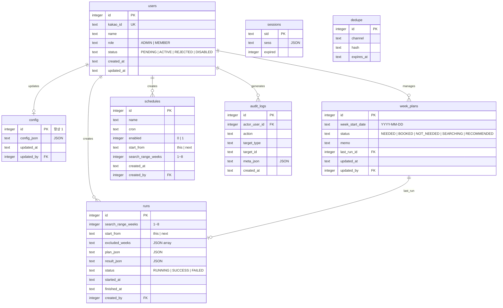
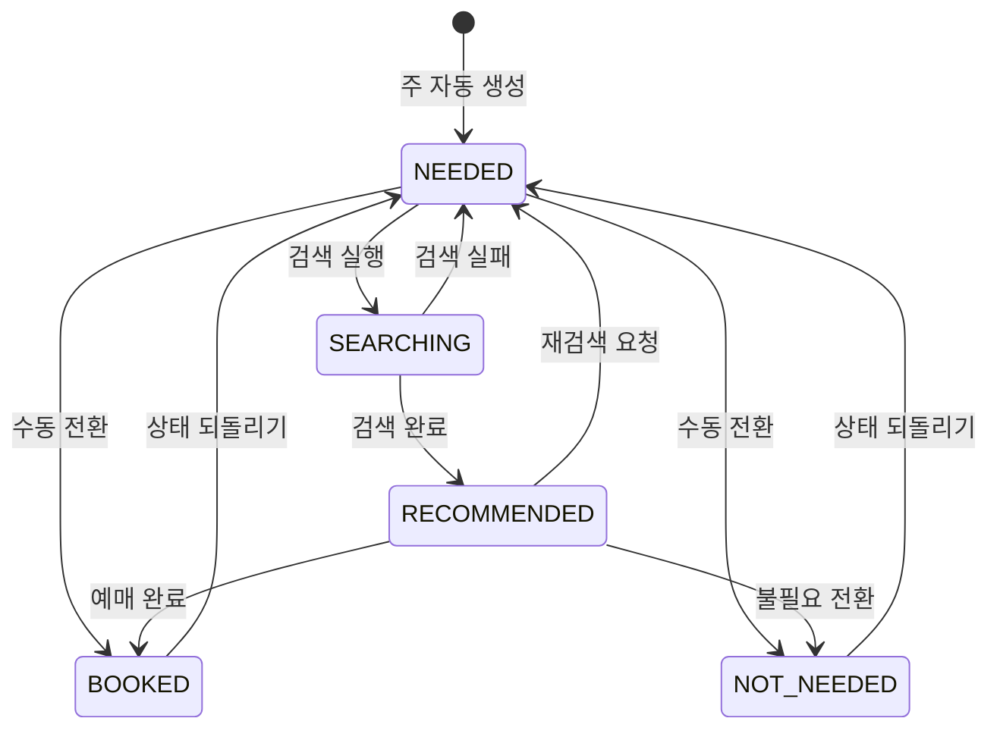

# 데이터베이스 설계서

| 항목 | 내용 |
|------|------|
| **프로젝트명** | TrainBot - 열차 추천 자동화 시스템 |
| **문서 버전** | v1.0 |
| **작성일** | 2026-03-02 |
| **작성자** | 시스템 설계팀 |
| **승인자** | 프로젝트 오너 |
| **문서 상태** | 초안 |

---

## 1. 개요

### 1.1 목적

본 문서는 TrainBot 시스템의 데이터베이스 논리적/물리적 설계를 정의한다. 엔티티 관계, 테이블 명세, 인덱스, 제약조건, 성능 전략 등을 포함하여 개발팀이 일관된 데이터 모델을 구현할 수 있도록 한다.

### 1.2 DBMS 선정

| 항목 | 내용 |
|------|------|
| DBMS | SQLite 3 |
| 접근 라이브러리 | better-sqlite3 (동기 API, Node.js 네이티브 바인딩) |
| 선정 근거 | NAS 단일 컨테이너 환경, 최대 4인 사용, 별도 DB 서버 불필요, 파일 기반 백업 용이 (ADR-002) |
| 인코딩 | UTF-8 |
| DB 파일 경로 | `/data/trainbot.db` |
| 저널 모드 | WAL (Write-Ahead Logging) |
| 타임존 | Asia/Seoul (애플리케이션 레벨에서 처리, DB에는 ISO 8601 문자열 저장) |

### 1.3 설계 원칙

| 원칙 | 설명 |
|------|------|
| 정규화 | 3NF 수준 유지. 소규모 시스템이므로 의도적 반정규화 없음 |
| 명명 규칙 | snake_case, 복수형 테이블명, 접두사 미사용 |
| 기본키 전략 | INTEGER PRIMARY KEY AUTOINCREMENT |
| Soft Delete | 미사용 — 물리 삭제 (보존 정책에 따른 정기 정리) |
| 타임스탬프 | 모든 테이블에 `created_at` 포함, 필요 시 `updated_at` 추가. TEXT 타입 ISO 8601 형식 |
| 외래키 제약 | 사용 (`PRAGMA foreign_keys = ON`) |
| 감사 로그 | 별도 `audit_logs` 테이블 사용 |
| JSON 저장 | TEXT 타입 + SQLite JSON 함수 활용 |
| Boolean | INTEGER (0 = false, 1 = true) |

### 1.4 SQLite PRAGMA 설정

애플리케이션 시작 시 다음 PRAGMA를 설정한다.

```sql
PRAGMA journal_mode = WAL;          -- 동시 읽기 성능 향상
PRAGMA foreign_keys = ON;           -- 외래키 제약 활성화
PRAGMA busy_timeout = 5000;         -- 잠금 대기 5초
PRAGMA synchronous = NORMAL;        -- WAL 모드에서 안전한 수준
PRAGMA cache_size = -8000;          -- 8MB 캐시
PRAGMA temp_store = MEMORY;         -- 임시 테이블 메모리 사용
```

### 1.5 변경 이력

| 버전 | 날짜 | 작성자 | 변경 내용 |
|------|------|--------|-----------|
| v1.0 | 2026-03-02 | 시스템 설계팀 | 초안 작성 |

---

## 2. ER 다이어그램

### 2.1 전체 ER 다이어그램



### 2.2 엔티티 관계 요약

| 관계 | 카디널리티 | 설명 |
|------|-----------|------|
| users → config | 1:0..1 | 한 사용자가 설정을 마지막으로 수정 |
| users → runs | 1:N | 한 사용자가 여러 실행을 생성 |
| users → week_plans | 1:N | 한 사용자가 여러 주간 계획을 관리 |
| users → schedules | 1:N | 한 사용자가 여러 스케줄을 생성 |
| users → audit_logs | 1:N | 한 사용자가 여러 감사 로그를 생성 |
| week_plans → runs | N:0..1 | 각 주간 계획은 마지막 실행을 참조 |

---

## 3. 테이블 명세서

### 3.1 users - 사용자

카카오 OAuth로 인증된 시스템 사용자 정보를 저장한다. 최대 4명 ACTIVE 제한.

#### 컬럼 정의

| 컬럼명 | 타입 | Nullable | 기본값 | 설명 |
|--------|------|----------|--------|------|
| `id` | INTEGER | NOT NULL | AUTOINCREMENT | 사용자 고유 식별자 |
| `kakao_id` | TEXT | NOT NULL | - | 카카오 계정 고유 ID |
| `name` | TEXT | NOT NULL | - | 카카오 프로필 이름 |
| `role` | TEXT | NOT NULL | `'MEMBER'` | 역할 (ADMIN / MEMBER) |
| `status` | TEXT | NOT NULL | `'PENDING'` | 상태 (PENDING / ACTIVE / REJECTED / DISABLED) |
| `created_at` | TEXT | NOT NULL | `CURRENT_TIMESTAMP` | 가입 시각 (ISO 8601) |
| `updated_at` | TEXT | NOT NULL | `CURRENT_TIMESTAMP` | 수정 시각 (ISO 8601) |

#### 제약조건

| 제약조건 유형 | 제약조건명 | 대상 컬럼 | 상세 |
|--------------|-----------|-----------|------|
| PK | `pk_users` | `id` | Primary Key (AUTOINCREMENT) |
| UK | `uk_users_kakao_id` | `kakao_id` | 카카오 ID 고유 제약 |
| CK | `ck_users_role` | `role` | `IN ('ADMIN', 'MEMBER')` |
| CK | `ck_users_status` | `status` | `IN ('PENDING', 'ACTIVE', 'REJECTED', 'DISABLED')` |

#### 인덱스

| 인덱스명 | 컬럼 | 타입 | 용도 |
|----------|------|------|------|
| `idx_users_kakao_id` | `kakao_id` | UNIQUE | 카카오 로그인 시 사용자 조회 |
| `idx_users_status` | `status` | B-tree | 상태별 사용자 필터링 |

#### 비즈니스 규칙

- 최초 가입자 → role = 'ADMIN', status = 'ACTIVE' (애플리케이션 레벨)
- 이후 가입자 → role = 'MEMBER', status = 'PENDING'
- ACTIVE 사용자 최대 4명 제한 (애플리케이션 레벨 가드레일)

---

### 3.2 sessions - 세션

express-session 기반 사용자 세션 정보를 저장한다. connect-sqlite3 어댑터 사용.

#### 컬럼 정의

| 컬럼명 | 타입 | Nullable | 기본값 | 설명 |
|--------|------|----------|--------|------|
| `sid` | TEXT | NOT NULL | - | 세션 고유 ID |
| `sess` | TEXT | NOT NULL | - | 세션 데이터 (JSON 직렬화) |
| `expired` | INTEGER | NOT NULL | - | 만료 시각 (Unix timestamp) |

#### 제약조건

| 제약조건 유형 | 제약조건명 | 대상 컬럼 | 상세 |
|--------------|-----------|-----------|------|
| PK | `pk_sessions` | `sid` | Primary Key |

#### 인덱스

| 인덱스명 | 컬럼 | 타입 | 용도 |
|----------|------|------|------|
| `idx_sessions_expired` | `expired` | B-tree | 만료 세션 정리 |

#### 비고

- connect-sqlite3 어댑터가 자동으로 테이블을 생성/관리
- 만료된 세션은 어댑터의 정기 정리(reap)로 삭제

---

### 3.3 config - 시스템 설정

시스템 전역 설정을 단일 레코드(id=1)로 관리한다. 설정 변경 이력은 audit_logs로 추적.

#### 컬럼 정의

| 컬럼명 | 타입 | Nullable | 기본값 | 설명 |
|--------|------|----------|--------|------|
| `id` | INTEGER | NOT NULL | - | 고정값 1 |
| `config_json` | TEXT | NOT NULL | - | 전체 설정 JSON (SRS 6.3 스키마 참조) |
| `updated_at` | TEXT | NOT NULL | `CURRENT_TIMESTAMP` | 최종 수정 시각 |
| `updated_by` | INTEGER | NULL | NULL | 최종 수정 사용자 (FK: users.id) |

#### 제약조건

| 제약조건 유형 | 제약조건명 | 대상 컬럼 | 상세 |
|--------------|-----------|-----------|------|
| PK | `pk_config` | `id` | Primary Key |
| CK | `ck_config_singleton` | `id` | `id = 1` (단일 레코드 보장) |
| FK | `fk_config_updated_by` | `updated_by` | REFERENCES users(id) ON DELETE SET NULL |

#### 인덱스

별도 인덱스 불필요 (단일 레코드, PK로 접근).

#### config_json 스키마

```jsonc
{
  "route": {
    "primary": { "from": "김천구미", "to": "동탄" },
    "alternatives": {
      "enabled": false,
      "from_candidates": [],
      "to_candidates": []
    }
  },
  "preferences": {
    "time_rules": {
      "up": { "금": 18, "토": 8 },      // 요일별 "N시 이후" 필터
      "down": { "일": 12 }
    },
    "modes": {
      "allow_transfer": true,
      "max_transfers": 1,
      "min_transfer_buffer_min": 20
    }
  },
  "ranking": {
    "direct_bonus": 100,
    "total_time_penalty_per_min": 1,
    "transfer_penalty": 50,
    "transfer_wait_penalty_per_min": 2
  },
  "search_range": {
    "default_weeks": 1,
    "max_weeks": 8,
    "default_start_from": "this"
  },
  "display": {
    "direct_top_n": 5,
    "transfer_top_n": 3,
    "max_candidates_per_direction": 30
  },
  "telegram": {
    "dedupe_window_minutes": 180,
    "multi_week_mode": "separate"        // "separate" | "summary"
  },
  "safety": {
    "mode": "assist",                    // "assist" | "auto"
    "auto_booking": {
      "enabled": false,
      "max_amount_per_booking": null,
      "max_bookings_per_week": null,
      "max_attempts_per_run": null
    }
  }
}
```

---

### 3.4 runs - 실행 기록

추천 검색 실행 이력과 결과를 저장한다.

#### 컬럼 정의

| 컬럼명 | 타입 | Nullable | 기본값 | 설명 |
|--------|------|----------|--------|------|
| `id` | INTEGER | NOT NULL | AUTOINCREMENT | 실행 고유 식별자 |
| `search_range_weeks` | INTEGER | NOT NULL | - | 검색 범위 (1~8주) |
| `start_from` | TEXT | NOT NULL | `'this'` | 시작 기준 ('this' / 'next') |
| `excluded_weeks` | TEXT | NULL | NULL | 제외된 주 인덱스 배열 (JSON) |
| `plan_json` | TEXT | NULL | NULL | 실행 계획 (대상 주, 적용 설정 스냅샷 등) |
| `result_json` | TEXT | NULL | NULL | 실행 결과 (방향별 추천 목록, 후보 수 등) |
| `status` | TEXT | NOT NULL | `'RUNNING'` | 실행 상태 |
| `started_at` | TEXT | NOT NULL | `CURRENT_TIMESTAMP` | 실행 시작 시각 |
| `finished_at` | TEXT | NULL | NULL | 실행 완료 시각 |
| `created_by` | INTEGER | NULL | NULL | 실행 트리거 사용자 (FK: users.id) |

#### 제약조건

| 제약조건 유형 | 제약조건명 | 대상 컬럼 | 상세 |
|--------------|-----------|-----------|------|
| PK | `pk_runs` | `id` | Primary Key (AUTOINCREMENT) |
| CK | `ck_runs_status` | `status` | `IN ('RUNNING', 'SUCCESS', 'FAILED')` |
| CK | `ck_runs_start_from` | `start_from` | `IN ('this', 'next')` |
| CK | `ck_runs_range` | `search_range_weeks` | `BETWEEN 1 AND 8` |
| FK | `fk_runs_created_by` | `created_by` | REFERENCES users(id) ON DELETE SET NULL |

#### 인덱스

| 인덱스명 | 컬럼 | 타입 | 용도 |
|----------|------|------|------|
| `idx_runs_status` | `status` | B-tree | 실행 중인 작업 조회 (중복 방지) |
| `idx_runs_started_at` | `started_at` | B-tree | 최신순 정렬 조회 |
| `idx_runs_created_by` | `created_by` | B-tree | 사용자별 실행 이력 조회 |

#### result_json 스키마

```jsonc
{
  "weeks": [
    {
      "week_start": "2026-03-02",
      "week_label": "3/2~3/8",
      "up": {
        "direct": [
          {
            "rank": 1,
            "score": 250,
            "train_type": "SRT",
            "train_no": "301",
            "departure": "김천구미 06:10",
            "arrival": "동탄 07:30",
            "duration_min": 80,
            "seats": "일반실 가능"
          }
        ],
        "transfer": []
      },
      "down": {
        "direct": [],
        "transfer": []
      }
    }
  ],
  "summary": {
    "total_candidates": 45,
    "filtered": 12,
    "ranked": 12
  }
}
```

---

### 3.5 week_plans - 주간 캘린더

주별 예매 상태와 메모를 관리한다. 캘린더 UI의 백엔드 데이터.

#### 컬럼 정의

| 컬럼명 | 타입 | Nullable | 기본값 | 설명 |
|--------|------|----------|--------|------|
| `id` | INTEGER | NOT NULL | AUTOINCREMENT | 고유 식별자 |
| `week_start_date` | TEXT | NOT NULL | - | 주 시작일 월요일 (YYYY-MM-DD) |
| `status` | TEXT | NOT NULL | `'NEEDED'` | 주 상태 |
| `memo` | TEXT | NULL | NULL | 사용자 메모 |
| `last_run_id` | INTEGER | NULL | NULL | 마지막 검색 실행 ID (FK: runs.id) |
| `updated_at` | TEXT | NOT NULL | `CURRENT_TIMESTAMP` | 최종 수정 시각 |
| `updated_by` | INTEGER | NULL | NULL | 최종 수정 사용자 (FK: users.id) |

#### 제약조건

| 제약조건 유형 | 제약조건명 | 대상 컬럼 | 상세 |
|--------------|-----------|-----------|------|
| PK | `pk_week_plans` | `id` | Primary Key (AUTOINCREMENT) |
| UK | `uk_week_plans_date` | `week_start_date` | 주 시작일 고유 (중복 주 방지) |
| CK | `ck_week_plans_status` | `status` | `IN ('NEEDED', 'BOOKED', 'NOT_NEEDED', 'SEARCHING', 'RECOMMENDED')` |
| FK | `fk_week_plans_last_run` | `last_run_id` | REFERENCES runs(id) ON DELETE SET NULL |
| FK | `fk_week_plans_updated_by` | `updated_by` | REFERENCES users(id) ON DELETE SET NULL |

#### 인덱스

| 인덱스명 | 컬럼 | 타입 | 용도 |
|----------|------|------|------|
| `idx_week_plans_date` | `week_start_date` | UNIQUE | 주 시작일 기반 조회 |
| `idx_week_plans_status` | `status` | B-tree | 상태별 필터링 (NEEDED만 검색 대상) |

#### 상태 전이 다이어그램



---

### 3.6 schedules - 스케줄

자동 실행 스케줄(Cron)을 정의한다.

#### 컬럼 정의

| 컬럼명 | 타입 | Nullable | 기본값 | 설명 |
|--------|------|----------|--------|------|
| `id` | INTEGER | NOT NULL | AUTOINCREMENT | 스케줄 고유 식별자 |
| `name` | TEXT | NOT NULL | - | 스케줄 이름 (예: "매일 아침 조회") |
| `cron` | TEXT | NOT NULL | - | Cron 표현식 (5필드) |
| `enabled` | INTEGER | NOT NULL | `1` | 활성화 여부 (0/1) |
| `start_from` | TEXT | NOT NULL | `'this'` | 검색 시작 기준 |
| `search_range_weeks` | INTEGER | NOT NULL | `1` | 검색 범위 (주) |
| `created_at` | TEXT | NOT NULL | `CURRENT_TIMESTAMP` | 생성 시각 |
| `created_by` | INTEGER | NULL | NULL | 생성 사용자 (FK: users.id) |

#### 제약조건

| 제약조건 유형 | 제약조건명 | 대상 컬럼 | 상세 |
|--------------|-----------|-----------|------|
| PK | `pk_schedules` | `id` | Primary Key (AUTOINCREMENT) |
| CK | `ck_schedules_enabled` | `enabled` | `IN (0, 1)` |
| CK | `ck_schedules_start_from` | `start_from` | `IN ('this', 'next')` |
| CK | `ck_schedules_range` | `search_range_weeks` | `BETWEEN 1 AND 8` |
| FK | `fk_schedules_created_by` | `created_by` | REFERENCES users(id) ON DELETE SET NULL |

#### 인덱스

| 인덱스명 | 컬럼 | 타입 | 용도 |
|----------|------|------|------|
| `idx_schedules_enabled` | `enabled` | B-tree | 활성 스케줄 조회 |

---

### 3.7 audit_logs - 감사 로그

시스템 이벤트(실행, 설정 변경, 사용자 승인 등)를 추적한다.

#### 컬럼 정의

| 컬럼명 | 타입 | Nullable | 기본값 | 설명 |
|--------|------|----------|--------|------|
| `id` | INTEGER | NOT NULL | AUTOINCREMENT | 로그 고유 식별자 |
| `actor_user_id` | INTEGER | NULL | NULL | 수행 사용자 (FK: users.id) |
| `action` | TEXT | NOT NULL | - | 수행 행위 (아래 열거형 참조) |
| `target_type` | TEXT | NOT NULL | - | 대상 엔티티 유형 |
| `target_id` | TEXT | NULL | NULL | 대상 엔티티 ID |
| `meta_json` | TEXT | NULL | NULL | 추가 메타데이터 (JSON) |
| `created_at` | TEXT | NOT NULL | `CURRENT_TIMESTAMP` | 이벤트 발생 시각 |

#### 제약조건

| 제약조건 유형 | 제약조건명 | 대상 컬럼 | 상세 |
|--------------|-----------|-----------|------|
| PK | `pk_audit_logs` | `id` | Primary Key (AUTOINCREMENT) |
| FK | `fk_audit_logs_actor` | `actor_user_id` | REFERENCES users(id) ON DELETE SET NULL |

#### 인덱스

| 인덱스명 | 컬럼 | 타입 | 용도 |
|----------|------|------|------|
| `idx_audit_logs_created_at` | `created_at` | B-tree | 시간순 조회 |
| `idx_audit_logs_action` | `action` | B-tree | 행위별 필터링 |
| `idx_audit_logs_actor` | `actor_user_id` | B-tree | 사용자별 이벤트 조회 |
| `idx_audit_logs_target` | `target_type, target_id` | Composite | 대상별 이벤트 조회 |

#### 감사 이벤트 유형

| action 값 | target_type | 설명 | meta_json 예시 |
|-----------|-------------|------|---------------|
| `USER_APPROVED` | user | 사용자 승인 | `{"user_id": 2}` |
| `USER_REJECTED` | user | 사용자 거절 | `{"user_id": 3}` |
| `USER_DISABLED` | user | 사용자 비활성화 | `{"user_id": 2}` |
| `CONFIG_UPDATED` | config | 설정 변경 | `{"changed_keys": ["preferences.time_rules"]}` |
| `RUN_STARTED` | run | 실행 시작 | `{"trigger": "manual", "run_id": 5}` |
| `RUN_COMPLETED` | run | 실행 완료 | `{"run_id": 5, "status": "SUCCESS"}` |
| `RUN_FAILED` | run | 실행 실패 | `{"run_id": 5, "error": "..."}` |
| `SCHEDULE_CREATED` | schedule | 스케줄 생성 | `{"schedule_id": 1}` |
| `SCHEDULE_UPDATED` | schedule | 스케줄 수정 | `{"schedule_id": 1, "field": "enabled"}` |
| `SCHEDULE_DELETED` | schedule | 스케줄 삭제 | `{"schedule_id": 1}` |
| `TELEGRAM_SENT` | notification | 텔레그램 발송 | `{"week": "2026-03-02"}` |
| `CREDENTIAL_SAVED` | credential | 자격증명 저장 | `{"key": "srt_account"}` |
| `CREDENTIAL_DELETED` | credential | 자격증명 삭제 | `{"key": "srt_account"}` |
| `AUTO_MODE_ENABLED` | config | 자동예매 활성화 | `{}` |
| `AUTO_MODE_DISABLED` | config | 자동예매 비활성화 | `{}` |

> **보안 규칙**: `meta_json`에 비밀번호, 결제정보 등 민감 값을 절대 기록하지 않는다 (NFR-007).

---

### 3.8 dedupe - 중복 방지

텔레그램 알림 중복 발송을 방지하기 위한 해시 기반 중복 체크 테이블.

#### 컬럼 정의

| 컬럼명 | 타입 | Nullable | 기본값 | 설명 |
|--------|------|----------|--------|------|
| `id` | INTEGER | NOT NULL | AUTOINCREMENT | 고유 식별자 |
| `channel` | TEXT | NOT NULL | - | 채널명 (현재 'telegram' 고정) |
| `hash` | TEXT | NOT NULL | - | 결과 해시 (SHA-256) |
| `expires_at` | TEXT | NOT NULL | - | 만료 시각 (ISO 8601) |

#### 제약조건

| 제약조건 유형 | 제약조건명 | 대상 컬럼 | 상세 |
|--------------|-----------|-----------|------|
| PK | `pk_dedupe` | `id` | Primary Key (AUTOINCREMENT) |
| UK | `uk_dedupe_channel_hash` | `channel, hash` | 채널+해시 고유 제약 |

#### 인덱스

| 인덱스명 | 컬럼 | 타입 | 용도 |
|----------|------|------|------|
| `idx_dedupe_channel_hash` | `channel, hash` | UNIQUE | 중복 체크 조회 |
| `idx_dedupe_expires_at` | `expires_at` | B-tree | 만료 레코드 정리 |

#### 중복 판정 로직

1. 알림 발송 전 `channel + hash` 조합으로 기존 레코드 조회
2. 미만료 레코드 존재 시 → 중복으로 판정, 발송 스킵
3. 미존재 또는 만료 시 → 신규 레코드 INSERT, 발송 진행
4. `expires_at` = 현재 시각 + `config.telegram.dedupe_window_minutes` (기본 180분)

---

## 4. 데이터 사전 (Data Dictionary)

### 4.1 공통 도메인 정의

| 용어 | 정의 | 도메인 (타입) | 허용값 | 비고 |
|------|------|---------------|--------|------|
| 사용자 ID | 사용자 고유 식별자 | INTEGER | 양의 정수 | AUTOINCREMENT |
| 카카오 ID | 카카오 계정 고유 ID | TEXT | - | 카카오 OAuth에서 제공 |
| 사용자 역할 | 시스템 내 권한 수준 | TEXT | ADMIN, MEMBER | RBAC |
| 사용자 상태 | 사용자 계정 상태 | TEXT | PENDING, ACTIVE, REJECTED, DISABLED | 승인 워크플로우 |
| 주간 상태 | 주별 예매 관리 상태 | TEXT | NEEDED, BOOKED, NOT_NEEDED, SEARCHING, RECOMMENDED | 캘린더 상태 |
| 실행 상태 | 추천 검색 실행 상태 | TEXT | RUNNING, SUCCESS, FAILED | 실행 라이프사이클 |
| 검색 시작점 | 검색 범위 시작 기준 | TEXT | this, next | 이번 주 / 다음 주 |
| Cron 표현식 | 스케줄 실행 시각 정의 | TEXT | 5필드 cron | node-cron 호환 |
| 타임스탬프 | 시간 기록 | TEXT | ISO 8601 형식 | Asia/Seoul 기준 |
| 날짜 | 날짜 기록 | TEXT | YYYY-MM-DD | 주 시작일은 월요일 |
| JSON 데이터 | 구조화된 데이터 | TEXT | 유효한 JSON 문자열 | SQLite JSON 함수 호환 |
| Boolean | 참/거짓 값 | INTEGER | 0 (false), 1 (true) | SQLite 관례 |

### 4.2 열거형 (Enum) 값 정의

#### 사용자 역할 (User Role)

| 값 | 설명 | 권한 |
|----|------|------|
| `ADMIN` | 관리자 | 모든 기능 접근, 사용자 관리, 설정 변경, 자격증명 관리 |
| `MEMBER` | 일반 멤버 | 대시보드 조회, 수동 실행, 결과 확인, 캘린더 관리 |

#### 사용자 상태 (User Status)

| 값 | 설명 | 전이 가능 상태 |
|----|------|---------------|
| `PENDING` | 승인 대기 | ACTIVE, REJECTED |
| `ACTIVE` | 활성 계정 | DISABLED |
| `REJECTED` | 거절된 계정 | - (최종 상태) |
| `DISABLED` | 비활성화 계정 | ACTIVE |

#### 주간 상태 (Week Plan Status)

| 값 | 설명 | 전이 가능 상태 |
|----|------|---------------|
| `NEEDED` | 예매 필요 (검색 대상) | SEARCHING, BOOKED, NOT_NEEDED |
| `SEARCHING` | 검색 진행 중 | RECOMMENDED, NEEDED (실패 시) |
| `RECOMMENDED` | 추천 완료 | NEEDED, BOOKED, NOT_NEEDED |
| `BOOKED` | 예매 완료 (검색 제외) | NEEDED |
| `NOT_NEEDED` | 불필요 (검색 제외) | NEEDED |

#### 실행 상태 (Run Status)

| 값 | 설명 | 전이 가능 상태 |
|----|------|---------------|
| `RUNNING` | 실행 중 | SUCCESS, FAILED |
| `SUCCESS` | 성공 완료 | - (최종 상태) |
| `FAILED` | 실패 | - (최종 상태) |

---

## 5. 마이그레이션 전략

### 5.1 마이그레이션 도구

| 항목 | 내용 |
|------|------|
| 도구 | 자체 구현 (better-sqlite3 기반 SQL 파일 순차 실행) |
| 버전 관리 방식 | 순차 번호 (`V001`, `V002`, ...) |
| 마이그레이션 파일 위치 | `server/database/migrations/` |
| 버전 추적 테이블 | `schema_migrations` (version TEXT PK, applied_at TEXT) |
| 실행 시점 | 애플리케이션 시작 시 자동 실행 |

### 5.2 버전 관리 규칙

| 규칙 | 설명 |
|------|------|
| 파일 명명 | `V{순번}__{설명}.sql` 예) `V001__create_users_table.sql` |
| 한 파일 = 하나의 변경 | 하나의 마이그레이션 파일에 하나의 논리적 변경만 포함 |
| 되돌리기 불가 원칙 | 적용된 마이그레이션 파일은 수정하지 않음. 새 마이그레이션으로 변경 |
| 데이터 마이그레이션 분리 | 스키마 변경과 시드 데이터를 별도 파일로 관리 |
| 트랜잭션 실행 | 각 마이그레이션을 트랜잭션 내에서 실행 |

### 5.3 초기 마이그레이션 파일 목록

| 파일명 | 내용 |
|--------|------|
| `V001__create_schema_migrations.sql` | 마이그레이션 버전 추적 테이블 생성 |
| `V002__create_users_table.sql` | users 테이블 + 인덱스 |
| `V003__create_config_table.sql` | config 테이블 + 기본 설정 INSERT |
| `V004__create_runs_table.sql` | runs 테이블 + 인덱스 |
| `V005__create_week_plans_table.sql` | week_plans 테이블 + 인덱스 |
| `V006__create_schedules_table.sql` | schedules 테이블 + 인덱스 |
| `V007__create_audit_logs_table.sql` | audit_logs 테이블 + 인덱스 |
| `V008__create_dedupe_table.sql` | dedupe 테이블 + 인덱스 |

### 5.4 마이그레이션 실행 흐름

```
애플리케이션 시작
  │
  ├─ PRAGMA 설정 (WAL, foreign_keys 등)
  │
  ├─ schema_migrations 테이블 존재 확인
  │   └─ 미존재 시 → V001 실행하여 생성
  │
  ├─ migrations/ 디렉토리의 SQL 파일 목록 조회 (정렬)
  │
  ├─ schema_migrations에 없는 미적용 파일 필터링
  │
  ├─ 미적용 파일 순차 실행
  │   ├─ BEGIN TRANSACTION
  │   ├─ SQL 파일 실행
  │   ├─ schema_migrations에 버전 INSERT
  │   └─ COMMIT (실패 시 ROLLBACK + 에러 로그 + 프로세스 종료)
  │
  └─ 마이그레이션 완료, 서버 시작
```

### 5.5 롤백 계획

| 시나리오 | 롤백 방법 |
|----------|-----------|
| 마이그레이션 실패 | 트랜잭션 ROLLBACK (자동), 에러 로그 기록 |
| 잘못된 마이그레이션 적용 | DB 파일 백업에서 복원 (SQLite 파일 기반) |
| 긴급 롤백 | `trainbot.db` 파일을 백업 파일로 교체 후 재시작 |

> **SQLite 특성**: 파일 기반이므로 전체 롤백 = 파일 교체로 간단하게 수행 가능.

---

## 6. 성능 설계

### 6.1 파티셔닝/샤딩

| 항목 | 내용 |
|------|------|
| 파티셔닝 | 미적용 — SQLite는 네이티브 파티셔닝 미지원. 데이터 규모가 극소 |
| 샤딩 | 미적용 — 단일 파일 DB, 최대 4인 사용 |
| 복제 | 미적용 — 단일 인스턴스 운영 |

### 6.2 예상 데이터 규모

| 테이블 | 예상 레코드 수 (1년) | 평균 레코드 크기 | 예상 총 크기 |
|--------|---------------------|-----------------|-------------|
| users | ~10 | ~200B | ~2KB |
| sessions | ~10 (동시) | ~500B | ~5KB |
| config | 1 | ~2KB | ~2KB |
| runs | ~200 (90일 보존) | ~5KB (result_json) | ~1MB |
| week_plans | ~50 (90일 보존) | ~200B | ~10KB |
| schedules | ~10 | ~150B | ~1.5KB |
| audit_logs | ~2,500 (1년 보존) | ~300B | ~750KB |
| dedupe | ~20 (만료 후 정리) | ~100B | ~2KB |
| **합계** | | | **~2MB** |

> SQLite 단일 파일로 충분히 관리 가능한 규모. DB 파일 크기는 1년 후에도 수 MB 수준.

### 6.3 인덱스 전략

#### 인덱스 설계 원칙

| 원칙 | 설명 |
|------|------|
| 최소 인덱스 | 소규모 데이터이므로 불필요한 인덱스 지양 |
| 고유 제약 | UK가 필요한 컬럼에만 UNIQUE 인덱스 |
| 조회 패턴 기반 | 실제 쿼리 패턴에 맞춰 인덱스 설계 |

#### 주요 쿼리별 인덱스 매핑

| 쿼리 용도 | 대상 테이블 | 사용 인덱스 | 예상 쿼리 패턴 |
|-----------|-------------|-------------|---------------|
| 카카오 로그인 | users | `idx_users_kakao_id` | `WHERE kakao_id = ?` |
| ACTIVE 사용자 수 확인 | users | `idx_users_status` | `WHERE status = 'ACTIVE'` |
| 실행 중 작업 확인 (중복 방지) | runs | `idx_runs_status` | `WHERE status = 'RUNNING'` |
| 최근 실행 목록 | runs | `idx_runs_started_at` | `ORDER BY started_at DESC LIMIT ?` |
| NEEDED 주 조회 (검색 대상) | week_plans | `idx_week_plans_status` | `WHERE status = 'NEEDED'` |
| 향후 8주 캘린더 | week_plans | `idx_week_plans_date` | `WHERE week_start_date >= ? AND week_start_date <= ?` |
| 활성 스케줄 조회 | schedules | `idx_schedules_enabled` | `WHERE enabled = 1` |
| 감사 로그 최신순 | audit_logs | `idx_audit_logs_created_at` | `ORDER BY created_at DESC` |
| 중복 체크 | dedupe | `idx_dedupe_channel_hash` | `WHERE channel = ? AND hash = ? AND expires_at > ?` |
| 만료 레코드 정리 | dedupe | `idx_dedupe_expires_at` | `WHERE expires_at < ?` |

### 6.4 쿼리 최적화 가이드라인

| 항목 | 가이드라인 |
|------|-----------|
| SELECT 절 | `SELECT *` 지양, 필요한 컬럼만 명시 |
| JSON 쿼리 | SQLite JSON 함수(`json_extract`, `json_each`) 활용. 빈번한 JSON 내부 조회 시 별도 컬럼 추출 고려 |
| 페이지네이션 | Offset 기반 (데이터 소규모이므로 Cursor 방식 불필요) |
| 트랜잭션 | 다중 INSERT/UPDATE 시 반드시 트랜잭션으로 묶어 성능 확보 |
| 동시성 | WAL 모드로 읽기/쓰기 동시 접근 허용. 쓰기 직렬화는 SQLite 자체 처리 |
| Prepared Statement | 모든 쿼리에 Prepared Statement 사용 (보안 + 성능) |

---

## 7. 백업/복구 정책

### 7.1 백업 방식

| 항목 | 내용 |
|------|------|
| 백업 방식 | SQLite 파일 복사 (`.backup` API 또는 파일 시스템 cp) |
| 백업 도구 | better-sqlite3 `.backup()` 메서드 + 쉘 스크립트 |
| 백업 경로 | `/data/backups/` |
| 파일 형식 | `trainbot_YYYYMMDD_HHmmss.db` |

### 7.2 백업 스케줄

| 백업 유형 | 주기 | 시간대 | 보존 기간 |
|-----------|------|--------|-----------|
| 일일 백업 | 매일 1회 | 새벽 3시 (KST) | 30일 |
| 수동 백업 | 설정 변경/마이그레이션 전 | 수동 | 무기한 (수동 삭제) |

### 7.3 백업 스크립트 구조

```bash
#!/bin/bash
# /data/scripts/backup.sh

DB_PATH="/data/trainbot.db"
BACKUP_DIR="/data/backups"
TIMESTAMP=$(date +%Y%m%d_%H%M%S)
BACKUP_FILE="${BACKUP_DIR}/trainbot_${TIMESTAMP}.db"
RETENTION_DAYS=30

# 백업 실행 (SQLite online backup)
sqlite3 "$DB_PATH" ".backup '${BACKUP_FILE}'"

# 무결성 검증
sqlite3 "$BACKUP_FILE" "PRAGMA integrity_check;" | grep -q "ok"
if [ $? -ne 0 ]; then
    echo "ERROR: Backup integrity check failed"
    rm -f "$BACKUP_FILE"
    exit 1
fi

# 오래된 백업 삭제
find "$BACKUP_DIR" -name "trainbot_*.db" -mtime +${RETENTION_DAYS} -delete

echo "Backup completed: ${BACKUP_FILE}"
```

### 7.4 복구 절차

| 복구 시나리오 | 절차 | 예상 소요 시간 |
|--------------|------|---------------|
| DB 파일 손상 | 1. 컨테이너 정지 → 2. 최신 백업 파일을 `trainbot.db`로 복사 → 3. 컨테이너 시작 | 5분 이내 |
| 잘못된 데이터 변경 | 1. 컨테이너 정지 → 2. 변경 전 백업으로 복원 → 3. 컨테이너 시작 | 5분 이내 |
| 컨테이너 재생성 | `/data` 볼륨 마운트 유지로 자동 복구 (별도 조치 불필요) | 즉시 |

### 7.5 데이터 보존 및 정리

| 데이터 유형 | 보존 기간 | 정리 방법 | 정리 주기 |
|------------|-----------|-----------|-----------|
| users | 무기한 | - | - |
| config | 무기한 | - | - |
| schedules | 무기한 | - | - |
| runs | 90일 | `DELETE FROM runs WHERE started_at < date('now', '-90 days')` | 매일 새벽 4시 |
| week_plans | 90일 | `DELETE FROM week_plans WHERE week_start_date < date('now', '-90 days')` | 매일 새벽 4시 |
| audit_logs | 1년 | `DELETE FROM audit_logs WHERE created_at < date('now', '-365 days')` | 매주 일요일 새벽 4시 |
| dedupe | expires_at 이후 | `DELETE FROM dedupe WHERE expires_at < datetime('now')` | 매 실행 시 |
| sessions | 만료 후 | connect-sqlite3 어댑터 자동 정리 (reap) | 자동 |
| 백업 파일 | 30일 | `find /data/backups/ -mtime +30 -delete` | 매일 백업 시 |

> 정리 작업은 node-cron으로 스케줄링하며, 정리 전 `VACUUM` 실행으로 DB 파일 크기를 최적화한다.

---

## 8. DDL 스크립트

### 8.1 전체 초기화 DDL

```sql
-- ============================================
-- TrainBot Database Schema
-- DBMS: SQLite 3
-- Version: V001
-- ============================================

-- PRAGMA 설정
PRAGMA journal_mode = WAL;
PRAGMA foreign_keys = ON;

-- ============================================
-- schema_migrations: 마이그레이션 버전 추적
-- ============================================
CREATE TABLE IF NOT EXISTS schema_migrations (
    version     TEXT    NOT NULL PRIMARY KEY,
    applied_at  TEXT    NOT NULL DEFAULT (datetime('now', 'localtime'))
);

-- ============================================
-- users: 사용자
-- ============================================
CREATE TABLE users (
    id          INTEGER NOT NULL PRIMARY KEY AUTOINCREMENT,
    kakao_id    TEXT    NOT NULL,
    name        TEXT    NOT NULL,
    role        TEXT    NOT NULL DEFAULT 'MEMBER'
                        CHECK (role IN ('ADMIN', 'MEMBER')),
    status      TEXT    NOT NULL DEFAULT 'PENDING'
                        CHECK (status IN ('PENDING', 'ACTIVE', 'REJECTED', 'DISABLED')),
    created_at  TEXT    NOT NULL DEFAULT (datetime('now', 'localtime')),
    updated_at  TEXT    NOT NULL DEFAULT (datetime('now', 'localtime')),

    CONSTRAINT uk_users_kakao_id UNIQUE (kakao_id)
);

CREATE INDEX idx_users_kakao_id ON users (kakao_id);
CREATE INDEX idx_users_status   ON users (status);

-- ============================================
-- config: 시스템 설정 (단일 레코드)
-- ============================================
CREATE TABLE config (
    id          INTEGER NOT NULL PRIMARY KEY CHECK (id = 1),
    config_json TEXT    NOT NULL,
    updated_at  TEXT    NOT NULL DEFAULT (datetime('now', 'localtime')),
    updated_by  INTEGER NULL,

    CONSTRAINT fk_config_updated_by
        FOREIGN KEY (updated_by) REFERENCES users (id)
        ON DELETE SET NULL
);

-- 기본 설정 INSERT
INSERT INTO config (id, config_json) VALUES (1, json('{
    "route": {
        "primary": {"from": "김천구미", "to": "동탄"},
        "alternatives": {"enabled": false, "from_candidates": [], "to_candidates": []}
    },
    "preferences": {
        "time_rules": {"up": {}, "down": {}},
        "modes": {"allow_transfer": true, "max_transfers": 1, "min_transfer_buffer_min": 20}
    },
    "ranking": {
        "direct_bonus": 100,
        "total_time_penalty_per_min": 1,
        "transfer_penalty": 50,
        "transfer_wait_penalty_per_min": 2
    },
    "search_range": {"default_weeks": 1, "max_weeks": 8, "default_start_from": "this"},
    "display": {"direct_top_n": 5, "transfer_top_n": 3, "max_candidates_per_direction": 30},
    "telegram": {"dedupe_window_minutes": 180, "multi_week_mode": "separate"},
    "safety": {
        "mode": "assist",
        "auto_booking": {
            "enabled": false,
            "max_amount_per_booking": null,
            "max_bookings_per_week": null,
            "max_attempts_per_run": null
        }
    }
}'));

-- ============================================
-- runs: 실행 기록
-- ============================================
CREATE TABLE runs (
    id                  INTEGER NOT NULL PRIMARY KEY AUTOINCREMENT,
    search_range_weeks  INTEGER NOT NULL CHECK (search_range_weeks BETWEEN 1 AND 8),
    start_from          TEXT    NOT NULL DEFAULT 'this'
                                CHECK (start_from IN ('this', 'next')),
    excluded_weeks      TEXT    NULL,
    plan_json           TEXT    NULL,
    result_json         TEXT    NULL,
    status              TEXT    NOT NULL DEFAULT 'RUNNING'
                                CHECK (status IN ('RUNNING', 'SUCCESS', 'FAILED')),
    started_at          TEXT    NOT NULL DEFAULT (datetime('now', 'localtime')),
    finished_at         TEXT    NULL,
    created_by          INTEGER NULL,

    CONSTRAINT fk_runs_created_by
        FOREIGN KEY (created_by) REFERENCES users (id)
        ON DELETE SET NULL
);

CREATE INDEX idx_runs_status     ON runs (status);
CREATE INDEX idx_runs_started_at ON runs (started_at);
CREATE INDEX idx_runs_created_by ON runs (created_by);

-- ============================================
-- week_plans: 주간 캘린더
-- ============================================
CREATE TABLE week_plans (
    id              INTEGER NOT NULL PRIMARY KEY AUTOINCREMENT,
    week_start_date TEXT    NOT NULL,
    status          TEXT    NOT NULL DEFAULT 'NEEDED'
                            CHECK (status IN ('NEEDED', 'BOOKED', 'NOT_NEEDED', 'SEARCHING', 'RECOMMENDED')),
    memo            TEXT    NULL,
    last_run_id     INTEGER NULL,
    updated_at      TEXT    NOT NULL DEFAULT (datetime('now', 'localtime')),
    updated_by      INTEGER NULL,

    CONSTRAINT uk_week_plans_date UNIQUE (week_start_date),
    CONSTRAINT fk_week_plans_last_run
        FOREIGN KEY (last_run_id) REFERENCES runs (id)
        ON DELETE SET NULL,
    CONSTRAINT fk_week_plans_updated_by
        FOREIGN KEY (updated_by) REFERENCES users (id)
        ON DELETE SET NULL
);

CREATE UNIQUE INDEX idx_week_plans_date   ON week_plans (week_start_date);
CREATE INDEX        idx_week_plans_status ON week_plans (status);

-- ============================================
-- schedules: 스케줄
-- ============================================
CREATE TABLE schedules (
    id                  INTEGER NOT NULL PRIMARY KEY AUTOINCREMENT,
    name                TEXT    NOT NULL,
    cron                TEXT    NOT NULL,
    enabled             INTEGER NOT NULL DEFAULT 1
                                CHECK (enabled IN (0, 1)),
    start_from          TEXT    NOT NULL DEFAULT 'this'
                                CHECK (start_from IN ('this', 'next')),
    search_range_weeks  INTEGER NOT NULL DEFAULT 1
                                CHECK (search_range_weeks BETWEEN 1 AND 8),
    created_at          TEXT    NOT NULL DEFAULT (datetime('now', 'localtime')),
    created_by          INTEGER NULL,

    CONSTRAINT fk_schedules_created_by
        FOREIGN KEY (created_by) REFERENCES users (id)
        ON DELETE SET NULL
);

CREATE INDEX idx_schedules_enabled ON schedules (enabled);

-- ============================================
-- audit_logs: 감사 로그
-- ============================================
CREATE TABLE audit_logs (
    id              INTEGER NOT NULL PRIMARY KEY AUTOINCREMENT,
    actor_user_id   INTEGER NULL,
    action          TEXT    NOT NULL,
    target_type     TEXT    NOT NULL,
    target_id       TEXT    NULL,
    meta_json       TEXT    NULL,
    created_at      TEXT    NOT NULL DEFAULT (datetime('now', 'localtime')),

    CONSTRAINT fk_audit_logs_actor
        FOREIGN KEY (actor_user_id) REFERENCES users (id)
        ON DELETE SET NULL
);

CREATE INDEX idx_audit_logs_created_at ON audit_logs (created_at);
CREATE INDEX idx_audit_logs_action     ON audit_logs (action);
CREATE INDEX idx_audit_logs_actor      ON audit_logs (actor_user_id);
CREATE INDEX idx_audit_logs_target     ON audit_logs (target_type, target_id);

-- ============================================
-- dedupe: 중복 방지
-- ============================================
CREATE TABLE dedupe (
    id          INTEGER NOT NULL PRIMARY KEY AUTOINCREMENT,
    channel     TEXT    NOT NULL,
    hash        TEXT    NOT NULL,
    expires_at  TEXT    NOT NULL,

    CONSTRAINT uk_dedupe_channel_hash UNIQUE (channel, hash)
);

CREATE INDEX idx_dedupe_expires_at ON dedupe (expires_at);
```

### 8.2 파일 구조

```
server/database/
├── migrations/
│   ├── V001__create_schema_migrations.sql
│   ├── V002__create_users_table.sql
│   ├── V003__create_config_table.sql
│   ├── V004__create_runs_table.sql
│   ├── V005__create_week_plans_table.sql
│   ├── V006__create_schedules_table.sql
│   ├── V007__create_audit_logs_table.sql
│   └── V008__create_dedupe_table.sql
├── seeds/
│   └── 01_default_config.sql
└── scripts/
    ├── backup.sh
    ├── restore.sh
    └── cleanup.sql
```

---

## 부록

### A. 참조 문서

| 문서 | 경로 |
|------|------|
| 소프트웨어 요구사항 명세서 (SRS) | `docs/01-요구사항분석/SRS-TRAINBOT-v1.0.md` |
| 시스템 아키텍처 설계서 (SAD) | `docs/02-시스템설계/SAD-TRAINBOT-v1.0.md` |
| API 설계서 | `docs/02-시스템설계/API-TRAINBOT-v1.0.md` |

### B. 관련 FR/NFR 추적

| 테이블 | 관련 FR | 관련 NFR |
|--------|---------|----------|
| users | FR-001, FR-002, FR-003 | NFR-005, NFR-006 |
| sessions | FR-001, FR-002 | NFR-005 |
| config | FR-004, FR-005, FR-015 | NFR-003 |
| runs | FR-006, FR-007, FR-008, FR-011 | NFR-008, NFR-010 |
| week_plans | FR-018 | - |
| schedules | FR-012 | - |
| audit_logs | FR-014 | NFR-011 |
| dedupe | FR-010 | - |

### C. SQLite 제약사항 및 대응

| SQLite 제약 | 영향 | 대응 방안 |
|-------------|------|-----------|
| 단일 쓰기 직렬화 | 동시 쓰기 시 대기 | WAL 모드 + busy_timeout으로 완화. 최대 4인이므로 문제 없음 |
| ENUM 타입 미지원 | 열거형 강제 불가 | CHECK 제약조건으로 유효값 검증 |
| BOOLEAN 타입 미지원 | 0/1 사용 | INTEGER + CHECK 제약 + 애플리케이션 레벨 변환 |
| TIMESTAMP 타입 미지원 | 날짜 함수 제한 | TEXT + ISO 8601 + SQLite 날짜 함수 활용 |
| ALTER TABLE 제한 | 일부 DDL 불가 | 테이블 재생성 방식으로 마이그레이션 |
| JSON 네이티브 미지원 | JSON 쿼리 성능 | TEXT 저장 + json_extract() 함수. 빈번 조회 필드는 별도 컬럼 |

---

> **본 문서는 프로젝트 이해관계자의 승인을 통해 확정되며, 변경 시 변경 관리 절차에 따라 관리된다.**
