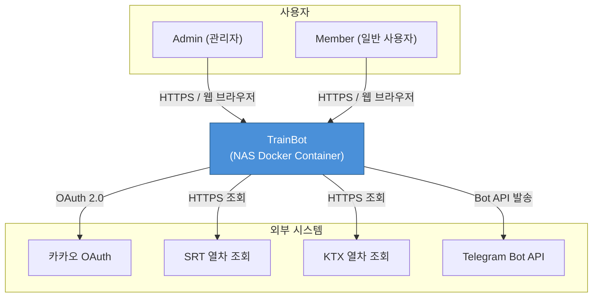
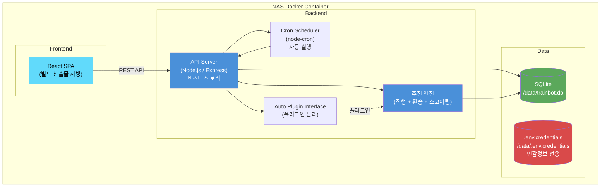
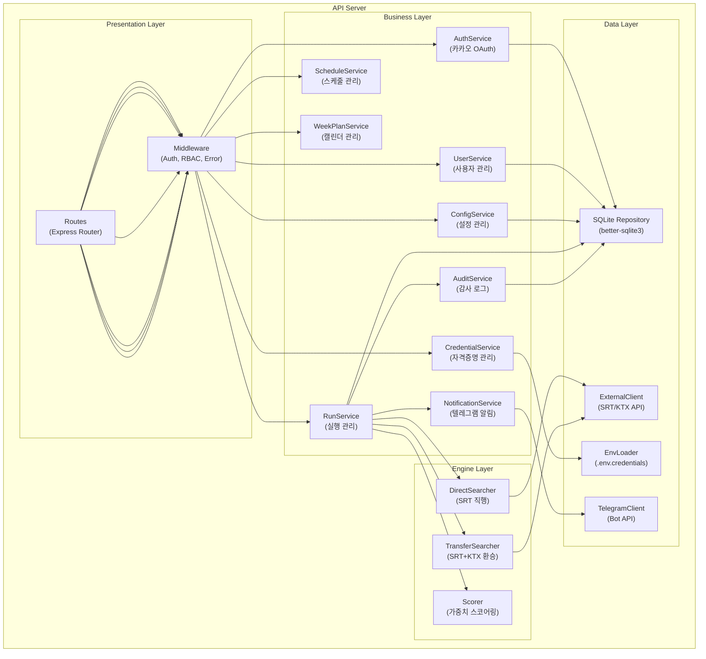
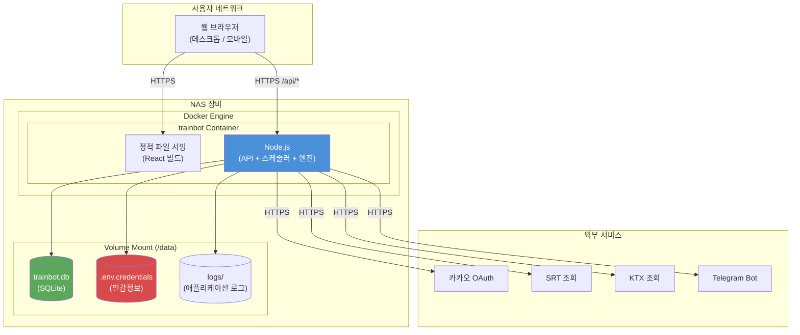
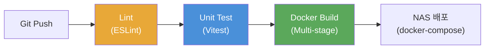
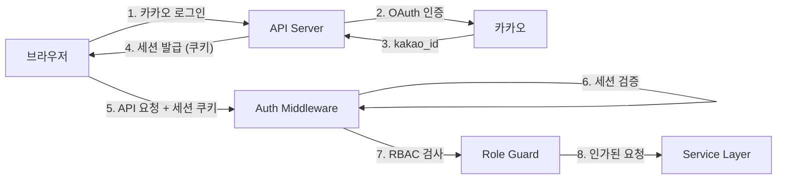
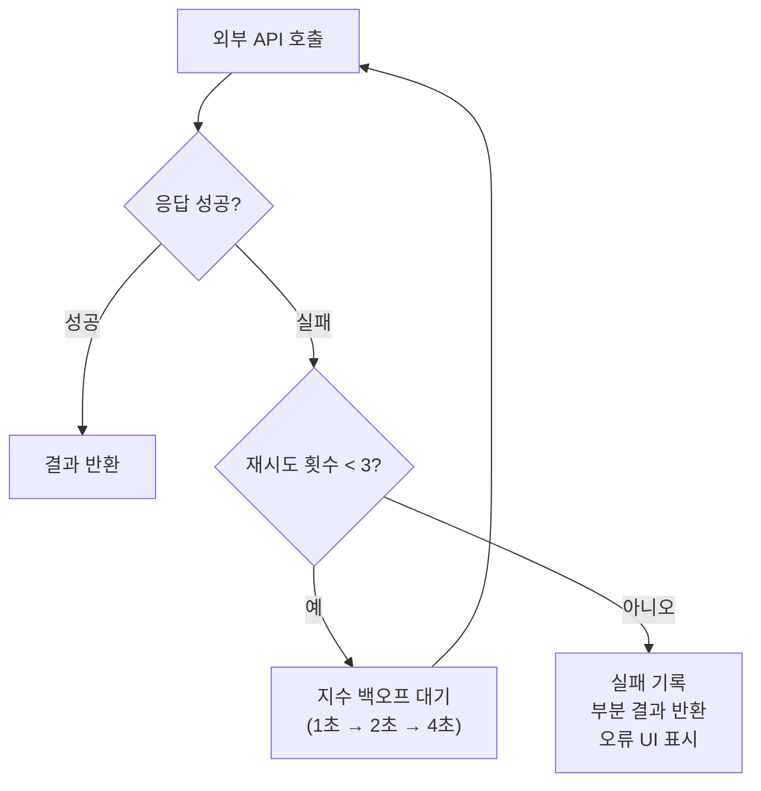
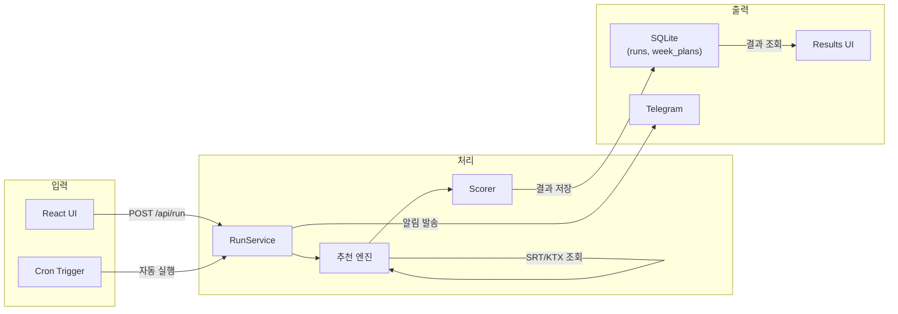

# 시스템 아키텍처 설계서 (SAD)

> System Architecture Document

| 항목 | 내용 |
|------|------|
| **프로젝트명** | TrainBot — 김천구미↔동탄 주간 예매 어시스턴트 |
| **문서 버전** | v1.0 |
| **작성일** | 2026-03-02 |
| **작성자** | 프로젝트 오너 |
| **승인자** | - |
| **문서 상태** | 초안 |

---

## 1. 문서 개요

### 1.1 목적

본 문서는 TrainBot 시스템의 아키텍처를 정의하고, 주요 기술적 결정 사항과 설계 원칙을 기술한다. 시스템의 전체 구조를 이해하고 일관된 방향으로 개발을 수행할 수 있도록 한다.

### 1.2 범위

- 시스템 전체 아키텍처 구조 및 구성 요소
- 기술 스택 선정 및 근거
- 배포 아키텍처 (NAS Docker)
- 비기능 요구사항에 대한 아키텍처 대응 전략
- 외부 시스템 통합 패턴

### 1.3 참조 문서

| 문서명 | 버전 | 비고 |
|--------|------|------|
| 요구사항 명세서 (SRS) | v1.3 | 기능/비기능 요구사항 |
| 요구사항 추적 매트릭스 (RTM) | v1.0 | 추적 매트릭스 |
| 유스케이스 명세서 (UCS) | v1.0 | 유스케이스 상세 |
| 서비스 기획서 (SPD) | v1.3 | 서비스 컨셉 |
| 비즈니스 정책서 (BPD) | v1.3 | 비즈니스 규칙 |

### 1.4 변경 이력

| 버전 | 날짜 | 작성자 | 변경 내용 |
|------|------|--------|-----------|
| v1.0 | 2026-03-02 | 프로젝트 오너 | 초안 작성 |

### 1.5 용어 정의

| 용어 | 정의 |
|------|------|
| NAS | Network Attached Storage. 시스템 운영 호스트 |
| SPA | Single Page Application |
| Cron | 시간 기반 작업 스케줄러 |
| earliest_after | 요일별 "N시 이후" 검색 시작 시각 |
| dedupe | 동일 결과 해시 기반 중복 발송 방지 |

---

## 2. 아키텍처 개요

### 2.1 아키텍처 스타일 선택

#### 선택된 아키텍처 스타일

**Layered Monolith (계층형 모놀리식)**

#### 후보 아키텍처 스타일 비교

| 평가 항목 | Layered Monolith | Microservices | Hexagonal |
|-----------|-----------------|---------------|-----------|
| 구현 복잡도 | **낮음** | 높음 | 중간 |
| 확장성 | 낮음 (불필요) | 높음 | 중간 |
| 유지보수성 | 중간 | 높음 | 높음 |
| 팀 역량 적합성 | **최적** (1인 개발) | 과도 | 중간 |
| 배포 유연성 | **높음** (단일 컨테이너) | 높음 | 중간 |
| 운영 복잡도 | **최저** | 높음 | 낮음 |
| **종합** | **최적** | 과도 | 차선 |

#### 선택 근거

- **1인 개발/운영** 환경에서 모놀리식이 가장 효율적
- NAS Docker **단일 컨테이너** 운영 제약에 부합
- 최대 **4명 동시 사용**의 소규모 시스템으로 확장 불필요
- 단일 프로세스/단일 DB로 운영 복잡도 최소화

### 2.2 아키텍처 원칙

| 원칙 | 설명 | 적용 방법 |
|------|------|-----------|
| 관심사 분리 | Presentation / Business / Data 계층 분리 | Router → Service → Repository 패턴 |
| 설정 외부화 | 환경별 설정을 환경변수로 관리 | .env + .env.credentials 분리 |
| 플러그인 분리 | auto 모드를 플러그인으로 분리 | 인터페이스 기반 바인딩 |
| 보안 최우선 | 민감정보 격리, RBAC 적용 | 환경변수 전용 저장, 미들웨어 인증/인가 |
| 경량 설계 | NAS 제한된 리소스에 최적화 | SQLite, 단일 프로세스, 인메모리 락 |

### 2.3 시스템 컨텍스트 다이어그램



### 2.4 컨테이너 다이어그램



### 2.5 컴포넌트 다이어그램



---

## 3. 기술 스택 선정

### 3.1 선정 기준

| 평가 항목 | 가중치 | 설명 |
|-----------|--------|------|
| NAS 호환성 | 30% | Docker 컨테이너 크기, ARM/x86 지원 |
| 개발 효율성 | 25% | 1인 개발에 적합한 생산성 |
| 경량성 | 20% | 리소스 사용량 (CPU/메모리) |
| 생태계 | 15% | 라이브러리, 커뮤니티 |
| 안정성 | 10% | 프로덕션 검증 수준 |

### 3.2 프론트엔드 기술 선정

| 영역 | 선정 기술 | 버전 | 선정 근거 |
|------|-----------|------|-----------|
| Framework | React | 18+ | SRS 명시, SPA 구현에 최적 |
| 빌드 도구 | Vite | latest | 빠른 빌드, 경량 |
| 상태 관리 | Zustand 또는 React Context | latest | 소규모 앱에 적합, 경량 |
| 스타일링 | Tailwind CSS | 3.x | 유틸리티 퍼스트, 빠른 UI 개발 |
| HTTP 클라이언트 | fetch (내장) | - | 추가 의존성 불필요 |
| 라우팅 | React Router | 6.x | 표준 SPA 라우팅 |

### 3.3 백엔드 기술 선정

| 영역 | 선정 기술 | 버전 | 선정 근거 |
|------|-----------|------|-----------|
| Language | Node.js (TypeScript) | LTS (20+) | 프론트엔드와 언어 통일, 비동기 처리 우수 |
| Framework | Express | 4.x | 경량, 유연, NAS 리소스 절약 |
| DB 드라이버 | better-sqlite3 | latest | 동기 API, 경량, 파일 기반 |
| 스케줄러 | node-cron | latest | 크론 표현식 기반 스케줄링 |
| 인증 | passport-kakao + express-session | latest | 카카오 OAuth 전용 |
| 로깅 | winston | latest | 구조화된 로깅 |
| 환경변수 | dotenv | latest | .env 파일 로드 |
| 입력 검증 | zod | latest | TypeScript 친화적 스키마 검증 |

### 3.4 데이터베이스 기술 선정

| 영역 | 선정 기술 | 버전 | 선정 근거 |
|------|-----------|------|-----------|
| Primary DB | SQLite | 3.x | SRS 명시, 파일 기반, 서버 불필요, NAS 최적 |
| 세션 저장 | SQLite (세션 테이블) | - | 별도 Redis 불필요, 최대 4인 |
| 민감정보 저장 | .env.credentials 파일 | - | DB 저장 금지 정책 (NFR-007) |

### 3.5 인프라 기술 선정

| 영역 | 선정 기술 | 버전 | 선정 근거 |
|------|-----------|------|-----------|
| 환경 | NAS (온프레미스) | - | 항시 가동, 개인 서버 |
| 컨테이너 | Docker | latest | NAS Docker 패키지 활용 |
| 오케스트레이션 | Docker Compose | latest | 단일 컨테이너지만 환경 정의용 |
| 리버스 프록시 | NAS 내장 또는 Nginx | - | HTTPS 지원 (선택) |

### 3.6 불채택 기술 및 사유

| 영역 | 불채택 기술 | 사유 |
|------|-------------|------|
| DB | PostgreSQL / MySQL | 별도 DB 서버 필요, NAS 리소스 과도 |
| 캐시 | Redis | 최대 4인 시스템에서 불필요, 리소스 낭비 |
| 백엔드 | Python (Django/FastAPI) | 가능하나 프론트엔드와 언어 불일치 |
| 백엔드 | NestJS | 소규모 프로젝트에 과도한 보일러플레이트 |
| 메시지 큐 | RabbitMQ / Kafka | 단일 프로세스에서 불필요 |

---

## 4. 배포 아키텍처

### 4.1 배포 다이어그램



### 4.2 환경 구성

| 환경 | 용도 | 인프라 구성 | 데이터 |
|------|------|-------------|--------|
| **Development (DEV)** | 로컬 개발/디버깅 | docker-compose up (로컬) | 테스트 데이터 |
| **Production (PROD)** | NAS 실서비스 운영 | Docker 컨테이너 (NAS) | 실 데이터 |

#### 환경별 상세 구성

| 구성 요소 | DEV | PROD |
|-----------|-----|------|
| Node.js | 로컬 실행 (hot reload) | Docker 컨테이너 |
| DB | /tmp/trainbot.db | /data/trainbot.db (볼륨) |
| 민감정보 | .env.local | /data/.env.credentials |
| TZ | Asia/Seoul | Asia/Seoul (환경변수) |
| 로그 수준 | debug | info |
| HTTPS | 미사용 (localhost) | NAS 리버스 프록시 또는 직접 |

### 4.3 Docker 구성

#### Dockerfile 구조

```dockerfile
# Stage 1: Frontend Build
FROM node:20-alpine AS frontend-build
WORKDIR /app/frontend
COPY frontend/package*.json ./
RUN npm ci
COPY frontend/ ./
RUN npm run build

# Stage 2: Backend Build
FROM node:20-alpine AS backend-build
WORKDIR /app/backend
COPY backend/package*.json ./
RUN npm ci
COPY backend/ ./
RUN npm run build

# Stage 3: Production
FROM node:20-alpine
WORKDIR /app
ENV TZ=Asia/Seoul
RUN apk add --no-cache tzdata

COPY --from=backend-build /app/backend/dist ./dist
COPY --from=backend-build /app/backend/node_modules ./node_modules
COPY --from=frontend-build /app/frontend/dist ./public

VOLUME /data
EXPOSE 8080

CMD ["node", "dist/main.js"]
```

#### docker-compose.yml 구조

```yaml
version: "3.8"
services:
  trainbot:
    build: .
    container_name: trainbot
    restart: unless-stopped
    ports:
      - "8080:8080"
    volumes:
      - ./data:/data
    env_file:
      - .env
    environment:
      - TZ=Asia/Seoul
      - NODE_ENV=production
      - DB_PATH=/data/trainbot.db
      - CREDENTIALS_PATH=/data/.env.credentials
```

### 4.4 CI/CD 파이프라인 (간소화)



| 단계 | 도구 | 설명 |
|------|------|------|
| Lint | ESLint + Prettier | 코드 품질 검사 |
| Test | Vitest | 단위 테스트 |
| Build | Docker (multi-stage) | 프론트엔드 빌드 + 백엔드 빌드 + 프로덕션 이미지 |
| Deploy | docker-compose | NAS에서 이미지 풀 + 재시작 |

---

## 5. 아키텍처 결정 기록 (ADR)

### 5.1 ADR 목록

| ADR ID | 제목 | 상태 | 날짜 |
|--------|------|------|------|
| ADR-001 | 단일 컨테이너 모놀리식 아키텍처 | 승인 | 2026-03-02 |
| ADR-002 | SQLite 선정 | 승인 | 2026-03-02 |
| ADR-003 | 세션 기반 인증 (JWT 불채택) | 승인 | 2026-03-02 |
| ADR-004 | 민감정보 환경변수 파일 분리 | 승인 | 2026-03-02 |
| ADR-005 | auto 모드 플러그인 분리 | 승인 | 2026-03-02 |

### 5.2 ADR-001: 단일 컨테이너 모놀리식 아키텍처

| 항목 | 내용 |
|------|------|
| **상태** | 승인 (Accepted) |
| **날짜** | 2026-03-02 |
| **의사결정자** | 프로젝트 오너 |

**컨텍스트:** NAS Docker 환경에서 운영되며, 1인 개발/운영, 최대 4인 사용. 리소스(CPU/메모리)가 제한적이다.

**결정:** Frontend(React 빌드 산출물) + Backend(Node.js) + DB(SQLite)를 단일 Docker 컨테이너로 운영한다.

**근거:**
- 선택지 1: 단일 컨테이너 — 배포/운영 단순, 리소스 최소. NAS 제약에 최적.
- 선택지 2: Frontend/Backend 분리 — 불필요한 복잡도. Nginx + Node 2개 컨테이너 관리 부담.
- 선택지 3: 마이크로서비스 — 4인용 시스템에 과도한 오버헤드.

**결과:**
- 긍정적: 배포/운영 극도로 단순, 리소스 사용 최소
- 부정적: 수평 확장 불가 (불필요)
- 중립적: 추후 사용자 수 확장 시 아키텍처 재검토 필요 (현재 불필요)

### 5.3 ADR-002: SQLite 선정

| 항목 | 내용 |
|------|------|
| **상태** | 승인 (Accepted) |
| **날짜** | 2026-03-02 |

**컨텍스트:** 최대 4인 사용, 주 2~5건 실행, 데이터 규모 극소. NAS에 별도 DB 서버 부담.

**결정:** SQLite를 유일한 RDBMS로 사용한다. /data 볼륨에 파일 저장하여 컨테이너 재생성에도 영속성 보장.

**근거:**
- 선택지 1: SQLite — 서버 불필요, 파일 기반, 설정 없음, 백업 = 파일 복사
- 선택지 2: PostgreSQL — 고성능이나 별도 컨테이너 필요, NAS 리소스 과도
- 선택지 3: MySQL — PostgreSQL과 동일한 문제

**결과:**
- 긍정적: 제로 설정, 경량, 백업 간단 (cp)
- 부정적: 동시 쓰기 제한 (WAL 모드로 완화, 4인 수준에서 문제 없음)

### 5.4 ADR-003: 세션 기반 인증

| 항목 | 내용 |
|------|------|
| **상태** | 승인 (Accepted) |
| **날짜** | 2026-03-02 |

**컨텍스트:** 카카오 OAuth 기반 인증. 최대 4인, 단일 서버, 웹 전용 (모바일 앱 없음).

**결정:** express-session 기반 서버 사이드 세션을 사용한다. 세션 스토어는 SQLite(또는 메모리).

**근거:**
- 선택지 1: 세션 쿠키 — 구현 단순, 즉시 무효화 가능, 단일 서버에 최적
- 선택지 2: JWT — Stateless이나 즉시 무효화 불가, 블랙리스트 별도 관리 필요
- 세션 방식이 단일 서버 + 소수 사용자 환경에서 가장 단순하고 안전

**결과:**
- 긍정적: 로그아웃 시 즉시 무효화, 구현 단순
- 부정적: 서버 확장 시 세션 공유 필요 (현재 불필요)

### 5.5 ADR-004: 민감정보 환경변수 파일 분리

| 항목 | 내용 |
|------|------|
| **상태** | 승인 (Accepted) |
| **날짜** | 2026-03-02 |

**컨텍스트:** 예매 계정, 결제 수단, 승객 정보 등 민감정보를 안전하게 저장해야 한다. DB/로그 저장 금지 (NFR-007).

**결정:** /data/.env.credentials 전용 파일에 환경변수 형식으로 저장한다. 파일 권한 600. DB/로그/config_json에는 절대 저장하지 않는다.

**근거:**
- 선택지 1: .env.credentials 파일 — 파일 권한으로 보호, 런타임 리로드 가능
- 선택지 2: DB 암호화 저장 — DB에 저장하면 로그/쿼리 노출 위험, NFR-007 위반
- 선택지 3: OS Keychain — Docker 환경에서 접근 복잡

**결과:**
- 긍정적: NFR-007 충족, 파일 권한으로 보호, 백업 시 별도 관리 가능
- 부정적: 파일 시스템 보안에 의존

### 5.6 ADR-005: auto 모드 플러그인 분리

| 항목 | 내용 |
|------|------|
| **상태** | 승인 (Accepted) |
| **날짜** | 2026-03-02 |

**컨텍스트:** 자동예매(auto 모드)는 P2 권장 기능으로, 결제 포함. 기본 배포에서는 assist(추천/알림)만 제공.

**결정:** auto 모드를 플러그인 인터페이스로 분리한다. 기본 배포에는 포함하지 않으며, 별도 플러그인 설치 시에만 활성화된다.

**근거:**
- assist 모드만으로 MVP 가치 충분
- 자동 결제는 리스크가 크므로 분리 관리
- 플러그인 미설치 시 UI에서 "미설치" 표시

**결과:**
- 긍정적: MVP 배포 범위 축소, 리스크 격리
- 부정적: 플러그인 인터페이스 설계 필요

---

## 6. 비기능 요구사항 대응 설계

### 6.1 운영/배포 (NFR-001 ~ NFR-004)

| NFR | 대응 설계 |
|-----|-----------|
| NFR-001 Docker 운영 | Multi-stage Dockerfile, docker-compose, restart: unless-stopped |
| NFR-002 데이터 영속성 | /data 볼륨 마운트 (SQLite DB, 로그, 설정) |
| NFR-003 시크릿 관리 | .env (시스템) + .env.credentials (민감정보) 분리 |
| NFR-004 시간대 | TZ=Asia/Seoul 환경변수, 모든 Date 처리에 적용 |

### 6.2 보안 (NFR-005 ~ NFR-007)

#### 인증/인가 아키텍처



#### 보안 계층별 대응

| 계층 | 위협 | 대응 |
|------|------|------|
| 네트워크 | 중간자 공격 | HTTPS (NAS 리버스 프록시) |
| 인증 | 세션 탈취 | httpOnly + secure 쿠키, 세션 만료 |
| 인가 | 권한 상승 | RBAC 미들웨어 (Admin/Member), API별 역할 검사 |
| 입력 | XSS, Injection | zod 입력 검증, SQLite 파라미터 바인딩 |
| 데이터 | 민감정보 노출 | .env.credentials 분리, UI 마스킹, 로그 제외 |

#### 민감정보 보호 설계

| 보호 대상 | 저장 위치 | 접근 제어 | 로그 정책 |
|-----------|-----------|-----------|-----------|
| 카카오 OAuth 시크릿 | .env (시스템 환경변수) | Docker 환경변수 | 로그 출력 금지 |
| Telegram Bot Token | .env (시스템 환경변수) | Docker 환경변수 | 로그 출력 금지 |
| 예매 계정/결제 정보 | .env.credentials (파일, 권한 600) | Admin API 전용 | 키 이름만 감사 로그 |

### 6.3 안정성 (NFR-008 ~ NFR-010)

| NFR | 대응 설계 |
|-----|-----------|
| NFR-008 Graceful Error | try-catch + 에러 미들웨어, 외부 API 실패 시 부분 결과 반환, 오류 UI 표시 |
| NFR-009 레이트리밋/재시도 | 외부 API 호출에 지수 백오프 (최대 3회), 요청 간 최소 간격 준수 |
| NFR-010 중복 실행 방지 | 인메모리 락 (단일 프로세스), 실행 전 RUNNING 상태 확인 |

#### 외부 API 장애 대응



### 6.4 관측성 (NFR-011)

| 관측 영역 | 도구 | 상세 |
|-----------|------|------|
| 감사 로그 | audit_logs 테이블 | 실행/설정/승인/자격증명 이벤트 기록 |
| 애플리케이션 로그 | winston → /data/logs/ | JSON 형식, 일별 로테이션 |
| 헬스체크 | GET /health | 서비스 상태 + DB 연결 확인 |

---

## 7. 통합 패턴

### 7.1 외부 시스템 통합

| 외부 시스템 | 통합 패턴 | 프로토콜 | 에러 전략 |
|------------|-----------|----------|-----------|
| 카카오 OAuth | Request-Response | OAuth 2.0 / HTTPS | 실패 시 로그인 불가 안내 |
| SRT 열차 조회 | Request-Response | HTTPS | 지수 백오프 재시도 (3회) |
| KTX 열차 조회 | Request-Response | HTTPS | 지수 백오프 재시도 (3회) |
| Telegram Bot | Fire-and-Forget | HTTPS (Bot Token) | 실패 시 로그, 다음 실행 시 재발송 |

### 7.2 내부 통합 패턴

시스템이 단일 프로세스이므로 모든 내부 통합은 **직접 함수 호출**로 처리한다.

| 호출 패턴 | 적용 대상 |
|-----------|-----------|
| 동기 호출 | Service → Repository, Service → Service |
| 비동기 (Promise) | 외부 API 호출, 텔레그램 발송 |
| 스케줄 트리거 | Cron → RunService.execute() |

### 7.3 데이터 흐름



---

## 부록

### A. 기술 스택 요약

| 계층 | 기술 |
|------|------|
| 프론트엔드 | React 18+, Vite, Tailwind CSS, React Router 6, Zustand |
| 백엔드 | Node.js (LTS), TypeScript, Express, better-sqlite3, node-cron |
| 데이터베이스 | SQLite 3.x |
| 인증 | passport-kakao, express-session |
| 인프라 | Docker (multi-stage), docker-compose, NAS |
| 로깅 | winston |
| 입력 검증 | zod |

### B. 디렉토리 구조 (예상)

```
trainbot/
├── frontend/                  # React SPA
│   ├── src/
│   │   ├── pages/            # 8개 페이지 컴포넌트
│   │   ├── components/       # 공통 UI 컴포넌트
│   │   ├── hooks/            # 커스텀 훅
│   │   ├── services/         # API 호출
│   │   └── store/            # 상태 관리
│   └── package.json
├── backend/                   # Node.js API
│   ├── src/
│   │   ├── routes/           # Express 라우터
│   │   ├── middleware/       # Auth, RBAC, Error
│   │   ├── services/         # 비즈니스 로직
│   │   ├── engine/           # 추천 엔진 (직행/환승/스코어링)
│   │   ├── repositories/     # SQLite 데이터 접근
│   │   ├── plugins/          # auto 플러그인 인터페이스
│   │   └── utils/            # 유틸리티
│   └── package.json
├── data/                      # 볼륨 마운트
│   ├── trainbot.db           # SQLite DB
│   ├── .env.credentials      # 민감정보 (권한 600)
│   └── logs/                 # 애플리케이션 로그
├── Dockerfile
├── docker-compose.yml
├── .env                       # 시스템 환경변수
└── docs/                      # 문서
```

### C. 관련 문서 링크

| 문서 | 경로 |
|------|------|
| 요구사항 명세서 (SRS) | docs/01-요구사항분석/SRS-TRAINBOT-v1.0.md |
| 요구사항 추적 매트릭스 (RTM) | docs/01-요구사항분석/RTM-TRAINBOT-v1.0.md |
| 유스케이스 명세서 (UCS) | docs/01-요구사항분석/UCS-TRAINBOT-v1.0.md |
| API 설계서 | docs/02-시스템설계/API-TRAINBOT-v1.0.md |
| 데이터베이스 설계서 | docs/02-시스템설계/DB-TRAINBOT-v1.0.md |
| 화면 설계서 | docs/02-시스템설계/UI-TRAINBOT-v1.0.md |

---

> **본 문서는 프로젝트 이해관계자의 승인을 통해 확정되며, 변경 시 변경 관리 절차에 따라 관리된다.**
