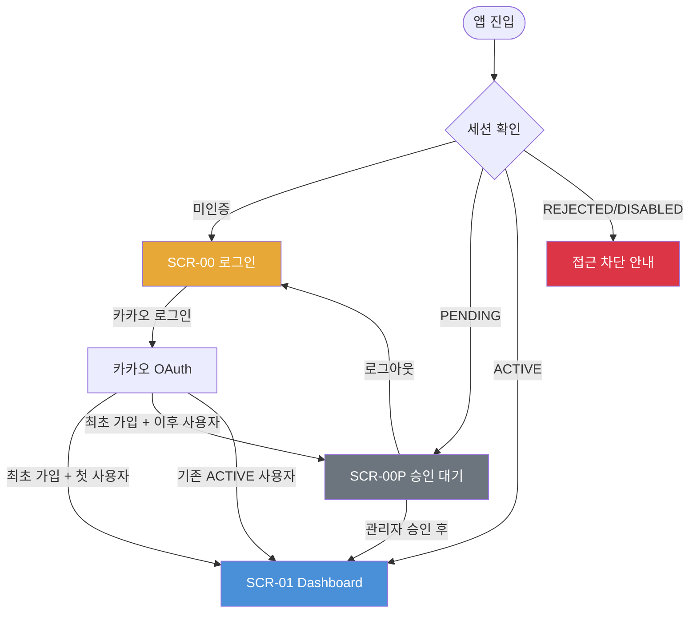
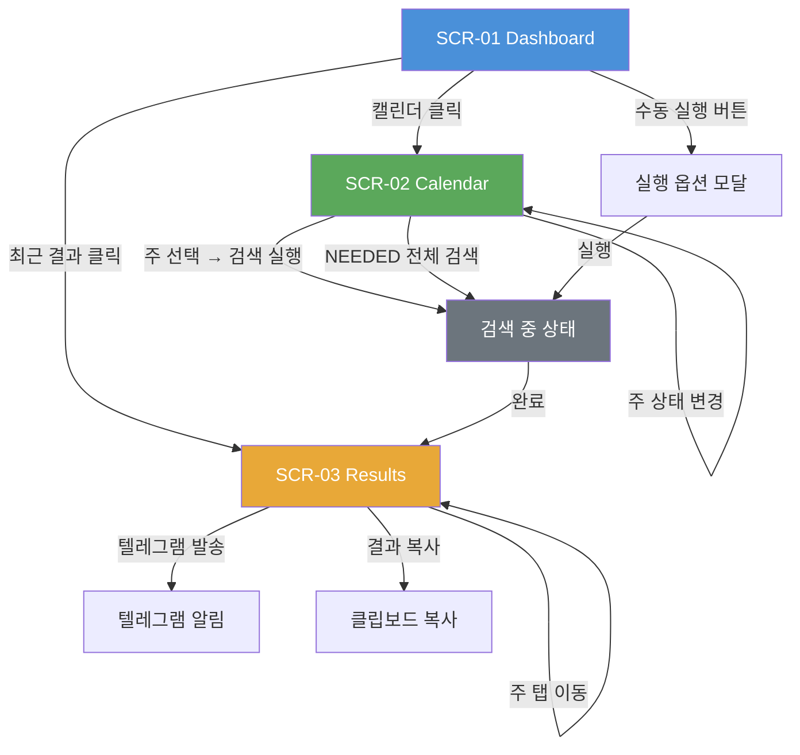
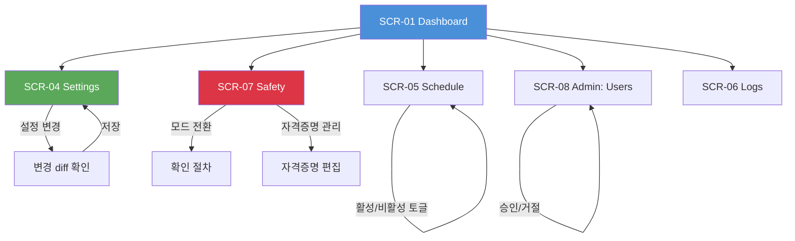

# 화면(UI/UX) 설계서

| 항목 | 내용 |
|------|------|
| **프로젝트명** | TrainBot - 열차 추천 자동화 시스템 |
| **문서 버전** | v1.0 |
| **작성일** | 2026-03-02 |
| **작성자** | 시스템 설계팀 |
| **승인자** | 프로젝트 오너 |
| **문서 상태** | 초안 |

---

## 1. 설계 원칙

### 1.1 사용성 (Usability)

| 원칙 | 설명 | 적용 방법 |
|------|------|-----------|
| 직관성 | 사용자가 학습 없이 즉시 사용 가능 | 명확한 사이드바 네비게이션, 상태 컬러 코딩 |
| 일관성 | 전체 화면에서 동일한 패턴과 규칙 적용 | Tailwind CSS 기반 디자인 시스템, 공통 컴포넌트 |
| 피드백 | 사용자 행동에 대한 즉각적 반응 | 로딩 스피너, Toast 알림, 실행 중 상태 표시 |
| 효율성 | 최소 단계로 목표 달성 가능 | 핵심 기능 2클릭 이내 접근, 캘린더에서 바로 검색 |
| 오류 방지 | 실수 가능성 사전 차단 | 설정 저장 전 diff 표시, 삭제 확인 대화상자 |

### 1.2 접근성 (Accessibility)

| 기준 | 수준 | 적용 항목 |
|------|------|-----------|
| 키보드 접근성 | 필수 | 모든 인터랙티브 요소 Tab 이동 가능 |
| 색상 대비 | 최소 4.5:1 | 전체 텍스트 및 아이콘 |
| 폰트 크기 | 최소 14px | 본문 기준 |
| 포커스 표시 | 필수 | 포커스 상태 시각적 표시 (focus-visible) |
| 시멘틱 HTML | 필수 | header, nav, main, section, footer 활용 |

### 1.3 반응형 디자인 (Responsive)

| 브레이크포인트 | 범위 | 대상 기기 | 레이아웃 |
|--------------|------|-----------|----------|
| Mobile (sm) | < 640px | 스마트폰 | 단일 컬럼, 하단 네비게이션 |
| Tablet (md) | 640px ~ 1023px | 태블릿 | 축소 사이드바 + 메인 |
| Desktop (lg) | >= 1024px | 데스크톱/노트북 | 사이드바 + 메인 (풀 레이아웃) |

### 1.4 기술 스택

| 항목 | 기술 | 비고 |
|------|------|------|
| UI 프레임워크 | React 18+ (Vite) | SPA |
| 스타일링 | Tailwind CSS | 유틸리티 퍼스트 |
| 상태 관리 | Zustand | 경량 전역 상태 |
| 라우팅 | React Router v6 | 클라이언트 사이드 라우팅 |
| HTTP 클라이언트 | fetch API (또는 ky) | API 통신 |
| 아이콘 | Lucide React | 경량 아이콘 |
| 날짜 처리 | date-fns | 한국 시간대 포맷 |

### 1.5 변경 이력

| 버전 | 날짜 | 작성자 | 변경 내용 |
|------|------|--------|-----------|
| v1.0 | 2026-03-02 | 시스템 설계팀 | 초안 작성 |

---

## 2. 화면 목록

### 2.1 전체 화면 목록

| 화면 ID | 화면명 | URL | 접근 권한 | 관련 FR |
|---------|--------|-----|-----------|---------|
| SCR-00 | 로그인 | `/login` | 비인증 | FR-001 |
| SCR-00P | 승인 대기 | `/pending` | PENDING 사용자 | FR-001, FR-003 |
| SCR-01 | Dashboard | `/` | 인증 (ACTIVE) | FR-011, FR-018 |
| SCR-02 | Calendar | `/calendar` | 인증 (ACTIVE) | FR-018, FR-016, FR-017 |
| SCR-03 | Results | `/results` | 인증 (ACTIVE) | FR-009, FR-017 |
| SCR-04 | Settings | `/settings` | Admin | FR-004, FR-005, FR-015, FR-016 |
| SCR-05 | Schedule | `/schedules` | Admin | FR-012 |
| SCR-06 | Logs | `/logs` | 인증 (ACTIVE) | FR-014 |
| SCR-07 | Safety | `/safety` | Admin | FR-013, FR-019 |
| SCR-08 | Admin: Users | `/admin/users` | Admin | FR-003 |
| SCR-ERR | 에러 페이지 | `/error` | 전체 | - |

### 2.2 공통 레이아웃

```
+--------------------------------------------------+
|  Sidebar (고정)  |     Main Content Area           |
|                  |                                 |
|  [로고]          |  +-----------------------------+|
|                  |  | Page Header (제목 + 액션)   ||
|  - Dashboard     |  +-----------------------------+|
|  - Calendar      |  |                             ||
|  - Results       |  |   Page Content              ||
|  - Settings *    |  |                             ||
|  - Schedule *    |  |                             ||
|  - Logs          |  |                             ||
|  - Safety *      |  |                             ||
|  - Users *       |  |                             ||
|                  |  +-----------------------------+|
|  [사용자 정보]    |                                 |
|  [로그아웃]       |                                 |
+--------------------------------------------------+

* Admin 전용 메뉴
```

#### 사이드바 구성

| 메뉴 | 아이콘 | URL | 접근 권한 | 비고 |
|------|--------|-----|-----------|------|
| Dashboard | LayoutDashboard | `/` | 전체 | 기본 화면 |
| Calendar | Calendar | `/calendar` | 전체 | 주간 캘린더 |
| Results | ListChecks | `/results` | 전체 | 추천 결과 |
| Settings | Settings | `/settings` | Admin | 구분선 아래 |
| Schedule | Clock | `/schedules` | Admin | |
| Logs | FileText | `/logs` | 전체 | |
| Safety | Shield | `/safety` | Admin | |
| Users | Users | `/admin/users` | Admin | |

---

## 3. 화면 흐름도

### 3.1 인증 플로우



### 3.2 핵심 사용 플로우 (추천 검색)



### 3.3 관리 플로우



---

## 4. 화면 상세 명세

### 4.1 SCR-00: 로그인

#### 기본 정보

| 항목 | 내용 |
|------|------|
| **화면 ID** | SCR-00 |
| **화면명** | 로그인 |
| **URL** | `/login` |
| **접근 권한** | 비인증 (인증 사용자 접근 시 Dashboard로 리다이렉트) |
| **관련 API** | `GET /auth/kakao/login` |

#### 레이아웃

```
+------------------------------------------+
|                                          |
|                                          |
|           TrainBot 로고/제목              |
|           "열차 추천 자동화"              |
|                                          |
|        +------------------------+        |
|        | 카카오 로그인 버튼       |        |
|        +------------------------+        |
|                                          |
|           서비스 소개 문구                |
|                                          |
+------------------------------------------+
```

#### 구성 요소

| 요소 ID | 유형 | 설명 | 동작 |
|---------|------|------|------|
| EL-001 | Image/Text | 서비스 로고 + 제목 | - |
| EL-002 | Text | 서비스 부제 ("열차 추천 자동화") | - |
| EL-003 | Button (카카오 스타일) | 카카오 로그인 버튼 | 카카오 OAuth 리다이렉트 |
| EL-004 | Text | 서비스 안내 문구 | - |

#### 이벤트

| 이벤트 | 트리거 | 동작 | API 연동 |
|--------|--------|------|----------|
| 카카오 로그인 | 카카오 버튼 클릭 | 카카오 OAuth 페이지로 리다이렉트 | `GET /auth/kakao/login` |
| OAuth 콜백 | 카카오 인증 완료 | 세션 생성 → 상태에 따라 라우팅 | `GET /auth/kakao/callback` |

#### 상태별 화면

| 상태 | 조건 | 화면 구성 |
|------|------|-----------|
| 초기 | 화면 진입 | 로고 + 카카오 로그인 버튼 |
| 로딩 | OAuth 진행 중 | 버튼에 Spinner 표시 |
| 에러 | OAuth 실패 | Toast로 에러 메시지 ("로그인에 실패했습니다. 다시 시도해주세요.") |

---

### 4.2 SCR-00P: 승인 대기

#### 기본 정보

| 항목 | 내용 |
|------|------|
| **화면 ID** | SCR-00P |
| **화면명** | 승인 대기 |
| **URL** | `/pending` |
| **접근 권한** | PENDING 상태 사용자 |
| **관련 API** | `POST /auth/logout` |

#### 레이아웃

```
+------------------------------------------+
|                                          |
|          승인 대기 아이콘 (시계)           |
|                                          |
|    "관리자 승인을 기다리고 있습니다"       |
|    "승인이 완료되면 서비스를 이용할        |
|     수 있습니다."                        |
|                                          |
|        +------------------------+        |
|        |     로그아웃 버튼        |        |
|        +------------------------+        |
|                                          |
+------------------------------------------+
```

---

### 4.3 SCR-01: Dashboard

#### 기본 정보

| 항목 | 내용 |
|------|------|
| **화면 ID** | SCR-01 |
| **화면명** | Dashboard |
| **URL** | `/` |
| **접근 권한** | 인증 필수 (ACTIVE) |
| **관련 API** | `GET /api/week-plans`, `GET /api/runs`, `GET /api/schedules`, `GET /api/health` |
| **관련 FR** | FR-011, FR-018 |

#### 레이아웃

```
+--------------------------------------------------+
| Sidebar |  Dashboard                              |
|         |                                          |
|         |  +--------+ +--------+ +--------+       |
|         |  | 이번주  | | 다음   | | 텔레그램|       |
|         |  | 상태    | | 스케줄 | | 상태   |       |
|         |  | 카드    | | 카드   | | 카드   |       |
|         |  +--------+ +--------+ +--------+       |
|         |                                          |
|         |  주간 캘린더 요약 (향후 4주)              |
|         |  +--------------------------------------+|
|         |  | 월 | 3/2~8 NEEDED | 3/9~15 BOOKED .. ||
|         |  +--------------------------------------+|
|         |                                          |
|         |  최근 실행 기록                           |
|         |  +--------------------------------------+|
|         |  | # | 시간 | 상태 | 후보수 | 소요시간  ||
|         |  | 5 | 3/2  | OK   | 12    | 3.2s     ||
|         |  | 4 | 3/1  | OK   | 8     | 2.8s     ||
|         |  +--------------------------------------+|
|         |                                          |
|         |  [수동 실행 버튼]                         |
+--------------------------------------------------+
```

#### 구성 요소

| 요소 ID | 유형 | 설명 | 동작 |
|---------|------|------|------|
| EL-001 | Card | 이번 주 상태 카드 | NEEDED 주 수, 현재 상태 표시. 클릭 시 Calendar 이동 |
| EL-002 | Card | 다음 스케줄 카드 | 다음 자동 실행 시각 표시. 클릭 시 Schedule 이동 |
| EL-003 | Card | 텔레그램 상태 카드 | 연결 상태 (연결됨/미설정). 클릭 시 Settings 이동 |
| EL-004 | 캘린더 요약 | 향후 4주 상태 미니 캘린더 | 주 클릭 시 Calendar 이동. 상태별 컬러 코딩 |
| EL-005 | Table | 최근 실행 기록 (최근 5건) | 행 클릭 시 Results 이동 |
| EL-006 | Button (primary) | 수동 실행 버튼 | 실행 옵션 모달 표시 |

#### 수동 실행 모달

```
+--------------------------------------+
|  추천 검색 실행                        |
|                                      |
|  검색 범위: [1주 ▼] ~ [8주]          |
|  시작 기준: ( ) 이번 주  (•) 다음 주   |
|                                      |
|  대상 주:                             |
|  [v] 3/2~3/8 (NEEDED)               |
|  [ ] 3/9~3/15 (BOOKED) - 비활성     |
|  [v] 3/16~3/22 (NEEDED)             |
|                                      |
|      [취소]  [실행]                   |
+--------------------------------------+
```

#### 이벤트

| 이벤트 | 트리거 | 동작 | API 연동 |
|--------|--------|------|----------|
| 대시보드 로드 | 화면 진입 | 캘린더 요약, 최근 실행, 스케줄 병렬 조회 | 복수 API 병렬 호출 |
| 수동 실행 클릭 | 버튼 클릭 | 실행 옵션 모달 표시 | N/A |
| 실행 확인 | 모달 실행 버튼 클릭 | API 호출 → 결과 화면 이동 | `POST /api/run` |
| 실행 기록 클릭 | 테이블 행 클릭 | Results 화면으로 이동 (해당 run_id) | N/A |
| 자동 갱신 | 30초 폴링 | 실행 중 상태 시 결과 자동 갱신 | `GET /api/runs/{id}` |

#### 상태별 화면

| 상태 | 조건 | 화면 구성 |
|------|------|-----------|
| 로딩 | API 호출 중 | 카드 Skeleton + 테이블 Skeleton |
| 정상 | 데이터 존재 | 요약 카드 + 캘린더 + 실행 기록 |
| 실행 중 | 검색 진행 중 | 실행 버튼 비활성화, 진행 Spinner 표시 |
| 빈 상태 | 실행 기록 없음 | "아직 실행 기록이 없습니다. 첫 검색을 실행해보세요!" |
| 에러 | API 실패 | 에러 Toast + 재시도 안내 |

---

### 4.4 SCR-02: Calendar

#### 기본 정보

| 항목 | 내용 |
|------|------|
| **화면 ID** | SCR-02 |
| **화면명** | Calendar |
| **URL** | `/calendar` |
| **접근 권한** | 인증 필수 (ACTIVE) |
| **관련 API** | `GET /api/week-plans`, `PUT /api/week-plans/{id}`, `POST /api/week-plans/search` |
| **관련 FR** | FR-018, FR-016, FR-017 |

#### 레이아웃

```
+--------------------------------------------------+
| Sidebar |  Calendar                [NEEDED 전체 검색] |
|         |                                          |
|         |  ◀ 2026년 3월 ▶                          |
|         |                                          |
|         |  +--------------------------------------+|
|         |  | 주       | 상태     | 메모   | 액션   ||
|         |  |----------|----------|--------|--------||
|         |  | 3/2~3/8  | NEEDED   | 회식.. | [검색] ||
|         |  |          | [상태▼]  | [편집] |        ||
|         |  |----------|----------|--------|--------||
|         |  | 3/9~3/15 | BOOKED   | 예매됨 | -      ||
|         |  |          | [상태▼]  | [편집] |        ||
|         |  |----------|----------|--------|--------||
|         |  | 3/16~22  | NEEDED   |        | [검색] ||
|         |  |          | [상태▼]  | [편집] |        ||
|         |  |----------|----------|--------|--------||
|         |  | 3/23~29  |NOT_NEEDED|        | -      ||
|         |  |          | [상태▼]  | [편집] |        ||
|         |  +--------------------------------------+|
|         |                                          |
|         |  * 색상: NEEDED(파랑) BOOKED(초록)        |
|         |         NOT_NEEDED(회색) SEARCHING(노랑)  |
|         |         RECOMMENDED(보라)                |
+--------------------------------------------------+
```

#### 구성 요소

| 요소 ID | 유형 | 설명 | 동작 |
|---------|------|------|------|
| EL-001 | Navigation | 월 네비게이션 (◀ ▶) | 이전/다음 달 표시 |
| EL-002 | Table/Grid | 주간 목록 | 향후 8주 표시 |
| EL-003 | Badge | 주 상태 뱃지 | 상태별 컬러 코딩 |
| EL-004 | Select | 상태 변경 드롭다운 | NEEDED/BOOKED/NOT_NEEDED 수동 전환 |
| EL-005 | Text/Input | 메모 표시/편집 | 인라인 편집 or 모달 편집 |
| EL-006 | Button | 주별 검색 실행 버튼 | NEEDED 상태 주에만 활성화 |
| EL-007 | Button (primary) | NEEDED 전체 검색 버튼 | NEEDED 상태인 모든 주 일괄 검색 |

#### 이벤트

| 이벤트 | 트리거 | 동작 | API 연동 |
|--------|--------|------|----------|
| 캘린더 로드 | 화면 진입 | 향후 8주 데이터 조회 | `GET /api/week-plans` |
| 상태 변경 | 드롭다운 선택 | 주 상태 업데이트 | `PUT /api/week-plans/{id}` |
| 메모 저장 | 메모 편집 → 저장 | 주 메모 업데이트 | `PUT /api/week-plans/{id}` |
| 주별 검색 | 검색 버튼 클릭 | 해당 주 검색 실행 → Results 이동 | `POST /api/week-plans/search` |
| 전체 검색 | NEEDED 전체 검색 클릭 | NEEDED 주 일괄 검색 → Results 이동 | `POST /api/week-plans/search` |
| 검색 중 표시 | 검색 실행 중 | 해당 주 상태 SEARCHING으로 전환, 스피너 표시 | 자동 |

#### 상태별 화면

| 상태 | 조건 | 화면 구성 |
|------|------|-----------|
| 로딩 | API 호출 중 | 테이블 Skeleton (8행) |
| 정상 | 데이터 존재 | 주간 목록 + 상태 뱃지 + 액션 버튼 |
| 검색 중 | SEARCHING 주 존재 | 해당 행에 Spinner, 검색 버튼 비활성화 |
| 빈 상태 | 주간 계획 없음 | "주간 캘린더가 비어있습니다" (자동 생성 대기) |

#### 상태별 컬러 코딩

| 상태 | 배경색 | 텍스트 | 의미 |
|------|--------|--------|------|
| NEEDED | `blue-100` | `blue-700` | 검색 필요 (검색 대상) |
| BOOKED | `green-100` | `green-700` | 예매 완료 (검색 제외) |
| NOT_NEEDED | `gray-100` | `gray-500` | 불필요 (검색 제외) |
| SEARCHING | `yellow-100` | `yellow-700` | 검색 진행 중 |
| RECOMMENDED | `purple-100` | `purple-700` | 추천 완료 (결과 있음) |

---

### 4.5 SCR-03: Results

#### 기본 정보

| 항목 | 내용 |
|------|------|
| **화면 ID** | SCR-03 |
| **화면명** | Results |
| **URL** | `/results` 또는 `/results?run_id={id}` |
| **접근 권한** | 인증 필수 (ACTIVE) |
| **관련 API** | `GET /api/runs`, `GET /api/runs/{id}`, `POST /api/notify/telegram` |
| **관련 FR** | FR-009, FR-017 |

#### 레이아웃

```
+--------------------------------------------------+
| Sidebar |  Results                                 |
|         |                                          |
|         |  실행 선택: [최근 실행 ▼] 2026-03-02 09:00 |
|         |  적용 조건: 김천구미↔동탄, 1주, 직행+환승  |
|         |                                          |
|         |  [주 탭: 3/2~3/8 | 3/16~3/22]            |
|         |                                          |
|         |  === 상행 (김천구미→동탄) ===              |
|         |                                          |
|         |  직행 TOP 5                              |
|         |  +--------------------------------------+|
|         |  | # | 열차 | 출발    | 도착   | 소요  ||
|         |  | 1 | SRT  | 06:10  | 07:30 | 80분  ||
|         |  | 2 | SRT  | 07:20  | 08:40 | 80분  ||
|         |  +--------------------------------------+|
|         |                                          |
|         |  환승 TOP 3                              |
|         |  +--------------------------------------+|
|         |  | # | 구간1      | 환승   | 구간2      ||
|         |  | 1 | KTX 06:00 | 대전  | SRT 06:50  ||
|         |  +--------------------------------------+|
|         |                                          |
|         |  === 하행 (동탄→김천구미) ===              |
|         |  (동일 구조)                              |
|         |                                          |
|         |  [클립보드 복사] [텔레그램 발송]            |
+--------------------------------------------------+
```

#### 구성 요소

| 요소 ID | 유형 | 설명 | 동작 |
|---------|------|------|------|
| EL-001 | Select | 실행 기록 선택 드롭다운 | 최근 실행 목록에서 선택 |
| EL-002 | Text | 적용 조건 요약 | 노선, 범위, 모드 등 표시 |
| EL-003 | Tabs | 주 단위 탭 네비게이션 | 복수 주 결과 시 주별 전환 |
| EL-004 | Section | 상행 섹션 | 상행 직행 + 환승 결과 |
| EL-005 | Section | 하행 섹션 | 하행 직행 + 환승 결과 |
| EL-006 | Table | 직행 TOP N 테이블 | 순위, 열차, 시각, 소요시간, 좌석 |
| EL-007 | Table | 환승 TOP N 테이블 | 순위, 구간별 상세, 환승역, 대기시간 |
| EL-008 | Button | 클립보드 복사 버튼 | 결과를 텍스트로 클립보드에 복사 |
| EL-009 | Button | 텔레그램 발송 버튼 | 텔레그램으로 결과 발송 |

#### 이벤트

| 이벤트 | 트리거 | 동작 | API 연동 |
|--------|--------|------|----------|
| 결과 로드 | 화면 진입 (run_id) | 해당 실행 결과 조회 | `GET /api/runs/{id}` |
| 실행 선택 변경 | 드롭다운 변경 | 선택한 실행 결과로 전환 | `GET /api/runs/{id}` |
| 주 탭 전환 | 탭 클릭 | 해당 주 결과로 스크롤/전환 | N/A (클라이언트) |
| 클립보드 복사 | 복사 버튼 클릭 | 결과 텍스트 포맷 → 클립보드 | N/A |
| 텔레그램 발송 | 발송 버튼 클릭 → 확인 | 텔레그램 알림 발송 | `POST /api/notify/telegram` |

#### 상태별 화면

| 상태 | 조건 | 화면 구성 |
|------|------|-----------|
| 로딩 | API 호출 중 | 테이블 Skeleton |
| 정상 | 결과 존재 | 상행/하행 직행+환승 테이블 |
| 결과 없음 | 후보 0건 | "조건에 맞는 열차를 찾지 못했습니다. 설정을 확인해주세요." |
| 실행 실패 | status=FAILED | "실행 중 오류가 발생했습니다." + 오류 상세 + 재실행 버튼 |
| 실행 없음 | 실행 기록 없음 | "아직 실행 기록이 없습니다." + Dashboard로 이동 안내 |

---

### 4.6 SCR-04: Settings

#### 기본 정보

| 항목 | 내용 |
|------|------|
| **화면 ID** | SCR-04 |
| **화면명** | Settings |
| **URL** | `/settings` |
| **접근 권한** | Admin 전용 |
| **관련 API** | `GET /api/config`, `PUT /api/config` |
| **관련 FR** | FR-004, FR-005, FR-015, FR-016 |

#### 레이아웃

```
+--------------------------------------------------+
| Sidebar |  Settings                    [저장]      |
|         |                                          |
|         |  [노선 | 시간 | 환승 | 가중치 | 검색 | 텔레그램] |
|         |                                          |
|         |  === 노선 설정 ===                       |
|         |  주 노선: 김천구미 → 동탄                 |
|         |  대안 노선: [ ] 사용                     |
|         |    출발 후보: [입력]                      |
|         |    도착 후보: [입력]                      |
|         |                                          |
|         |  === 선호 시간대 ===                      |
|         |  상행 (김천구미→동탄):                    |
|         |  +----------------------------------+   |
|         |  | 요일 | 시간 이후 | 삭제            |   |
|         |  | 금   | 18시      | [x]            |   |
|         |  | 토   | 8시       | [x]            |   |
|         |  | [+ 요일 추가]                     |   |
|         |  +----------------------------------+   |
|         |                                          |
|         |  하행 (동탄→김천구미):                    |
|         |  (동일 구조)                             |
|         |                                          |
|         |  === 환승 옵션 ===                       |
|         |  환승 허용: [v]                          |
|         |  최대 환승 횟수: [1 ▼]                    |
|         |  최소 환승 대기: [20]분                   |
|         |                                          |
|         |  === 가중치 설정 ===                      |
|         |  직행 보너스: [100]                      |
|         |  총 소요시간 패널티/분: [1]               |
|         |  환승 패널티: [50]                       |
|         |  환승 대기 패널티/분: [2]                 |
|         |                                          |
+--------------------------------------------------+
```

#### 구성 요소

| 요소 ID | 유형 | 설명 | 동작 |
|---------|------|------|------|
| EL-001 | Tabs | 설정 카테고리 탭 | 노선/시간/환승/가중치/검색/텔레그램 전환 |
| EL-002 | Input (text) | 노선 출발/도착역 | 텍스트 입력 |
| EL-003 | Toggle | 대안 노선 사용 여부 | ON/OFF |
| EL-004 | Table + Input | 요일별 시간 설정 (상행) | 요일 선택 + 시간 입력, 행 추가/삭제 |
| EL-005 | Table + Input | 요일별 시간 설정 (하행) | 동일 |
| EL-006 | Toggle | 환승 허용 | ON/OFF |
| EL-007 | Select | 최대 환승 횟수 | 1/2 선택 |
| EL-008 | Input (number) | 최소 환승 대기 시간 | 분 단위 입력 |
| EL-009 | Input (number) | 가중치 값들 (4개) | 숫자 입력 |
| EL-010 | Input (number) | 검색 범위 기본값 | 1~8주 |
| EL-011 | Select | 기본 시작점 | this/next |
| EL-012 | Input (number) | 텔레그램 중복 방지 시간 | 분 단위 |
| EL-013 | Select | 복수 주 알림 모드 | separate/summary |
| EL-014 | Button (primary) | 저장 버튼 | 변경 diff 확인 후 저장 |

#### 저장 전 변경 확인 모달

```
+--------------------------------------+
|  설정 변경 확인                        |
|                                      |
|  변경 항목:                           |
|  - preferences.time_rules.up.금:     |
|    18 → 17                           |
|  - preferences.modes.allow_transfer: |
|    true → false                      |
|                                      |
|      [취소]  [저장]                   |
+--------------------------------------+
```

#### 이벤트

| 이벤트 | 트리거 | 동작 | API 연동 |
|--------|--------|------|----------|
| 설정 로드 | 화면 진입 | 현재 설정 조회 → 폼 채우기 | `GET /api/config` |
| 값 변경 | 필드 수정 | 변경 감지, 저장 버튼 활성화 | N/A |
| 저장 클릭 | 저장 버튼 | 변경 diff 모달 표시 | N/A |
| 저장 확인 | 모달 저장 클릭 | 설정 업데이트 | `PUT /api/config` |
| 저장 성공 | API 200 | Toast "설정이 저장되었습니다" | N/A |

---

### 4.7 SCR-05: Schedule

#### 기본 정보

| 항목 | 내용 |
|------|------|
| **화면 ID** | SCR-05 |
| **화면명** | Schedule |
| **URL** | `/schedules` |
| **접근 권한** | Admin 전용 |
| **관련 API** | `GET /api/schedules`, `POST /api/schedules`, `PATCH /api/schedules/{id}`, `DELETE /api/schedules/{id}` |
| **관련 FR** | FR-012 |

#### 레이아웃

```
+--------------------------------------------------+
| Sidebar |  Schedule                 [+ 스케줄 추가]|
|         |                                          |
|         |  +--------------------------------------+|
|         |  | 활성 | 이름     | Cron    | 범위 | 삭제||
|         |  |------|----------|---------|------|----||
|         |  | [v]  | 매일아침 | 0 7 * * | 1주  | [x]||
|         |  | [ ]  | 주말저녁 | 0 18 * * 5| 2주| [x]||
|         |  +--------------------------------------+|
|         |                                          |
|         |  프리셋:                                 |
|         |  [매일 07:00] [매일 18:00] [주중 07:00]   |
|         |  [주말 09:00] [사용자 정의]               |
+--------------------------------------------------+
```

#### 스케줄 추가/편집 모달

```
+--------------------------------------+
|  스케줄 추가                           |
|                                      |
|  이름: [                      ]      |
|                                      |
|  실행 시각:                           |
|  프리셋: [매일 07:00 ▼]              |
|  또는 Cron: [0 7 * * *       ]      |
|  (다음 실행: 내일 07:00)             |
|                                      |
|  검색 범위: [1주 ▼]                   |
|  시작 기준: (•) 이번 주  ( ) 다음 주   |
|                                      |
|      [취소]  [저장]                   |
+--------------------------------------+
```

#### 구성 요소

| 요소 ID | 유형 | 설명 | 동작 |
|---------|------|------|------|
| EL-001 | Table | 스케줄 목록 | 활성 토글, 이름, Cron, 범위, 삭제 |
| EL-002 | Toggle | 활성/비활성 토글 | 즉시 PATCH로 enabled 변경 |
| EL-003 | Button (danger) | 삭제 버튼 | 확인 후 삭제 |
| EL-004 | Button (primary) | 스케줄 추가 버튼 | 추가 모달 표시 |
| EL-005 | ButtonGroup | 프리셋 버튼들 | 클릭 시 Cron 값 자동 채우기 |
| EL-006 | Input | Cron 직접 입력 | 5필드 Cron 표현식 |
| EL-007 | Text | 다음 실행 미리보기 | Cron 파싱하여 다음 실행 시각 표시 |

#### 이벤트

| 이벤트 | 트리거 | 동작 | API 연동 |
|--------|--------|------|----------|
| 목록 로드 | 화면 진입 | 스케줄 목록 조회 | `GET /api/schedules` |
| 토글 변경 | 활성 토글 클릭 | 즉시 enabled 업데이트 | `PATCH /api/schedules/{id}` |
| 추가 | 저장 버튼 클릭 | 새 스케줄 생성 | `POST /api/schedules` |
| 삭제 | 삭제 → 확인 | 스케줄 삭제 | `DELETE /api/schedules/{id}` |

---

### 4.8 SCR-06: Logs

#### 기본 정보

| 항목 | 내용 |
|------|------|
| **화면 ID** | SCR-06 |
| **화면명** | Logs |
| **URL** | `/logs` |
| **접근 권한** | 인증 필수 (ACTIVE) |
| **관련 API** | `GET /api/runs` |
| **관련 FR** | FR-014 |

#### 레이아웃

```
+--------------------------------------------------+
| Sidebar |  Logs                                    |
|         |                                          |
|         |  필터: [전체 ▼] [날짜범위]  [검색]        |
|         |                                          |
|         |  +--------------------------------------+|
|         |  | # | 시간            | 트리거 | 상태  ||
|         |  |   | 범위 | 후보수 | 소요시간 | 상세   ||
|         |  |---|----------------|--------|-------||
|         |  | 5 | 2026-03-02 09:00| 수동  | SUCCESS||
|         |  |   | 1주  | 12    | 3.2s    | [보기] ||
|         |  |---|----------------|--------|-------||
|         |  | 4 | 2026-03-01 07:00| 스케줄| FAILED ||
|         |  |   | 2주  | 0     | 1.5s    | [보기] ||
|         |  +--------------------------------------+|
|         |                                          |
|         |  << 1 2 3 >> (페이지네이션)              |
+--------------------------------------------------+
```

#### 실행 상세 모달 (FAILED)

```
+--------------------------------------+
|  실행 상세 #4                         |
|                                      |
|  시간: 2026-03-01 07:00:15           |
|  트리거: 스케줄 (매일 아침)           |
|  상태: FAILED                        |
|  소요: 1.5s                          |
|                                      |
|  오류 상세:                           |
|  SRT API 연결 시간 초과               |
|  (timeout after 10000ms)             |
|                                      |
|  적용 설정:                           |
|  - 노선: 김천구미→동탄               |
|  - 범위: 2주 (이번 주 시작)          |
|  - 모드: 직행+환승                   |
|                                      |
|      [닫기]  [재실행]                 |
+--------------------------------------+
```

#### 구성 요소

| 요소 ID | 유형 | 설명 | 동작 |
|---------|------|------|------|
| EL-001 | Select | 상태 필터 (전체/SUCCESS/FAILED) | 필터링 |
| EL-002 | DatePicker | 날짜 범위 필터 | 기간별 조회 |
| EL-003 | Table | 실행 기록 테이블 | 시간, 트리거, 상태, 범위, 후보수, 소요시간 |
| EL-004 | Badge | 상태 뱃지 (SUCCESS/FAILED) | 컬러 코딩 (green/red) |
| EL-005 | Button | 상세 보기 버튼 | 모달 표시 |
| EL-006 | Pagination | 페이지네이션 | 페이지 이동 |

---

### 4.9 SCR-07: Safety

#### 기본 정보

| 항목 | 내용 |
|------|------|
| **화면 ID** | SCR-07 |
| **화면명** | Safety |
| **URL** | `/safety` |
| **접근 권한** | Admin 전용 |
| **관련 API** | `GET /api/config`, `PUT /api/config`, `GET /api/credentials`, `PUT /api/credentials`, `DELETE /api/credentials/{key}` |
| **관련 FR** | FR-013, FR-019 |

#### 레이아웃

```
+--------------------------------------------------+
| Sidebar |  Safety                                  |
|         |                                          |
|         |  === 운행 모드 ===                        |
|         |  현재 모드: [assist]                      |
|         |                                          |
|         |  (•) Assist 모드 - 추천만 제공            |
|         |  ( ) Auto 모드 - 자동예매 활성화           |
|         |      ⚠ Auto 모드는 실제 결제가 발생합니다  |
|         |                                          |
|         |  === Auto 모드 제한 설정 ===  (비활성)     |
|         |  건당 최대 금액: [       ]원               |
|         |  주간 최대 예매 건수: [     ]건            |
|         |  실행당 최대 시도: [     ]회               |
|         |                                          |
|         |  === 예매 계정/결제 수단 ===               |
|         |  +--------------------------------------+|
|         |  | 항목        | 값           | 액션    ||
|         |  |-------------|--------------|--------||
|         |  | SRT 계정    | us****@..    | [편집] ||
|         |  | SRT 비밀번호 | ●●●●● (설정됨)| [편집] ||
|         |  | 결제 카드   | ****-1234    | [편집] ||
|         |  +--------------------------------------+|
|         |  [+ 항목 추가]                            |
|         |                                          |
|         |  [저장]                                  |
+--------------------------------------------------+
```

#### Auto 모드 활성화 확인 모달

```
+--------------------------------------+
|  ⚠ Auto 모드 활성화 확인              |
|                                      |
|  Auto 모드를 활성화하면 설정된 조건에  |
|  따라 자동으로 열차가 예매되며,       |
|  실제 결제가 발생합니다.              |
|                                      |
|  활성화 전 확인:                      |
|  [v] 예매 계정이 설정되어 있습니다    |
|  [v] 결제 수단이 설정되어 있습니다    |
|  [v] 제한값이 설정되어 있습니다       |
|                                      |
|  확인 문구를 입력하세요:              |
|  "AUTO 활성화" → [               ]   |
|                                      |
|      [취소]  [활성화]                 |
+--------------------------------------+
```

#### 구성 요소

| 요소 ID | 유형 | 설명 | 동작 |
|---------|------|------|------|
| EL-001 | RadioGroup | 모드 선택 (Assist/Auto) | 모드 전환 |
| EL-002 | Alert | Auto 모드 경고 문구 | 위험 안내 |
| EL-003 | Input (number) | 제한값 설정 (3개) | Auto 모드에서만 활성화 |
| EL-004 | Table | 자격증명 목록 | 항목명, 마스킹된 값, 편집/삭제 |
| EL-005 | Button | 자격증명 편집 버튼 | 인라인 편집 모달 |
| EL-006 | Button | 항목 추가 버튼 | 새 자격증명 추가 모달 |
| EL-007 | Modal | Auto 활성화 확인 | 체크리스트 + 텍스트 확인 |
| EL-008 | Button (primary) | 저장 버튼 | 설정 저장 |

#### 이벤트

| 이벤트 | 트리거 | 동작 | API 연동 |
|--------|--------|------|----------|
| 페이지 로드 | 화면 진입 | 설정 + 자격증명 조회 | `GET /api/config`, `GET /api/credentials` |
| Auto 선택 | Auto 라디오 클릭 | 확인 모달 표시 | N/A |
| Auto 활성화 확인 | 확인 문구 + 활성화 클릭 | 설정 업데이트 | `PUT /api/config` |
| 자격증명 저장 | 편집 완료 → 저장 | 자격증명 업데이트 | `PUT /api/credentials` |
| 자격증명 삭제 | 삭제 → 확인 | 자격증명 제거 | `DELETE /api/credentials/{key}` |

#### 보안 규칙

- 비밀번호 필드는 항상 마스킹 표시 (설정 여부만 표시)
- 자격증명 값은 API 응답에서 마스킹된 상태로 수신
- 저장 시 전체 덮어쓰기 (PUT) — 부분 수정 불가
- 감사 로그에 키 이름만 기록 (값은 절대 기록 금지)

---

### 4.10 SCR-08: Admin: Users

#### 기본 정보

| 항목 | 내용 |
|------|------|
| **화면 ID** | SCR-08 |
| **화면명** | Admin: Users |
| **URL** | `/admin/users` |
| **접근 권한** | Admin 전용 |
| **관련 API** | `GET /api/admin/users`, `POST /api/admin/users/{id}/approve`, `POST /api/admin/users/{id}/reject`, `POST /api/admin/users/{id}/disable` |
| **관련 FR** | FR-003 |

#### 레이아웃

```
+--------------------------------------------------+
| Sidebar |  Admin: Users                            |
|         |                                          |
|         |  ACTIVE 사용자: 2 / 4 (최대)              |
|         |  ████████░░░░░░░░  50%                   |
|         |                                          |
|         |  === 승인 대기 ===                        |
|         |  +--------------------------------------+|
|         |  | 이름    | 카카오ID | 가입일  | 액션    ||
|         |  |---------|---------|---------|--------||
|         |  | 홍길동  | kakao_3 | 3/1    |[승인][거절]||
|         |  +--------------------------------------+|
|         |                                          |
|         |  === 활성 사용자 ===                      |
|         |  +--------------------------------------+|
|         |  | 이름    | 역할   | 가입일  | 액션     ||
|         |  |---------|--------|---------|--------||
|         |  | 김관리  | ADMIN  | 2/15   | -       ||
|         |  | 이멤버  | MEMBER | 2/20   |[비활성화]||
|         |  +--------------------------------------+|
|         |                                          |
|         |  === 비활성/거절 ===                      |
|         |  (접기/펼치기)                            |
+--------------------------------------------------+
```

#### 구성 요소

| 요소 ID | 유형 | 설명 | 동작 |
|---------|------|------|------|
| EL-001 | ProgressBar | ACTIVE 사용자 수 / 최대 4명 | 시각적 정원 표시 |
| EL-002 | Table | 승인 대기 (PENDING) 목록 | 이름, 카카오ID, 가입일, 액션 |
| EL-003 | Button (success) | 승인 버튼 | 사용자 승인 (ACTIVE 전환). 정원 초과 시 비활성화 |
| EL-004 | Button (danger) | 거절 버튼 | 확인 후 거절 (REJECTED 전환) |
| EL-005 | Table | 활성 사용자 목록 | 이름, 역할, 가입일, 비활성화 |
| EL-006 | Button | 비활성화 버튼 | 확인 후 비활성화 (DISABLED 전환). 자기 자신은 불가 |
| EL-007 | Accordion | 비활성/거절 사용자 접기 | 기본 접힘, 클릭 시 펼침 |

#### 이벤트

| 이벤트 | 트리거 | 동작 | API 연동 |
|--------|--------|------|----------|
| 목록 로드 | 화면 진입 | 전체 사용자 목록 조회 | `GET /api/admin/users` |
| 승인 | 승인 버튼 → 확인 | ACTIVE 전환 | `POST /api/admin/users/{id}/approve` |
| 거절 | 거절 버튼 → 확인 | REJECTED 전환 | `POST /api/admin/users/{id}/reject` |
| 비활성화 | 비활성화 버튼 → 확인 | DISABLED 전환 | `POST /api/admin/users/{id}/disable` |

#### 비즈니스 규칙

- ACTIVE 사용자 4명 도달 시 승인 버튼 비활성화 + "정원 초과" 메시지
- Admin 자기 자신은 비활성화 불가
- 승인/거절/비활성화 시 확인 대화상자 필수

---

## 5. 에러 페이지

### 5.1 SCR-ERR: 에러 페이지

| 에러 유형 | 조건 | 표시 내용 | 액션 |
|-----------|------|-----------|------|
| 404 | 존재하지 않는 페이지 접근 | "페이지를 찾을 수 없습니다" | [Dashboard로 이동] |
| 403 | 권한 없는 페이지 접근 | "접근 권한이 없습니다" | [Dashboard로 이동] |
| 500 | 서버 오류 | "서버 오류가 발생했습니다" | [새로고침] [Dashboard로 이동] |
| 네트워크 | 연결 끊김 | "서버에 연결할 수 없습니다" | [재시도] |

---

## 6. UX 검토 체크리스트

### 6.1 사용성 (Usability)

| 검토 항목 | 확인 내용 | 결과 |
|-----------|-----------|------|
| 직관성 | 주요 기능을 2클릭 이내에 접근할 수 있는가? | [ ] |
| 직관성 | 사이드바 메뉴 레이블이 동작을 명확히 설명하는가? | [ ] |
| 일관성 | 모든 화면에서 동일한 레이아웃 패턴이 적용되는가? | [ ] |
| 피드백 | 모든 비동기 작업에 로딩 인디케이터가 있는가? | [ ] |
| 피드백 | 실행 중 버튼이 비활성화 + 진행 상태가 표시되는가? | [ ] |
| 피드백 | 결과 화면에 "적용된 조건"이 항상 표시되는가? | [ ] |
| 오류 방지 | 설정 저장 전 변경 diff가 제공되는가? | [ ] |
| 오류 방지 | 삭제/모드 전환 시 확인 대화상자가 있는가? | [ ] |
| 상태 표시 | 캘린더 주 상태별 컬러 코딩이 직관적인가? | [ ] |
| 정원 관리 | ACTIVE 사용자 수/최대 4명이 UI에 명확히 표시되는가? | [ ] |

### 6.2 접근성 (Accessibility)

| 검토 항목 | 확인 내용 | 결과 |
|-----------|-----------|------|
| 키보드 | 모든 인터랙티브 요소에 Tab으로 접근 가능한가? | [ ] |
| 키보드 | 포커스 상태가 시각적으로 명확한가? | [ ] |
| 색상 대비 | 상태 뱃지의 색상 대비가 4.5:1 이상인가? | [ ] |
| 색상 보조 | 색상 외에 텍스트/아이콘으로 상태를 구분할 수 있는가? | [ ] |
| 마크업 | 시멘틱 HTML 요소를 사용하는가? | [ ] |
| 폼 | 모든 폼 요소에 적절한 label이 연결되어 있는가? | [ ] |

### 6.3 반응형 (Responsive)

| 검토 항목 | 확인 내용 | 결과 |
|-----------|-----------|------|
| 모바일 | 사이드바가 햄버거 메뉴로 전환되는가? | [ ] |
| 모바일 | 테이블이 카드 형태로 전환되는가? | [ ] |
| 모바일 | 터치 타겟 크기가 44x44px 이상인가? | [ ] |
| 데스크톱 | 사이드바 + 메인 레이아웃이 정상 표시되는가? | [ ] |

### 6.4 보안 UX

| 검토 항목 | 확인 내용 | 결과 |
|-----------|-----------|------|
| 마스킹 | 자격증명 값이 마스킹 처리되어 표시되는가? | [ ] |
| 접근 제어 | Admin 전용 메뉴가 Member에게 숨겨져 있는가? | [ ] |
| 확인 절차 | Auto 모드 활성화 시 명시적 확인 절차가 있는가? | [ ] |
| 세션 | 세션 만료 시 로그인 페이지로 자동 이동하는가? | [ ] |

---

## 7. 디자인 시스템

### 7.1 컬러 팔레트

| 용도 | Tailwind 클래스 | 사용 위치 |
|------|-----------------|-----------|
| Primary | `blue-600` | CTA 버튼, 활성 네비게이션, 링크 |
| Primary Hover | `blue-700` | 버튼 호버 |
| Success | `green-600` | 성공 Toast, BOOKED 뱃지, 승인 버튼 |
| Warning | `yellow-500` | 경고 메시지, SEARCHING 뱃지 |
| Danger | `red-600` | 에러 메시지, FAILED 뱃지, 삭제 버튼 |
| Background | `gray-50` | 페이지 배경 |
| Surface | `white` | 카드, 패널 배경 |
| Sidebar | `gray-900` | 사이드바 배경 |
| Text Primary | `gray-900` | 본문 텍스트 |
| Text Secondary | `gray-500` | 보조 텍스트 |
| Border | `gray-200` | 구분선, 테두리 |

### 7.2 타이포그래피

| 용도 | 크기 | 두께 | Tailwind |
|------|------|------|----------|
| 페이지 제목 | 24px | Bold | `text-2xl font-bold` |
| 섹션 제목 | 18px | SemiBold | `text-lg font-semibold` |
| 카드 제목 | 16px | Medium | `text-base font-medium` |
| 본문 | 14px | Regular | `text-sm` |
| 캡션 | 12px | Regular | `text-xs` |
| 버튼 | 14px | Medium | `text-sm font-medium` |

### 7.3 주요 컴포넌트

| 컴포넌트 | 변형 | 사용 위치 |
|----------|------|-----------|
| Button | Primary, Secondary, Danger, Ghost | 전역 |
| Badge | 상태별 (NEEDED, BOOKED, SUCCESS 등) | Calendar, Results, Logs |
| Card | 통계 카드, 정보 카드 | Dashboard |
| Table | 기본, 행 클릭 가능 | Logs, Users, Schedule |
| Modal | 확인, 편집, 경고 | 전역 |
| Toast | Success, Error, Warning, Info | 전역 |
| Toggle | 기본 | Schedule, Settings |
| Select | 기본, 검색 가능 | Settings, Results |
| Tabs | 기본 (Underline) | Settings, Results |
| Spinner | 인라인, 오버레이 | 전역 |
| Skeleton | 카드, 테이블 행 | 전역 (로딩) |
| Sidebar | 고정, 축소 (모바일) | 공통 레이아웃 |

### 7.4 상태 뱃지 시스템

| 뱃지 | 배경 | 텍스트 | 대상 |
|------|------|--------|------|
| NEEDED | `bg-blue-100` | `text-blue-700` | week_plans |
| BOOKED | `bg-green-100` | `text-green-700` | week_plans |
| NOT_NEEDED | `bg-gray-100` | `text-gray-500` | week_plans |
| SEARCHING | `bg-yellow-100` | `text-yellow-700` | week_plans |
| RECOMMENDED | `bg-purple-100` | `text-purple-700` | week_plans |
| SUCCESS | `bg-green-100` | `text-green-700` | runs |
| FAILED | `bg-red-100` | `text-red-700` | runs |
| RUNNING | `bg-blue-100` | `text-blue-700` | runs |
| PENDING | `bg-yellow-100` | `text-yellow-700` | users |
| ACTIVE | `bg-green-100` | `text-green-700` | users |
| ADMIN | `bg-indigo-100` | `text-indigo-700` | users |
| MEMBER | `bg-gray-100` | `text-gray-700` | users |

---

## 부록

### A. 라우트 구조

```
src/
├── pages/
│   ├── LoginPage.tsx          # SCR-00
│   ├── PendingPage.tsx        # SCR-00P
│   ├── DashboardPage.tsx      # SCR-01
│   ├── CalendarPage.tsx       # SCR-02
│   ├── ResultsPage.tsx        # SCR-03
│   ├── SettingsPage.tsx       # SCR-04
│   ├── SchedulePage.tsx       # SCR-05
│   ├── LogsPage.tsx           # SCR-06
│   ├── SafetyPage.tsx         # SCR-07
│   ├── AdminUsersPage.tsx     # SCR-08
│   └── ErrorPage.tsx          # SCR-ERR
├── components/
│   ├── layout/
│   │   ├── Sidebar.tsx
│   │   ├── MainLayout.tsx
│   │   └── PageHeader.tsx
│   ├── common/
│   │   ├── Button.tsx
│   │   ├── Badge.tsx
│   │   ├── Modal.tsx
│   │   ├── Toast.tsx
│   │   ├── Table.tsx
│   │   ├── Spinner.tsx
│   │   └── Skeleton.tsx
│   └── domain/
│       ├── WeekStatusBadge.tsx
│       ├── RunStatusBadge.tsx
│       ├── RunModal.tsx
│       └── SettingsDiffModal.tsx
└── routes.tsx
```

### B. 참조 문서

| 문서 | 경로 |
|------|------|
| 소프트웨어 요구사항 명세서 (SRS) | `docs/01-요구사항분석/SRS-TRAINBOT-v1.0.md` |
| 유스케이스 명세서 (UCS) | `docs/01-요구사항분석/UCS-TRAINBOT-v1.0.md` |
| 시스템 아키텍처 설계서 (SAD) | `docs/02-시스템설계/SAD-TRAINBOT-v1.0.md` |
| API 설계서 | `docs/02-시스템설계/API-TRAINBOT-v1.0.md` |
| 데이터베이스 설계서 | `docs/02-시스템설계/DB-TRAINBOT-v1.0.md` |

### C. FR/NFR 추적

| 화면 ID | 화면명 | 관련 FR | 관련 NFR |
|---------|--------|---------|----------|
| SCR-00 | 로그인 | FR-001, FR-002 | NFR-005 |
| SCR-00P | 승인 대기 | FR-001, FR-003 | NFR-006 |
| SCR-01 | Dashboard | FR-011, FR-018 | NFR-008 |
| SCR-02 | Calendar | FR-016, FR-017, FR-018 | - |
| SCR-03 | Results | FR-009, FR-010, FR-017 | - |
| SCR-04 | Settings | FR-004, FR-005, FR-015, FR-016 | NFR-006 |
| SCR-05 | Schedule | FR-012 | NFR-006 |
| SCR-06 | Logs | FR-014 | NFR-011 |
| SCR-07 | Safety | FR-013, FR-019 | NFR-003, NFR-006, NFR-007 |
| SCR-08 | Admin: Users | FR-003 | NFR-006 |

---

> **본 문서는 프로젝트 이해관계자의 승인을 통해 확정되며, 변경 시 변경 관리 절차에 따라 관리된다.**
