# 상세 설계서 (Detailed Design Document)

| 항목 | 내용 |
|------|------|
| **프로젝트명** | TrainBot - 열차 추천 자동화 시스템 |
| **문서 버전** | v1.0 |
| **작성일** | 2026-03-02 |
| **작성자** | 시스템 설계팀 |
| **승인자** | 프로젝트 오너 |
| **문서 상태** | 초안 |

---

## 1. 문서 개요

### 1.1 목적

본 문서는 TrainBot 시스템의 상세 설계를 정의한다. SAD에서 정의된 Layered Monolith 아키텍처를 기반으로, 각 모듈의 인터페이스, 시퀀스 흐름, 상태 전이, 디자인 패턴 적용 등 구현 수준의 설계를 기술한다.

### 1.2 범위

- 서비스/리포지토리 계층 클래스 다이어그램
- 주요 비즈니스 로직의 시퀀스 다이어그램 (추천 검색, 인증, 알림 등)
- 엔티티 상태 전이 다이어그램
- 10개 모듈별 상세 설계 (인터페이스, 의존성, 주요 로직)
- 디자인 패턴 적용 기록
- 코딩 표준 및 에러 처리 규칙

### 1.3 참조 문서

| 문서명 | 버전 | 경로 |
|--------|------|------|
| 시스템 아키텍처 설계서 (SAD) | v1.0 | `docs/02-시스템설계/SAD-TRAINBOT-v1.0.md` |
| 데이터베이스 설계서 | v1.0 | `docs/02-시스템설계/DB-TRAINBOT-v1.0.md` |
| API 설계서 | v1.0 | `docs/02-시스템설계/API-TRAINBOT-v1.0.md` |
| 화면 설계서 | v1.0 | `docs/02-시스템설계/UI-TRAINBOT-v1.0.md` |
| 요구사항 명세서 (SRS) | v1.0 | `docs/01-요구사항분석/SRS-TRAINBOT-v1.0.md` |

### 1.4 변경 이력

| 버전 | 날짜 | 작성자 | 변경 내용 |
|------|------|--------|-----------|
| v1.0 | 2026-03-02 | 시스템 설계팀 | 초안 작성 |

---

## 2. 클래스 다이어그램

### 2.1 서비스 계층 전체 뷰

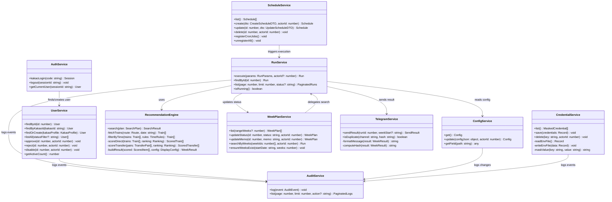

### 2.2 리포지토리 계층

```mermaid
classDiagram
    class BaseRepository {
        #db: Database
        +getDb() Database
    }

    class UserRepository {
        +findById(id: number) User?
        +findByKakaoId(kakaoId: string) User?
        +create(data: CreateUser) User
        +updateStatus(id: number, status: string) void
        +countByStatus(status: string) number
        +findAll(statusFilter?: string) User[]
    }

    class ConfigRepository {
        +get() Config
        +update(configJson: string, updatedBy: number) void
    }

    class RunRepository {
        +create(data: CreateRun) Run
        +findById(id: number) Run?
        +updateResult(id: number, result: string, status: string) void
        +findRunning() Run?
        +list(offset: number, limit: number, status?: string) Run[]
        +count(status?: string) number
        +deleteOlderThan(days: number) number
    }

    class WeekPlanRepository {
        +findByDateRange(start: string, end: string) WeekPlan[]
        +findById(id: number) WeekPlan?
        +upsert(weekStartDate: string) WeekPlan
        +updateStatus(id: number, status: string, updatedBy: number) void
        +updateMemo(id: number, memo: string, updatedBy: number) void
        +updateLastRun(id: number, runId: number) void
        +deleteOlderThan(days: number) number
    }

    class ScheduleRepository {
        +findAll() Schedule[]
        +findById(id: number) Schedule?
        +create(data: CreateSchedule) Schedule
        +update(id: number, data: Partial) void
        +delete(id: number) void
    }

    class AuditLogRepository {
        +create(data: CreateAuditLog) void
        +list(offset: number, limit: number, action?: string) AuditLog[]
        +count(action?: string) number
        +deleteOlderThan(days: number) number
    }

    class DedupeRepository {
        +find(channel: string, hash: string) Dedupe?
        +create(channel: string, hash: string, expiresAt: string) void
        +deleteExpired() number
    }

    BaseRepository <|-- UserRepository
    BaseRepository <|-- ConfigRepository
    BaseRepository <|-- RunRepository
    BaseRepository <|-- WeekPlanRepository
    BaseRepository <|-- ScheduleRepository
    BaseRepository <|-- AuditLogRepository
    BaseRepository <|-- DedupeRepository
```

### 2.3 미들웨어/인프라 계층

```mermaid
classDiagram
    class AuthMiddleware {
        +requireAuth(req, res, next) void
        +requireAdmin(req, res, next) void
        +requireActive(req, res, next) void
    }

    class SessionStore {
        -db: Database
        +get(sid: string) Session?
        +set(sid: string, session: object) void
        +destroy(sid: string) void
        +clearExpired() void
    }

    class ExternalApiClient {
        <<interface>>
        +fetchTrains(params: FetchParams) RawTrain[]
    }

    class SrtClient {
        +fetchTrains(params: FetchParams) RawTrain[]
    }

    class KtxClient {
        +fetchTrains(params: FetchParams) RawTrain[]
    }

    class KakaoOAuthClient {
        +getAuthUrl() string
        +getToken(code: string) TokenResponse
        +getUserInfo(accessToken: string) KakaoProfile
    }

    class TelegramBotClient {
        +sendMessage(chatId: string, text: string) boolean
        +formatMarkdown(text: string) string
    }

    class CronManager {
        -jobs: Map~string, CronJob~
        +register(id: string, cron: string, handler: Function) void
        +unregister(id: string) void
        +unregisterAll() void
        +getNextRun(cron: string) Date
    }

    class DatabaseManager {
        -db: Database
        +initialize() void
        +runMigrations() void
        +getConnection() Database
        +backup(path: string) void
        +close() void
    }

    ExternalApiClient <|.. SrtClient
    ExternalApiClient <|.. KtxClient
```

---

## 3. 시퀀스 다이어그램

### 3.1 카카오 OAuth 로그인 플로우

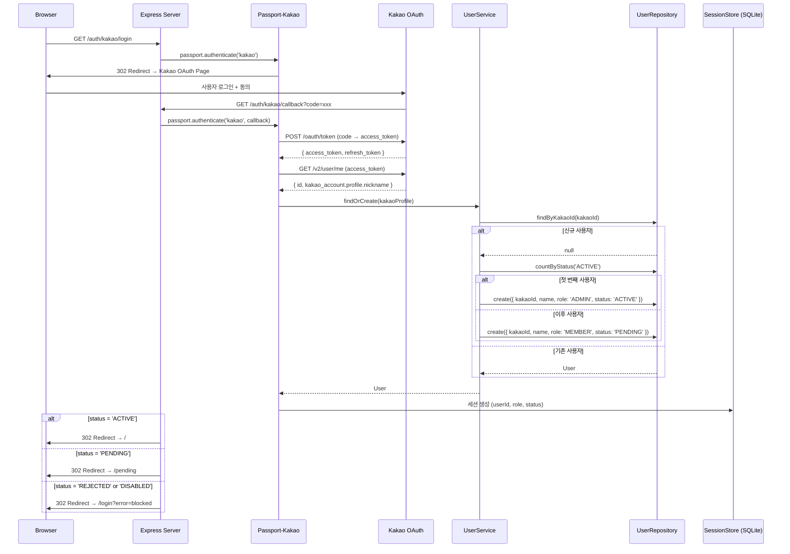

### 3.2 추천 검색 실행 플로우 (핵심)

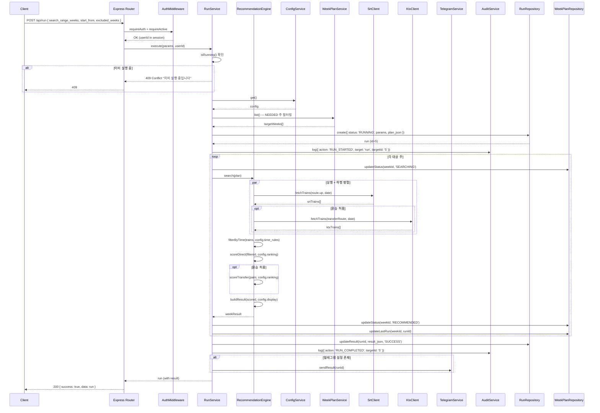

### 3.3 추천 스코어링 알고리즘 상세

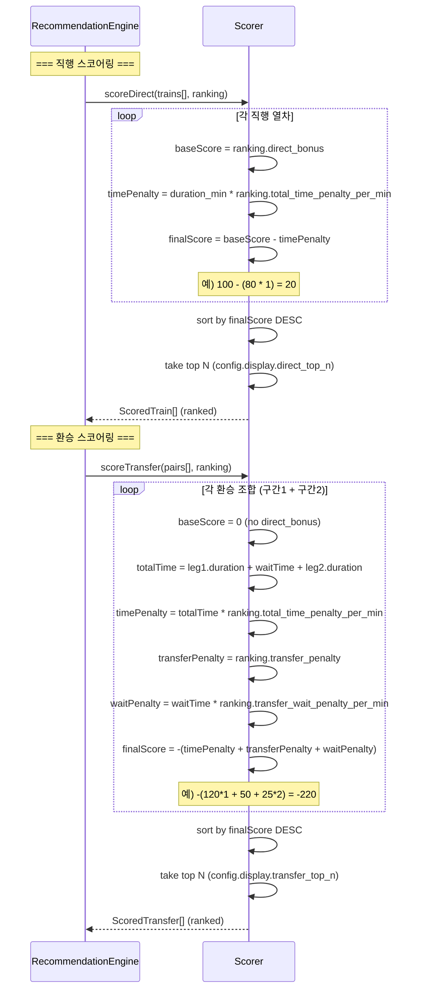

### 3.4 텔레그램 알림 발송 플로우

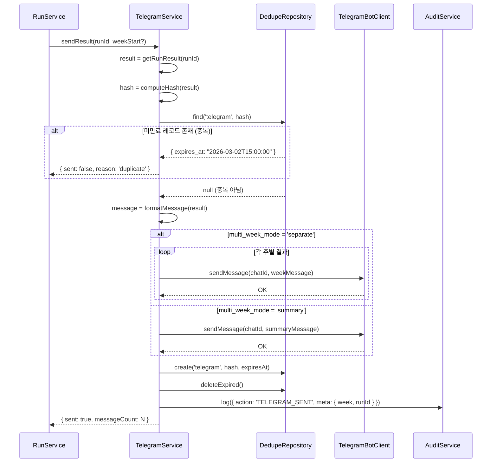

### 3.5 스케줄 실행 플로우

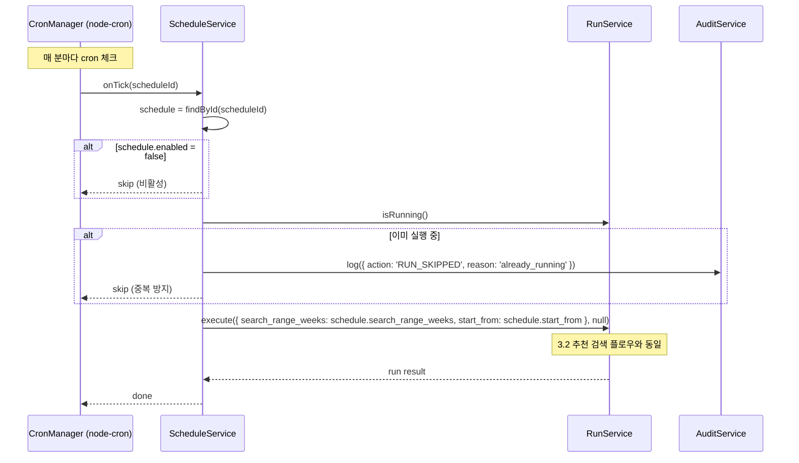

---

## 4. 상태 다이어그램

### 4.1 사용자 상태 (User Status)

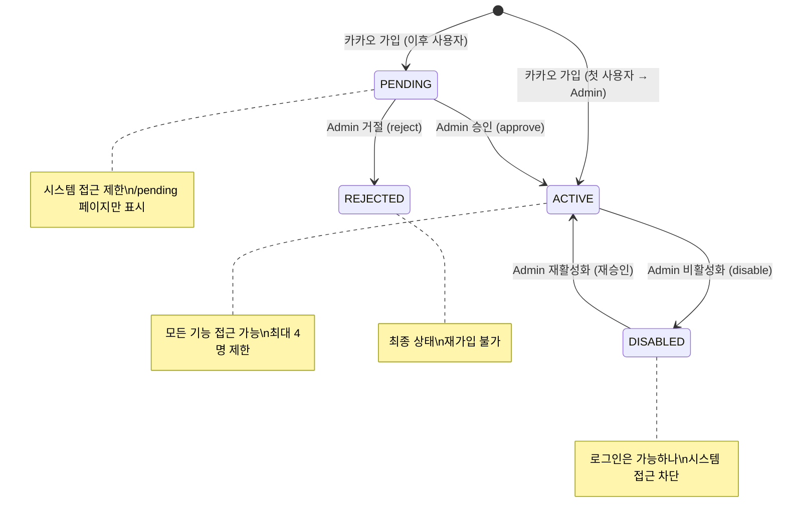

#### 상태 전이 규칙

| 현재 상태 | 이벤트 | 다음 상태 | 권한 | 부가 동작 |
|-----------|--------|-----------|------|-----------|
| - | 최초 가입 (사용자 0명) | ACTIVE | 시스템 | role='ADMIN' 자동 설정 |
| - | 이후 가입 | PENDING | 시스템 | role='MEMBER', 대기 상태 |
| PENDING | 승인 | ACTIVE | Admin | ACTIVE 수 < 4 확인, 감사 로그 |
| PENDING | 거절 | REJECTED | Admin | 감사 로그 |
| ACTIVE | 비활성화 | DISABLED | Admin | 자기 자신 불가, 감사 로그 |
| DISABLED | 재활성화 | ACTIVE | Admin | ACTIVE 수 < 4 확인 |

### 4.2 주간 계획 상태 (WeekPlan Status)

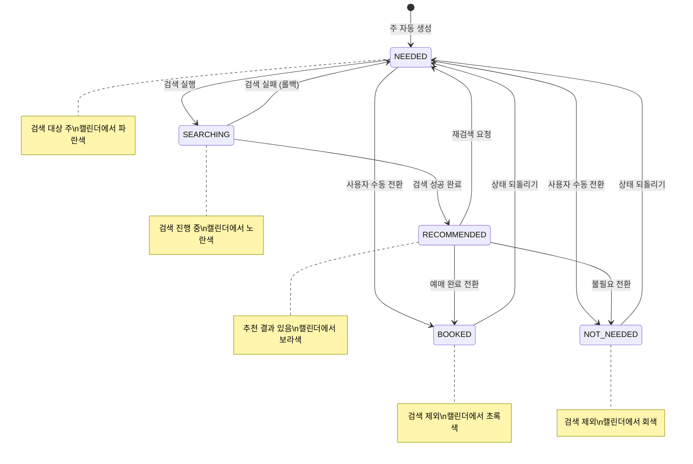

#### 상태 전이 규칙

| 현재 상태 | 이벤트 | 다음 상태 | 부가 동작 |
|-----------|--------|-----------|-----------|
| (생성) | 자동 생성 | NEEDED | week_start_date = 다음 월요일 |
| NEEDED | 검색 실행 | SEARCHING | run 생성 |
| SEARCHING | 검색 성공 | RECOMMENDED | last_run_id 업데이트 |
| SEARCHING | 검색 실패 | NEEDED | 에러 로그 기록 |
| RECOMMENDED | 재검색 | NEEDED | last_run_id 유지 |
| NEEDED/RECOMMENDED | BOOKED 전환 | BOOKED | 검색 대상에서 제외 |
| NEEDED/RECOMMENDED | NOT_NEEDED 전환 | NOT_NEEDED | 검색 대상에서 제외 |
| BOOKED/NOT_NEEDED | 되돌리기 | NEEDED | 다시 검색 대상 |

### 4.3 실행 상태 (Run Status)

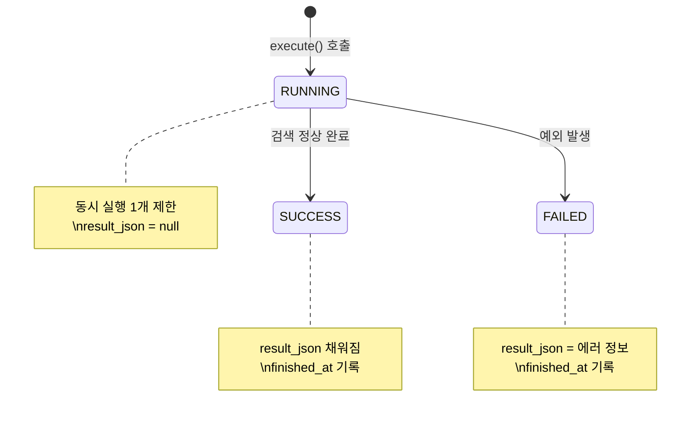

---

## 5. 모듈 상세 설계

### 5.1 AuthModule

| 항목 | 내용 |
|------|------|
| **모듈명** | AuthModule |
| **책임** | 카카오 OAuth 인증, 세션 관리, 로그아웃 |
| **의존성** | UserService, passport-kakao, express-session, connect-sqlite3 |
| **관련 FR** | FR-001, FR-002 |

#### 인터페이스

```
AuthService
├── kakaoLogin(code: string): Session
│   - passport-kakao strategy가 처리
│   - UserService.findOrCreate() 호출
│   - 세션에 userId, role, status 저장
│
├── logout(sessionId: string): void
│   - 세션 파기 (req.session.destroy)
│   - 쿠키 삭제
│
└── getCurrentUser(sessionId: string): User | null
    - 세션에서 userId 추출
    - UserService.findById() 호출
```

#### 세션 구조

```typescript
interface SessionData {
  userId: number;
  role: 'ADMIN' | 'MEMBER';
  status: 'PENDING' | 'ACTIVE' | 'REJECTED' | 'DISABLED';
  kakaoId: string;
  name: string;
}
```

#### 미들웨어 체인

```
requireAuth → 세션 존재 확인 (미인증 시 401)
  └── requireActive → status='ACTIVE' 확인 (PENDING이면 403)
        └── requireAdmin → role='ADMIN' 확인 (MEMBER이면 403)
```

---

### 5.2 UserModule

| 항목 | 내용 |
|------|------|
| **모듈명** | UserModule |
| **책임** | 사용자 CRUD, 승인/거절/비활성화, 정원 관리 |
| **의존성** | UserRepository, AuditService |
| **관련 FR** | FR-003 |

#### 인터페이스

```
UserService
├── findOrCreate(kakaoProfile: KakaoProfile): User
│   1. findByKakaoId(profile.id) 조회
│   2. 미존재 시:
│      - countByStatus('ACTIVE') 확인
│      - 0명이면: role=ADMIN, status=ACTIVE
│      - 1명 이상이면: role=MEMBER, status=PENDING
│      - create() 호출
│   3. 존재 시: 기존 User 반환
│
├── approve(id: number, actorId: number): void
│   1. 대상 사용자 조회 (status=PENDING 확인)
│   2. ACTIVE 사용자 수 < 4 확인
│   3. status → ACTIVE 업데이트
│   4. AuditService.log(USER_APPROVED)
│
├── reject(id: number, actorId: number): void
│   1. 대상 사용자 조회 (status=PENDING 확인)
│   2. status → REJECTED 업데이트
│   3. AuditService.log(USER_REJECTED)
│
├── disable(id: number, actorId: number): void
│   1. 대상 사용자 조회 (status=ACTIVE 확인)
│   2. actorId ≠ id 확인 (자기 자신 불가)
│   3. status → DISABLED 업데이트
│   4. AuditService.log(USER_DISABLED)
│
└── getActiveCount(): number
    - countByStatus('ACTIVE') 반환
```

#### 비즈니스 규칙

| 규칙 ID | 규칙 | 검증 위치 |
|---------|------|-----------|
| BR-USR-01 | ACTIVE 사용자 최대 4명 | approve() |
| BR-USR-02 | 첫 사용자는 자동 Admin + Active | findOrCreate() |
| BR-USR-03 | Admin은 자기 자신을 비활성화할 수 없음 | disable() |
| BR-USR-04 | PENDING → ACTIVE/REJECTED만 가능 | approve(), reject() |

---

### 5.3 ConfigModule

| 항목 | 내용 |
|------|------|
| **모듈명** | ConfigModule |
| **책임** | 시스템 설정 CRUD (단일 레코드) |
| **의존성** | ConfigRepository, AuditService |
| **관련 FR** | FR-004, FR-005, FR-015, FR-016 |

#### 인터페이스

```
ConfigService
├── get(): Config
│   - ConfigRepository.get() 호출
│   - config_json 파싱 후 반환
│   - 기본값 merge (누락 필드 대비)
│
├── update(configJson: object, actorId: number): Config
│   1. zod 스키마로 config 유효성 검증
│   2. 현재 설정과 diff 계산
│   3. ConfigRepository.update(JSON.stringify(configJson), actorId)
│   4. AuditService.log(CONFIG_UPDATED, { changed_keys: [...] })
│   5. 갱신된 Config 반환
│
└── getField(path: string): any
    - lodash.get(config, path) — 특정 설정값 조회
    - 예: getField('preferences.modes.allow_transfer')
```

#### 설정 유효성 검증 (Zod 스키마)

```typescript
const configSchema = z.object({
  route: z.object({
    primary: z.object({ from: z.string(), to: z.string() }),
    alternatives: z.object({
      enabled: z.boolean(),
      from_candidates: z.array(z.string()),
      to_candidates: z.array(z.string()),
    }),
  }),
  preferences: z.object({
    time_rules: z.object({
      up: z.record(z.string(), z.number().min(0).max(23)),
      down: z.record(z.string(), z.number().min(0).max(23)),
    }),
    modes: z.object({
      allow_transfer: z.boolean(),
      max_transfers: z.number().min(1).max(2),
      min_transfer_buffer_min: z.number().min(10).max(60),
    }),
  }),
  ranking: z.object({
    direct_bonus: z.number().min(0),
    total_time_penalty_per_min: z.number().min(0),
    transfer_penalty: z.number().min(0),
    transfer_wait_penalty_per_min: z.number().min(0),
  }),
  search_range: z.object({
    default_weeks: z.number().min(1).max(8),
    max_weeks: z.number().min(1).max(8),
    default_start_from: z.enum(['this', 'next']),
  }),
  display: z.object({
    direct_top_n: z.number().min(1).max(20),
    transfer_top_n: z.number().min(1).max(10),
    max_candidates_per_direction: z.number().min(10).max(100),
  }),
  telegram: z.object({
    dedupe_window_minutes: z.number().min(0),
    multi_week_mode: z.enum(['separate', 'summary']),
  }),
  safety: z.object({
    mode: z.enum(['assist', 'auto']),
    auto_booking: z.object({
      enabled: z.boolean(),
      max_amount_per_booking: z.number().nullable(),
      max_bookings_per_week: z.number().nullable(),
      max_attempts_per_run: z.number().nullable(),
    }),
  }),
});
```

---

### 5.4 RunModule + RecommendationEngine

| 항목 | 내용 |
|------|------|
| **모듈명** | RunModule |
| **책임** | 추천 검색 실행, 열차 조회, 스코어링, 랭킹 |
| **의존성** | ConfigService, WeekPlanService, TelegramService, ExternalApiClient, AuditService |
| **관련 FR** | FR-006, FR-007, FR-008, FR-009, FR-011, FR-016, FR-017 |

#### RecommendationEngine 알고리즘

```
search(plan: SearchPlan): SearchResult

  1. 대상 주 결정
     - plan.weekStartDates[] 에서 NEEDED 상태 주만 필터
     - excluded_weeks 에 포함된 주 제외

  2. 각 주별 처리 (루프)
     a. 대상 날짜 계산 (주의 각 요일)
     b. config.time_rules에서 해당 요일 필터 추출

     c. 상행(up) 처리:
        - SrtClient.fetchTrains(from, to, dates)
        - filterByTime(trains, up_rules) → 시간 이후만
        - scoreDirect(filtered, ranking)
        - if allow_transfer:
            KtxClient.fetchTrains(transferRoutes, dates)
            buildTransferPairs(srt, ktx, min_buffer)
            scoreTransfer(pairs, ranking)
        - top_direct = take(direct_top_n)
        - top_transfer = take(transfer_top_n)

     d. 하행(down) 처리: 동일 로직, 반대 방향

     e. 주별 결과 조합

  3. 전체 결과 조합 + 요약 통계
  4. result_json 생성
```

#### 스코어링 공식

| 항목 | 직행 | 환승 |
|------|------|------|
| 기본 점수 | `+direct_bonus` | 0 |
| 소요시간 패널티 | `-duration * time_penalty_per_min` | `-totalDuration * time_penalty_per_min` |
| 환승 패널티 | - | `-transfer_penalty` |
| 환승 대기 패널티 | - | `-waitMin * wait_penalty_per_min` |
| **최종** | `direct_bonus - (duration * penalty)` | `-(totalDuration * penalty + transfer_penalty + wait * waitPenalty)` |

#### 중복 실행 방지

```
execute(params, actorId):
  1. RunRepository.findRunning() 조회
  2. 실행 중인 run 존재 시 → throw ConflictError
  3. 새 run INSERT (status=RUNNING)
  4. try:
       result = engine.search(plan)
       RunRepository.updateResult(runId, result, 'SUCCESS')
     catch(error):
       RunRepository.updateResult(runId, { error: message }, 'FAILED')
       throw error
     finally:
       // RUNNING 상태 해제 보장 (finished_at 기록)
```

---

### 5.5 WeekPlanModule

| 항목 | 내용 |
|------|------|
| **모듈명** | WeekPlanModule |
| **책임** | 주간 캘린더 상태/메모 관리, 주 자동 생성 |
| **의존성** | WeekPlanRepository, RunService |
| **관련 FR** | FR-018 |

#### 인터페이스

```
WeekPlanService
├── list(rangeWeeks?: number): WeekPlan[]
│   1. 기본 8주 범위 계산 (오늘 기준)
│   2. ensureWeeksExist(startDate, weeks) — 미존재 주 자동 생성
│   3. findByDateRange(start, end) 반환
│
├── updateStatus(id: number, status: string, actorId: number): WeekPlan
│   1. 현재 상태 조회
│   2. 상태 전이 규칙 검증 (허용된 전이인지)
│   3. WeekPlanRepository.updateStatus(id, status, actorId)
│   4. 갱신된 WeekPlan 반환
│
├── updateMemo(id: number, memo: string, actorId: number): WeekPlan
│   - WeekPlanRepository.updateMemo(id, memo, actorId)
│
├── searchByWeeks(weekIds: number[], actorId: number): Run
│   1. 각 weekId의 week_start_date 추출
│   2. NEEDED 상태가 아닌 주 제외 (경고 반환)
│   3. RunService.execute({ targetWeeks: dates }, actorId)
│   4. run 결과 반환
│
└── ensureWeeksExist(startDate: string, weeks: number): void
    - 지정 범위의 월요일 날짜 생성
    - 각 날짜에 대해 WeekPlanRepository.upsert(date)
    - 중복 INSERT 무시 (UNIQUE 제약)
```

#### 주 시작일 계산 로직

```
getMonday(date):
  1. date의 요일 확인 (0=일, 1=월, ..., 6=토)
  2. 월요일이면 그대로 반환
  3. 아니면 이전 월요일로 조정: date - (dayOfWeek - 1) days
     (일요일은 date - 6 days)

getWeekRange(startFrom, rangeWeeks):
  1. today = 오늘 날짜 (KST)
  2. baseMonday = getMonday(today)
  3. if startFrom == 'next': baseMonday += 7 days
  4. weeks = [baseMonday, baseMonday+7, ..., baseMonday+(rangeWeeks-1)*7]
  5. return weeks (YYYY-MM-DD 형식)
```

---

### 5.6 ScheduleModule

| 항목 | 내용 |
|------|------|
| **모듈명** | ScheduleModule |
| **책임** | Cron 스케줄 CRUD, node-cron 등록/해제 |
| **의존성** | ScheduleRepository, RunService, CronManager, AuditService |
| **관련 FR** | FR-012 |

#### 인터페이스

```
ScheduleService
├── list(): Schedule[]
│
├── create(dto: CreateScheduleDTO, actorId: number): Schedule
│   1. Cron 표현식 유효성 검증 (cron-parser)
│   2. ScheduleRepository.create(dto)
│   3. enabled=true이면 CronManager.register(id, cron, handler)
│   4. AuditService.log(SCHEDULE_CREATED)
│
├── update(id: number, dto: UpdateScheduleDTO): Schedule
│   1. 기존 스케줄 조회
│   2. 변경 사항 적용
│   3. CronManager.unregister(id)
│   4. enabled=true이면 CronManager.register(id, cron, handler)
│   5. AuditService.log(SCHEDULE_UPDATED)
│
├── delete(id: number, actorId: number): void
│   1. CronManager.unregister(id)
│   2. ScheduleRepository.delete(id)
│   3. AuditService.log(SCHEDULE_DELETED)
│
└── registerCronJobs(): void   // 앱 시작 시 호출
    1. ScheduleRepository.findAll() — enabled=true만
    2. 각 스케줄에 대해 CronManager.register(id, cron, handler)
    3. handler: () => RunService.execute(params, null)
```

#### 프리셋 매핑

| 프리셋 이름 | Cron 표현식 | 설명 |
|------------|-------------|------|
| 매일 07:00 | `0 7 * * *` | 매일 아침 7시 |
| 매일 18:00 | `0 18 * * *` | 매일 저녁 6시 |
| 주중 07:00 | `0 7 * * 1-5` | 월~금 아침 7시 |
| 주말 09:00 | `0 9 * * 0,6` | 토,일 아침 9시 |

---

### 5.7 TelegramModule

| 항목 | 내용 |
|------|------|
| **모듈명** | TelegramModule |
| **책임** | 텔레그램 결과 알림 발송, 중복 방지 |
| **의존성** | TelegramBotClient, DedupeRepository, RunRepository |
| **관련 FR** | FR-010 |

#### 중복 방지 로직

```
isDuplicate(channel, hash):
  1. DedupeRepository.find(channel, hash)
  2. 존재하고 expires_at > now → true (중복)
  3. 미존재 or 만료 → false (신규)

computeHash(result):
  1. 결과의 핵심 데이터 추출 (열차번호, 시각, 방향)
  2. JSON.stringify() → SHA-256 해시
  3. 동일 추천 결과 = 동일 해시

recordSend(channel, hash, windowMinutes):
  1. expiresAt = now + windowMinutes (config.telegram.dedupe_window_minutes)
  2. DedupeRepository.create(channel, hash, expiresAt)
```

#### 메시지 포맷

```
formatMessage(weekResult):
  ---
  🚄 TrainBot 추천 [3/2~3/8]

  ▲ 상행 (김천구미→동탄)
  [직행 TOP 5]
  1. SRT 301 | 06:10→07:30 (80분)
  2. SRT 303 | 07:20→08:40 (80분)
  ...

  [환승 TOP 3]
  1. KTX 101 대전 06:50 → SRT 305 07:20 (대기 30분)
  ...

  ▼ 하행 (동탄→김천구미)
  ...
  ---
```

---

### 5.8 CredentialModule

| 항목 | 내용 |
|------|------|
| **모듈명** | CredentialModule |
| **책임** | /data/.env.credentials 파일 기반 민감정보 관리 |
| **의존성** | 파일시스템 (fs), AuditService |
| **관련 FR** | FR-019 |
| **관련 NFR** | NFR-003, NFR-007 |

#### 인터페이스

```
CredentialService
├── list(): MaskedCredential[]
│   1. readEnvFile() — KEY=VALUE 파싱
│   2. 각 값을 maskValue()로 마스킹
│   3. [{ key, maskedValue, isSet }] 반환
│
├── save(credentials: Record<string, string>, actorId: number): void
│   1. 입력값 검증 (XSS/Injection 방지)
│   2. writeEnvFile(credentials) — 전체 덮어쓰기
│   3. 파일 권한 설정 (chmod 600)
│   4. AuditService.log(CREDENTIAL_SAVED, { keys: Object.keys(credentials) })
│   ※ 값은 감사 로그에 절대 기록 금지
│
├── delete(key: string, actorId: number): void
│   1. 현재 파일 읽기
│   2. 해당 키 제거
│   3. writeEnvFile(updated)
│   4. AuditService.log(CREDENTIAL_DELETED, { key })
│
├── readEnvFile(): Record<string, string>
│   - /data/.env.credentials 파일 읽기
│   - KEY=VALUE 형식 파싱 (dotenv 호환)
│   - 미존재 시 빈 객체 반환
│
├── writeEnvFile(data: Record<string, string>): void
│   - KEY=VALUE 형식으로 직렬화
│   - fs.writeFileSync('/data/.env.credentials', content, { mode: 0o600 })
│
└── maskValue(key: string, value: string): string
    - password 포함 키: "●●●●● (설정됨)" or "(미설정)"
    - 계정/이메일: 앞 2자 + ****
    - 카드번호: ****-****-****-뒤4자리
    - 기타: 앞 3자 + ****
```

#### 보안 규칙

1. 파일 경로: `/data/.env.credentials` 고정 (하드코딩)
2. 파일 권한: `0o600` (소유자만 읽기/쓰기)
3. DB 저장 금지: 자격증명 값은 절대 SQLite에 기록하지 않음
4. 로그 금지: 자격증명 값은 console.log, winston, audit_logs에 기록하지 않음
5. 메모리 관리: 사용 후 변수 null 할당 권장

---

### 5.9 AuditModule

| 항목 | 내용 |
|------|------|
| **모듈명** | AuditModule |
| **책임** | 감사 이벤트 기록, 조회 |
| **의존성** | AuditLogRepository |
| **관련 FR** | FR-014 |

#### 인터페이스

```
AuditService
├── log(event: AuditEvent): void
│   - AuditLogRepository.create({
│       actor_user_id: event.actorId,
│       action: event.action,
│       target_type: event.targetType,
│       target_id: event.targetId,
│       meta_json: JSON.stringify(event.meta)
│     })
│   ※ 동기 처리 (SQLite이므로 성능 부담 없음)
│
└── list(page, limit, action?): PaginatedLogs
    - offset 계산
    - AuditLogRepository.list(offset, limit, action)
    - AuditLogRepository.count(action)
    - { data, pagination } 반환
```

#### AuditEvent 타입

```typescript
interface AuditEvent {
  actorId: number | null;     // null = 시스템 (스케줄 등)
  action: AuditAction;
  targetType: string;
  targetId?: string;
  meta?: Record<string, any>; // 민감 정보 절대 포함 금지
}

type AuditAction =
  | 'USER_APPROVED' | 'USER_REJECTED' | 'USER_DISABLED'
  | 'CONFIG_UPDATED'
  | 'RUN_STARTED' | 'RUN_COMPLETED' | 'RUN_FAILED' | 'RUN_SKIPPED'
  | 'SCHEDULE_CREATED' | 'SCHEDULE_UPDATED' | 'SCHEDULE_DELETED'
  | 'TELEGRAM_SENT'
  | 'CREDENTIAL_SAVED' | 'CREDENTIAL_DELETED'
  | 'AUTO_MODE_ENABLED' | 'AUTO_MODE_DISABLED';
```

---

### 5.10 CleanupModule

| 항목 | 내용 |
|------|------|
| **모듈명** | CleanupModule |
| **책임** | 데이터 보존 정책에 따른 정기 정리 |
| **의존성** | RunRepository, WeekPlanRepository, AuditLogRepository, DedupeRepository, CronManager |

#### 정리 스케줄

```
registerCleanupJobs():
  1. CronManager.register('cleanup-daily', '0 4 * * *', dailyCleanup)
  2. CronManager.register('cleanup-weekly', '0 4 * * 0', weeklyCleanup)

dailyCleanup():
  - RunRepository.deleteOlderThan(90)        // runs: 90일
  - WeekPlanRepository.deleteOlderThan(90)   // week_plans: 90일
  - DedupeRepository.deleteExpired()         // dedupe: 만료 기준

weeklyCleanup():
  - AuditLogRepository.deleteOlderThan(365)  // audit_logs: 1년
  - VACUUM 실행 (DB 파일 크기 최적화)
```

---

## 6. 디자인 패턴 적용 기록

| 패턴명 | 적용 위치 | 목적 |
|--------|-----------|------|
| **Repository** | 모든 데이터 접근 | DB 접근 로직 분리. better-sqlite3 Prepared Statement 캡슐화 |
| **Strategy** | ExternalApiClient | SRT/KTX 조회 클라이언트를 인터페이스로 추상화. 신규 열차 유형 추가 용이 |
| **Singleton** | DatabaseManager | SQLite 연결을 단일 인스턴스로 관리. better-sqlite3는 동기 API |
| **Facade** | RunService.execute() | 복잡한 검색 워크플로우를 단일 메서드로 캡슐화 |
| **Observer** | AuditService | 각 모듈이 이벤트 발생 시 AuditService.log() 호출. 관심사 분리 |
| **Guard Clause** | 미들웨어 체인 | requireAuth → requireActive → requireAdmin 순차 검증 |
| **Template Method** | ExternalApiClient | fetchTrains() 공통 인터페이스, SRT/KTX별 구현 상이 |
| **Builder** | 메시지 포맷터 | 텔레그램 메시지를 단계별로 구성 (헤더 → 상행 → 하행 → 푸터) |

---

## 7. 에러 처리

### 7.1 예외 클래스 구조

```typescript
class AppError extends Error {
  statusCode: number;
  code: string;
  constructor(message: string, statusCode: number, code: string) { ... }
}

class BadRequestError extends AppError {       // 400
  constructor(message: string, code = 'BAD_REQUEST') { super(message, 400, code); }
}
class UnauthorizedError extends AppError {     // 401
  constructor(message = '인증이 필요합니다') { super(message, 401, 'UNAUTHORIZED'); }
}
class ForbiddenError extends AppError {        // 403
  constructor(message = '접근 권한이 없습니다') { super(message, 403, 'FORBIDDEN'); }
}
class NotFoundError extends AppError {         // 404
  constructor(resource: string) { super(`${resource}을(를) 찾을 수 없습니다`, 404, 'NOT_FOUND'); }
}
class ConflictError extends AppError {         // 409
  constructor(message: string) { super(message, 409, 'CONFLICT'); }
}
class ExternalApiError extends AppError {      // 502
  constructor(service: string, cause?: Error) { super(`${service} 연동 오류`, 502, 'EXTERNAL_ERROR'); }
}
```

### 7.2 글로벌 에러 핸들러

```typescript
function globalErrorHandler(err: Error, req: Request, res: Response, next: NextFunction) {
  if (err instanceof AppError) {
    // 비즈니스 에러 — 정의된 응답
    logger.warn(`[${err.code}] ${err.message}`, { path: req.path });
    return res.status(err.statusCode).json({
      success: false,
      error: { code: err.code, message: err.message }
    });
  }

  // 예상치 못한 에러 — 500
  logger.error('Unhandled error', { error: err.message, stack: err.stack, path: req.path });
  return res.status(500).json({
    success: false,
    error: { code: 'INTERNAL_ERROR', message: '서버 내부 오류가 발생했습니다' }
  });
  // ※ 프로덕션에서는 스택 트레이스 노출 금지
}
```

### 7.3 외부 API 에러 처리

```typescript
async function fetchWithRetry(fn: () => Promise<any>, options: RetryOptions): Promise<any> {
  const { maxRetries = 3, baseDelay = 1000, maxDelay = 10000 } = options;

  for (let attempt = 1; attempt <= maxRetries; attempt++) {
    try {
      return await fn();
    } catch (error) {
      if (attempt === maxRetries) {
        throw new ExternalApiError('SRT/KTX', error);
      }
      const delay = Math.min(baseDelay * Math.pow(2, attempt - 1), maxDelay);
      await sleep(delay);
      logger.warn(`External API retry ${attempt}/${maxRetries}`, { delay });
    }
  }
}
```

---

## 8. 코딩 표준

### 8.1 네이밍 컨벤션

| 대상 | 규칙 | 예시 |
|------|------|------|
| 파일명 (모듈) | camelCase | `userService.ts`, `runRepository.ts` |
| 파일명 (타입/인터페이스) | camelCase | `types.ts`, `schemas.ts` |
| 클래스 | PascalCase | `UserService`, `RunRepository` |
| 함수/메서드 | camelCase | `findById()`, `executeRun()` |
| 변수 | camelCase | `userId`, `weekStartDate` |
| 상수 | UPPER_SNAKE_CASE | `MAX_ACTIVE_USERS`, `DEFAULT_PAGE_SIZE` |
| DB 컬럼 | snake_case | `created_at`, `config_json` |
| API 경로 | kebab-case | `/api/week-plans`, `/api/admin/users` |
| API 본문 필드 | snake_case | `search_range_weeks`, `start_from` |
| 환경 변수 | UPPER_SNAKE_CASE | `KAKAO_CLIENT_ID`, `TELEGRAM_BOT_TOKEN` |

### 8.2 프로젝트 디렉토리 구조

```
src/
├── server/
│   ├── index.ts                    # Express 앱 진입점
│   ├── app.ts                      # Express 앱 설정
│   ├── routes/
│   │   ├── authRoutes.ts           # /auth/*
│   │   ├── userRoutes.ts           # /api/admin/users/*
│   │   ├── configRoutes.ts         # /api/config
│   │   ├── runRoutes.ts            # /api/run, /api/runs/*
│   │   ├── weekPlanRoutes.ts       # /api/week-plans/*
│   │   ├── scheduleRoutes.ts       # /api/schedules/*
│   │   ├── telegramRoutes.ts       # /api/notify/telegram
│   │   ├── credentialRoutes.ts     # /api/credentials/*
│   │   └── healthRoutes.ts         # /api/health
│   ├── services/
│   │   ├── authService.ts
│   │   ├── userService.ts
│   │   ├── configService.ts
│   │   ├── runService.ts
│   │   ├── recommendationEngine.ts
│   │   ├── weekPlanService.ts
│   │   ├── scheduleService.ts
│   │   ├── telegramService.ts
│   │   ├── credentialService.ts
│   │   ├── auditService.ts
│   │   └── cleanupService.ts
│   ├── repositories/
│   │   ├── baseRepository.ts
│   │   ├── userRepository.ts
│   │   ├── configRepository.ts
│   │   ├── runRepository.ts
│   │   ├── weekPlanRepository.ts
│   │   ├── scheduleRepository.ts
│   │   ├── auditLogRepository.ts
│   │   └── dedupeRepository.ts
│   ├── middleware/
│   │   ├── authMiddleware.ts
│   │   ├── errorHandler.ts
│   │   └── requestLogger.ts
│   ├── external/
│   │   ├── srtClient.ts
│   │   ├── ktxClient.ts
│   │   ├── kakaoOAuthClient.ts
│   │   └── telegramBotClient.ts
│   ├── database/
│   │   ├── manager.ts
│   │   └── migrations/
│   ├── utils/
│   │   ├── dateUtils.ts
│   │   ├── hashUtils.ts
│   │   └── retryUtils.ts
│   ├── types/
│   │   ├── models.ts
│   │   ├── dto.ts
│   │   └── config.ts
│   └── schemas/
│       ├── configSchema.ts
│       └── requestSchemas.ts
├── client/                          # React 앱 (Vite)
│   ├── src/
│   │   ├── pages/
│   │   ├── components/
│   │   ├── stores/
│   │   ├── hooks/
│   │   ├── api/
│   │   └── utils/
│   └── vite.config.ts
├── package.json
├── tsconfig.json
└── Dockerfile
```

### 8.3 코드 리뷰 체크리스트

| 카테고리 | 항목 |
|----------|------|
| **기능** | 요구사항(FR)을 올바르게 구현했는가? |
| **기능** | 엣지 케이스를 고려했는가? (null, 빈 배열, 경계값) |
| **보안** | Prepared Statement를 사용하는가? (SQL Injection 방지) |
| **보안** | 민감 정보가 로그/DB에 기록되지 않는가? (NFR-007) |
| **보안** | 인증/인가 미들웨어가 올바르게 적용되었는가? |
| **보안** | 사용자 입력이 zod로 검증되는가? |
| **성능** | 불필요한 DB 쿼리가 없는가? |
| **성능** | 트랜잭션이 필요한 곳에 적용되었는가? |
| **에러** | 외부 API 호출에 재시도/타임아웃이 있는가? |
| **에러** | 에러 응답이 일관된 형식인가? |
| **코드** | 네이밍 컨벤션을 준수하는가? |
| **코드** | 매직 넘버 없이 상수를 사용하는가? |
| **테스트** | 핵심 로직에 단위 테스트가 있는가? |

---

## 부록

### A. DTO 목록

| DTO 명 | 용도 | 주요 필드 |
|--------|------|-----------|
| `RunParams` | 실행 요청 | search_range_weeks, start_from, excluded_weeks |
| `CreateScheduleDTO` | 스케줄 생성 | name, cron, enabled, start_from, search_range_weeks |
| `UpdateScheduleDTO` | 스케줄 수정 | enabled?, cron?, name? |
| `SearchPlan` | 검색 계획 (내부) | weekStartDates, config snapshot, targetWeeks |
| `SearchResult` | 검색 결과 (내부) | weeks[]{up, down}, summary |
| `WeekResult` | 주별 결과 | week_start, week_label, up{direct[], transfer[]}, down{...} |
| `ScoredTrain` | 점수 매겨진 열차 | rank, score, train_type, train_no, departure, arrival, duration_min |
| `ScoredTransfer` | 점수 매겨진 환승 | rank, score, leg1, leg2, transfer_station, wait_min |
| `MaskedCredential` | 마스킹된 자격증명 | key, maskedValue, isSet |
| `AuditEvent` | 감사 이벤트 | actorId, action, targetType, targetId, meta |
| `PaginatedResult<T>` | 페이지네이션 응답 | data[], pagination{page, limit, total, total_pages} |

### B. 참조 문서

| 문서 | 경로 |
|------|------|
| 시스템 아키텍처 설계서 (SAD) | `docs/02-시스템설계/SAD-TRAINBOT-v1.0.md` |
| 데이터베이스 설계서 (DB) | `docs/02-시스템설계/DB-TRAINBOT-v1.0.md` |
| API 설계서 | `docs/02-시스템설계/API-TRAINBOT-v1.0.md` |
| 화면 설계서 (UI) | `docs/02-시스템설계/UI-TRAINBOT-v1.0.md` |
| 요구사항 명세서 (SRS) | `docs/01-요구사항분석/SRS-TRAINBOT-v1.0.md` |
| 유스케이스 명세서 (UCS) | `docs/01-요구사항분석/UCS-TRAINBOT-v1.0.md` |

---

> **본 문서는 프로젝트 이해관계자의 승인을 통해 확정되며, 변경 시 변경 관리 절차에 따라 관리된다.**
