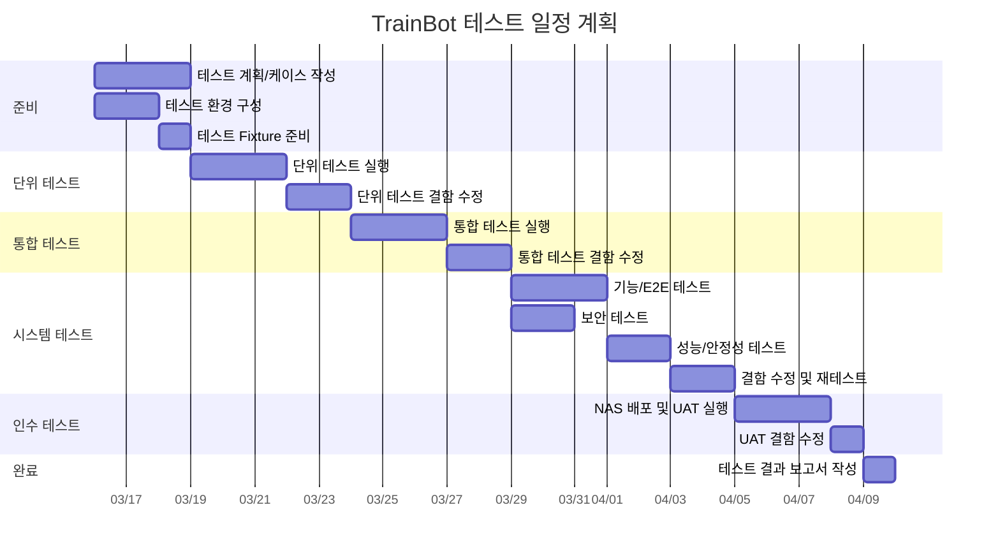

# 테스트 계획서 (Test Plan)

| 항목 | 내용 |
|------|------|
| **프로젝트명** | TrainBot — 김천구미↔동탄 주간 예매 어시스턴트 |
| **문서 버전** | v1.0 |
| **작성일** | 2026-03-02 |
| **작성자** | 프로젝트 오너 |
| **승인자** | - |
| **문서 상태** | [x] 초안 / [ ] 검토 중 / [ ] 승인됨 |

---

## 1. 문서 개요

### 1.1 목적

본 문서는 **TrainBot** 프로젝트의 테스트 활동 전반에 대한 계획을 수립하여, 테스트 범위·전략·일정·리소스·환경 등을 정의하고 관련 이해관계자 간 합의를 도출하기 위해 작성한다.

### 1.2 범위

- **대상 시스템**: TrainBot v1.0 — NAS Docker 단일 컨테이너 (React + Express + SQLite)
- **테스트 대상 범위**: 19개 기능 요구사항(FR-001 ~ FR-019), 11개 비기능 요구사항(NFR-001 ~ NFR-011)
- **테스트 기간**: 구현 완료 후 약 2주

### 1.3 참조 문서

| 문서명 | 버전 | 비고 |
|--------|------|------|
| 요구사항 명세서 (SRS) | v1.0 | 기능/비기능 요구사항 기준 |
| 시스템 아키텍처 설계서 (SAD) | v1.0 | 아키텍처 및 레이어 기준 |
| 상세 설계서 (DDD) | v1.0 | 모듈별 설계 기준 |
| 화면 설계서 (UI) | v1.0 | 화면 기반 테스트 기준 |
| API 설계서 (API) | v1.0 | API 테스트 기준 |
| 데이터베이스 설계서 (DB) | v1.0 | DB 정합성 기준 |
| 요구사항 추적 매트릭스 (RTM) | v1.0 | 커버리지 추적 기준 |

### 1.4 변경 이력

| 버전 | 변경일 | 변경 내용 | 작성자 | 승인자 |
|------|--------|-----------|--------|--------|
| v1.0 | 2026-03-02 | 초안 작성 | 프로젝트 오너 | - |

### 1.5 용어 정의

| 용어 | 설명 |
|------|------|
| SUT (System Under Test) | 테스트 대상 시스템 (TrainBot) |
| TC (Test Case) | 테스트 케이스 |
| RTM | 요구사항 추적 매트릭스 |
| E2E | End-to-End 테스트 |
| NAS | Network Attached Storage (시놀로지 등) |
| WAL | Write-Ahead Logging (SQLite 저널 모드) |
| dedupe | 동일 결과 해시 기반 중복 발송 방지 |
| earliest_after | 요일별 "N시 이후" 검색 컷오프 시간 |

---

## 2. 테스트 전략

### 2.1 테스트 레벨별 전략

#### 2.1.1 단위 테스트 (Unit Test)

| 항목 | 내용 |
|------|------|
| **목적** | 개별 서비스·리포지토리·유틸리티 함수의 정확성 검증 |
| **범위** | 10개 서비스 모듈, 8개 리포지토리, 스코어링 알고리즘, Zod 스키마, 유틸리티 함수 |
| **테스트 도구** | Vitest |
| **커버리지 목표** | Statement Coverage 80% 이상, Branch Coverage 70% 이상 |
| **담당** | 개발자 |
| **자동화 수준** | 100% 자동화 |
| **실행 빈도** | 코드 커밋 시 자동 실행 |

**단위 테스트 기준**:
- 모든 서비스 public 메서드에 대한 테스트 작성
- 스코어링 알고리즘(직행/환승) 경계값 테스트
- Zod 스키마 유효성/무효성 테스트
- 외부 의존성(SRT API, Telegram API)은 Mock 처리
- 각 테스트는 독립적으로 실행 가능해야 함

**핵심 테스트 대상**:

| 모듈 | 테스트 포인트 |
|------|---------------|
| RecommendationEngine | 스코어링 공식, 직행 보너스, 환승 페널티, Top N 정렬 |
| ConfigService | Zod 검증, 기본값 병합, 부분 업데이트 |
| AuthService | 신규/기존 사용자 분기, 정원(4명) 제한, 상태별 로그인 처리 |
| WeekPlanService | 상태 전이 규칙(NEEDED→SEARCHING→RECOMMENDED), 자동 생성 |
| ScheduleService | cron 표현식 파싱, 활성/비활성 토글 |
| TelegramService | 메시지 포맷팅, dedupe 해시 계산, 윈도우 만료 판정 |
| CredentialService | 마스킹 처리, 파일 읽기/쓰기, 키 삭제 |

#### 2.1.2 통합 테스트 (Integration Test)

| 항목 | 내용 |
|------|------|
| **목적** | API 엔드포인트·DB 연동·모듈 간 데이터 흐름 검증 |
| **범위** | 24개 API 엔드포인트, SQLite CRUD, 서비스 간 호출 체인 |
| **테스트 도구** | Vitest + Supertest |
| **담당** | 개발자 |
| **자동화 수준** | 100% 자동화 |
| **실행 빈도** | PR 생성 시 자동 실행 |

**통합 테스트 기준**:
- 모든 API 엔드포인트의 요청/응답 포맷 검증
- SQLite DB CRUD 정합성 검증 (in-memory DB 사용)
- 인증/인가 미들웨어 흐름 검증
- 서비스 간 호출 체인 검증 (Run → Recommendation → Telegram)
- 에러 핸들링 미들웨어 동작 검증

**핵심 테스트 대상**:

| 테스트 영역 | 검증 항목 |
|-------------|-----------|
| Auth 흐름 | Kakao OAuth 콜백 → 세션 생성 → RBAC 검증 |
| Run 체인 | POST /api/run → RecommendationEngine → 결과 저장 → Telegram 발송 |
| Config API | GET/PUT /api/config → Zod 검증 → DB 저장 → 감사 로그 |
| WeekPlan 연동 | 캘린더 조회 → 상태 변경 → 검색 실행 → 상태 자동 전이 |
| Admin API | 사용자 목록 → 승인/거절 → 정원 제한 검증 |

#### 2.1.3 시스템 테스트 (System Test)

| 항목 | 내용 |
|------|------|
| **목적** | 전체 시스템 E2E 시나리오 및 비기능 요구사항 검증 |
| **범위** | 핵심 사용자 시나리오, Docker 환경 동작, 성능, 보안 |
| **테스트 도구** | Playwright (E2E), 수동 테스트 |
| **담당** | 개발자 + 프로젝트 오너 |
| **자동화 수준** | 핵심 시나리오 70% 자동화, 탐색적 테스트 수동 |
| **실행 빈도** | 빌드 단위 |

**시스템 테스트 기준**:
- SRS 기반 전수 시나리오 테스트
- E2E 흐름: 로그인 → 설정 → 검색 실행 → 결과 확인 → 알림 발송
- Docker 컨테이너 기동/재기동 시 데이터 영속성 검증
- SQLite WAL 모드 동시 접근(최대 4명) 검증
- 에러 상황 복구 시나리오 테스트

#### 2.1.4 인수 테스트 (Acceptance Test / UAT)

| 항목 | 내용 |
|------|------|
| **목적** | 실 사용자 관점에서 주간 예매 어시스턴트로서 핵심 워크플로우 충족 검증 |
| **범위** | 핵심 비즈니스 시나리오 (주간 검색→추천→알림→예매완료) |
| **테스트 도구** | 수동 테스트 + 실 데이터 |
| **담당** | 프로젝트 오너 (최종 사용자) |
| **자동화 수준** | 수동 |
| **실행 빈도** | 시스템 테스트 완료 후 1회 |

**인수 테스트 시나리오**:
1. 카카오 로그인 → 최초 사용자 Admin 자동 부여
2. 설정 구성 (노선/선호시간대/스코어링 가중치)
3. 이번 주 수동 검색 → 직행/환승 결과 확인
4. 텔레그램 알림 수신 확인
5. 주간 캘린더에서 상태 관리 (필요→추천완료→예매완료)
6. 스케줄 등록 → 자동 실행 → 알림 수신
7. 2주 이상 복수 주 검색 → 주별 그룹핑 결과 확인
8. NAS Docker 환경에서 실 운영 48시간 안정성 확인

---

### 2.2 테스트 유형별 전략

#### 2.2.1 기능 테스트 (Functional Test)

| 항목 | 내용 |
|------|------|
| **목적** | 19개 FR의 정확한 동작 검증 |
| **접근 방법** | 요구사항 기반 블랙박스 테스트 |
| **기법** | 동등 분할, 경계값 분석, 상태 전이(WeekPlan/User/Run) |
| **도구** | Vitest + Supertest (API), Playwright (UI) |
| **우선순위** | 높음 |

#### 2.2.2 성능 테스트 (Performance Test)

| 항목 | 내용 |
|------|------|
| **목적** | NAS 환경에서의 응답 시간 및 안정성 검증 |
| **유형** | 부하 테스트 (동시 4명), 지속성 테스트 (72시간 연속 운영) |
| **도구** | k6 (API 부하), 수동 모니터링 (리소스) |
| **목표** | API 평균 응답 300ms 이하, 동시 4명 정상 처리, 메모리 누수 없음 |
| **환경** | NAS Docker 실 환경 |
| **우선순위** | 중간 |

**성능 테스트 시나리오**:

| 시나리오 | 조건 | 기대 결과 |
|----------|------|-----------|
| 동시 검색 | 4명 동시 POST /api/run | 모든 요청 정상 완료, 응답 < 5초 |
| 연속 스케줄 | 매 30분 자동 실행 × 72시간 | 메모리 안정, 로그 정상 |
| DB 부하 | 1년치 데이터 (runs 2000건) 상태에서 조회 | 목록 조회 < 200ms |
| 대량 결과 | 8주 검색 (주당 상행+하행 각 5건) | 결과 렌더링 < 2초 |

#### 2.2.3 보안 테스트 (Security Test)

| 항목 | 내용 |
|------|------|
| **목적** | 인증/인가, 민감정보 보호, 입력 검증 확인 |
| **범위** | OWASP Top 10 중 관련 항목, 세션 관리, RBAC, 자격증명 보호 |
| **도구** | npm audit, 수동 점검 |
| **우선순위** | 높음 |

**보안 테스트 체크리스트**:

| ID | 점검 항목 | 관련 NFR |
|----|-----------|----------|
| SEC-01 | 미인증 사용자 API 접근 차단 | NFR-005 |
| SEC-02 | Member → Admin 전용 API 접근 차단 (RBAC) | NFR-006 |
| SEC-03 | PENDING/REJECTED/DISABLED 사용자 로그인 차단 | NFR-005 |
| SEC-04 | 세션 만료 후 API 접근 차단 | NFR-005 |
| SEC-05 | `/data/.env.credentials` 파일 권한 600 확인 | NFR-007 |
| SEC-06 | DB/로그에 결제 민감정보 미기록 확인 | NFR-007 |
| SEC-07 | API 응답에서 민감정보 마스킹 확인 | NFR-007 |
| SEC-08 | XSS 입력값 검증 (메모, 스케줄 이름 등) | NFR-005 |
| SEC-09 | SQL Injection 방지 (파라미터 바인딩) | NFR-005 |
| SEC-10 | npm audit 취약점 0 critical | NFR-005 |
| SEC-11 | 정원 초과(5번째 사용자) 가입 차단 | NFR-006 |

#### 2.2.4 호환성 테스트 (Compatibility Test)

| 항목 | 내용 |
|------|------|
| **목적** | 주요 브라우저/기기에서 정상 동작 검증 |
| **범위** | 데스크톱 브라우저, 모바일 브라우저 (NAS 내부망 접속) |
| **도구** | 수동 테스트 (실기기) |
| **우선순위** | 낮음 (내부망 4명 사용) |

**대상 환경 매트릭스**:

| 브라우저 | 버전 | OS | 비고 |
|----------|------|----|------|
| Chrome | 최신 2개 버전 | Windows, macOS | 주력 브라우저 |
| Safari | 최신 버전 | macOS, iOS | |
| Samsung Internet | 최신 버전 | Android | 모바일 확인 |

| 해상도 | 용도 | 비고 |
|--------|------|------|
| 1920×1080 | 데스크톱 | 주 사용 환경 |
| 1440×900 | 노트북 | |
| 390×844 | 모바일 (iPhone) | 반응형 확인 |
| 360×780 | 모바일 (Android) | |

---

## 3. 테스트 범위

### 3.1 In-Scope 항목

| FR-ID | 기능명 | 테스트 레벨 | 우선순위 | 비고 |
|-------|--------|-------------|----------|------|
| FR-001 | 카카오 로그인 | 단위, 통합, 시스템, 인수 | P1 | OAuth 연동 |
| FR-002 | 로그아웃 | 단위, 통합, 시스템 | P1 | 세션 무효화 |
| FR-003 | 사용자 관리 (Admin) | 단위, 통합, 시스템, 인수 | P1 | 정원 4명 제한 |
| FR-004 | 노선/역 설정 | 단위, 통합, 시스템 | P1 | 대체역 포함 |
| FR-005 | 선호시간대 설정 | 단위, 통합, 시스템 | P1 | 요일별 컷오프 |
| FR-006 | 추천 엔진 (직행) | 단위, 통합, 시스템, 인수 | P1 | 핵심 기능 |
| FR-007 | 추천 엔진 (환승) | 단위, 통합, 시스템, 인수 | P1 | 핵심 기능 |
| FR-008 | 스코어링/정렬 | 단위, 통합, 시스템 | P1 | 알고리즘 검증 |
| FR-009 | 결과 출력 (UI) | 시스템, 인수 | P1 | 상행/하행 탭 |
| FR-010 | 텔레그램 알림 | 단위, 통합, 시스템, 인수 | P1 | dedupe 포함 |
| FR-011 | 수동 실행 | 통합, 시스템, 인수 | P1 | |
| FR-012 | 스케줄 실행 | 단위, 통합, 시스템, 인수 | P1 | cron 기반 |
| FR-013 | 자동예매 (auto 모드) | 단위, 통합, 시스템 | P2 | 플러그인 분리 |
| FR-014 | 감사 로그 | 단위, 통합, 시스템 | P2 | 이벤트 기록 |
| FR-015 | 설정 관리 | 단위, 통합, 시스템 | P1 | Zod 검증 |
| FR-016 | 검색 범위 설정 | 단위, 통합, 시스템 | P1 | 1~8주 |
| FR-017 | 주 단위 제외 | 단위, 통합, 시스템 | P1 | Skip Weeks |
| FR-018 | 주간 캘린더 관리 | 단위, 통합, 시스템, 인수 | P1 | 상태 전이 |
| FR-019 | 결제 수단/계정 관리 | 단위, 통합, 시스템 | P2 | 자격증명 보호 |
| NFR-001~004 | 운영/배포 요구사항 | 시스템 | P1 | Docker/볼륨/TZ |
| NFR-005~007 | 보안 요구사항 | 통합, 시스템 | P1 | 인증/RBAC/민감정보 |
| NFR-008~010 | 안정성 요구사항 | 통합, 시스템 | P1 | 에러/재시도/중복방지 |
| NFR-011 | 관측성 요구사항 | 통합, 시스템 | P2 | 감사 로그 |

### 3.2 Out-of-Scope 항목

| 항목 | 사유 |
|------|------|
| 자동예매 플러그인 내부 결제 로직 | v1.0에서 미구현 (인터페이스만 검증) |
| 외부 열차 API 실시간 연동 테스트 | Mock 기반 테스트로 대체 |
| 모바일 앱 테스트 | 웹 UI만 제공 (반응형으로 대체) |
| 다국어(i18n) 테스트 | 한국어만 지원 |
| 부하 테스트 (대규모 동시 접속) | 최대 4명 사용, 대규모 부하 불필요 |
| 캘린더 자동 등록 | v2 범위 |
| 개인별 모델 학습/지능형 추천 | v2 범위 |

---

## 4. 테스트 환경

### 4.1 환경 구성

#### 4.1.1 개발/테스트 환경

| 환경 | 용도 | 구성 | OS | 비고 |
|------|------|------|----|------|
| 로컬 (DEV) | 단위/통합 테스트 | Node.js 20 LTS, SQLite in-memory | macOS / Linux | 개발자 PC |
| Docker (TEST) | 시스템/E2E 테스트 | Docker Compose, SQLite file | Linux (Alpine) | 운영 동등 구성 |
| NAS (PROD) | 인수/성능 테스트 | Synology Docker, SQLite file | DSM 7.x (Linux) | 실 운영 환경 |

#### 4.1.2 데이터베이스

| 환경 | DBMS | 버전 | 저장 경로 | 비고 |
|------|------|------|-----------|------|
| DEV (단위) | SQLite | 3.x | `:memory:` | 테스트별 초기화 |
| DEV (통합) | SQLite | 3.x | `/tmp/test-trainbot.db` | 테스트 스위트별 초기화 |
| TEST | SQLite | 3.x | `/data/trainbot.db` | Docker 볼륨 |
| PROD | SQLite | 3.x | `/data/trainbot.db` | NAS 볼륨 마운트 |

**PRAGMA 설정** (모든 환경 동일):

```sql
PRAGMA journal_mode = WAL;
PRAGMA foreign_keys = ON;
PRAGMA busy_timeout = 5000;
PRAGMA cache_size = -2000;
```

#### 4.1.3 외부 연동 서비스

| 서비스 | DEV/TEST 환경 | PROD 환경 | 비고 |
|--------|---------------|-----------|------|
| 카카오 OAuth | Mock (Passport stub) | Kakao Sandbox | 소셜 로그인 |
| SRT/KTX 열차 조회 | Mock 서버 (Fixture) | 실 API | 추천 엔진 데이터 소스 |
| Telegram Bot API | Mock (응답 시뮬레이션) | 실 Bot API | 알림 발송 |

### 4.2 테스트 데이터 준비 전략

| 구분 | 전략 | 도구/방법 | 비고 |
|------|------|-----------|------|
| DB 스키마 | 마이그레이션 스크립트 | V001~V008 SQL 파일 | 매 테스트 사이클 자동 적용 |
| Seed 데이터 | 테스트 Fixture | TypeScript Fixture 파일 | 사용자/설정/스케줄 초기 데이터 |
| 열차 검색 결과 | Mock Fixture | JSON 파일 | SRT 직행/환승 응답 시뮬레이션 |
| 대량 데이터 | Factory 함수 | Vitest 내 생성 | runs 1000건, audit_logs 5000건 |
| 경계값 데이터 | 수동 구성 | TC별 개별 정의 | 정원 한계, 8주 범위 등 |

**테스트 데이터 관리 원칙**:
- 단위 테스트: in-memory DB, 매 테스트 독립 초기화
- 통합 테스트: 파일 DB, 매 스위트 시작 시 마이그레이션 + Seed 적용
- E2E 테스트: Docker 환경 DB, 테스트 전 초기화 스크립트 실행
- 실 환경 데이터는 테스트에 사용하지 않음

### 4.3 테스트 계정 목록

| 계정 | 역할 | 상태 | 용도 | 비고 |
|------|------|------|------|------|
| test_admin (kakao_id: 1001) | Admin | ACTIVE | 관리자 기능 테스트 | 최초 가입자 (자동 Admin) |
| test_member01 (kakao_id: 1002) | Member | ACTIVE | 일반 기능 테스트 | 승인된 사용자 |
| test_member02 (kakao_id: 1003) | Member | ACTIVE | 동시 접속 테스트 | |
| test_member03 (kakao_id: 1004) | Member | ACTIVE | 정원 한계 테스트 | 4번째 활성 사용자 |
| test_pending (kakao_id: 1005) | Member | PENDING | 가입 대기 테스트 | 승인 전 상태 |
| test_rejected (kakao_id: 1006) | Member | REJECTED | 거절 상태 테스트 | |
| test_disabled (kakao_id: 1007) | Member | DISABLED | 비활성 상태 테스트 | |
| test_new (kakao_id: 1008) | - | - | 신규 가입 테스트 | 매회 삭제 후 재생성 |

---

## 5. 진입/종료 기준

### 5.1 테스트 레벨별 진입/종료 기준

#### 단위 테스트

| 구분 | 기준 |
|------|------|
| **진입 기준** | - 해당 모듈 코드 구현 완료 |
| | - Vitest 환경 구성 완료 |
| | - 상세 설계서(DDD) 기반 테스트 대상 식별 완료 |
| **종료 기준** | - Statement Coverage 80% 이상 달성 |
| | - Branch Coverage 70% 이상 달성 |
| | - 스코어링 알고리즘 테스트 전수 통과 |
| | - Critical/Major 결함 0건 |

#### 통합 테스트

| 구분 | 기준 |
|------|------|
| **진입 기준** | - 단위 테스트 종료 기준 충족 |
| | - API 엔드포인트 구현 완료 (24개) |
| | - SQLite 마이그레이션 스크립트 (V001~V008) 완료 |
| | - 테스트 Fixture 데이터 준비 완료 |
| **종료 기준** | - 전체 API 테스트 케이스 실행 완료 |
| | - API 테스트 통과율 95% 이상 |
| | - DB CRUD 정합성 검증 완료 |
| | - 인증/인가 흐름 검증 완료 |
| | - Critical/Major 결함 전수 수정 |

#### 시스템 테스트

| 구분 | 기준 |
|------|------|
| **진입 기준** | - 통합 테스트 종료 기준 충족 |
| | - Docker 이미지 빌드 및 실행 확인 |
| | - 전체 기능 배포 완료 |
| | - 테스트 케이스 작성 완료 |
| **종료 기준** | - 전체 테스트 케이스 실행 완료 |
| | - 테스트 통과율 95% 이상 |
| | - Critical 결함 0건, Major 미해결 2건 이하 |
| | - 보안 체크리스트 전항목 통과 |
| | - Docker 재기동 시 데이터 영속성 확인 |

#### 인수 테스트

| 구분 | 기준 |
|------|------|
| **진입 기준** | - 시스템 테스트 종료 기준 충족 |
| | - NAS Docker 환경 배포 완료 |
| | - 인수 시나리오 확정 |
| **종료 기준** | - 전체 인수 시나리오 실행 완료 |
| | - 프로젝트 오너 승인 |
| | - Critical/Major 결함 전수 해결 |
| | - NAS 환경 48시간 안정 운영 확인 |

### 5.2 결함 심각도 정의

| 등급 | 심각도 | 정의 | TrainBot 예시 |
|------|--------|------|---------------|
| S1 | **Critical** | 시스템 전체 장애, 핵심 기능 완전 불가, 데이터 손실 | 서버 기동 불가, 로그인 불가, DB 손상, 검색 결과 전혀 안 나옴 |
| S2 | **Major** | 주요 기능 장애 (우회 불가), 심각한 성능 저하 | 스코어링 오류, 텔레그램 발송 실패, 스케줄 미실행, 캘린더 상태 전이 오류 |
| S3 | **Minor** | 부가 기능 장애 (우회 가능), 경미한 문제 | UI 정렬 깨짐, 감사 로그 누락, dedupe 오판정 |
| S4 | **Trivial** | 사용에 영향 없는 경미한 문제 | 오탈자, 날짜 포맷 불일치, 마진/패딩 미세 차이 |

### 5.3 결함 우선순위 정의

| 등급 | 우선순위 | 정의 | 대응 기한 |
|------|----------|------|-----------|
| P1 | **Immediate** | 즉시 수정, 테스트 진행 차단 | 발견 후 4시간 이내 |
| P2 | **High** | 현재 테스트 사이클 내 수정 | 발견 후 1일 이내 |
| P3 | **Medium** | 다음 빌드에서 수정 | 발견 후 3일 이내 |
| P4 | **Low** | 일정 여유 시 수정 | 릴리스 전 |

---

## 6. 일정 및 리소스

### 6.1 테스트 일정



> **참고**: 위 일정은 구현 완료 후 기준 예시이며, 실제 개발 진행에 맞춰 조정된다.

### 6.2 역할/책임 매트릭스 (RACI)

| 활동 | 프로젝트 오너 | 개발자 |
|------|---------------|--------|
| 테스트 계획 수립 | **A** | **R** |
| 테스트 케이스 작성 | A | **R** |
| 테스트 환경 구성 | I | **R** |
| 단위 테스트 실행 | I | **R** |
| 통합 테스트 실행 | I | **R** |
| 시스템/E2E 테스트 실행 | C | **R** |
| 보안 테스트 실행 | I | **R** |
| 성능 테스트 실행 | I | **R** |
| 인수 테스트 (UAT) | **R** | C |
| 결함 보고/관리 | C | **R** |
| 결함 수정 | I | **R** |
| 테스트 결과 보고 | **A** | **R** |

> **R**: Responsible (수행) / **A**: Accountable (승인) / **C**: Consulted (자문) / **I**: Informed (통보)

### 6.3 테스트 리소스

| 역할 | 인원 | 투입 기간 | 투입률 | 비고 |
|------|------|-----------|--------|------|
| 개발자 (겸 QA) | 1명 | 전체 기간 | 100% | 테스트 작성/실행/결함수정 |
| 프로젝트 오너 | 1명 | UAT 기간 | 50% | 인수 테스트 수행 |

---

## 7. 위험 관리

### 7.1 테스트 위험 식별 및 대응

| ID | 위험 | 영향도 | 발생 확률 | 위험 등급 | 대응 방안 |
|----|------|--------|-----------|-----------|-----------|
| R-01 | 외부 열차 API 변경/차단 | 높음 | 중간 | 높음 | Mock 기반 테스트 분리, API 응답 스냅샷 관리 |
| R-02 | NAS Docker 환경 차이로 인한 버그 | 높음 | 중간 | 높음 | Docker Compose로 로컬-운영 동일 구성, 조기 NAS 배포 테스트 |
| R-03 | SQLite 동시 접근 이슈 | 중간 | 중간 | 중간 | WAL 모드 + busy_timeout 설정, 동시 접근 시나리오 테스트 |
| R-04 | 카카오 OAuth Sandbox 제한 | 중간 | 낮음 | 낮음 | Passport Mock으로 단위/통합 테스트, 실 연동은 UAT에서만 |
| R-05 | 텔레그램 Bot API 레이트 리밋 | 낮음 | 중간 | 낮음 | 복수 주 알림 시 1초 딜레이, Mock 기반 자동 테스트 |
| R-06 | 1인 개발 체제에서 테스트 인력 부족 | 높음 | 높음 | 높음 | P1 기능 우선 자동화, 핵심 시나리오 집중, 탐색적 테스트 최소화 |
| R-07 | 스코어링 알고리즘 엣지케이스 | 중간 | 중간 | 중간 | 경계값 테스트 집중, 다양한 열차 조합 Fixture 확보 |
| R-08 | cron 스케줄 시간대 오류 | 중간 | 중간 | 중간 | TZ=Asia/Seoul 고정 검증, 자정/일광절약시간 경계 테스트 |

---

## 8. 보고 체계

### 8.1 결함 관리 프로세스

```
발견(New) → 등록(Open) → 수정(Fixed) → 재검증(Verified) → 종료(Closed)
                                                          → 재오픈(Reopened) → 수정
           → 보류(Deferred) → [다음 릴리스 이관]
```

**결함 관리 도구**: GitHub Issues (라벨 기반 분류)

| 라벨 | 용도 |
|------|------|
| `bug/critical` | S1 Critical 결함 |
| `bug/major` | S2 Major 결함 |
| `bug/minor` | S3 Minor 결함 |
| `bug/trivial` | S4 Trivial 결함 |
| `priority/P1` ~ `priority/P4` | 우선순위 |
| `test/unit` | 단위 테스트 발견 |
| `test/integration` | 통합 테스트 발견 |
| `test/system` | 시스템 테스트 발견 |
| `test/uat` | 인수 테스트 발견 |

### 8.2 테스트 보고

| 보고 시점 | 보고 내용 | 방법 |
|-----------|-----------|------|
| 테스트 레벨 완료 시 | 실행 TC 수, 통과/실패율, 발견 결함 현황, 커버리지 | GitHub Issue + 마일스톤 |
| 최종 | 전체 테스트 결과 요약, 결함 추이, 커버리지, 릴리스 판단 | 테스트 결과 보고서 (별도 문서) |

---

## 9. UX 테스트 계획

### 9.1 사용성 테스트 시나리오

#### 테스트 개요

| 항목 | 내용 |
|------|------|
| **목적** | 실 사용자(프로젝트 오너 + 가족)의 관점에서 주간 예매 어시스턴트 사용성 검증 |
| **방법** | 태스크 기반 사용성 테스트 (비모더레이터) |
| **참여자** | 프로젝트 오너 + 실 사용자 2~3명 |
| **장소** | 원격 (NAS 접속) |
| **녹화** | 화면 녹화 (선택) |

#### 사용성 테스트 태스크

| 태스크 ID | 시나리오 | 성공 기준 | 시간 제한 | 난이도 |
|-----------|----------|-----------|-----------|--------|
| UX-T-01 | 카카오 로그인으로 시스템에 접속하세요 | 대시보드 진입 | 1분 | 쉬움 |
| UX-T-02 | 금요일 퇴근 후 열차 검색을 위해 시간 설정을 변경하세요 | 설정 저장 완료 | 3분 | 보통 |
| UX-T-03 | 이번 주 열차를 검색하고 결과를 확인하세요 | 검색 결과 확인 | 2분 | 쉬움 |
| UX-T-04 | 검색 결과를 텔레그램으로 전송하세요 | 텔레그램 수신 | 1분 | 쉬움 |
| UX-T-05 | 향후 4주 캘린더에서 3주차를 "예매완료"로 변경하세요 | 상태 변경 반영 | 2분 | 보통 |
| UX-T-06 | 매주 월요일 오전 8시에 자동 검색되도록 스케줄을 등록하세요 | 스케줄 생성 완료 | 3분 | 보통 |
| UX-T-07 | 감사 로그에서 최근 검색 실행 이력을 확인하세요 | 로그 확인 | 1분 | 쉬움 |

#### 측정 항목

| 측정 항목 | 설명 | 목표 |
|-----------|------|------|
| 태스크 성공률 | 각 태스크의 완료 성공 비율 | 90% 이상 |
| 태스크 완료 시간 | 태스크 시작~완료까지 소요 시간 | 제한 시간 이내 |
| 오류 횟수 | 태스크 수행 중 잘못된 경로 진입 횟수 | 태스크당 평균 1회 이하 |
| 전반적 만족도 | 5점 척도 설문 | 4점 이상 |

### 9.2 접근성 테스트 (간소화)

> TrainBot은 4명 이내 내부 사용자 대상 시스템으로, WCAG 2.1 AA 전수 준수 대신 핵심 항목만 점검한다.

| ID | 항목 | 기준 | 비고 |
|----|------|------|------|
| A-01 | 키보드 탐색 가능 | 2.1.1 | 주요 기능에 대해 Tab/Enter로 조작 가능 |
| A-02 | 색상 대비 4.5:1 | 1.4.3 | Tailwind CSS 기본 팔레트 활용 |
| A-03 | 포커스 표시 가시적 | 2.4.7 | focus ring 스타일 적용 |
| A-04 | 반응형 레이아웃 | 1.4.10 | 360px ~ 1920px 대응 |
| A-05 | 페이지 lang 속성 | 3.1.1 | `<html lang="ko">` |
| A-06 | 에러 메시지 명확 | 3.3.1 | 토스트/인라인 에러 표시 |

---

## 부록

### A. 테스트 자동화 전략

| 항목 | 내용 |
|------|------|
| 자동화 대상 | 단위 테스트 전수, API 통합 테스트, 핵심 E2E 시나리오, 스모크 테스트 |
| 자동화 제외 | 탐색적 테스트, UX 테스트, 외부 API 실 연동 테스트 |
| 자동화 프레임워크 | Vitest (단위/통합), Playwright (E2E) |
| CI 연동 | GitHub Actions (또는 로컬 스크립트) |
| 자동화 목표 | 전체 TC 대비 70% 자동화 |

**자동화 우선순위**:

| 우선순위 | 대상 | 사유 |
|----------|------|------|
| 1순위 | 스코어링 알고리즘 단위 테스트 | 핵심 비즈니스 로직, 회귀 위험 높음 |
| 2순위 | API 인증/인가 통합 테스트 | 보안 관련, 모든 엔드포인트 영향 |
| 3순위 | Config Zod 검증 테스트 | 다양한 입력 조합, 수동 테스트 비효율 |
| 4순위 | WeekPlan 상태 전이 테스트 | 상태 머신 복잡도, 경계 케이스 다수 |
| 5순위 | E2E 핵심 시나리오 (로그인→검색→알림) | 전체 흐름 회귀 방지 |

### B. 테스트 도구 목록

| 도구 | 용도 | 버전 | 라이선스 |
|------|------|------|----------|
| Vitest | 단위/통합 테스트 | 2.x | MIT |
| Supertest | HTTP API 테스트 | 7.x | MIT |
| Playwright | E2E 브라우저 테스트 | 1.x | Apache 2.0 |
| k6 | 성능/부하 테스트 | 0.5x | AGPL-3.0 |
| npm audit | 의존성 취약점 스캔 | npm 내장 | - |
| GitHub Issues | 결함 관리 | - | - |
| c8 / istanbul | 코드 커버리지 | - | MIT |

### C. FR-NFR ↔ 테스트 레벨 추적 매트릭스 요약

| 요구사항 | 단위 | 통합 | 시스템 | 인수 |
|----------|------|------|--------|------|
| FR-001 카카오 로그인 | ● | ● | ● | ● |
| FR-002 로그아웃 | ● | ● | ● | |
| FR-003 사용자 관리 | ● | ● | ● | ● |
| FR-004 노선/역 설정 | ● | ● | ● | |
| FR-005 선호시간대 설정 | ● | ● | ● | |
| FR-006 추천 엔진 (직행) | ● | ● | ● | ● |
| FR-007 추천 엔진 (환승) | ● | ● | ● | ● |
| FR-008 스코어링/정렬 | ● | ● | ● | |
| FR-009 결과 출력 (UI) | | | ● | ● |
| FR-010 텔레그램 알림 | ● | ● | ● | ● |
| FR-011 수동 실행 | | ● | ● | ● |
| FR-012 스케줄 실행 | ● | ● | ● | ● |
| FR-013 자동예매 | ● | ● | ● | |
| FR-014 감사 로그 | ● | ● | ● | |
| FR-015 설정 관리 | ● | ● | ● | |
| FR-016 검색 범위 설정 | ● | ● | ● | |
| FR-017 주 단위 제외 | ● | ● | ● | |
| FR-018 주간 캘린더 관리 | ● | ● | ● | ● |
| FR-019 결제 수단/계정 관리 | ● | ● | ● | |
| NFR-001~004 운영/배포 | | | ● | ● |
| NFR-005~007 보안 | | ● | ● | |
| NFR-008~010 안정성 | | ● | ● | |
| NFR-011 관측성 | | ● | ● | |

> ● = 해당 레벨에서 테스트 수행

### D. 승인

| 역할 | 성명 | 서명 | 일자 |
|------|------|------|------|
| 프로젝트 오너 | - | | - |
| 개발자 | - | | - |
