# 배포 계획서 (Deployment Plan)

| 항목 | 내용 |
|------|------|
| **프로젝트명** | TrainBot — 김천구미↔동탄 주간 예매 어시스턴트 |
| **문서 버전** | v1.0 |
| **작성일** | 2026-03-02 |
| **작성자** | 프로젝트 오너 |
| **승인자** | - |
| **배포 예정일** | 구현/테스트 완료 후 결정 |

---

## 1. 배포 개요

### 1.1 배포 정보

| 항목 | 내용 |
|------|------|
| **대상 시스템** | TrainBot v1.0.0 |
| **배포 버전** | v1.0.0 |
| **배포 유형** | [x] 신규 배포 |
| **배포 방식** | Docker Compose 단일 컨테이너 배포 (다운타임 배포) |
| **예상 다운타임** | 약 3분 (컨테이너 재기동) |
| **배포 담당자** | 프로젝트 오너 |
| **배포 환경** | Synology NAS (Docker) |

### 1.2 배포 범위

| 구성 요소 | 현재 버전 | 배포 버전 | 변경 사항 요약 |
|-----------|-----------|-----------|---------------|
| 프론트엔드 (React) | - | v1.0.0 | 신규 — 11개 화면 (Dashboard, Calendar, Results 등) |
| 백엔드 (Express) | - | v1.0.0 | 신규 — 24개 API, 10개 서비스 모듈 |
| 데이터베이스 (SQLite) | - | v1.0.0 | 신규 — V001~V008 마이그레이션 (8개 테이블) |
| Docker 이미지 | - | v1.0.0 | 신규 — Node.js 20 Alpine 기반 |
| 설정 파일 | - | v1.0.0 | .env, docker-compose.yml |

### 1.3 전제 조건

- [ ] 시스템 테스트 / 인수 테스트 완료 (TC 통과율 95% 이상)
- [ ] Critical/Major 결함 전수 수정 및 검증 완료
- [ ] Docker 이미지 빌드 성공 확인
- [ ] NAS Docker 환경 사전 확인 (Docker, docker-compose 사용 가능)
- [ ] .env 파일 환경변수 준비 완료
- [ ] /data 디렉토리 볼륨 마운트 경로 확인
- [ ] 카카오 OAuth 앱 설정 완료 (Redirect URI 등)
- [ ] 텔레그램 Bot 생성 및 Chat ID 확인 완료
- [ ] 롤백 계획 확인 완료

---

## 2. 배포 환경

### 2.1 환경별 구성

#### 개발 환경 (DEV)

| 항목 | 내용 |
|------|------|
| **서버** | 개발자 PC (macOS / Linux) |
| **Node.js** | v20 LTS |
| **DB** | SQLite 3.x (`:memory:` 또는 로컬 파일) |
| **포트** | 프론트 5173, 백엔드 3000 |
| **비고** | `npm run dev` (Vite + nodemon) |

#### 운영 환경 (PROD)

| 항목 | 내용 |
|------|------|
| **서버** | Synology NAS (DSM 7.x) |
| **Docker** | Docker Engine (NAS 기본 제공) |
| **구성** | docker-compose.yml — 단일 컨테이너 |
| **베이스 이미지** | node:20-alpine |
| **내부 포트** | 3000 (Express 서빙: API + React 정적 파일) |
| **외부 포트** | 8080 (NAS 포트 매핑, 조정 가능) |
| **DB** | SQLite 3.x — `/data/trainbot.db` |
| **로그** | `/data/logs/` (winston) |
| **볼륨** | `/volume1/docker/trainbot/data` → 컨테이너 `/data` |
| **시간대** | TZ=Asia/Seoul |
| **네트워크** | NAS 내부망 (192.168.x.x) |

### 2.2 디렉토리 구조 (운영)

```
/volume1/docker/trainbot/
├── docker-compose.yml
├── .env                          # 시스템 환경변수
├── data/                          # Docker 볼륨 마운트 → /data
│   ├── trainbot.db               # SQLite DB
│   ├── trainbot.db-wal           # WAL 파일
│   ├── trainbot.db-shm           # Shared Memory 파일
│   ├── .env.credentials          # 결제 민감정보 (권한 600)
│   └── logs/
│       ├── app-2026-03-02.log    # 일별 애플리케이션 로그
│       └── error-2026-03-02.log  # 에러 로그
```

### 2.3 환경변수 목록

#### .env (시스템 환경변수)

| 변수명 | 필수 | 설명 | 예시 |
|--------|------|------|------|
| NODE_ENV | Y | 실행 환경 | `production` |
| PORT | N | 서버 포트 (기본 3000) | `3000` |
| TZ | Y | 시간대 | `Asia/Seoul` |
| SESSION_SECRET | Y | 세션 암호화 키 | `랜덤 문자열 (32자 이상)` |
| KAKAO_CLIENT_ID | Y | 카카오 OAuth Client ID | `발급받은 키` |
| KAKAO_CLIENT_SECRET | Y | 카카오 OAuth Client Secret | `발급받은 시크릿` |
| KAKAO_CALLBACK_URL | Y | OAuth 콜백 URL | `http://192.168.x.x:8080/auth/kakao/callback` |
| TELEGRAM_BOT_TOKEN | Y | 텔레그램 Bot Token | `1234567:ABC-DEF...` |
| TELEGRAM_CHAT_ID | Y | 텔레그램 Chat ID | `-100xxxxxxxxxx` |
| DB_PATH | N | SQLite DB 경로 (기본 /data/trainbot.db) | `/data/trainbot.db` |
| LOG_PATH | N | 로그 디렉토리 (기본 /data/logs) | `/data/logs` |

#### /data/.env.credentials (결제 민감정보)

| 변수명 | 필수 | 설명 |
|--------|------|------|
| BOOKING_SRT_MEMBER_ID | N | SRT 회원번호 |
| BOOKING_SRT_PASSWORD | N | SRT 비밀번호 |
| BOOKING_KORAIL_MEMBER_ID | N | 코레일 회원번호 |
| BOOKING_KORAIL_PASSWORD | N | 코레일 비밀번호 |
| PAYMENT_METHOD_ALIAS | N | 결제 수단 별칭 |
| PAYMENT_METHOD_ID | N | 결제 수단 식별 정보 |
| PASSENGER_NAME | N | 승객 이름 |
| PASSENGER_PHONE | N | 승객 연락처 |

> 결제 관련 변수는 auto 모드 사용 시에만 필요. 초기 배포 시 미설정 가능.

### 2.4 인프라 체크리스트

| 항목 | 확인 내용 | 상태 | 비고 |
|------|-----------|------|------|
| NAS 여유 공간 | /volume1 여유 공간 1GB 이상 | [ ] 확인 | DB+로그 연간 ~100MB |
| Docker 설치 | DSM > 패키지 센터 > Docker 설치 | [ ] 확인 | |
| docker-compose | docker-compose 명령 사용 가능 | [ ] 확인 | |
| 포트 가용성 | 8080 포트 미사용 확인 | [ ] 확인 | 변경 가능 |
| 내부 DNS/IP | NAS 내부 IP 고정 할당 | [ ] 확인 | |
| 카카오 개발자 앱 | OAuth 앱 생성, Redirect URI 등록 | [ ] 확인 | |
| 텔레그램 Bot | BotFather로 Bot 생성, Chat ID 확인 | [ ] 확인 | |
| 방화벽 | NAS 방화벽에서 8080 포트 허용 | [ ] 확인 | 내부망 전용 |

---

## 3. 배포 절차

### 3.1 Docker 설정 파일

#### Dockerfile

```dockerfile
# 빌드 단계 — React 프론트엔드
FROM node:20-alpine AS builder
WORKDIR /app

COPY package*.json ./
RUN npm ci

COPY . .
RUN npm run build

# 실행 단계
FROM node:20-alpine
WORKDIR /app

# 시간대 설정
RUN apk add --no-cache tzdata
ENV TZ=Asia/Seoul

COPY package*.json ./
RUN npm ci --omit=dev

COPY --from=builder /app/dist ./dist
COPY --from=builder /app/server ./server

# 데이터 디렉토리
RUN mkdir -p /data/logs

EXPOSE 3000

HEALTHCHECK --interval=30s --timeout=5s --start-period=10s --retries=3 \
  CMD wget -qO- http://localhost:3000/health || exit 1

CMD ["node", "server/index.js"]
```

#### docker-compose.yml

```yaml
version: "3.8"

services:
  trainbot:
    build: .
    container_name: trainbot
    restart: unless-stopped
    ports:
      - "8080:3000"
    volumes:
      - ./data:/data
    env_file:
      - .env
    environment:
      - NODE_ENV=production
      - TZ=Asia/Seoul
    healthcheck:
      test: ["CMD", "wget", "-qO-", "http://localhost:3000/health"]
      interval: 30s
      timeout: 5s
      retries: 3
      start_period: 10s
```

### 3.2 최초 배포 절차 (신규)

#### Phase 1: NAS 환경 준비

| 순서 | 작업 내용 | 명령어/작업 | 예상 시간 |
|------|----------|------------|-----------|
| 1-1 | NAS에 SSH 접속 | `ssh admin@192.168.x.x` | 1분 |
| 1-2 | 프로젝트 디렉토리 생성 | `mkdir -p /volume1/docker/trainbot/data/logs` | 1분 |
| 1-3 | 소스 코드 배치 | Git clone 또는 파일 복사 | 5분 |
| 1-4 | .env 파일 생성 | 환경변수 목록 참조하여 작성 | 5분 |
| 1-5 | credentials 파일 생성 | `touch /volume1/docker/trainbot/data/.env.credentials && chmod 600 /volume1/docker/trainbot/data/.env.credentials` | 1분 |

#### Phase 2: Docker 이미지 빌드 및 실행

| 순서 | 작업 내용 | 명령어/작업 | 예상 시간 |
|------|----------|------------|-----------|
| 2-1 | Docker 이미지 빌드 | `cd /volume1/docker/trainbot && docker-compose build` | 5~10분 |
| 2-2 | 컨테이너 기동 | `docker-compose up -d` | 30초 |
| 2-3 | 기동 로그 확인 | `docker-compose logs -f --tail=50` | 1분 |
| 2-4 | DB 마이그레이션 자동 실행 확인 | 로그에서 V001~V008 마이그레이션 완료 확인 | 1분 |

#### Phase 3: 검증

| 순서 | 작업 내용 | 명령어/작업 | 예상 시간 |
|------|----------|------------|-----------|
| 3-1 | 헬스체크 확인 | `curl -s http://localhost:8080/health` | 1분 |
| 3-2 | 버전 확인 | `curl -s http://localhost:8080/api/version` | 1분 |
| 3-3 | 웹 UI 접속 확인 | 브라우저에서 `http://192.168.x.x:8080` 접속 | 1분 |
| 3-4 | 카카오 로그인 테스트 | 카카오 로그인 → 최초 사용자 Admin 자동 부여 확인 | 2분 |
| 3-5 | 기본 설정 확인 | Settings 페이지 → 기본 노선/시간대 확인 | 2분 |
| 3-6 | 검색 실행 테스트 | 수동 검색 실행 → 결과 확인 | 2분 |
| 3-7 | 텔레그램 알림 테스트 | 텔레그램 메시지 수신 확인 | 1분 |
| 3-8 | 에러 로그 확인 | `docker-compose logs --tail=100 \| grep -i error` | 1분 |

#### Phase 4: 사후 작업

| 순서 | 작업 내용 | 명령어/작업 | 예상 시간 |
|------|----------|------------|-----------|
| 4-1 | 컨테이너 상태 확인 | `docker-compose ps` | 1분 |
| 4-2 | 자동 재시작 확인 | restart: unless-stopped 설정 확인 | - |
| 4-3 | DB 파일 존재 확인 | `ls -la /volume1/docker/trainbot/data/trainbot.db*` | 1분 |
| 4-4 | 1시간 모니터링 | 에러 로그 관찰, 스케줄 실행 정상 여부 | 1시간 |

### 3.3 업데이트 배포 절차 (이후 버전)

| 순서 | 작업 내용 | 명령어/작업 | 예상 시간 |
|------|----------|------------|-----------|
| U-1 | DB 백업 | `cp /volume1/docker/trainbot/data/trainbot.db /volume1/docker/trainbot/data/backup/trainbot-$(date +%Y%m%d%H%M).db` | 1분 |
| U-2 | 소스 코드 업데이트 | `cd /volume1/docker/trainbot && git pull` (또는 파일 교체) | 2분 |
| U-3 | 컨테이너 재빌드 + 재기동 | `docker-compose up -d --build` | 5분 |
| U-4 | 마이그레이션 자동 실행 확인 | `docker-compose logs --tail=30` | 1분 |
| U-5 | 스모크 테스트 | 헬스체크 + 로그인 + 검색 실행 확인 | 3분 |
| U-6 | 에러 로그 확인 | `docker-compose logs --tail=100 \| grep -i error` | 1분 |

---

## 4. 롤백 계획

### 4.1 롤백 기준

다음 상황 중 하나라도 해당되면 롤백을 결정합니다:

| # | 롤백 기준 | 판단 주체 |
|---|----------|-----------|
| 1 | 컨테이너 기동 실패 (health check 연속 실패) | 프로젝트 오너 |
| 2 | 카카오 로그인 불가 | 프로젝트 오너 |
| 3 | 검색 실행 시 서버 에러 | 프로젝트 오너 |
| 4 | DB 마이그레이션 실패 | 프로젝트 오너 |
| 5 | 기존 데이터 손실/손상 확인 | 프로젝트 오너 |

### 4.2 롤백 절차 — 최초 배포 시

최초 배포이므로 이전 버전이 없음. 문제 발생 시:

| 순서 | 작업 내용 | 명령어/작업 |
|------|----------|------------|
| R-1 | 컨테이너 중지 | `docker-compose down` |
| R-2 | 에러 로그 분석 | `docker-compose logs > /tmp/trainbot-error.log` |
| R-3 | 문제 수정 후 재배포 | 코드 수정 → `docker-compose up -d --build` |

### 4.3 롤백 절차 — 업데이트 배포 시

| 순서 | 작업 내용 | 명령어/작업 | 예상 시간 |
|------|----------|------------|-----------|
| R-1 | 컨테이너 중지 | `docker-compose down` | 30초 |
| R-2 | DB 복원 (백업에서) | `cp /volume1/docker/trainbot/data/backup/trainbot-YYYYMMDD.db /volume1/docker/trainbot/data/trainbot.db` | 1분 |
| R-3 | 소스 코드 이전 버전 복원 | `git checkout v{이전버전}` (또는 파일 교체) | 2분 |
| R-4 | 이전 버전으로 재빌드 | `docker-compose up -d --build` | 5분 |
| R-5 | 헬스체크 확인 | `curl -s http://localhost:8080/health` | 1분 |
| R-6 | 스모크 테스트 | 로그인 + 검색 실행 확인 | 3분 |

### 4.4 DB 백업/복원 전략

| 항목 | 내용 |
|------|------|
| **백업 방법** | SQLite DB 파일 복사 (`cp` 명령) |
| **백업 타이밍** | 업데이트 배포 전 필수 + 일일 자동 백업 |
| **백업 경로** | `/volume1/docker/trainbot/data/backup/` |
| **보존 기간** | 30일 (이후 자동 삭제) |
| **복원 방법** | 백업 파일을 원본 경로로 복사 + 컨테이너 재기동 |

**일일 자동 백업 스크립트** (NAS 작업 스케줄러에 등록):

```bash
#!/bin/bash
BACKUP_DIR="/volume1/docker/trainbot/data/backup"
DB_PATH="/volume1/docker/trainbot/data/trainbot.db"
DATE=$(date +%Y%m%d)

mkdir -p "$BACKUP_DIR"
cp "$DB_PATH" "$BACKUP_DIR/trainbot-$DATE.db"

# 30일 이전 백업 삭제
find "$BACKUP_DIR" -name "trainbot-*.db" -mtime +30 -delete
```

---

## 5. 배포 일정

### 5.1 배포 단계별 소요 시간 (최초 배포)

```mermaid
gantt
    title TrainBot 최초 배포 일정
    dateFormat  HH:mm
    axisFormat  %H:%M

    section NAS 환경 준비
    디렉토리 생성 + 소스 배치     :prep, 00:00, 15min
    .env 파일 작성                :env, after prep, 5min

    section 빌드 및 실행
    Docker 이미지 빌드            :build, after env, 10min
    컨테이너 기동                 :start, after build, 1min
    DB 마이그레이션 확인          :migrate, after start, 2min

    section 검증
    헬스체크 + UI 접속            :health, after migrate, 3min
    카카오 로그인 테스트          :auth, after health, 3min
    검색 + 텔레그램 테스트        :func, after auth, 5min

    section 사후
    1시간 모니터링                :monitor, after func, 60min
```



**총 예상 소요 시간**: 약 45분 (모니터링 제외)

### 5.2 서비스 다운타임 계획

| 항목 | 내용 |
|------|------|
| **다운타임 필요 여부** | 신규 배포 — 해당 없음 (기존 서비스 없음) |
| **업데이트 시 다운타임** | 약 3분 (컨테이너 재빌드 + 기동) |
| **사용자 사전 공지** | 텔레그램 채널을 통해 사전 공지 |

---

## 6. 릴리스 노트

### TrainBot v1.0.0

**릴리스 일자**: TBD (구현 완료 후)

---

#### 신규 기능 (New Features)

| # | 기능 | 설명 |
|---|------|------|
| 1 | 카카오 OAuth 로그인 | 카카오 계정 기반 인증, 최초 사용자 Admin 자동 부여 |
| 2 | 사용자 관리 | Admin이 가입 승인/거절/비활성화, 정원 4명 관리 |
| 3 | 노선/선호시간대 설정 | 김천구미↔동탄 기본 노선, 요일별 earliest_after 컷오프 |
| 4 | 추천 엔진 (직행+환승) | SRT 직행 최우선 + SRT+KTX 환승 후보, 스코어링/정렬 |
| 5 | 결과 출력 UI | 상행/하행 탭, 직행/환승 섹션, 결과 카드 |
| 6 | 텔레그램 알림 | 추천 결과 발송 + 해시 기반 dedupe (180분 윈도우) |
| 7 | 수동/스케줄 실행 | 즉시 검색 + cron 기반 자동 검색 |
| 8 | 검색 범위 설정 | 1~8주 단위 검색, 이번/다음 주 시작점, Skip Weeks |
| 9 | 주간 캘린더 관리 | 주별 상태(NEEDED/BOOKED/NOT_NEEDED) 관리, 검색 연동 |
| 10 | 자동예매 (auto 모드) | 플러그인 인터페이스 준비 (기본 비활성) |
| 11 | 감사 로그 | 실행/설정/사용자 관리 이벤트 기록 |
| 12 | 결제 수단/계정 관리 | Safety 페이지에서 자격증명 관리 (파일 저장, DB 미저장) |

#### 기술 스택

| 항목 | 기술 |
|------|------|
| 프론트엔드 | React 18, Vite, Tailwind CSS, Zustand |
| 백엔드 | Node.js 20, Express, TypeScript |
| 데이터베이스 | SQLite 3 (better-sqlite3, WAL 모드) |
| 인증 | passport-kakao, express-session, connect-sqlite3 |
| 스케줄링 | node-cron |
| 알림 | Telegram Bot API |
| 검증 | zod |
| 로깅 | winston |
| 배포 | Docker (Node.js Alpine) |

#### 알려진 제한 사항

| # | 항목 | 설명 |
|---|------|------|
| 1 | 동시 사용자 | 최대 4명 (SQLite 특성상 대규모 동시 접근 미지원) |
| 2 | auto 모드 | 플러그인 인터페이스만 제공, 실제 결제 기능은 v1.1+ |
| 3 | HTTPS | NAS 내부망 기본 HTTP, HTTPS는 NAS 역방향 프록시로 별도 설정 |
| 4 | 외부 열차 API | SRT/KTX 공식 API 변경 시 어댑터 수정 필요 |

#### 호환성 정보

| 항목 | 지원 버전 |
|------|-----------|
| 브라우저 | Chrome 최신 2, Safari 최신, Samsung Internet 최신 |
| Node.js | v20 LTS |
| Docker | Docker Engine 20.10+ |
| NAS | Synology DSM 7.x |

---

## 부록

### A. 배포 이력

| 버전 | 배포일 | 배포 유형 | 주요 내용 | 비고 |
|------|--------|-----------|-----------|------|
| v1.0.0 | TBD | 신규 배포 | 전체 기능 초기 릴리스 | |

### B. 트러블슈팅 가이드

| 증상 | 원인 | 해결 방법 |
|------|------|-----------|
| 컨테이너 기동 실패 | .env 파일 누락 | .env 파일 존재 및 필수 변수 확인 |
| 카카오 로그인 실패 | KAKAO_CALLBACK_URL 불일치 | .env의 CALLBACK_URL과 카카오 개발자 앱 설정 일치 확인 |
| DB 마이그레이션 실패 | /data 볼륨 권한 문제 | `chmod -R 755 /volume1/docker/trainbot/data` |
| 텔레그램 발송 실패 | Bot Token 또는 Chat ID 오류 | .env의 TELEGRAM_BOT_TOKEN, TELEGRAM_CHAT_ID 확인 |
| 시간대 오류 | TZ 환경변수 미설정 | docker-compose.yml에 TZ=Asia/Seoul 확인 |
| SQLite 잠금 오류 | WAL 모드 미활성 | 로그에서 PRAGMA journal_mode 확인 |
| 포트 충돌 | 8080 포트 이미 사용 중 | docker-compose.yml 포트 변경 (예: 8081:3000) |
| 디스크 공간 부족 | 로그 파일 누적 | 로그 로테이션 설정 확인, 오래된 로그 삭제 |

### C. 승인

| 역할 | 성명 | 서명 | 일자 |
|------|------|------|------|
| 프로젝트 오너 | - | | - |
| 개발자 | - | | - |
