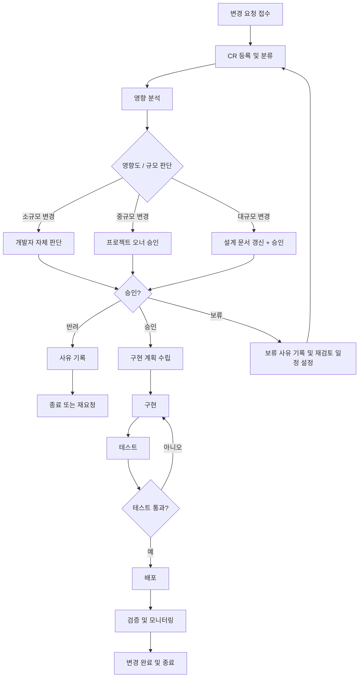

# 유지보수 계획서 (Maintenance Plan)

| 항목 | 내용 |
|------|------|
| **프로젝트명** | TrainBot — 김천구미↔동탄 주간 예매 어시스턴트 |
| **문서 번호** | MP-TRAINBOT-v1.0 |
| **문서 버전** | v1.0 |
| **작성일** | 2026-03-02 |
| **작성자** | 프로젝트 오너 |
| **승인자** | 프로젝트 오너 |
| **유지보수 기간** | 2026-04-01 ~ 2027-03-31 (1년) |

---

## 1. 유지보수 유형 정의

### 1.1 유지보수 유형 분류

#### 수정 유지보수 (Corrective Maintenance)

| 항목 | 내용 |
|------|------|
| **정의** | 운영 중 발견된 결함(버그)을 수정하는 활동 |
| **목적** | 시스템의 정상 동작을 복구하고 사용자에게 미치는 영향을 최소화 |
| **트리거** | 사용자 보고, 로그 모니터링, 텔레그램 알림 실패 감지 |
| **우선순위** | 결함 심각도에 따라 즉시 ~ 차기 릴리스 |

**예시**:
- 추천 엔진 스코어링 오류로 직행 우선 정렬이 깨지는 버그 수정
- 특정 요일의 earliest_after 설정이 반영되지 않는 오류
- 텔레그램 dedupe 해시 충돌로 알림이 누락되는 버그
- 주간 캘린더 상태 전이(SEARCHING→NEEDED) 롤백 실패

#### 적응 유지보수 (Adaptive Maintenance)

| 항목 | 내용 |
|------|------|
| **정의** | 변화하는 환경(OS, 브라우저, 라이브러리, 외부 API 등)에 시스템을 적응시키는 활동 |
| **목적** | 변경된 환경에서도 시스템이 정상적으로 동작하도록 보장 |
| **트리거** | 외부 환경 변화 (Node.js LTS 변경, SRT/KTX API 변경, NAS OS 업데이트 등) |
| **우선순위** | 환경 변화 시점 및 영향도에 따라 결정 |

**예시**:
- SRT/KTX 열차 조회 API 응답 형식 변경 대응
- 카카오 OAuth API 버전 업그레이드 대응
- Node.js LTS 메이저 버전 업그레이드 (18 → 20 → 22)
- NAS DSM (Synology OS) Docker 엔진 업데이트 대응
- 의존성 패키지 보안 패치 적용 (express, better-sqlite3 등)
- Chrome/Safari 브라우저 호환성 이슈 대응

#### 완전 유지보수 (Perfective Maintenance)

| 항목 | 내용 |
|------|------|
| **정의** | 사용자 요구사항 변경이나 기능 개선을 통해 시스템을 향상시키는 활동 |
| **목적** | 사용자 만족도 향상 및 사용 편의성 증대 |
| **트리거** | 사용자 피드백, 새로운 요구, 운영 경험 |
| **우선순위** | 비즈니스 가치 및 사용자 영향도에 따라 결정 |

**예시**:
- 추천 스코어링 가중치 파인튜닝 (운영 데이터 기반)
- 캘린더 뷰 UX 개선 (드래그&드롭 상태 변경)
- 텔레그램 알림 포맷 개선 (이모지, 요약 통계 추가)
- 다크 모드 지원
- v2 기능: 캘린더 자동 등록, 지능형 추천 고도화

#### 예방 유지보수 (Preventive Maintenance)

| 항목 | 내용 |
|------|------|
| **정의** | 잠재적 문제를 사전에 식별하고 예방하기 위한 활동 |
| **목적** | 시스템 안정성 확보 및 장애 예방 |
| **트리거** | 정기 점검, 기술 부채 검토, 보안 감사 |
| **우선순위** | 위험도 및 영향도에 따라 결정 |

**예시**:
- SQLite DB 파일 크기 모니터링 및 VACUUM 실행
- audit_logs / dedupe 테이블 오래된 데이터 정리
- 의존성 패키지 정기 업데이트 (`npm audit`)
- Docker 이미지 정기 재빌드 (베이스 이미지 패치 적용)
- 백업 파일 무결성 정기 검증
- 로그 파일 로테이션 및 디스크 사용량 점검

### 1.2 유지보수 유형별 비율 목표

| 유지보수 유형 | 목표 비율 | 비고 |
|-------------|-----------|------|
| 수정 (Corrective) | 15% | 초기 안정화 후 점진적 감소 목표 |
| 적응 (Adaptive) | 25% | SRT/KTX API 변경이 가장 빈번한 외부 요인 |
| 완전 (Perfective) | 35% | 운영 경험 기반 개선에 가장 큰 투자 |
| 예방 (Preventive) | 25% | SQLite 관리, 보안 패치가 핵심 |

---

## 2. 변경 요청(CR) 프로세스

### 2.1 CR 프로세스 흐름도



> **TrainBot 특성**: 1~2인 소규모 팀이므로 CCB(변경통제위원회) 대신 개발자-프로젝트 오너 간 직접 협의로 운영한다.

### 2.2 CR 양식 템플릿

---

#### 변경 요청서 (Change Request)

| 항목 | 내용 |
|------|------|
| **CR-ID** | CR-[YYYY]-[NNNN] |
| **요청일** | [YYYY-MM-DD] |
| **요청자** | [요청자명] |
| **유형** | [ ] 수정 / [ ] 적응 / [ ] 완전 / [ ] 예방 |
| **우선순위** | [ ] 긴급 / [ ] 높음 / [ ] 보통 / [ ] 낮음 |
| **희망 완료일** | [YYYY-MM-DD] |

**변경 설명**:

| 항목 | 내용 |
|------|------|
| 현재 상황 | [현재 시스템 동작/상태 기술] |
| 변경 요청 내용 | [원하는 변경 사항 상세 기술] |
| 변경 사유 | [왜 이 변경이 필요한지 기술] |
| 비즈니스 영향 | [이 변경이 운영에 미치는 영향] |
| 첨부 자료 | [스크린샷, 로그, 참조 문서 등] |

**승인 이력**:

| 단계 | 승인자 | 결정 | 일자 | 비고 |
|------|--------|------|------|------|
| 접수 | 개발자 | 접수 완료 | [YYYY-MM-DD] | |
| 영향 분석 | 개발자 | 분석 완료 | [YYYY-MM-DD] | |
| 승인 | 프로젝트 오너 | [ ] 승인 / [ ] 반려 / [ ] 보류 | [YYYY-MM-DD] | [사유] |

---

### 2.3 영향 분석 템플릿

---

#### 변경 영향 분석서

| 항목 | 내용 |
|------|------|
| **CR-ID** | CR-[YYYY]-[NNNN] |
| **분석일** | [YYYY-MM-DD] |
| **분석자** | 개발자 |

**기술적 영향 분석**:

| 영향 범위 | 영향 내용 | 영향도 |
|-----------|----------|--------|
| 소스 코드 | [변경 필요한 모듈/파일 목록] | [높음/중간/낮음] |
| 데이터베이스 | [스키마/마이그레이션 변경 사항] | [높음/중간/낮음] |
| API | [엔드포인트 변경 사항] | [높음/중간/낮음] |
| UI/UX | [화면 변경 사항] | [높음/중간/낮음] |
| 외부 연동 | [SRT/KTX/카카오/텔레그램 영향] | [높음/중간/낮음] |
| Docker 설정 | [Dockerfile, docker-compose 변경] | [높음/중간/낮음] |

**리소스 산정**:

| 항목 | 산정 |
|------|------|
| 개발 공수 | [N] 시간 |
| 테스트 공수 | [N] 시간 |
| 예상 소요 기간 | [N] 영업일 |

---

### 2.4 승인 기준

| 변경 규모 | 판단 기준 | 승인 권한 | 소요 시간 |
|-----------|-----------|-----------|-----------|
| **소규모** | 공수 4시간 이하, 단일 모듈, 설정 변경 | 개발자 자체 판단 | 즉시 |
| **중규모** | 공수 4시간~2일, 복수 모듈, API 변경 | 프로젝트 오너 승인 | 1영업일 |
| **대규모** | 공수 2일 초과, DB 스키마 변경, 아키텍처 변경 | 프로젝트 오너 + 설계 문서 갱신 | 3영업일 |
| **긴급** | 서비스 중단, 보안 취약점 | 개발자 즉시 대응 (사후 보고) | 즉시 |

---

## 3. SLA 정의

### 3.1 장애 등급별 대응/복구 시간 목표

| 장애 등급 | 정의 | 대응 시간 | 복구 시간 | 근본 원인 분석 |
|-----------|------|-----------|-----------|---------------|
| **Critical (P1)** | 전체 서비스 중단, 컨테이너 다운, DB 손상 | 1시간 | 4시간 | 3영업일 |
| **Major (P2)** | 주요 기능 장애 (검색 불가, 알림 실패), 심각한 성능 저하 | 4시간 | 12시간 | 5영업일 |
| **Minor (P3)** | 부가 기능 장애 (감사 로그 미기록), 경미한 UI 오류 | 1영업일 | 3영업일 | 10영업일 |
| **Low (P4)** | 사용에 영향 없는 경미한 문제, 개선 사항 | 3영업일 | 다음 릴리스 | 필요 시 |

> **대응 시간**: 장애 인지 후 담당자가 분석에 착수하기까지의 시간
> **복구 시간**: 장애 인지 후 서비스가 정상 운영 상태로 복구되기까지의 시간

### 3.2 가용성 목표

| 항목 | 목표 | 허용 다운타임 | 비고 |
|------|------|-------------|------|
| **서비스 가용성** | 99.0% | 월 7.3시간 / 연 87.6시간 | 개인용 NAS 환경 고려 |
| **핵심 기능 가용성** | 99.5% | 월 3.6시간 / 연 43.8시간 | 검색/추천/알림 |
| **스케줄 실행 가용성** | 99.0% | 월 7.3시간 | 크론 기반 자동 실행 |

**가용성 산정 기준**:
- 측정 기간: 월간 (매월 1일~말일)
- 측정 방법: Docker healthcheck + 로그 기반 자체 모니터링
- 제외 항목: NAS 전원 장애, ISP 인터넷 장애, 계획된 업데이트

### 3.3 SLA 위반 시 에스컬레이션

| 위반 수준 | 조건 | 알림 방법 | 조치 사항 |
|-----------|------|-----------|-----------|
| Level 1 | 대응 시간 목표 초과 | 텔레그램 알림 → 개발자 | 즉시 원인 조사 착수 |
| Level 2 | 복구 시간 목표의 50% 경과 | 텔레그램 + 직접 연락 | 롤백 검토, 대안 모색 |
| Level 3 | 복구 시간 목표 초과 | 프로젝트 오너 직접 보고 | 비상 대책, 임시 우회 |

> **TrainBot 특성**: 개인용 서비스이므로 SLA 위반 시 외부 보상 대신 자체 개선 보고서를 작성한다.

---

## 4. 기술 부채 관리

### 4.1 기술 부채 분류

| 분류 | 설명 | 예시 | 영향 |
|------|------|------|------|
| **코드 부채** | 코드 품질 저하, 복잡도 증가 | 하드코딩된 역 이름, 스코어링 매직 넘버, 긴 함수 | 유지보수 비용 증가 |
| **아키텍처 부채** | 부적절한 설계, 확장성 제한 | Layered Monolith 한계, 플러그인 인터페이스 미완성 | 확장 어려움 |
| **테스트 부채** | 테스트 부족, 테스트 품질 저하 | 환승 경로 조합 테스트 부족, E2E 테스트 미비 | 회귀 버그 위험 |
| **문서 부채** | 문서 부재 또는 오래된 문서 | API 변경 후 문서 미갱신, 운영 매뉴얼 미갱신 | 운영 실수 |
| **인프라 부채** | 인프라 설정 관리 부재 | 수동 Docker 빌드, 모니터링 자동화 미비 | 운영 실수, 복구 지연 |

### 4.2 기술 부채 등록 템플릿

---

#### 기술 부채 등록서

| 항목 | 내용 |
|------|------|
| **TD-ID** | TD-[NNNN] |
| **등록일** | [YYYY-MM-DD] |
| **등록자** | [등록자명] |
| **분류** | [ ] 코드 / [ ] 아키텍처 / [ ] 테스트 / [ ] 문서 / [ ] 인프라 |
| **위치** | [파일/모듈/시스템 위치] |
| **심각도** | [ ] 높음 / [ ] 중간 / [ ] 낮음 |

**부채 내용**:

| 항목 | 내용 |
|------|------|
| 현재 상태 | [현재 코드/시스템의 문제점 기술] |
| 발생 원인 | [기술 부채가 발생하게 된 배경/원인] |
| 영향 범위 | [이 부채로 인해 영향 받는 범위] |
| 개선 방안 | [개선 방법 기술] |
| 예상 공수 | [N] 시간 |
| 비용 (방치 시) | [방치할 경우 지속적으로 발생하는 비용/영향] |

---

### 4.3 초기 기술 부채 현황 (v1.0 릴리스 시점)

| TD-ID | 분류 | 위치 | 부채 내용 | 심각도 | 예상 공수 | 해소 시기 |
|-------|------|------|-----------|--------|-----------|-----------|
| TD-001 | 테스트 | 전체 | E2E 테스트(Playwright) 미작성 — 시스템 테스트 자동화 부재 | 중간 | 16시간 | Q1 |
| TD-002 | 아키텍처 | auto 플러그인 | 자동예매 플러그인 인터페이스 미완성 (FR-013 P2) | 낮음 | 24시간 | Q2 |
| TD-003 | 인프라 | 배포 | CI/CD 파이프라인 없음, 수동 Docker 빌드/배포 | 중간 | 8시간 | Q1 |
| TD-004 | 코드 | 추천 엔진 | 스코어링 가중치 하드코딩, 설정 파일 분리 필요 | 낮음 | 4시간 | Q1 |
| TD-005 | 문서 | API | OpenAPI Spec 자동 생성 미설정, 수동 관리 중 | 낮음 | 4시간 | Q2 |
| TD-006 | 테스트 | 환승 엔진 | 환승 경로 조합 edge case 커버리지 부족 | 중간 | 8시간 | Q1 |

### 4.4 기술 부채 해소 계획

| 분기 | 해소 대상 | 분류 | 예상 공수 | 담당 | 상태 |
|------|-----------|------|-----------|------|------|
| Q1 | TD-001 | 테스트 | 16시간 | 개발자 | 예정 |
| Q1 | TD-003 | 인프라 | 8시간 | 개발자 | 예정 |
| Q1 | TD-004 | 코드 | 4시간 | 개발자 | 예정 |
| Q1 | TD-006 | 테스트 | 8시간 | 개발자 | 예정 |
| Q2 | TD-002 | 아키텍처 | 24시간 | 개발자 | 예정 |
| Q2 | TD-005 | 문서 | 4시간 | 개발자 | 예정 |

**기술 부채 관리 원칙**:
- 매 릴리스마다 전체 공수의 20%를 기술 부채 해소에 할당
- 월별 기술 부채 현황 검토 및 우선순위 재조정
- Critical 수준의 기술 부채는 발견 즉시 해소 계획 수립
- 새로운 기술 부채 발생 시 즉시 TD-ID 부여하여 등록

---

## 5. 인수인계 문서 템플릿

> 유지보수 주체 변경 시 (개발자 변경, 외부 협력 등) 아래 내용을 기반으로 인수인계 문서를 작성합니다.

### 5.1 시스템 구성도

```
TrainBot 시스템 구성도:

인프라 레이어:
  └─ NAS (Synology) — Docker Host
      ├─ Docker Container (trainbot:latest)
      │   ├─ Frontend: React 18+ (Vite, Tailwind CSS)
      │   ├─ Backend: Node.js/Express (TypeScript)
      │   ├─ Scheduler: node-cron
      │   └─ Port: 3100
      ├─ Volume Mount: /data
      │   ├─ trainbot.db (SQLite WAL mode)
      │   ├─ .env.credentials (파일 권한 600)
      │   ├─ logs/ (winston 로그)
      │   └─ backups/ (DB 백업)
      └─ 네트워크: host 또는 bridge mode

외부 연동:
  ├─ SRT 열차 조회 API
  ├─ KTX 열차 조회 API
  ├─ 카카오 OAuth API
  └─ Telegram Bot API
```

> **참고**: 상세 아키텍처는 SAD-TRAINBOT-v1.0.md 참조

**소스 코드 저장소**:

| 저장소 | 위치 | 설명 | 브랜치 전략 |
|--------|------|------|-------------|
| 메인 애플리케이션 | (로컬 또는 GitHub) | 프론트엔드 + 백엔드 모노레포 | main 브랜치 |
| 문서 | /docs 디렉토리 | 워터폴 산출물 전체 | main 브랜치 |

### 5.2 계정/접근 권한 목록

| 서비스 | 계정/역할 | 접근 범위 | 관리 담당자 | 비고 |
|--------|-----------|-----------|-------------|------|
| NAS SSH | admin | Docker 관리, 파일 접근 | 프로젝트 오너 | |
| Docker Registry | (없음 — 로컬 빌드) | 이미지 빌드/관리 | 개발자 | |
| 카카오 개발자 콘솔 | (앱 관리자) | OAuth 앱 설정 | 프로젝트 오너 | REST API 키 관리 |
| Telegram BotFather | (봇 소유자) | 봇 토큰 관리 | 프로젝트 오너 | |
| SQLite DB | (파일 접근) | 데이터 직접 조회/수정 | 개발자 | /data/trainbot.db |
| 시스템 환경변수 | .env 파일 | 서버 설정 | 개발자 | |
| 민감정보 파일 | .env.credentials | 예매 계정/결제 정보 | 프로젝트 오너 | 파일 권한 600 |

> **주의**: 인수인계 완료 후 카카오 OAuth, Telegram Bot 토큰을 필요 시 재발급한다.

### 5.3 정기 작업 일정

| 작업 | 주기 | 시간 | 담당 | 자동화 | 상세 가이드 |
|------|------|------|------|--------|-------------|
| DB 백업 확인 | 일별 | 02:30 | 자동 | NAS 작업 스케줄러 | OG 5.1 참조 |
| 로그 파일 확인 | 주 1회 | 월요일 | 개발자 | 수동 | OG 4.2 참조 |
| audit_logs 정리 | 월 1회 | 1일 | 수동 | SQL 스크립트 | OG 7.1 참조 |
| dedupe 테이블 정리 | 월 1회 | 1일 | 수동 | SQL 스크립트 | OG 7.1 참조 |
| npm audit 보안 점검 | 월 1회 | 15일 | 개발자 | 수동 | |
| Docker 이미지 재빌드 | 분기 1회 | 분기 초 | 개발자 | 수동 | DP 3.2 참조 |
| 백업 복원 테스트 | 분기 1회 | 분기 초 | 개발자 | 수동 | OG 5.3 참조 |
| SQLite VACUUM | 분기 1회 | 분기 초 | 수동 | SQL 명령 | |
| NAS 디스크 사용량 확인 | 월 1회 | 1일 | 프로젝트 오너 | NAS 모니터링 | |

### 5.4 알려진 이슈 목록

| ID | 이슈 | 심각도 | 영향 | 우회 방법 | 해결 계획 |
|----|------|--------|------|-----------|-----------|
| KI-001 | SRT/KTX API가 비공식이므로 예고 없이 변경될 수 있음 | 높음 | 검색 실패 | 수동으로 API 응답 구조 업데이트 | Adapter 패턴으로 변경 영향 최소화 |
| KI-002 | SQLite WAL 모드에서 동시 쓰기 제한 | 낮음 | 최대 4인 동시 접속 시 가끔 BUSY 에러 | 자동 재시도 로직 적용 | busy_timeout 튜닝 |
| KI-003 | NAS Docker 환경에서 파일 시스템 성능 제한 | 낮음 | DB 쿼리 응답 1초 이상 가능 | 인덱스 최적화 | SSD NAS 권장 |
| KI-004 | 자동예매(FR-013) 플러그인 미완성 | 낮음 | auto 모드 사용 불가 | assist 모드로 운영 | v1.1에서 구현 예정 |

**운영 주의 사항**:

| 항목 | 내용 |
|------|------|
| 스케줄 실행 시간 | 주중 저녁~야간 스케줄 실행 시 SRT/KTX API 응답 지연 가능 |
| NAS 전원 | NAS 재시작 시 Docker 컨테이너 자동 시작 확인 필요 (restart: unless-stopped) |
| 디스크 공간 | /data 볼륨 최소 500MB 여유 공간 유지 |
| 세션 만료 | express-session 기본 24시간 만료, 장기 미사용 시 재로그인 필요 |

### 5.5 긴급 연락처

| 역할 | 담당자 | 연락처 | 비고 |
|------|--------|--------|------|
| 프로젝트 오너 / 관리자 | [성명] | Telegram / 전화 | 1차 연락 |
| 개발자 | [성명] | Telegram / 전화 | 기술 이슈 |
| NAS 관리 | 프로젝트 오너 | - | NAS 하드웨어/네트워크 |
| 카카오 기술 지원 | - | https://devtalk.kakao.com | OAuth 이슈 |
| Telegram Bot 지원 | - | https://core.telegram.org/bots | Bot API 이슈 |

---

## 부록

### A. 유지보수 보고서 양식

| 항목 | 내용 |
|------|------|
| 보고 기간 | [YYYY-MM] |
| 작성자 | 개발자 |
| 작성일 | [YYYY-MM-DD] |

| 지표 | 수치 | 목표 | 달성 여부 |
|------|------|------|-----------|
| 서비스 가용성 | [N]% | 99.0% | [달성/미달] |
| P1 장애 건수 | [N]건 | 0건 | [달성/미달] |
| P1 평균 복구 시간 | [N]시간 | 4시간 | [달성/미달] |
| CR 처리 건수 | [N]건 | - | - |
| 기술 부채 해소 | [N]건 / [N]시간 | - | - |
| 배포 횟수 | [N]회 | - | - |
| 스케줄 실행 성공률 | [N]% | 95% | [달성/미달] |

### B. 버전 관리 정책

| 항목 | 규칙 |
|------|------|
| 버전 형식 | Semantic Versioning (MAJOR.MINOR.PATCH) |
| MAJOR | 호환되지 않는 API 변경, DB 스키마 대규모 변경 |
| MINOR | 하위 호환 기능 추가 (FR 추가) |
| PATCH | 버그 수정, 보안 패치 |
| 태그 | Git 태그: `v1.0.0`, `v1.1.0`, ... |
| 릴리스 노트 | 매 배포 시 CHANGELOG.md 또는 배포계획서에 기록 |

### C. 승인

| 역할 | 성명 | 서명 | 일자 |
|------|------|------|------|
| 프로젝트 오너 | | | [YYYY-MM-DD] |
| 개발자 | | | [YYYY-MM-DD] |
