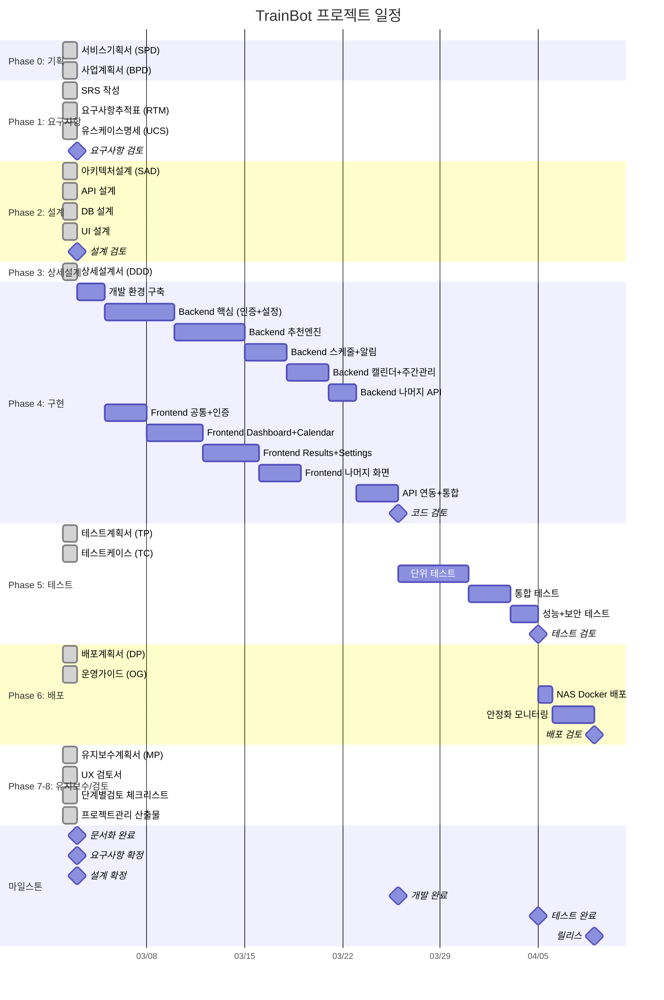
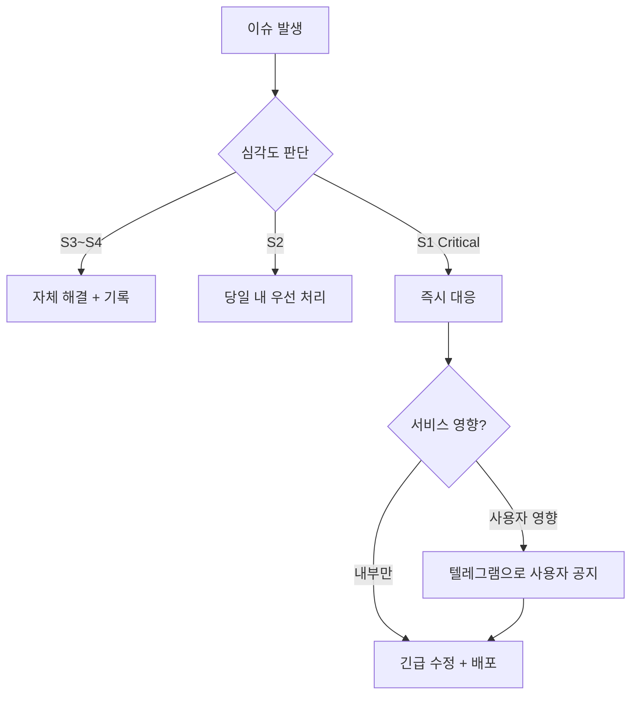
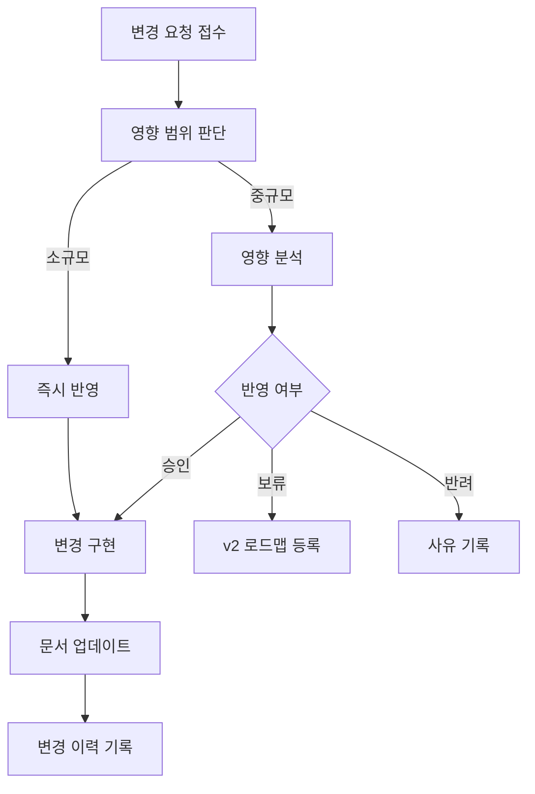

# 프로젝트 관리 산출물 (Project Management Artifacts)

> **프로젝트명:** TrainBot — 김천구미↔동탄 주간 예매 어시스턴트
> **문서 번호:** PM-TRAINBOT-v1.0
> **작성일:** 2026-03-02
> **작성자:** 프로젝트 오너

---

## 목차

1. [WBS (Work Breakdown Structure)](#1-wbs-work-breakdown-structure)
2. [위험 관리 대장 (Risk Register)](#2-위험-관리-대장-risk-register)
3. [커뮤니케이션 계획](#3-커뮤니케이션-계획)
4. [변경 관리 계획](#4-변경-관리-계획)
5. [프로젝트 완료 보고서](#5-프로젝트-완료-보고서)
6. [부록: 산출물 목록](#부록-산출물-목록)

---

## 1. WBS (Work Breakdown Structure)

### 1.1 WBS 작성 원칙

| 원칙 | TrainBot 적용 |
|------|--------------|
| 100% Rule | 문서화 ~ 배포/운영까지 전체 범위 포함 |
| 상호 배타성 | 각 작업 패키지가 중복되지 않음 |
| 결과물 기반 | 산출물(문서, 코드, 테스트 결과) 중심 분해 |
| 8/80 Rule | 1일~2주 단위로 추정 가능한 크기 |
| 1인 개발 고려 | 순차적 실행 (병렬화 제한적) |

### 1.2 프로젝트 일정 (Gantt Chart)

### 1.3 WBS 상세 테이블

| WBS-ID | 작업명 | 기간 | 담당자 | 상태 | 산출물 |
|--------|--------|:----:|--------|------|--------|
| **0** | **Phase 0: 기획** | | | | |
| 0.1 | 서비스기획서 작성 | 1d | 프로젝트 오너 | Completed | SPD-TRAINBOT-v1.0.md |
| 0.2 | 사업계획서 작성 | 1d | 프로젝트 오너 | Completed | BPD-TRAINBOT-v1.0.md |
| **1** | **Phase 1: 요구사항 분석** | | | | |
| 1.1 | SRS 작성 (v1.0→v1.3) | 1d | 프로젝트 오너 | Completed | SRS-TRAINBOT-v1.0.md |
| 1.2 | 요구사항 추적표 | 1d | 프로젝트 오너 | Completed | RTM-TRAINBOT-v1.0.md |
| 1.3 | 유스케이스 명세 | 1d | 프로젝트 오너 | Completed | UCS-TRAINBOT-v1.0.md |
| **2** | **Phase 2: 시스템 설계** | | | | |
| 2.1 | 아키텍처 설계 (SAD) | 1d | 프로젝트 오너 | Completed | SAD-TRAINBOT-v1.0.md |
| 2.2 | API 설계 | 1d | 프로젝트 오너 | Completed | API-TRAINBOT-v1.0.md |
| 2.3 | DB 설계 | 1d | 프로젝트 오너 | Completed | DB-TRAINBOT-v1.0.md |
| 2.4 | UI 설계 | 1d | 프로젝트 오너 | Completed | UI-TRAINBOT-v1.0.md |
| **3** | **Phase 3: 상세 설계** | | | | |
| 3.1 | 상세 설계서 (DDD) | 1d | 프로젝트 오너 | Completed | DDD-TRAINBOT-v1.0.md |
| **4** | **Phase 4: 구현** | | | | |
| 4.0 | 개발 환경 구축 | 2d | 프로젝트 오너 | Not Started | 프로젝트 초기 설정 |
| 4.1 | Backend: 인증/세션 | 5d | 프로젝트 오너 | Not Started | 소스 코드 |
| 4.1.1 | Kakao OAuth 연동 | 2d | 프로젝트 오너 | Not Started | auth 모듈 |
| 4.1.2 | express-session 설정 | 1d | 프로젝트 오너 | Not Started | session 설정 |
| 4.1.3 | RBAC 미들웨어 | 1d | 프로젝트 오너 | Not Started | middleware |
| 4.1.4 | 사용자 관리 API | 1d | 프로젝트 오너 | Not Started | user 모듈 |
| 4.2 | Backend: 추천 엔진 | 5d | 프로젝트 오너 | Not Started | 소스 코드 |
| 4.2.1 | SRT 직행 검색 | 2d | 프로젝트 오너 | Not Started | recommend 모듈 |
| 4.2.2 | KTX 환승 검색 | 2d | 프로젝트 오너 | Not Started | recommend 모듈 |
| 4.2.3 | 스코어링/정렬 | 1d | 프로젝트 오너 | Not Started | scoring 모듈 |
| 4.3 | Backend: 스케줄+알림 | 3d | 프로젝트 오너 | Not Started | 소스 코드 |
| 4.3.1 | node-cron 스케줄러 | 1d | 프로젝트 오너 | Not Started | schedule 모듈 |
| 4.3.2 | Telegram 발송 + dedupe | 1d | 프로젝트 오너 | Not Started | notification 모듈 |
| 4.3.3 | 수동 실행 API | 1d | 프로젝트 오너 | Not Started | run 모듈 |
| 4.4 | Backend: 캘린더+주간관리 | 3d | 프로젝트 오너 | Not Started | 소스 코드 |
| 4.4.1 | week_plans CRUD | 1d | 프로젝트 오너 | Not Started | weekPlan 모듈 |
| 4.4.2 | 상태 전이 로직 | 1d | 프로젝트 오너 | Not Started | weekPlan 서비스 |
| 4.4.3 | 검색 연동 | 1d | 프로젝트 오너 | Not Started | weekPlan 연동 |
| 4.5 | Backend: 설정+감사+자격증명 | 2d | 프로젝트 오너 | Not Started | 소스 코드 |
| 4.5.1 | config API | 0.5d | 프로젝트 오너 | Not Started | config 모듈 |
| 4.5.2 | audit_logs API | 0.5d | 프로젝트 오너 | Not Started | audit 모듈 |
| 4.5.3 | credentials API (.env.credentials) | 1d | 프로젝트 오너 | Not Started | credential 모듈 |
| 4.6 | Frontend: 공통+인증 | 3d | 프로젝트 오너 | Not Started | 소스 코드 |
| 4.6.1 | Vite + React 18 + Tailwind 설정 | 0.5d | 프로젝트 오너 | Not Started | 프로젝트 설정 |
| 4.6.2 | 공통 레이아웃 (사이드바, 헤더) | 1d | 프로젝트 오너 | Not Started | Layout 컴포넌트 |
| 4.6.3 | Zustand 스토어 설정 | 0.5d | 프로젝트 오너 | Not Started | stores |
| 4.6.4 | 로그인 페이지 + 인증 가드 | 1d | 프로젝트 오너 | Not Started | Auth 컴포넌트 |
| 4.7 | Frontend: Dashboard + Calendar | 4d | 프로젝트 오너 | Not Started | 소스 코드 |
| 4.7.1 | SCR-01 Dashboard | 2d | 프로젝트 오너 | Not Started | Dashboard 페이지 |
| 4.7.2 | SCR-02 Calendar | 2d | 프로젝트 오너 | Not Started | Calendar 페이지 |
| 4.8 | Frontend: Results + Settings | 4d | 프로젝트 오너 | Not Started | 소스 코드 |
| 4.8.1 | SCR-03 Results | 2d | 프로젝트 오너 | Not Started | Results 페이지 |
| 4.8.2 | SCR-04 Settings | 2d | 프로젝트 오너 | Not Started | Settings 페이지 |
| 4.9 | Frontend: 나머지 화면 | 3d | 프로젝트 오너 | Not Started | 소스 코드 |
| 4.9.1 | SCR-05 Schedule | 1d | 프로젝트 오너 | Not Started | Schedule 페이지 |
| 4.9.2 | SCR-06 Logs | 0.5d | 프로젝트 오너 | Not Started | Logs 페이지 |
| 4.9.3 | SCR-07 Safety | 1d | 프로젝트 오너 | Not Started | Safety 페이지 |
| 4.9.4 | SCR-08 Admin:Users | 0.5d | 프로젝트 오너 | Not Started | Admin 페이지 |
| 4.10 | API 연동 + 통합 | 3d | 프로젝트 오너 | Not Started | 통합 빌드 |
| **5** | **Phase 5: 테스트** | | | | |
| 5.1 | 테스트 계획서 작성 | 1d | 프로젝트 오너 | Completed | TP-TRAINBOT-v1.0.md |
| 5.2 | 테스트 케이스 작성 | 1d | 프로젝트 오너 | Completed | TC-TRAINBOT-v1.0.md |
| 5.3 | 단위 테스트 구현 | 5d | 프로젝트 오너 | Not Started | Vitest 테스트 코드 |
| 5.4 | 통합 테스트 구현 | 3d | 프로젝트 오너 | Not Started | Supertest 테스트 코드 |
| 5.5 | 성능+보안 테스트 | 2d | 프로젝트 오너 | Not Started | k6 시나리오, 보안 체크 |
| 5.6 | 테스트 결과 보고서 | 1d | 프로젝트 오너 | Not Started | TR-TRAINBOT-v1.0.md |
| **6** | **Phase 6: 배포** | | | | |
| 6.1 | 배포 계획서 작성 | 1d | 프로젝트 오너 | Completed | DP-TRAINBOT-v1.0.md |
| 6.2 | 운영 가이드 작성 | 1d | 프로젝트 오너 | Completed | OG-TRAINBOT-v1.0.md |
| 6.3 | NAS Docker 배포 | 1d | 프로젝트 오너 | Not Started | Docker 컨테이너 |
| 6.4 | 안정화 모니터링 | 3d | 프로젝트 오너 | Not Started | 모니터링 결과 |
| **7** | **Phase 7: 유지보수** | | | | |
| 7.1 | 유지보수 계획서 | 1d | 프로젝트 오너 | Completed | MP-TRAINBOT-v1.0.md |
| **8** | **Phase 8: 검토** | | | | |
| 8.1 | UX 검토서 | 1d | 프로젝트 오너 | Completed | UXR-TRAINBOT-v1.0.md |
| 8.2 | 단계별 검토 체크리스트 | 1d | 프로젝트 오너 | Completed | RC-TRAINBOT-v1.0.md |
| 8.3 | 프로젝트 관리 산출물 | 1d | 프로젝트 오너 | Completed | PM-TRAINBOT-v1.0.md |

> **상태 값:** Not Started / In Progress / Completed / On Hold / Cancelled

---

## 2. 위험 관리 대장 (Risk Register)

### 2.1 위험 평가 매트릭스

**확률 (Probability)**

| 등급 | 수치 | 설명 |
|------|:----:|------|
| 매우 낮음 | 1 | 발생 가능성 10% 미만 |
| 낮음 | 2 | 발생 가능성 10~30% |
| 보통 | 3 | 발생 가능성 30~50% |
| 높음 | 4 | 발생 가능성 50~70% |
| 매우 높음 | 5 | 발생 가능성 70% 초과 |

**영향 (Impact)**

| 등급 | 수치 | 설명 |
|------|:----:|------|
| 매우 낮음 | 1 | 프로젝트에 미미한 영향 |
| 낮음 | 2 | 일부 작업에 경미한 지연 |
| 보통 | 3 | 마일스톤 지연 |
| 높음 | 4 | 주요 기능 영향 |
| 매우 높음 | 5 | 프로젝트 실패 가능성 |

**위험도 = 확률 x 영향**

|  | 영향 1 | 영향 2 | 영향 3 | 영향 4 | 영향 5 |
|:-:|:------:|:------:|:------:|:------:|:------:|
| **확률 5** | 5 | 10 | 15 | 20 | **25** |
| **확률 4** | 4 | 8 | 12 | **16** | 20 |
| **확률 3** | 3 | 6 | 9 | 12 | 15 |
| **확률 2** | 2 | 4 | 6 | 8 | 10 |
| **확률 1** | 1 | 2 | 3 | 4 | 5 |

> **위험도 등급:** 낮음(1~4) / 보통(5~9) / 높음(10~15) / 매우 높음(16~25)

### 2.2 위험 관리 테이블

| RISK-ID | 카테고리 | 위험 설명 | 확률 | 영향 | 위험도 | 대응 전략 | 대응 계획 | 상태 |
|---------|----------|-----------|:----:|:----:|:------:|-----------|-----------|------|
| RSK-001 | 기술/외부 | SRT/KTX 열차 조회 API가 비공식이며 언제든 차단/변경될 수 있음 | 4 | 4 | **16** | 완화 | Adapter 패턴으로 API 계층 분리, 대안 API 조사, Mock 기반 테스트 | Open |
| RSK-002 | 리소스 | 1인 개발로 일정 지연 위험 (번아웃, 본업 병행) | 4 | 3 | **12** | 완화 | MVP 범위 엄격 관리, P1 필수 기능 우선, 여유 버퍼 20% | Open |
| RSK-003 | 기술 | NAS 하드웨어 장애 시 서비스 및 데이터 손실 | 2 | 5 | **10** | 완화 | SQLite 일일 자동 백업, /data 볼륨 외부 백업, Docker 이미지 레지스트리 보관 | Open |
| RSK-004 | 보안 | 결제 수단 민감정보(.env.credentials) 유출 위험 | 2 | 5 | **10** | 완화 | 파일 권한 600, Docker 이미지에 미포함, 로그/DB 저장 금지, Admin 전용 | Open |
| RSK-005 | 기술 | SQLite 동시 쓰기 제한으로 스케줄+수동 실행 충돌 | 3 | 3 | **9** | 완화 | WAL 모드 활성화, 실행 락(NFR-010) 구현, 동시 요청 큐잉 | Open |
| RSK-006 | 외부 | 카카오 OAuth API 장애/정책 변경 | 2 | 4 | **8** | 완화 | 세션 유지로 빈번한 재인증 방지, 장기 세션 설정 | Open |
| RSK-007 | 외부 | Telegram Bot API 장애/레이트리밋 | 2 | 3 | **6** | 수용 | 재시도 로직, 발송 실패 시 UI에 표시하여 수동 재전송 가능 | Open |
| RSK-008 | 기술 | React/Node.js 의존성 보안 취약점 발견 | 3 | 2 | **6** | 완화 | npm audit 정기 수행, Dependabot 또는 수동 모니터링 | Open |
| RSK-009 | 비즈니스 | 요구사항 추가/변경으로 범위 증가 (Scope Creep) | 3 | 3 | **9** | 완화 | 변경 관리 프로세스 적용, P1 필수 기능 우선, v2 기능 명확히 분리 | Open |
| RSK-010 | 기술 | 스코어링 가중치 기본값이 실제 사용에서 부적합 | 3 | 2 | **6** | 수용 | Settings에서 가중치 조정 가능, 운영 중 튜닝 예정 | Open |

> **상태:** Open / In Progress / Mitigated / Closed / Occurred

---

## 3. 커뮤니케이션 계획

### 3.1 이해관계자 (2인 팀 + 사용자)

| 이해관계자 | 역할 | 관심도 | 영향력 | 커뮤니케이션 전략 |
|-----------|------|:------:|:------:|------------------|
| 프로젝트 오너 | 개발자, 관리자, PO 겸임 | 높음 | 높음 | 자체 관리 (개인 노트/문서) |
| 보조 리뷰어 (선택적) | 코드/문서 교차 검토 | 보통 | 낮음 | 필요 시 비동기 리뷰 요청 |
| 사용자 (최대 4명) | 서비스 이용 | 높음 | 보통 | 텔레그램 그룹 또는 개별 피드백 |

### 3.2 커뮤니케이션 매트릭스

| 대상 | 빈도 | 방법 | 주요 내용 |
|------|------|------|-----------|
| 자체 (개발 기록) | 매일 | 개인 노트/커밋 메시지 | 진행 현황, 이슈, 결정 사항 |
| 사용자 | 릴리스 시 | 텔레그램 공지 | 새 기능, 변경사항, 알려진 이슈 |
| 보조 리뷰어 | 필요 시 | 비동기 (GitHub PR/문서 공유) | 코드 리뷰, 설계 피드백 |

### 3.3 이슈 에스컬레이션

> 1인 개발 특성상 에스컬레이션 경로가 단순하며, 모든 의사결정을 프로젝트 오너가 직접 수행한다.

---

## 4. 변경 관리 계획

### 4.1 변경 요청 프로세스 (간소화)

> 1~2인 팀이므로 CCB(변경통제위원회) 없이, 프로젝트 오너가 직접 판단·승인한다.

### 4.2 변경 요청서 (CR) 템플릿

| 항목 | 내용 |
|------|------|
| **CR-ID** | CR-XXXX |
| **요청일** | YYYY-MM-DD |
| **변경 유형** | [ ] 요구사항 / [ ] 설계 / [ ] 범위 / [ ] 기타 |
| **우선순위** | [ ] 긴급 / [ ] 높음 / [ ] 보통 / [ ] 낮음 |
| **변경 제목** | |
| **현재 상태 (As-Is)** | |
| **요청 사항 (To-Be)** | |
| **변경 사유** | |
| **영향 받는 산출물** | |
| **결정** | [ ] 승인 / [ ] 보류 / [ ] 반려 |

### 4.3 변경 이력

| CR-ID | 요청일 | 변경 제목 | 영향 범위 | 결정 | 반영 |
|-------|--------|-----------|-----------|------|------|
| CR-0001 | 2026-03-02 | 검색 범위 설정 기능 추가 (FR-016, FR-017) | SRS, DB, API, UI | 승인 | SRS v1.1 반영 |
| CR-0002 | 2026-03-02 | 주간 캘린더 관리 추가 (FR-018) + 8페이지 체계 | SRS, DB, API, UI | 승인 | SRS v1.2 반영 |
| CR-0003 | 2026-03-02 | 결제 수단/계정 관리 추가 (FR-019) | SRS, API, UI | 승인 | SRS v1.3 반영 |

---

## 5. 프로젝트 완료 보고서

### 5.1 프로젝트 개요

| 항목 | 내용 |
|------|------|
| 프로젝트명 | TrainBot — 김천구미↔동탄 주간 예매 어시스턴트 |
| 프로젝트 기간 | 2026-03-02 ~ (진행 중) |
| 프로젝트 목표 | 주간 왕복 열차 추천/알림 자동화 |
| 투입 인원 | 1명 (프로젝트 오너) |
| 기술 스택 | React 18+, Node.js/TypeScript, SQLite, Docker |

### 5.2 주요 성과 (계획 vs 실적)

**마일스톤 현황:**

| 마일스톤 | 계획일 | 실적일 | 차이 | 사유 |
|----------|--------|--------|------|------|
| 문서화 완료 | 2026-03-03 | 2026-03-03 | 0 | - |
| 요구사항 확정 | | | | |
| 설계 확정 | | | | |
| 개발 완료 | | | | |
| 테스트 완료 | | | | |
| 릴리스 | | | | |

### 5.3 품질 지표 (목표)

| 지표 | 목표 | 실적 | 충족 여부 |
|------|------|------|-----------|
| Critical/Major 미해결 결함 | 0건 | | |
| 테스트 커버리지 | >= 80% | | |
| 테스트 통과율 | >= 95% | | |
| 154개 TC 실행율 | 100% | | |
| API 응답시간 | < 2초 | | |
| Docker 가용성 | >= 99.0% | | |

### 5.4 범위 달성 현황

| 요구사항 분류 | 계획 수 | 완료 수 | 이월 수 | 달성률 |
|--------------|:-------:|:-------:|:-------:|:------:|
| 기능 요구사항 (P1 필수) | 14 | | | |
| 기능 요구사항 (P2 권장) | 5 | | | |
| 비기능 요구사항 | 11 | | | |
| **합계** | **30** | | | |

### 5.5 교훈 (Lessons Learned)

| # | 분류 | 내용 | 원인 | 개선방안 |
|---|------|------|------|----------|
| 1 | | | | |
| 2 | | | | |

> 프로젝트 완료 시 기록한다.

### 5.6 프로젝트 종료 승인

| 역할 | 이름 | 서명 | 일자 |
|------|------|------|------|
| 프로젝트 오너 | | | |

---

## 부록: 산출물 목록

### 전체 산출물 (18개 문서)

| # | Phase | 문서 ID | 문서명 | 파일명 | 상태 |
|---|-------|---------|--------|--------|------|
| 1 | 00-기획 | SPD | 서비스기획서 | SPD-TRAINBOT-v1.0.md | Completed |
| 2 | 00-기획 | BPD | 사업계획서 | BPD-TRAINBOT-v1.0.md | Completed |
| 3 | 01-요구사항분석 | SRS | 소프트웨어 요구사항 명세서 | SRS-TRAINBOT-v1.0.md | Completed |
| 4 | 01-요구사항분석 | RTM | 요구사항 추적 매트릭스 | RTM-TRAINBOT-v1.0.md | Completed |
| 5 | 01-요구사항분석 | UCS | 유스케이스 명세서 | UCS-TRAINBOT-v1.0.md | Completed |
| 6 | 02-시스템설계 | SAD | 소프트웨어 아키텍처 설계서 | SAD-TRAINBOT-v1.0.md | Completed |
| 7 | 02-시스템설계 | API | API 설계서 | API-TRAINBOT-v1.0.md | Completed |
| 8 | 02-시스템설계 | DB | 데이터베이스 설계서 | DB-TRAINBOT-v1.0.md | Completed |
| 9 | 02-시스템설계 | UI | UI 설계서 | UI-TRAINBOT-v1.0.md | Completed |
| 10 | 03-상세설계 | DDD | 상세 설계서 | DDD-TRAINBOT-v1.0.md | Completed |
| 11 | 05-테스트 | TP | 테스트 계획서 | TP-TRAINBOT-v1.0.md | Completed |
| 12 | 05-테스트 | TC | 테스트 케이스 명세서 | TC-TRAINBOT-v1.0.md | Completed |
| 13 | 06-배포 | DP | 배포 계획서 | DP-TRAINBOT-v1.0.md | Completed |
| 14 | 06-배포 | OG | 운영 가이드 | OG-TRAINBOT-v1.0.md | Completed |
| 15 | 07-유지보수 | MP | 유지보수 계획서 | MP-TRAINBOT-v1.0.md | Completed |
| 16 | 08-검토 | UXR | UX 검토서 | UXR-TRAINBOT-v1.0.md | Completed |
| 17 | 08-검토 | RC | 단계별 검토 체크리스트 | RC-TRAINBOT-v1.0.md | Completed |
| 18 | 08-검토 | PM | 프로젝트 관리 산출물 | PM-TRAINBOT-v1.0.md | Completed |

### 추후 작성 예정

| # | Phase | 문서 ID | 문서명 | 작성 시점 |
|---|-------|---------|--------|-----------|
| 19 | 05-테스트 | TR | 테스트 결과 보고서 | 테스트 실행 완료 후 |

---

*본 문서는 프로젝트 진행에 따라 지속적으로 업데이트된다.*
