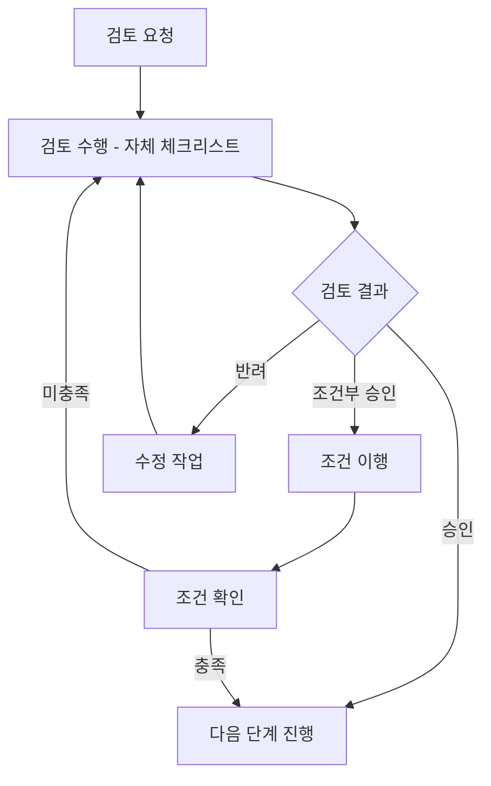

# 단계별 검토 체크리스트 (Phase Review Checklist)

> **프로젝트명:** TrainBot — 김천구미↔동탄 주간 예매 어시스턴트
> **문서 번호:** RC-TRAINBOT-v1.0
> **작성일:** 2026-03-02
> **작성자:** 프로젝트 오너

---

## 목차

1. [Phase 1: 요구사항 검토](#phase-1-요구사항-검토)
2. [Phase 2: 설계 검토](#phase-2-설계-검토)
3. [Phase 3: 코드 검토](#phase-3-코드-검토)
4. [Phase 4: 테스트 검토](#phase-4-테스트-검토)
5. [Phase 5: 배포 검토](#phase-5-배포-검토)
6. [부록](#부록)

---

## Phase 1: 요구사항 검토 (Requirements Review)

### 1.1 검토 목적

SRS v1.3의 **완전성, 일관성, 추적 가능성, 테스트 가능성**을 확인하여, 후속 단계에서 발생할 수 있는 재작업을 최소화한다.

### 1.2 검토 범위

| 항목 | 대상 문서 | 버전 |
|------|-----------|------|
| 기능 요구사항 | SRS 섹션 3 (FR-001 ~ FR-019) | v1.3 |
| 비기능 요구사항 | SRS 섹션 4 (NFR-001 ~ NFR-011) | v1.3 |
| 유스케이스 명세 | UCS (UC-01 ~ UC-13) | v1.0 |
| 요구사항 추적표 | RTM | v1.0 |
| 외부 인터페이스 | SRS 섹션 5 (24개 API 엔드포인트) | v1.3 |
| 데이터 요구사항 | SRS 섹션 6 (8개 테이블) | v1.3 |

### 1.3 요구사항 검토 체크리스트

#### A. 완전성 (Completeness)

- [ ] 19개 FR(FR-001~FR-019)에 모두 고유 ID가 부여되었는가?
- [ ] 11개 NFR(NFR-001~NFR-011)에 모두 고유 ID가 부여되었는가?
- [ ] 각 FR에 우선순위(P1~P4)가 명시되었는가?
- [ ] 시스템 경계(포함/제외 범위)가 SRS 섹션 1.2에 명확히 정의되었는가?
- [ ] 2가지 사용자 역할(Admin, Member)이 식별되고 권한이 정의되었는가?
- [ ] 13개 유스케이스(UC-01~UC-13)의 기본/대안/예외 흐름이 기술되었는가?
- [ ] 외부 시스템(SRT API, KTX API, 카카오 OAuth, Telegram Bot API)이 모두 식별되었는가?
- [ ] 24개 API 엔드포인트의 입출력이 정의되었는가?
- [ ] week_plans 상태 모델(NEEDED/BOOKED/NOT_NEEDED/SEARCHING/RECOMMENDED)이 완전히 정의되었는가?
- [ ] 결제 수단/계정 관리(FR-019)의 저장 방식(.env.credentials)이 명확히 정의되었는가?

#### B. 일관성 (Consistency)

- [ ] 용어 정의(섹션 1.3)가 문서 전체에서 일관적으로 사용되는가? (상행/하행, earliest_after, dedupe 등)
- [ ] FR 간 충돌이 없는가? (예: FR-016 검색범위와 FR-017 제외주 간 정합성)
- [ ] FR-018(캘린더) 상태와 FR-017(Skip Weeks) 제외 로직이 일관적인가?
- [ ] NFR-007(민감정보 저장 금지)과 FR-019(결제 수단 관리)가 상충하지 않는가?
- [ ] 모든 API 엔드포인트의 인증 수준(불필요/필수/Admin)이 일관적인가?

#### C. 추적 가능성 (Traceability)

- [ ] RTM이 작성되어 FR/NFR → 설계 → 테스트 추적이 가능한가?
- [ ] 19개 FR이 모두 RTM에 포함되었는가?
- [ ] 각 FR이 최소 하나의 테스트 케이스와 매핑 가능한가?
- [ ] 비즈니스 규칙(BP-*) → FR 추적이 가능한가?

#### D. 테스트 가능성 (Testability)

- [ ] NFR에 측정 가능한 수치가 명시되었는가? (예: "최대 4명", "180분 윈도우")
- [ ] "적절히", "빠르게" 등 모호한 표현이 제거되었는가?
- [ ] 22개 수용 기준(AC-01~AC-22)이 검증 가능한 형태인가?
- [ ] earliest_after 범위(0~23), search_range_weeks 범위(1~8) 등 경계값이 명시되었는가?

#### E. 우선순위 및 승인

- [ ] 모든 FR에 우선순위(P1 필수 14개 / P2 권장 5개)가 부여되었는가?
- [ ] 미결정 사항(ISSUE-01~03)이 명시되고 담당자가 지정되었는가?
- [ ] 변경 이력(v1.0 → v1.1 → v1.2 → v1.3)이 관리되고 있는가?

### 1.4 요구사항 검토 피드백 양식

**검토 정보**

| 항목 | 내용 |
|------|------|
| 검토자 | 프로젝트 오너 (자체 검토) |
| 검토일 | |
| 검토 대상 문서 | SRS-TRAINBOT v1.3, RTM v1.0, UCS v1.0 |
| 검토 결과 | [ ] 승인 / [ ] 조건부 승인 / [ ] 반려 |

**피드백 상세**

| # | 항목 | 위치 | 심각도 | 피드백 내용 | 조치사항 | 상태 |
|---|------|------|--------|-------------|----------|------|
| 1 | | | | | | |
| 2 | | | | | | |

---

## Phase 2: 설계 검토 (Design Review)

### 2.1 검토 목적

아키텍처 설계(SAD), DB 설계, API 설계, UI 설계가 SRS 요구사항을 올바르게 반영하고 품질 속성을 충족하는지 검증한다.

### 2.2 아키텍처 검토 체크리스트

#### A. 요구사항 충족성

- [ ] 19개 FR이 아키텍처 컴포넌트(6개 계층)에 매핑되었는가?
- [ ] NFR이 아키텍처 결정에 반영되었는가? (NAS Docker → 단일 컨테이너, SQLite → 파일 기반)
- [ ] RTM이 설계 항목으로 확장되었는가? (FR → SAD 컴포넌트)

#### B. 기술 스택 및 구조 (TrainBot 특화)

- [ ] 기술 스택(React 18+, Node.js/TypeScript, SQLite, Express) 선정 근거(ADR)가 문서화되었는가?
- [ ] 6계층(Presentation → Router → Controller → Service → Repository → Infrastructure) 분리가 명확한가?
- [ ] 계층 간 의존 방향이 단방향(위→아래)인가?
- [ ] 외부 API 어댑터(SRT, KTX, Telegram, Kakao)가 Infrastructure 계층에 분리되었는가?
- [ ] 추천 엔진(Scoring)이 Service 계층에 위치하고 비즈니스 로직이 응집되었는가?
- [ ] Auto 모드 플러그인 인터페이스가 확장 가능하게 설계되었는가?

#### C. NAS Docker 운영 특화

- [ ] 단일 컨테이너(모놀리스) 배포 전략이 정의되었는가?
- [ ] NAS 장애 시 복구 방안(SQLite 백업, /data 볼륨)이 있는가?
- [ ] 리소스 제한(CPU/메모리) 환경에서의 성능 전략이 있는가?
- [ ] 스케줄러(node-cron)의 단일 프로세스 내 실행이 설계되었는가?

#### D. 보안 아키텍처 (TrainBot 특화)

- [ ] Kakao OAuth + express-session 기반 인증이 설계되었는가?
- [ ] RBAC(Admin/Member) 미들웨어가 설계되었는가?
- [ ] 민감정보 저장(.env.credentials, 파일 권한 600)이 설계되었는가?
- [ ] 로그에 민감정보 마스킹이 설계되었는가?

#### E. 관측성

- [ ] winston 로깅(로그 수준, 파일 로테이션)이 설계되었는가?
- [ ] 감사 로그(audit_logs 테이블)가 설계되었는가?
- [ ] /api/health 헬스체크 엔드포인트가 설계되었는가?

### 2.3 데이터베이스 설계 검토 체크리스트

#### A. 데이터 모델링 (SQLite 특화)

- [ ] ERD가 제공되었는가? (users, sessions, config, runs, week_plans, schedules, audit_logs, dedupe)
- [ ] 8개 테이블의 명명 규칙(snake_case)이 일관적인가?
- [ ] 데이터 타입 선택이 SQLite에 적합한가? (TEXT, INTEGER, REAL)
- [ ] NULL 허용 정책이 적절한가? (config_json NOT NULL 등)
- [ ] WAL 모드 설정이 문서화되었는가?

#### B. 무결성 및 관계

- [ ] 기본키(INTEGER PRIMARY KEY AUTOINCREMENT) 전략이 적절한가?
- [ ] 외래키(users.id → runs.created_by 등) 관계가 올바른가?
- [ ] UNIQUE 제약조건(users.kakao_id, schedules.name 등)이 필요한 곳에 설정되었는가?
- [ ] CHECK 제약조건(role IN ('ADMIN','MEMBER'), status 값 등)이 설정되었는가?
- [ ] week_plans.week_start_date의 UNIQUE 제약이 설정되었는가?

#### C. 성능 및 운영

- [ ] 인덱스 전략이 주요 쿼리 패턴(runs.created_by, audit_logs.created_at 등)에 맞게 설계되었는가?
- [ ] 마이그레이션 전략(V001~V008)이 수립되었는가?
- [ ] 데이터 보존 정책(runs 90일, audit_logs 1년, dedupe 만료 기반)이 정의되었는가?
- [ ] SQLite 백업 전략(.backup 명령, /data 볼륨)이 정의되었는가?

### 2.4 API 설계 검토 체크리스트

#### A. 설계 규약

- [ ] RESTful 규약(리소스 명명, HTTP 메서드)을 따르는가?
- [ ] 24개 엔드포인트의 URI가 일관적인가? (/api/*, /auth/*)
- [ ] HTTP 상태 코드(200, 201, 400, 401, 403, 404, 500)가 표준적으로 사용되는가?
- [ ] Content-Type: application/json이 일관적으로 사용되는가?

#### B. 인증 및 보안

- [ ] Session 기반 인증이 모든 /api/* 엔드포인트에 적용되는가?
- [ ] Admin 전용 엔드포인트(users, schedules, credentials, config PUT)에 RBAC가 적용되는가?
- [ ] CORS 정책이 설정되었는가? (NAS 내부망 + 외부 접속 대비)
- [ ] 민감 데이터(/api/credentials)가 마스킹 처리되어 응답하는가?
- [ ] Zod 기반 입력 검증이 모든 POST/PUT/PATCH에 적용되는가?

#### C. 요청/응답 설계

- [ ] 에러 응답 형식이 일관적인가? (`{ error: { code, message } }`)
- [ ] 페이지네이션이 필요한 엔드포인트(runs, audit_logs)에 적용되었는가?
- [ ] 날짜/시간 형식이 ISO 8601로 통일되었는가?

### 2.5 UI 설계 검토 체크리스트

- [ ] 8개 화면(SCR-01~SCR-08) 와이어프레임이 작성되었는가?
- [ ] 화면 흐름도(Screen Flow)가 작성되었는가?
- [ ] Tailwind CSS 기반 컴포넌트 구조가 정의되었는가?
- [ ] Zustand 상태 관리 구조가 정의되었는가?
- [ ] React Router 라우팅 구조가 정의되었는가?
- [ ] 주요 인터랙션(상태 전환, 검색 실행, 설정 저장)의 동작이 명세되었는가?

### 2.6 설계 검토 피드백 양식

| 항목 | 내용 |
|------|------|
| 검토자 | 프로젝트 오너 (자체 검토) |
| 검토일 | |
| 검토 대상 | [x] 아키텍처 / [x] DB 설계 / [x] API 설계 / [x] UI 설계 |
| 검토 결과 | [ ] 승인 / [ ] 조건부 승인 / [ ] 반려 |

| # | 영역 | 항목 | 심각도 | 피드백 내용 | 조치사항 | 상태 |
|---|------|------|--------|-------------|----------|------|
| 1 | | | | | | |

---

## Phase 3: 코드 검토 (Code Review)

### 3.1 검토 목적

구현된 코드가 설계 명세와 코딩 표준을 준수하고, TypeScript/React/SQLite 환경에서의 보안·성능 이슈가 없는지 검증한다.

### 3.2 코드 검토 체크리스트

#### A. 기능 정확성

- [ ] 19개 FR이 올바르게 구현되었는가?
- [ ] 추천 엔진 스코어링(direct_bonus, time_penalty, transfer_penalty)이 설계 명세와 일치하는가?
- [ ] week_plans 상태 전이(NEEDED→SEARCHING→RECOMMENDED/NEEDED)가 정확한가?
- [ ] earliest_after 필터링이 방향(상행/하행)+요일별로 정확히 적용되는가?
- [ ] dedupe 해시 생성 및 180분 윈도우가 정확히 구현되었는가?
- [ ] search_range_weeks 범위(1~8), start_from 검증이 구현되었는가?
- [ ] 정원 제한(ACTIVE <= 4) 가드레일이 구현되었는가?

#### B. 코드 품질 (TypeScript/Node.js 특화)

- [ ] TypeScript strict 모드가 활성화되었는가?
- [ ] ESLint + Prettier가 설정되고 경고/에러가 없는가?
- [ ] 함수/클래스의 단일 책임 원칙(SRP)이 준수되었는가?
- [ ] 인터페이스/타입이 명확히 정의되었는가? (any 타입 사용 최소화)
- [ ] 매직 넘버(180, 4, 8, 0~23 등)가 상수로 추출되었는가?
- [ ] 비동기 처리(async/await)가 일관적으로 사용되었는가?

#### C. 보안 (TrainBot 특화)

- [ ] SQLite 쿼리에 Parameterized Query(better-sqlite3의 `?` 바인딩)가 사용되었는가?
- [ ] React JSX에서 dangerouslySetInnerHTML이 사용되지 않는가?
- [ ] express-session에 secure, httpOnly, sameSite 옵션이 적용되었는가?
- [ ] RBAC 미들웨어가 Admin 전용 API에 누락 없이 적용되었는가?
- [ ] .env.credentials 파일의 민감정보가 로그/DB에 절대 기록되지 않는가?
- [ ] Zod 스키마로 모든 사용자 입력이 검증되는가?
- [ ] 의존성(package.json)에 알려진 취약점이 없는가? (`npm audit`)

#### D. 에러 처리

- [ ] Express 글로벌 에러 핸들러가 구현되었는가?
- [ ] 외부 API(SRT/KTX/Telegram/Kakao) 호출에 try-catch가 적용되었는가?
- [ ] 에러 메시지가 내부 정보(스택 트레이스, DB 쿼리 등)를 노출하지 않는가?
- [ ] SQLite 연결 실패 시 graceful shutdown이 구현되었는가?
- [ ] 실행 중 에러 발생 시 runs.status가 FAILED로 정확히 업데이트되는가?

#### E. 성능

- [ ] SQLite 쿼리에 불필요한 SELECT * 대신 필요 컬럼만 조회하는가?
- [ ] 대량 데이터(audit_logs) 조회에 페이지네이션이 적용되었는가?
- [ ] React 컴포넌트에 불필요한 리렌더링 방지(React.memo, useMemo 등)가 적용되었는가?
- [ ] better-sqlite3의 동기 API가 이벤트 루프를 과도하게 차단하지 않는가?
- [ ] 실행 중복 방지 락(NFR-010)이 구현되었는가?

#### F. 테스트

- [ ] 단위 테스트(Vitest)가 핵심 비즈니스 로직(추천 엔진, 스코어링)에 작성되었는가?
- [ ] API 통합 테스트(Supertest)가 24개 엔드포인트에 작성되었는가?
- [ ] 테스트 커버리지가 80% 이상인가?
- [ ] 외부 API Mock(SRT/KTX/Telegram)이 적용되었는가?

#### G. 프론트엔드 (React 특화)

- [ ] React 18+ Hook 패턴이 일관적으로 사용되었는가?
- [ ] Zustand 스토어가 적절히 분리되었는가? (auth, config, runs, weekPlans 등)
- [ ] React Router v6 라우팅이 설계와 일치하는가?
- [ ] API 호출에 에러/로딩 상태 처리가 일관적인가?
- [ ] Tailwind CSS 유틸리티 클래스가 일관적으로 사용되었는가?

### 3.3 코드 리뷰 피드백 분류

| 접두어 | 의미 | 설명 |
|--------|------|------|
| `[MUST]` | 필수 수정 | 반드시 수정 후 재리뷰 |
| `[SHOULD]` | 권장 수정 | 강력히 권장 |
| `[COULD]` | 선택적 개선 | 개선하면 좋음 |
| `[QUESTION]` | 질문 | 의도/설계 결정에 대한 질문 |

> **참고**: 1~2인 팀이므로 PR 기반 리뷰 대신 자체 체크리스트 기반 리뷰를 수행한다.

---

## Phase 4: 테스트 검토 (Test Review)

### 4.1 검토 목적

테스트 계획의 완전성과 테스트 결과의 신뢰성을 검증하여, 릴리스 품질 기준 충족 여부를 판단한다.

### 4.2 테스트 계획 검토 체크리스트

#### A. 테스트 범위 및 전략

- [ ] 154개 테스트 케이스(TC)가 RTM의 모든 FR/NFR을 커버하는가?
- [ ] 테스트 유형별 범위가 정의되었는가?
  - 기능 테스트: 105개 TC (Vitest + Supertest)
  - 성능 테스트: 6개 TC (k6)
  - 보안 테스트: 11개 TC (수동 + 자동)
  - 운영 테스트: 11개 TC
  - 호환성 테스트: 6개 TC (Playwright)
  - 회귀 테스트: 15개 TC
- [ ] 위험 기반 테스트 접근이 적용되었는가? (추천 엔진, 인증, 결제 관련 우선)
- [ ] 회귀 테스트 전략이 수립되었는가?

#### B. 테스트 환경 및 데이터

- [ ] 3개 테스트 환경(DEV/TEST/PROD)이 정의되었는가?
- [ ] 테스트 데이터에 실제 민감정보가 포함되지 않았는가?
- [ ] 외부 API Mock 전략(SRT/KTX/Telegram/Kakao)이 있는가?
- [ ] SQLite 인메모리 DB를 테스트에 활용하는 전략이 있는가?

#### C. 진입/종료 기준

- [ ] 테스트 진입 기준이 정의되었는가? (빌드 성공, 린트 통과 등)
- [ ] 테스트 종료 기준이 정의되었는가? (통과율 >= 95%, Critical 0건 등)

#### D. 비기능 테스트

- [ ] 성능 테스트(k6): API 응답시간 < 2초, 동시 4사용자 처리?
- [ ] 보안 테스트: SQL Injection, XSS, CSRF, 인증 우회, 민감정보 노출?
- [ ] 호환성 테스트: Chrome, Firefox, Safari, Edge + 모바일 브라우저?

### 4.3 테스트 결과 검토 체크리스트

#### A. 테스트 실행 결과

- [ ] 154개 TC가 모두 실행되었는가?
- [ ] 테스트 종료 기준이 충족되었는가?
- [ ] 미실행 TC에 대한 사유가 기록되었는가?
- [ ] 테스트 통과율이 95% 이상인가?

#### B. 결함 현황

- [ ] Critical/Major 결함이 모두 해결되었는가?
- [ ] 미해결 결함의 위험이 수용 가능한가?
- [ ] 결함 추세가 안정화(수렴) 추세인가?

#### C. 코드 품질 메트릭

- [ ] 코드 커버리지(Vitest)가 80% 이상인가?
- [ ] ESLint 정적 분석 이슈가 0건인가?
- [ ] TypeScript strict 모드 에러가 0건인가?

### 4.4 테스트 검토 피드백 양식

| 항목 | 내용 |
|------|------|
| 검토자 | 프로젝트 오너 (자체 검토) |
| 검토일 | |
| 검토 결과 | [ ] 승인 (릴리스 가능) / [ ] 조건부 승인 / [ ] 반려 |

**테스트 요약 메트릭**

| 메트릭 | 기준 | 실적 | 충족 여부 |
|--------|------|------|-----------|
| TC 실행율 | 100% | | |
| TC 통과율 | >= 95% | | |
| Critical 결함 미해결 | 0건 | | |
| Major 결함 미해결 | <= 3건 | | |
| 코드 커버리지 | >= 80% | | |
| 성능 목표 달성 | API < 2초 | | |

---

## Phase 5: 배포 검토 (Deployment Review)

### 5.1 검토 목적

NAS Docker 환경에 안정적으로 배포하기 위한 기술적 준비 상태, 롤백 계획을 검증한다.

### 5.2 배포 전 검토 체크리스트 (Pre-Deployment)

#### A. 테스트 완료 확인

- [ ] 모든 테스트(154 TC)가 실행되고 종료 기준이 충족되었는가?
- [ ] 미해결 결함에 대한 위험 수용이 결정되었는가?
- [ ] 회귀 테스트가 완료되었는가?

#### B. 배포 아티팩트 준비 (NAS Docker 특화)

- [ ] Docker 이미지(node:20-alpine 기반 multi-stage)가 빌드되었는가?
- [ ] docker-compose.yml이 검증되었는가?
- [ ] 환경 변수 파일(.env)이 운영 환경에 맞게 준비되었는가?
- [ ] /data 볼륨 마운트 경로가 확인되었는가?
- [ ] TZ=Asia/Seoul이 설정되었는가?

#### C. 데이터베이스 변경

- [ ] SQLite 마이그레이션(V001~V008)이 순서대로 실행 가능한가?
- [ ] 마이그레이션 롤백 방안(SQLite .backup 파일)이 준비되었는가?
- [ ] WAL 모드 설정이 확인되었는가?
- [ ] 기존 DB가 있는 경우 호환성이 검증되었는가?

#### D. 롤백 계획

- [ ] 롤백 기준(헬스체크 실패, 에러율 급증)이 정의되었는가?
- [ ] 롤백 절차(이전 이미지 태그로 docker-compose up)가 문서화되었는가?
- [ ] 롤백 시 DB 복원 방안(.backup 파일)이 있는가?
- [ ] 롤백 소요 시간이 추정되었는가? (목표: 5분 이내)

#### E. 보안 최종 확인

- [ ] .env, .env.credentials 파일이 Docker 이미지에 포함되지 않는가?
- [ ] .env.credentials 파일 권한이 600인가?
- [ ] express-session secret이 강력한 값인가?
- [ ] 기본 포트(3000)가 NAS 방화벽에 맞게 설정되었는가?

### 5.3 배포 후 검토 체크리스트 (Post-Deployment)

#### A. 즉시 확인 (배포 후 10분 이내)

- [ ] /api/health 응답이 200 OK인가?
- [ ] 카카오 로그인이 정상 동작하는가?
- [ ] Dashboard 페이지가 정상 렌더링되는가?
- [ ] 수동 검색 실행이 정상 동작하는가?
- [ ] 텔레그램 알림이 정상 발송되는가?
- [ ] Docker 컨테이너 로그에 에러가 없는가?
- [ ] SQLite DB 파일이 /data에 정상 생성되었는가?

#### B. 안정화 모니터링 (배포 후 24~72시간)

- [ ] 스케줄 실행이 정상 동작하는가?
- [ ] 메모리 사용량이 안정적인가? (메모리 누수 없음)
- [ ] SQLite WAL 파일 크기가 비정상적으로 증가하지 않는가?
- [ ] Docker 컨테이너가 재시작 없이 안정적으로 운영되는가?

#### C. 배포 완료 확인

- [ ] Docker 이미지 태그가 기록되었는가?
- [ ] 운영 가이드(OG) 문서가 최신화되었는가?
- [ ] 배포 결과가 기록되었는가?

---

## 부록

### A. 심각도(Severity) 기준

| 등급 | 명칭 | 설명 | 대응 기한 |
|------|------|------|-----------|
| S1 | Critical | 핵심 기능(검색/인증/알림) 불가, 데이터 손실 위험 | 즉시 |
| S2 | Major | 주요 기능 불가, 우회 방법 없음 | 24시간 |
| S3 | Minor | 기능 불편, 우회 방법 존재 | 1주일 |
| S4 | Info | 사소한 개선 사항 | 다음 릴리스 |

### B. 검토 결과 구분

| 결과 | 설명 | 후속 조치 |
|------|------|-----------|
| 승인 (Approved) | 모든 기준 충족 | 다음 단계 진행 |
| 조건부 승인 (Conditionally Approved) | 경미한 이슈, 조건 충족 시 진행 | 조건 이행 후 재확인 |
| 반려 (Rejected) | 중대한 이슈, 수정 후 재검토 | 수정 후 재검토 요청 |

### C. 검토 프로세스 흐름

### D. 검토자 매트릭스 (2인 팀)

| 검토 단계 | 개발자 (프로젝트 오너) | 리뷰어 (보조) |
|-----------|:--------------------:|:------------:|
| 요구사항 검토 | O (작성+자체검토) | O (교차검토) |
| 아키텍처 검토 | O | - |
| DB 설계 검토 | O | - |
| API 설계 검토 | O | O (교차검토) |
| 코드 검토 | O (자체검토) | O (교차검토) |
| 테스트 검토 | O | O |
| 배포 검토 | O | - |

> `O` = 참여, `-` = 해당 없음. 2인 팀 구조로 대부분 자체 검토 + 가능한 경우 교차 검토.

---

*본 문서는 각 단계 완료 시 체크리스트를 수행하고 결과를 기록한다.*
