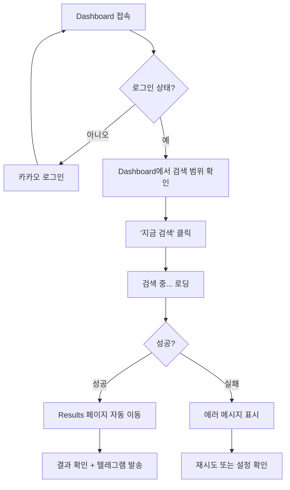
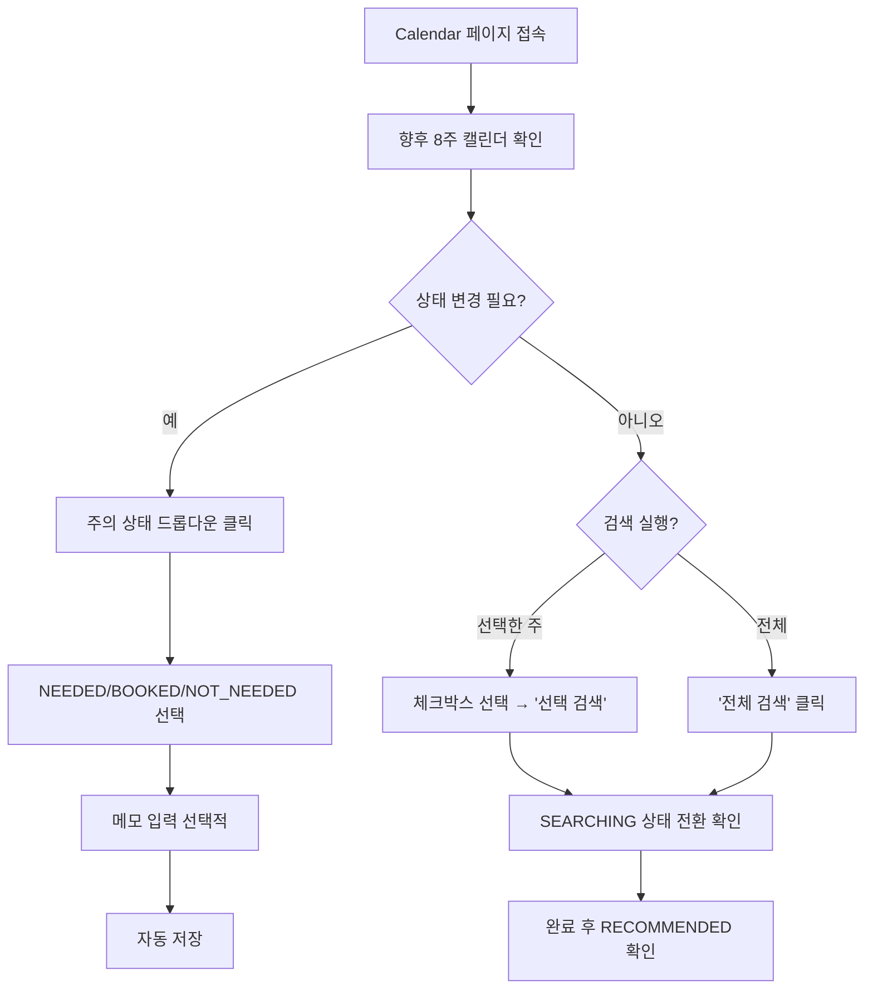
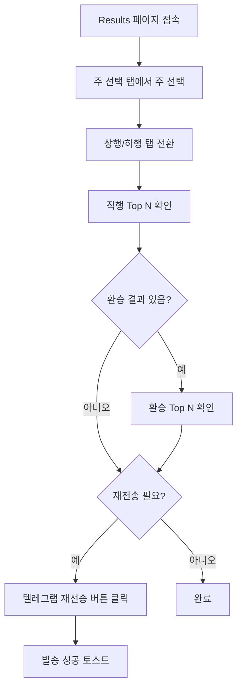
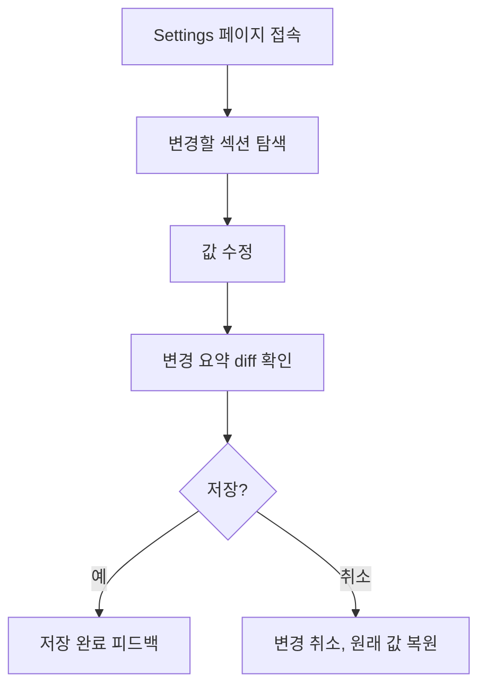
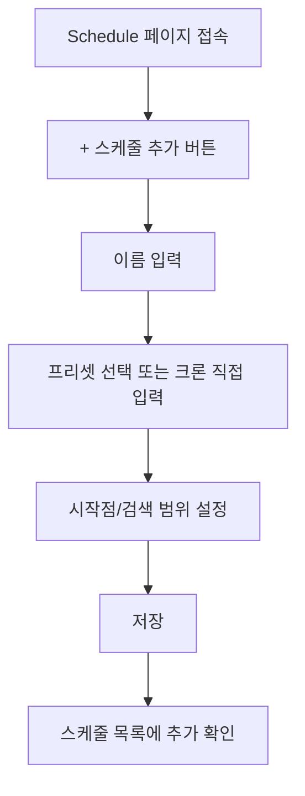
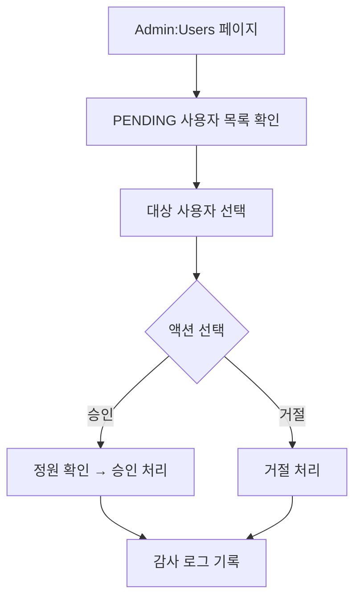
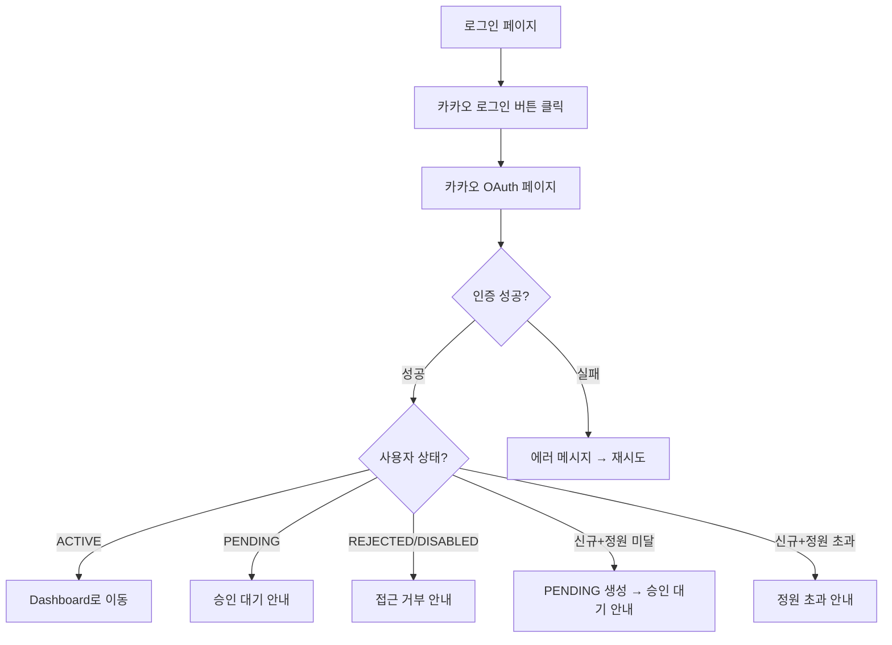

# UX 검토서 (UX Review Document)

> **프로젝트명:** TrainBot — 김천구미↔동탄 주간 예매 어시스턴트
> **문서 번호:** UXR-TRAINBOT-v1.0
> **작성일:** 2026-03-02
> **작성자:** 프로젝트 오너
> **검토 대상:** React Web UI 8개 화면 (SCR-01 ~ SCR-08)

---

## 목차

1. [UX 검토 개요](#1-ux-검토-개요)
2. [닐슨의 10가지 휴리스틱 평가](#2-닐슨의-10가지-휴리스틱-평가)
3. [접근성(Accessibility) 검토](#3-접근성-검토)
4. [반응형 디자인 검토](#4-반응형-디자인-검토)
5. [사용자 플로우 검토](#5-사용자-플로우-검토)
6. [에러/예외 상황 검토](#6-에러예외-상황-검토)
7. [성능 UX 검토](#7-성능-ux-검토)
8. [UX 검토 결과 보고서](#8-ux-검토-결과-보고서)

---

## 1. UX 검토 개요

### 1.1 검토 목적

TrainBot의 React Web UI가 사용성, 접근성, 일관성, 효율성 기준을 충족하는지 체계적으로 검증한다. 1~2인 개인 프로젝트 특성상 전문 UX 리서처 없이 **휴리스틱 평가 + 체크리스트 + 인지 워크스루** 중심으로 수행한다.

### 1.2 검토 범위

**대상 화면 목록:**

| # | 화면 ID | 화면명 | 화면 유형 | 우선순위 | 검토 상태 |
|---|---------|--------|-----------|----------|-----------|
| 1 | SCR-01 | Dashboard | 대시보드 | High | 미착수 |
| 2 | SCR-02 | Calendar | 캘린더 뷰 | High | 미착수 |
| 3 | SCR-03 | Results | 목록/상세 | High | 미착수 |
| 4 | SCR-04 | Settings | 폼 | High | 미착수 |
| 5 | SCR-05 | Schedule | 목록/폼 | Medium | 미착수 |
| 6 | SCR-06 | Logs | 목록/상세 | Medium | 미착수 |
| 7 | SCR-07 | Safety | 폼/토글 | Medium | 미착수 |
| 8 | SCR-08 | Admin: Users | 목록/액션 | Medium | 미착수 |

### 1.3 검토 기준

| 기준 | 설명 | 가중치 |
|------|------|--------|
| 사용성 (Usability) | 사용자가 쉽고 효율적으로 목표를 달성할 수 있는가 | 35% |
| 일관성 (Consistency) | Tailwind CSS 기반 디자인이 일관적으로 적용되었는가 | 25% |
| 효율성 (Efficiency) | 최소 단계로 검색/설정/확인 태스크를 완료할 수 있는가 | 20% |
| 접근성 (Accessibility) | 기본적인 WCAG 2.1 AA를 준수하는가 | 10% |
| 심미성 (Aesthetics) | 시각적으로 정돈되고 가독성이 높은가 | 10% |

> **참고**: 4명 이하 소규모 사용자 대상이므로, 사용성·효율성 가중치를 높이고 접근성은 기본 수준만 확인한다.

### 1.4 검토 방법

| 방법 | 설명 | 적용 시점 |
|------|------|-----------|
| 휴리스틱 평가 | 닐슨의 10가지 원칙에 따른 자체 평가 | 설계 완료 후 |
| 인지 워크스루 | 주요 태스크를 사용자 관점에서 단계별 수행 | 프로토타입 단계 |
| 체크리스트 | 접근성, 반응형 등 기준별 항목 확인 | 구현 완료 후 |

---

## 2. 닐슨의 10가지 휴리스틱 평가

### 평가 척도

| 점수 | 등급 | 설명 |
|------|------|------|
| 5 | 우수 | 원칙을 완벽히 준수하며 모범적 |
| 4 | 양호 | 원칙을 대부분 준수, 사소한 개선 가능 |
| 3 | 보통 | 일부 미흡한 점이 있으나 사용에 큰 지장 없음 |
| 2 | 미흡 | 원칙 위반이 있어 사용성에 영향을 줌 |
| 1 | 심각 | 원칙을 심각하게 위반하여 사용에 큰 지장 |

---

### H1. 시스템 상태의 가시성 (Visibility of System Status)

> 시스템은 적절한 피드백을 통해 사용자에게 현재 상태를 알려야 한다.

**TrainBot 맞춤 체크 항목:**

- [ ] Dashboard(SCR-01)에서 현재 활성 스케줄, 마지막 실행 시각, 다음 실행 예정이 표시되는가?
- [ ] 수동 실행(POST /api/run) 시 "검색 중..." 로딩 인디케이터가 표시되는가?
- [ ] Calendar(SCR-02)에서 SEARCHING 상태 주에 로딩 스피너가 표시되는가?
- [ ] 주별 상태(NEEDED/BOOKED/NOT_NEEDED/SEARCHING/RECOMMENDED)가 색상+텍스트로 구분되는가?
- [ ] 텔레그램 발송 후 성공/실패 토스트 메시지가 표시되는가?
- [ ] 설정 저장 시 "저장 완료" 피드백이 명확히 제공되는가?
- [ ] 사이드바/네비게이션에서 현재 활성 페이지가 하이라이트되는가?

**평가:** [ ] 1 / [ ] 2 / [ ] 3 / [ ] 4 / [ ] 5

**발견사항:**

| # | 화면 | 설명 | 심각도 | 권장 개선안 |
|---|------|------|--------|------------|
| 1 | | | | |

---

### H2. 시스템과 현실 세계의 일치 (Match Between System and Real World)

> 시스템은 사용자에게 친숙한 용어와 개념을 사용해야 한다.

**TrainBot 맞춤 체크 항목:**

- [ ] "상행"/"하행" 대신 자연어 레이블도 함께 표시하는가? (예: "상행(김천구미→동탄)")
- [ ] earliest_after가 "N시 이후 출발"로 자연스럽게 표현되는가?
- [ ] 날짜/시간이 한국어 로케일(yyyy년 MM월 dd일, HH:mm)로 표시되는가?
- [ ] 요일이 한국어(월/화/수/목/금/토/일)로 표시되는가?
- [ ] "dedupe"가 UI에 기술 용어로 노출되지 않는가? (사용자에게는 "중복 발송 방지")
- [ ] "cron" 표현식 대신 프리셋(매일 오전 8시, 매주 금요일 등)이 기본 제공되는가?
- [ ] 열차 추천 결과의 태그(직행/환승/최단 등)가 직관적인가?

**평가:** [ ] 1 / [ ] 2 / [ ] 3 / [ ] 4 / [ ] 5

**발견사항:**

| # | 화면 | 설명 | 심각도 | 권장 개선안 |
|---|------|------|--------|------------|
| 1 | | | | |

---

### H3. 사용자 제어 및 자유 (User Control and Freedom)

> 실수로 원하지 않는 상태에서 쉽게 벗어날 수 있는 "비상구"가 필요하다.

**TrainBot 맞춤 체크 항목:**

- [ ] 수동 실행 중 취소 기능이 제공되는가? (또는 실행이 빠르게 완료되는가?)
- [ ] 설정 변경 시 저장 전 "변경 요약(diff)"이 표시되고 취소할 수 있는가?
- [ ] Calendar에서 상태 변경(BOOKED→NEEDED 등) 되돌리기가 가능한가?
- [ ] 사용자 승인/거절 후 되돌리기가 가능한가? (거절→재승인)
- [ ] 스케줄 삭제 전 확인(Confirmation) 다이얼로그가 표시되는가?
- [ ] 모달/다이얼로그를 ESC 키 또는 배경 클릭으로 닫을 수 있는가?

**평가:** [ ] 1 / [ ] 2 / [ ] 3 / [ ] 4 / [ ] 5

**발견사항:**

| # | 화면 | 설명 | 심각도 | 권장 개선안 |
|---|------|------|--------|------------|
| 1 | | | | |

---

### H4. 일관성 및 표준 (Consistency and Standards)

> 동일한 상황에서 동일한 용어·동작·스타일을 사용해야 한다.

**TrainBot 맞춤 체크 항목:**

- [ ] Tailwind CSS 유틸리티 클래스가 일관적으로 사용되는가?
- [ ] Primary/Secondary/Danger 버튼 스타일이 전체 화면에서 통일되는가?
- [ ] 성공/경고/에러 토스트 메시지 스타일이 일관적인가?
- [ ] 테이블/리스트 레이아웃이 Logs, Schedule, Admin:Users에서 통일되는가?
- [ ] "저장"/"확인"/"실행" 등 액션 버튼 레이블이 맥락에 맞게 통일되는가?
- [ ] 날짜/시간 포맷이 전체 화면에서 동일한가?
- [ ] 아이콘 라이브러리(예: Lucide/Heroicons)가 하나로 통일되는가?

**평가:** [ ] 1 / [ ] 2 / [ ] 3 / [ ] 4 / [ ] 5

**발견사항:**

| # | 화면 | 설명 | 심각도 | 권장 개선안 |
|---|------|------|--------|------------|
| 1 | | | | |

---

### H5. 오류 방지 (Error Prevention)

> 처음부터 문제가 발생하지 않도록 설계하는 것이 중요하다.

**TrainBot 맞춤 체크 항목:**

- [ ] earliest_after 입력에 0~23 범위 제한이 적용되는가?
- [ ] 검색 범위 주 수(search_range_weeks)에 1~8 범위 검증이 적용되는가?
- [ ] 크론 프리셋이 기본 제공되어 잘못된 크론 표현식 입력을 줄이는가?
- [ ] 정원 초과(ACTIVE 4명) 시 승인 버튼이 비활성화되는가?
- [ ] auto 모드 활성화에 2단계 확인(체크박스 + 문구 입력)이 적용되는가?
- [ ] 모든 주가 제외(Skip)된 상태에서 실행 시 안내 메시지가 표시되는가?
- [ ] 결제 수단/계정 저장 시 빈 값 검증이 수행되는가?
- [ ] 수동 실행 버튼 더블 클릭 방지(debounce)가 적용되는가?

**평가:** [ ] 1 / [ ] 2 / [ ] 3 / [ ] 4 / [ ] 5

**발견사항:**

| # | 화면 | 설명 | 심각도 | 권장 개선안 |
|---|------|------|--------|------------|
| 1 | | | | |

---

### H6. 인식 > 회상 (Recognition Rather Than Recall)

> 사용자의 기억 부담을 최소화해야 한다.

**TrainBot 맞춤 체크 항목:**

- [ ] Dashboard에 마지막 실행 결과 요약이 표시되어 Results 페이지 방문 없이 확인 가능한가?
- [ ] Calendar에서 각 주의 상태가 색상 배지로 한눈에 파악되는가?
- [ ] Results에서 "적용된 조건"(컷오프 시간, 환승 허용 여부 등)이 항상 표시되는가?
- [ ] Settings에서 현재 값이 기본값과 다를 때 시각적으로 구분되는가?
- [ ] 스케줄 목록에서 다음 실행 예정 시각이 표시되는가?
- [ ] 사이드바 네비게이션에 각 페이지의 아이콘+레이블이 함께 표시되는가?

**평가:** [ ] 1 / [ ] 2 / [ ] 3 / [ ] 4 / [ ] 5

**발견사항:**

| # | 화면 | 설명 | 심각도 | 권장 개선안 |
|---|------|------|--------|------------|
| 1 | | | | |

---

### H7. 유연성 및 효율성 (Flexibility and Efficiency of Use)

> 숙련된 사용자를 위한 가속 수단이 있어야 한다.

**TrainBot 맞춤 체크 항목:**

- [ ] Calendar에서 "전체 검색" 원클릭으로 NEEDED 상태 전체를 검색할 수 있는가?
- [ ] 크론 스케줄에 프리셋(일상 패턴)과 직접 입력(고급) 모두 제공되는가?
- [ ] Results에서 텔레그램 재전송이 한 번의 클릭으로 가능한가?
- [ ] Settings에서 자주 변경하는 항목(검색 범위, 시작점)이 상단에 위치하는가?
- [ ] 키보드 Enter로 폼 제출이 가능한가?
- [ ] Dashboard에서 "지금 검색" 바로 실행이 가능한가?

**평가:** [ ] 1 / [ ] 2 / [ ] 3 / [ ] 4 / [ ] 5

**발견사항:**

| # | 화면 | 설명 | 심각도 | 권장 개선안 |
|---|------|------|--------|------------|
| 1 | | | | |

---

### H8. 미니멀한 디자인 (Aesthetic and Minimalist Design)

> 화면에 불필요한 정보가 포함되어서는 안 된다.

**TrainBot 맞춤 체크 항목:**

- [ ] Dashboard에 핵심 정보(다음 스케줄, 마지막 실행, NEEDED 주 수)만 표시되는가?
- [ ] Results 카드에 열차 정보가 과밀하지 않고 시각적 계층이 명확한가?
- [ ] Settings가 섹션별로 논리적 그룹(노선/시간/환승/가중치/알림)으로 정리되어 있는가?
- [ ] Safety 페이지에서 auto 모드 미사용 시 관련 설정이 접혀 있는가?
- [ ] 불필요한 장식 요소가 최소화되어 있는가?
- [ ] 여백(Tailwind spacing)이 적절히 사용되어 가독성이 좋은가?

**평가:** [ ] 1 / [ ] 2 / [ ] 3 / [ ] 4 / [ ] 5

**발견사항:**

| # | 화면 | 설명 | 심각도 | 권장 개선안 |
|---|------|------|--------|------------|
| 1 | | | | |

---

### H9. 오류 인식/진단/복구 (Help Users Recognize, Diagnose, and Recover from Errors)

> 에러 메시지는 사용자가 이해하고 해결할 수 있어야 한다.

**TrainBot 맞춤 체크 항목:**

- [ ] API 에러(401/403/404/500)에 사용자 친화적 메시지가 표시되는가?
- [ ] 외부 열차 조회 실패 시 "열차 정보를 가져올 수 없습니다. 잠시 후 다시 시도해주세요" 류의 안내가 제공되는가?
- [ ] 폼 검증 에러가 해당 필드 근처에 인라인으로 표시되는가?
- [ ] 카카오 로그인 실패 시 사유(PENDING/REJECTED/DISABLED)가 안내되는가?
- [ ] 정원 초과 시 "현재 활성 사용자가 4명입니다" 메시지가 표시되는가?
- [ ] 텔레그램 발송 실패 시 원인(Bot Token 미설정, Chat ID 오류 등) 안내가 있는가?

**평가:** [ ] 1 / [ ] 2 / [ ] 3 / [ ] 4 / [ ] 5

**발견사항:**

| # | 화면 | 설명 | 심각도 | 권장 개선안 |
|---|------|------|--------|------------|
| 1 | | | | |

---

### H10. 도움말 및 문서 (Help and Documentation)

> 필요 시 상황별 도움말을 제공해야 한다.

**TrainBot 맞춤 체크 항목:**

- [ ] earliest_after 설정에 "해당 요일 N시 이후 출발하는 열차만 검색합니다" 도움말이 있는가?
- [ ] 크론 표현식 입력 필드에 형식 예시가 제공되는가?
- [ ] auto 모드 활성화 시 리스크 안내문이 표시되는가?
- [ ] 가중치(ranking) 설정에 각 항목의 의미를 설명하는 툴팁이 있는가?
- [ ] 첫 로그인 시 간단한 온보딩 안내가 제공되는가? (선택적)

**평가:** [ ] 1 / [ ] 2 / [ ] 3 / [ ] 4 / [ ] 5

**발견사항:**

| # | 화면 | 설명 | 심각도 | 권장 개선안 |
|---|------|------|--------|------------|
| 1 | | | | |

---

### 휴리스틱 평가 종합

| # | 원칙 | 평가 | 발견 이슈 수 | Critical | Major | Minor |
|---|------|:----:|:------------:|:--------:|:-----:|:-----:|
| H1 | 시스템 상태의 가시성 | /5 | | | | |
| H2 | 시스템과 현실 세계의 일치 | /5 | | | | |
| H3 | 사용자 제어 및 자유 | /5 | | | | |
| H4 | 일관성 및 표준 | /5 | | | | |
| H5 | 오류 방지 | /5 | | | | |
| H6 | 인식 > 회상 | /5 | | | | |
| H7 | 유연성 및 효율성 | /5 | | | | |
| H8 | 미니멀한 디자인 | /5 | | | | |
| H9 | 오류 인식/진단/복구 | /5 | | | | |
| H10 | 도움말 및 문서 | /5 | | | | |
| | **평균** | **/5** | **합계** | | | |

---

## 3. 접근성 검토 (Accessibility Review)

### 3.1 검토 기준

WCAG 2.1 AA 기본 수준을 기준으로 검토한다. 4명 이하 소규모 사용자 대상이므로, 핵심 접근성 항목에 집중한다.

### 3.2 인지 가능 (Perceivable)

#### 3.2.1 텍스트 대안

- [ ] 아이콘 버튼(실행, 삭제, 편집 등)에 `aria-label`이 제공되는가?
- [ ] 상태 아이콘(NEEDED/BOOKED/SEARCHING 등)에 색상+텍스트 레이블이 병행되는가?
- [ ] 장식용 아이콘에 `aria-hidden="true"`가 적용되는가?

#### 3.2.2 구별 가능 (Distinguishable)

- [ ] 색상만으로 정보를 전달하지 않는가? (상태 배지: 색상+텍스트)
- [ ] 본문 텍스트와 배경의 명도 대비가 4.5:1 이상인가?
- [ ] UI 컴포넌트(버튼, 입력 필드)의 명도 대비가 3:1 이상인가?
- [ ] 텍스트 크기를 200%까지 확대해도 레이아웃이 깨지지 않는가?

### 3.3 조작 가능 (Operable)

#### 3.3.1 키보드 접근성

- [ ] 모든 인터랙티브 요소가 키보드(Tab/Enter/Space)로 접근 가능한가?
- [ ] 키보드 포커스 인디케이터가 시각적으로 보이는가?
- [ ] Calendar 주별 행에서 키보드로 상태 변경이 가능한가?
- [ ] 모달/다이얼로그 내에서 포커스 트랩이 적절히 동작하는가?

#### 3.3.2 탐색 가능 (Navigable)

- [ ] 페이지 제목(`<title>`)이 각 화면의 내용을 정확히 설명하는가?
- [ ] 헤딩(`<h1>`~`<h6>`)이 논리적 계층으로 사용되었는가?
- [ ] "건너뛰기 링크(Skip Navigation)"가 제공되는가? (선택적)

### 3.4 이해 가능 (Understandable)

- [ ] 페이지 언어가 `<html lang="ko">`로 지정되었는가?
- [ ] 폼 필드에 `<label>` 또는 `aria-label`이 연결되었는가?
- [ ] 필수 필드가 명확히 표시되었는가?
- [ ] 에러 메시지가 해당 필드 근처에 텍스트로 설명되는가?

### 3.5 견고한 (Robust)

- [ ] 시맨틱 HTML(`<nav>`, `<main>`, `<header>`, `<section>`)이 적절히 사용되었는가?
- [ ] ARIA 역할(role)이 커스텀 컴포넌트에 올바르게 적용되었는가?
- [ ] 동적 콘텐츠 변경(검색 결과 로드 등) 시 `aria-live` 영역이 설정되었는가?

### 3.6 접근성 도구

| 도구 | 용도 | 적용 시점 |
|------|------|-----------|
| axe-core (React 플러그인) | 자동화 접근성 검사 | 개발 중 |
| Lighthouse | 접근성 점수 확인 | 빌드 후 |
| VoiceOver (macOS) | 스크린 리더 수동 테스트 | QA |

---

## 4. 반응형 디자인 검토

### 4.1 브레이크포인트 정의

Tailwind CSS 기본 브레이크포인트를 사용한다:

| 이름 | Tailwind | 범위 | 대표 기기 |
|------|----------|------|-----------|
| 모바일 | default | ~639px | iPhone, Galaxy |
| 태블릿 | sm: (640px) | 640px~767px | 작은 태블릿 |
| 중간 | md: (768px) | 768px~1023px | iPad |
| 데스크톱 | lg: (1024px) | 1024px~1279px | 노트북 |
| 와이드 | xl: (1280px) | 1280px+ | 데스크톱 모니터 |

### 4.2 브레이크포인트별 검토 체크리스트

#### 모바일 (~639px)

| # | 항목 | 결과 |
|---|------|------|
| 1 | 사이드바가 햄버거 메뉴로 전환되는가? | |
| 2 | Calendar 주별 행이 세로 카드로 전환되는가? | |
| 3 | Results 열차 카드가 풀 폭으로 표시되는가? | |
| 4 | 터치 타겟(버튼, 링크) 크기가 최소 44x44px인가? | |
| 5 | Settings 폼이 단일 컬럼으로 재배치되는가? | |
| 6 | 상행/하행 탭이 터치하기 편한 크기인가? | |

#### 태블릿/중간 (640px~1023px)

| # | 항목 | 결과 |
|---|------|------|
| 1 | 2컬럼 레이아웃이 적절히 적용되는가? | |
| 2 | Calendar 캘린더가 읽기 좋은 크기인가? | |
| 3 | 모달 크기가 적절한가? | |

#### 데스크톱/와이드 (1024px+)

| # | 항목 | 결과 |
|---|------|------|
| 1 | 사이드바가 항상 표시되는가? | |
| 2 | 콘텐츠 영역에 max-width가 설정되어 과도한 늘어남이 방지되는가? | |
| 3 | 호버(hover) 상태가 적절히 표시되는가? | |
| 4 | Dashboard 위젯이 그리드로 최적 배치되는가? | |

### 4.3 공통 항목

- [ ] 콘텐츠가 가로 스크롤 없이 표시되는가?
- [ ] 텍스트가 최소 16px 이상인가?
- [ ] 이미지/아이콘이 뷰포트에 맞게 조정되는가?

---

## 5. 사용자 플로우 검토

### 5.1 주요 사용자 태스크 목록

| # | 태스크명 | 대상 사용자 | 빈도 | 중요도 |
|---|---------|------------|------|--------|
| 1 | 이번 주 열차 검색 실행 | Admin/Member | 주 2~3회 | Critical |
| 2 | 주간 캘린더 상태 관리 | Admin/Member | 주 1회 | High |
| 3 | 검색 결과 확인 및 텔레그램 재전송 | Admin/Member | 주 2~3회 | High |
| 4 | 선호시간대/설정 변경 | Admin | 월 1~2회 | Medium |
| 5 | 스케줄 등록/관리 | Admin | 분기 1~2회 | Medium |
| 6 | 사용자 승인 | Admin | 최초 1회 | Medium |
| 7 | 카카오 로그인 | 전체 | 주 1~2회 | Critical |

### 5.2 태스크별 플로우 분석

#### 태스크 1: 이번 주 열차 검색 실행

**플로우 다이어그램:**

**플로우 분석:**

| 항목 | 내용 |
|------|------|
| 태스크 완수율 기대치 | 95% |
| 현재 단계 수 | 3~4단계 (로그인 완료 기준) |
| 최적 단계 수 | 2단계 (Dashboard → 검색 → 결과 확인) |
| 예상 소요 시간 | 30초~1분 |

#### 태스크 2: 주간 캘린더 상태 관리

**플로우 다이어그램:**

**플로우 분석:**

| 항목 | 내용 |
|------|------|
| 태스크 완수율 기대치 | 98% |
| 현재 단계 수 | 2~4단계 |
| 최적 단계 수 | 2단계 (접속 → 상태 변경) |
| 예상 소요 시간 | 20초~1분 |

#### 태스크 3: 검색 결과 확인 및 텔레그램 재전송

**플로우 다이어그램:**

#### 태스크 4: 선호시간대/설정 변경

#### 태스크 5: 스케줄 등록

#### 태스크 6: 사용자 승인

#### 태스크 7: 카카오 로그인

### 5.3 사용자 플로우 검토 양식

| # | 태스크명 | 현재 단계 수 | 최적 단계 수 | 문제점 | 개선안 | 우선순위 |
|---|---------|:----------:|:----------:|--------|--------|:--------:|
| 1 | 이번 주 열차 검색 | 3~4 | 2 | | | |
| 2 | 캘린더 상태 관리 | 2~4 | 2 | | | |
| 3 | 결과 확인/재전송 | 3~4 | 2 | | | |
| 4 | 설정 변경 | 3~4 | 3 | | | |
| 5 | 스케줄 등록 | 5 | 4 | | | |
| 6 | 사용자 승인 | 3 | 2 | | | |
| 7 | 카카오 로그인 | 2~3 | 2 | | | |

---

## 6. 에러/예외 상황 검토

### 6.1 폼 검증 에러 검토

| # | 항목 | 결과 |
|---|------|------|
| 1 | 에러 메시지가 해당 필드 바로 아래에 표시되는가? | |
| 2 | 에러 필드가 빨간 테두리(Tailwind `ring-red-500`)로 강조되는가? | |
| 3 | 에러 메시지가 구체적 수정 방법을 안내하는가? (예: "0~23 사이 값을 입력하세요") | |
| 4 | 에러 수정 시 에러 메시지가 즉시 사라지는가? | |
| 5 | Zod 검증 에러가 사용자 친화적 한국어 메시지로 변환되는가? | |

### 6.2 네트워크/API 에러 처리 검토

| # | 시나리오 | 사용자 표시 내용 | 자동 재시도 | 수동 재시도 | 결과 |
|---|---------|-----------------|:-----------:|:-----------:|------|
| 1 | SRT/KTX 열차 조회 실패 | "열차 정보를 불러오지 못했습니다" | Yes (3회) | Yes | |
| 2 | 카카오 OAuth 실패 | "로그인에 실패했습니다. 다시 시도해주세요" | No | Yes | |
| 3 | 텔레그램 발송 실패 | "알림 발송에 실패했습니다" + 원인 표시 | No | Yes | |
| 4 | 세션 만료 (401) | 로그인 페이지로 리다이렉트 | N/A | N/A | |
| 5 | 권한 부족 (403) | "이 기능은 관리자만 사용할 수 있습니다" | N/A | N/A | |
| 6 | 서버 에러 (500) | "서버 오류가 발생했습니다" + 재시도 안내 | No | Yes | |

### 6.3 빈 상태 (Empty State) 디자인 검토

| # | 화면/상황 | 빈 상태 메시지 | 행동 유도(CTA) | 결과 |
|---|----------|---------------|:-------------:|------|
| 1 | Results: 검색 결과 없음 | "검색 결과가 없습니다. 시간대 설정을 확인해보세요" | Settings 링크 | |
| 2 | Logs: 실행 기록 없음 | "아직 실행 기록이 없습니다" | 검색 실행 버튼 | |
| 3 | Schedule: 스케줄 없음 | "등록된 스케줄이 없습니다" | + 스케줄 추가 | |
| 4 | Admin:Users: PENDING 없음 | "대기 중인 가입 신청이 없습니다" | - | |
| 5 | Calendar: 검색 결과 없는 주 | NEEDED 상태 유지 + "검색을 실행해주세요" | 검색 버튼 | |

### 6.4 로딩 상태 디자인 검토

| # | 항목 | 결과 |
|---|------|------|
| 1 | 페이지 전체 로딩에 Skeleton UI 또는 스피너가 표시되는가? | |
| 2 | 검색 실행 중 해당 버튼이 disabled + 스피너로 변경되는가? | |
| 3 | Calendar의 SEARCHING 상태 주에 로딩 인디케이터가 표시되는가? | |
| 4 | 데이터 로딩 중 기존 콘텐츠가 유지되는가? (깜빡임 방지) | |
| 5 | 3초 이상 소요 시 "검색 중입니다..." 안내 메시지가 표시되는가? | |

---

## 7. 성능 UX 검토

### 7.1 인지 성능 (Perceived Performance) 검토

| # | 항목 | 적용 여부 | 결과 |
|---|------|:---------:|------|
| 1 | 페이지 전환 시 Skeleton UI가 데이터 로딩 영역에 적용되었는가? | | |
| 2 | 이미지 Lazy Loading이 적용되었는가? (해당 시) | | |
| 3 | 중요 콘텐츠(Dashboard 요약)가 먼저 렌더링되는가? | | |
| 4 | 버튼 클릭 시 즉각적 피드백(disabled + spinner)이 있는가? | | |
| 5 | 애니메이션/트랜지션이 200~300ms로 적절한가? | | |
| 6 | Layout Shift가 최소화되었는가? (결과 로딩 시 높이 점프 방지) | | |

### 7.2 Core Web Vitals 목표

| 메트릭 | 설명 | 목표 | 측정값 | 충족 |
|--------|------|------|--------|------|
| LCP | 가장 큰 콘텐츠 렌더링 시간 | <= 2.5초 | | |
| INP | 인터랙션 응답 시간 | <= 200ms | | |
| CLS | 누적 레이아웃 시프트 | <= 0.1 | | |
| TTFB | 첫 바이트 수신 시간 | <= 800ms | | |
| FCP | 첫 콘텐츠 렌더링 시간 | <= 1.8초 | | |

> **참고**: NAS Docker 환경이므로, 동일 네트워크 내에서 측정한다. 외부 접속 시 NAS 업로드 속도에 영향을 받을 수 있다.

### 7.3 리소스 최적화 검토

| # | 항목 | 결과 |
|---|------|------|
| 1 | Vite 빌드 시 Code Splitting이 적용되었는가? (React.lazy) | |
| 2 | JavaScript 번들 크기가 적절한가? (초기 로드 < 200KB gzip) | |
| 3 | Tailwind CSS purge가 적용되어 불필요 CSS가 제거되었는가? | |
| 4 | 폰트가 `font-display: swap`으로 로드되는가? | |

---

## 8. UX 검토 결과 보고서

### 8.1 검토 요약

| 항목 | 수치 |
|------|------|
| 검토 화면 수 | 8개 |
| 발견 이슈 수 (총) | TBD |
| Critical | TBD |
| Major | TBD |
| Minor | TBD |
| Enhancement | TBD |

### 8.2 심각도 기준

| 등급 | 명칭 | 설명 | 대응 기한 |
|------|------|------|-----------|
| S1 | Critical | 핵심 태스크(검색 실행, 결과 확인) 수행 불가 | 릴리스 전 필수 수정 |
| S2 | Major | 기능 사용에 상당한 불편, 우회 방법 있음 | 릴리스 전 수정 권장 |
| S3 | Minor | 사소한 불편, 우회 방법 명확 | 차기 릴리스 |
| S4 | Enhancement | 개선 시 사용 경험 향상 | 로드맵 반영 |

### 8.3 이슈 목록

| 이슈 ID | 화면 | 카테고리 | 심각도 | 설명 | 권장 개선안 | 상태 |
|---------|------|----------|--------|------|------------|------|
| UX-001 | | | | | | Open |
| UX-002 | | | | | | Open |
| UX-003 | | | | | | Open |

> 구현 완료 후 실제 검토 시 이슈를 기록한다.

### 8.4 검토 서명

| 역할 | 이름 | 서명 | 일자 |
|------|------|------|------|
| 개발자/검토자 | 프로젝트 오너 | | |

---

*본 문서는 구현 완료 후 실제 UI를 대상으로 체크리스트를 수행하여 결과를 기록한다.*
